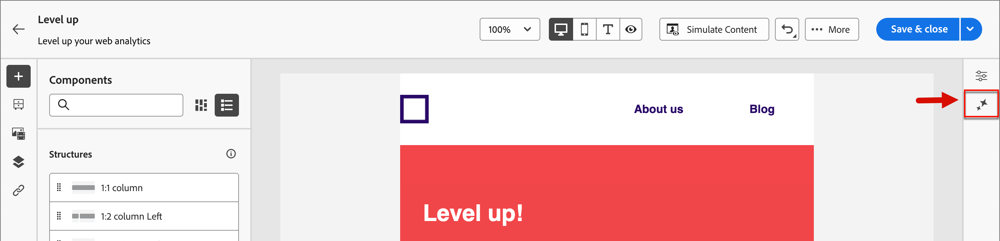

# AI Assistant for email content generation

As the Marketing industry becomes more competitive, brands are seeking efficient ways to generate impactful content quickly and efficiently. AI Assistant for email authoring in Adobe Journey Optimizer B2B Edition is Adobe's AI-powered content generation capability that revolutionizes the way marketers create professional and brand-consistent email content. With advanced GenAI models and deep understanding of brand guidelines, AI Assistant auto-generates personalized, engaging, and effective content based on the marketing objective with content optimized for brand outlined styles, layouts, tone, and more. AI Assistant makes the creation and execution of email marketing campaigns intuitive, simple, and hassle-free. Adding this capability to your workflows can save you time, improve efficiency, and drive better results.

This new capability provides a prompt-based text generation, full email generation, and content generation within email structures. Images are not generated, but are recommended from within the catalog of images in the input brand asset to the model. You can also use this capability to generate optimal subject lines and preheaders to impact the open rate.

>[!NOTE]
>
>This capability is available in its Beta version and subject to change without prior notice.

## Guidelines and limitations

Before you get started with AI Assistant in Adobe Journey Optimizer B2B Edition for email content generation, review these guidelines:

* The marketing objective/prompt that you define is a key determinant of the quality of the generated content. Use a well-defined prompt for the GenAI model to interpret accurately.
* Upload brand assets to have accurate, on brand content. Without these assets, content is based on publicly available information.
   * The uploaded assets can be in the following formats: PDF, JPEG, PNG, or ZIP files (containing supported file formats).
   * The maximum size for an uploaded brand asset is 50 MB. Larger files or large quantities of images may work, but the processing time is increased.
* Use Adobe Journey Optimizer B2B Edition authored email templates, preferably the built-in or sample templates, a brand specific template, or custom template to create your email content. Email templates with up to eight to ten images are recommended.
* Make sure to report any problematic output using the thumb down or flag icons against a generated variant.
* Your use of AI Assistant is subject to the [Adobe Generative AI User Guidelines](https://www.adobe.com/legal/licenses-terms/adobe-gen-ai-user-guidelines.html).

The following limitations apply to AI Assistant in Adobe Journey Optimizer B2B Edition for email content generation:

* English is the only supported language.
* It is only available for the email channel.
* GenAI content might not be accurate &#8212; share your feedback so that Adobe engineers can refine the models.
* You can upload multiple brand assets, but can leverage only one for a specific generation.

>[!BEGINSHADEBOX]

## Prompt Library

An effective prompt is essential for generating the best possible content. If you need assistance with crafting your prompt, access the _Prompt Library_. This library provides a diverse range of prompt ideas to improve the content generation.

{width="500" zoomable="no"}

Select the prompt that best reflects your intended goals and add the needed values that specify your brand, offering, campaign, and use cases.

>[!ENDSHADEBOX]

## Buying group roles

Adobe Journey Optimizer B2B Edition offers five standard B2B buying group roles out-of-the-box. Each buying group role has a distinct messaging focus:

| Role | Messaging focus |
| ---- | --------------- |
| Executive Steering Committee | Product information  Pricing   Technical integration details   Product features and functions |
| Influencer | Proof of quality  Ease of implementation  Subject matter expertise  Competitive advantages |
| Decision maker | Return on investment  Financial value (RoI)  Customer stories |
| Practitioner | Ease of use  Product features and functionality  Product compatibility  Ease of product integration |
| Champion | Educational content  Thought leadership content  Customer stories |

Choosing one of these buying group roles automatically customizes the output based on the characteristics and topics of interest for each of these roles.

## Generate email properties with AI Assistant

When you [add an email action](./add-email.md#add-an-email-action-node-in-a-journey) to an account journey, you define a set of email properties that are used for sending the email. AI Assistant can help achieve better email engagement by generating recommended content for the email **subject line** and **preheader**.

1. Create an email from an account journey or open an existing email from a journey node.

   The email preview page is displayed with the _[!UICONTROL Email properties]_ on the right.

1. Select any of the following tabs to learn how to use AI Assistant in your email property authoring.

>[!BEGINTABS]

>[!TAB Subject line generation]

The following steps describe the task sequence for using AI Assistant to generate an optimized subject line for your email:

1. In the _[!UICONTROL Email Properties]_, click the AI Assistant icon ( {width="30" zoomable="no"} ) at the right of the **[!UICONTROL Subject line]** field.

   {width="600" zoomable="yes"}

   The AI Assistant pop-up opens with the generation settings for the email subject line. 
   
   Depending on the email content that is associated with the email or how you want to use the subject line to fit your purpose, there are a couple of options for generating subject line text:

   * You can immediately click **[!UICONTROL Generate]** without a prompt or a brand asset to use the existing email body as the context for subject line generation.

   * (Recommended) You can provide a prompt, brand asset, and other setting values to provide context for generating the most optimal subject line text for your needs. (Steps 2 through 7)

1. In the **[!UICONTROL Prompt]** field, enter a description of what you want to generate.

   Use the [Prompt Library](#prompt-library) if you need some help with crafting an effective prompt.

1. Specify a brand asset that contains content to serve as the source for the text generation.

   * Select the asset from the catalog.

   * Click **[!UICONTROL Upload brand asset]** to add the brand asset file.

   {width="600" zoomable="yes"}

1. Scroll if needed and select the **[!UICONTROL Buying group role]** to use as the target audience for the generated text.

1. If needed, use the messaging options to tailor your content:

   * **[!UICONTROL Communication strategy]** - Choose the most suitable communication style for your generated text.
   * **[!UICONTROL Language]** - Select the language in which you want your content to be generated.
   * **[!UICONTROL Tone]** - Choose a tone that resonates with your audience. If you specify that you want to sound informative, playful, or persuasive, AI Assistant can adapt the message accordingly.

1. If needed, use the slider to set the desired length of text to be generated.

1. Change the **[!UICONTROL Use emojis]** option (on or off) according to your preference.

1. When your prompt and settings are ready, click **[!UICONTROL Generate]**.

1. Scroll the AI Assistant panel and browse through the generated variations to determine which one is the best fit. 

   * Click **[!UICONTROL Preview]** to view a full-screen version of a selected variation.

   * Provide feedback for the generated variants by clicking the _Thumbs Up_, _Thumbs Down_, or _Flag_ icon and choose the reason that best summarizes your feedback.

1. Navigate to the _Refine_ options within the Preview window to access additional customization features:

   * **[!UICONTROL Use as reference content]** - Select this option to use the variant as the reference content for generating other results.

   * **[!UICONTROL Rephrase]** - AI Assistant can rephrase your message in different ways, keeping your writing fresh and engaging for diverse audiences.

   * **[!UICONTROL Use simpler language]** - Leverage AI Assistant to simplify your language, ensuring clarity and accessibility for a wider audience.

   {width="600" zoomable="yes"}

1. Click **[!UICONTROL Select]** to replace the subject line text with the selected variant and return to the email properties.

>[!TAB Preheader generation]

An email preheader is the short summary text that follows the subject line when an email is viewed in the inbox. It is an optional element for an email, but a great opportunity to improve engagement. The following steps describe the task sequence for using AI Assistant to generate an optimized preheader for your email:

1. In the Email Properties, select the **[!UICONTROL Preheader]** checkbox and click the AI Assistant icon ( {width="30" zoomable="no"} ) at the right.

   {width="600" zoomable="yes"}

   The AI Assistant pop-up opens with the generation settings for the email preheader.

   Depending on the email content that is associated with the email or how you want to target the email, there are a couple of options for generating the preheader:

   * You can immediately click **[!UICONTROL Generate]** without a prompt or a brand asset to use the existing email body as the context for preheader generation.

   * (Recommended) You can provide a prompt, brand asset, and other setting values to provide context for generating the most optimal preheader for your needs. (Steps 2 through 7)

1. In the **[!UICONTROL Prompt]** field, enter a description of what you want to generate.

   Use the [Prompt Library](#prompt-library) if you need some help with crafting an effective prompt.

1. Specify a brand asset that contains content to serve as the source for the text generation.

   * Select the asset from the catalog.

   * Click **[!UICONTROL Upload brand asset]** to add the brand asset file.

   {width="600" zoomable="yes"}

1. Scroll if needed and select the **[!UICONTROL Buying group role]** to use as the target audience for the generated text.

1. If needed, use the messaging options to tailor your content:

   * **[!UICONTROL Communication strategy]** - Choose the most suitable communication style for your generated text.
   * **[!UICONTROL Language]** - Select the language in which you want your content to be generated.
   * **[!UICONTROL Tone]** - Choose a tone that resonates with your audience. If you specify that you want to sound informative, playful, or persuasive, AI Assistant can adapt the message accordingly.

1. If needed, use the slider to set the desired length of text to be generated.

1. Change the **[!UICONTROL Use emojis]** option (on or off) according to your preference.

1. When your prompt and settings are ready, click **[!UICONTROL Generate]**.

1. Scroll the AI Assistant panel and browse through the generated variations to determine which one is the best fit. 

   * Click **[!UICONTROL Preview]** to view a full-screen version of a selected variation.

   * Provide feedback for the generated variants by clicking the _Thumbs Up_, _Thumbs Down_, or _Flag_ icon and choose the reason that best summarizes your feedback.

1. Navigate to the _Refine_ options within the Preview window to access additional customization features:

   * **[!UICONTROL Use as reference content]** - Select this option to use the variant as the reference content for generating other results.

   * **[!UICONTROL Rephrase]** - AI Assistant can rephrase your message in different ways, keeping your writing fresh and engaging for diverse audiences.

   * **[!UICONTROL Use simpler language]** - Leverage AI Assistant to simplify your language, ensuring clarity and accessibility for a wider audience.

   {width="600" zoomable="yes"}

1. Click **[!UICONTROL Select]** to replace the preheader with the selected variant and return to the email properties.

>[!ENDTABS]

## Generate email body content with AI Assistant

After you [create and personalize your email](./email-authoring.md), use AI Assistant in Adobe Journey Optimizer B2B Edition, powered by generative AI to elevate your email body content to the next level.

In the email design space, AI Assistant can help you optimize the impact of your deliveries by generating the full email body, targeted text content, and recommendations for images that resonate with your audience. This optimization of your email campaigns is designed to produce better engagement.

1. Create an email from an account journey and click **[!UICONTROL Open Email Designer]** or **[!UICONTROL Add Email Content]**.

1. Select and open an email template in the visual email design space.

1. Personalize the email as needed for the journey node.

1. Select any of the following tabs to learn how to use AI Assistant in your email body content authoring.

>[!BEGINTABS]

>[!TAB Full email generation]

The following steps describe the task sequence for using AI Assistant to refine an existing email template:

1. In the email design space, access the AI Assistant menu by clicking the icon ( {width="30" zoomable="no"} ) at the right.

   {width="600" zoomable="yes"}

   The AI Assistant settings on the right reflect _Generation settings (full email)_.

1. In the **[!UICONTROL Prompt]** field, enter a description of what you want to generate.

   Use the [Prompt Library](#prompt-library) if you need some help with crafting an effective prompt.

   {width="600" zoomable="yes"}

1. Specify a brand asset that contains content that can provide additional context for AI Assistant. 

   * Select the asset from the catalog.

   * Click **[!UICONTROL Upload brand asset]** to add the brand asset file.

   This input asset serves as the source for content generation and image recommendation within the email.

1. Select the **[!UICONTROL Buying group role]** to use as the target audience for the email communication. 

1. If needed, use the messaging options to tailor your content:

   * **[!UICONTROL Communication strategy]** - Choose the most suitable communication style for your generated text.
   * **[!UICONTROL Language]** - Select the language in which you want your content to be generated.
   * **[!UICONTROL Tone]** - Choose a tone that resonates with your audience. If you specify that you want to sound informative, playful, or persuasive, AI Assistant can adapt the message accordingly.
   * **Content type** - Choose an option that reflects the nature of the visual elements. This setting distinguishes between different forms of visual representation, such as photos, graphics, or art.

1. When your prompt is ready, click **[!UICONTROL Generate]**. 

1. Scroll the AI Assistant panel and browse through the generated variations to determine which one is the best fit. 

   * Click **[!UICONTROL Preview]** to view a full-screen version of a selected variation.

   * Provide feedback for the generated variants by clicking the _Thumbs Up_, _Thumbs Down_, or _Flag_ icon and choose the reason that best summarizes your feedback.

      {width="600" zoomable="yes"}

1. Click **[!UICONTROL Select]** to replace the template contents with the selected variant and return to the email design space.

   In the email design space, you can use the editing and formatting tools on the canvas to alter the content, as well as the _[!UICONTROL Settings]_ and _[!UICONTROL Style]_ options on the right.

>[!TAB Text generation]

The following steps describe the task sequence for using AI Assistant to refine or enhance the text content for an existing email:

1. In the email design space, access the AI Assistant menu by clicking the icon ( {width="30" zoomable="no"} ) at the right.

   {width="600" zoomable="yes"}

1. Select a _Text_ component to target the specific content.

   The AI Assistant settings on the right reflect _Generation settings (text)_.

1. In the **[!UICONTROL Prompt]** field, enter a description of what you want to generate.

   {width="600" zoomable="yes"}

   Use the [Prompt Library](#prompt-library) if you need some help with crafting an effective prompt.

1. Specify a brand asset that contains content to serve as the source for the text generation.

   * Select the asset from the catalog.

   * Click **[!UICONTROL Upload brand asset]** to add the brand asset file.

1. Select the **[!UICONTROL Buying group role]** to use as the target audience for the generated text.

1. If needed, use the language and messaging options to tailor your content:

   * **[!UICONTROL Communication strategy]** - Choose the most suitable communication style for your generated text.
   * **[!UICONTROL Language]** - Select the language in which you want your content to be generated.
   * **[!UICONTROL Tone]** - Choose a tone that resonates with your audience. If you specify that you want to sound informative, playful, or persuasive, AI Assistant can adapt the message accordingly.

1. If needed, use the slider to set the desired length of text to be generated.

1. When your prompt is ready, click **[!UICONTROL Generate]**.

1. Browse through the generated _Variations_ and click **[!UICONTROL Preview]** to view a full-screen version of the selected variation.

1. Navigate to the _Refine_ options within the Preview window to access additional customization features:

   * **[!UICONTROL Use as reference content]** - Select this option to use the variant as the reference content for generating other results.

   * **[!UICONTROL Elaborate]** - AI Assistant can help you expand on specific topics, providing additional details for better understanding and engagement.

   * **[!UICONTROL Summarize]** - Lengthy information can overload email recipients. Use AI Assistant to condense key points into clear, concise summaries that grab attention and encourage them to read further.

   * **[!UICONTROL Rephrase]** - AI Assistant can rephrase your message in different ways, keeping your writing fresh and engaging for diverse audiences.

   * **[!UICONTROL Use simpler language]** - Leverage AI Assistant to simplify your language, ensuring clarity and accessibility for a wider audience.

   {width="700" zoomable="yes"}

1. When you have the content that you want, click **[!UICONTROL Select]** to replace the text with the selected variant and return to the email design space.

   In the email design space, you can use the editing and formatting tools on the canvas to alter the text, as well as the _[!UICONTROL Settings]_ and _[!UICONTROL Style]_ options on the right.

>[!TAB Image recommendations]

You can use AI Assistant to optimize and improve your assets and ensure a more user-friendly experience. The following steps describe the task sequence for using AI Assistant to enhance the image content of the email:

1. Access the AI Assistant menu by clicking the icon ( {width="30" zoomable="no"} ) at the right.

   {width="600" zoomable="yes"}

1. Select an _Image_ component to target the specific content and access the AI Assistant menu.
   
   The settings on the right reflect _[!UICONTROL Generation settings (image)]_.

1. To fine tune the asset, enter a description of what you want in the **[!UICONTROL Prompt]** field.

   {width="600" zoomable="yes"}

   Use the [Prompt Library](#prompt-library) if you need some help with crafting an effective prompt.

1. Click **[!UICONTROL Upload brand asset]** to add any brand asset containing content that can provide additional context for AI Assistant.

   If the needed asset is already available, expand **[!UICONTROL Uploaded brand assets]** and select the asset.

   Your prompt must always be tied to an existing asset.

1. Use the image settings to refine your prompt:

   * **[!UICONTROL Aspect ratio]** - This setting determines the width and height of the asset. You have the option to choose from common ratios such as 16:9, 4:3, 3:2, or 1:1, or you can enter a custom size.
   * **[!UICONTROL Color & tone]** - This setting influences the overall appearance of the colors within an image and the mood or atmosphere that it conveys.
   * **[!UICONTROL Content type]** - This setting categorizes the nature of the visual element, distinguishing between different forms of visual representation, such as photos, graphics, or art.
   * **[!UICONTROL Lighting]** - This setting adjusts the lightning present in an image, which shapes its atmosphere and highlights specific elements.
   * **[!UICONTROL Composition]** - This setting determines the arrangement of elements within the frame of an image.

1. When you are satisfied with your prompt configuration, click **[!UICONTROL Generate]**.

   AI Assistant processes the request and recommends the best suited images from within the input brand asset and based on the prompt and other inputs.

   >[!IMPORTANT]
   >
   >If there are no images in the input brand asset or there are no images relevant to the input prompt, the output is empty.

1. Browse through the _[!UICONTROL Variations]_ and select the one that is the best fit for the email.
   
   To view a full-screen version of the selected variation, click **[!UICONTROL Preview]**.

1. Highlight the image that you want and click **[!UICONTROL Select]** to replace the image or placeholder with the selected item and return to the email design space.

   In the email design space, you can use the editing and formatting tools on the canvas to alter the content, as well as the _[!UICONTROL Settings]_ and _[!UICONTROL Style]_ options on the right.

>[!ENDTABS]
