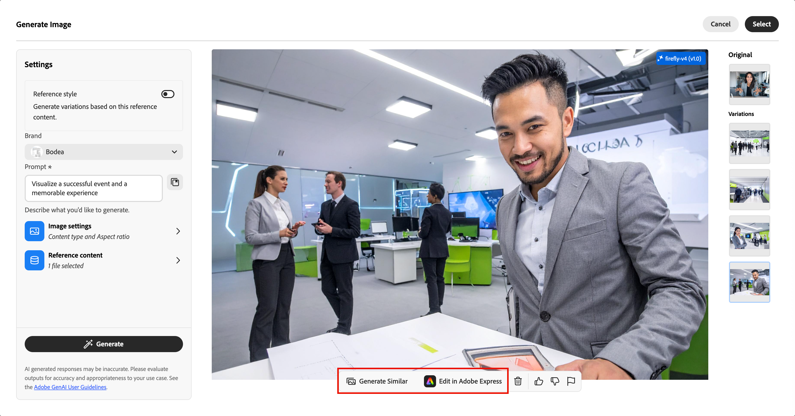

# AI Assistant for Landing Page Content {#generative-full-content}

AI Assistant for landing page content in [!DNL Adobe Journey Optimizer B2B Edition] uses Adobe's AI-powered content generation capabilities and revolutionizes the way marketers create professional and brand-consistent landing page content. With advanced generative AI models and deep understanding of brand guidelines, AI Assistant auto-generates personalized, engaging, and effective content. It uses your marketing objective and optimizes the content for brand outlined styles, layouts, tone, and more. AI Assistant makes campaign and program creation and execution more intuitive, simple, and hassle-free. Adding this capability to your workflows can save you time, improve efficiency, and drive better results.

You can generate complete content experiences for your landing pages, including both text and images. This robust functionality helps you create compelling, on-brand content that connects with your audience.

>[!NOTE]
>
>This capability is available in its Beta version and subject to change without prior notice.

>[!IMPORTANT]
>
>To access these features in [!DNL Journey Optimizer B2B Edition], you must have the _[!UICONTROL AI Assistant]_ > _[!UICONTROL Generate Content]_ permission. For more information about how a product administrator can grant feature permissions, see [Edit roles for product permissions](../admin/user-management.md#edit-roles-for-product-permissions).

## Guidelines and limitations

Before you start using this capability, review the [guidelines and limitations](../ai-assistant/generative-ai-content.md#general-guidelines-and-limitations). [User agreement](https://www.adobe.com/legal/licenses-terms/adobe-dx-gen-ai-user-guidelines.html){target="_blank"} acceptance is also required before you can use AI capabilities in [!DNL Journey Optimizer B2B Edition]. For more information, contact your Adobe representative.

With Adobe's commitment to promote transparency in the use of generative AI tools in media creation, Adobe applies [content credentials](https://helpx.adobe.com/firefly/web/get-started/learn-the-basics/content-credentials-overview.html){target="_blank"} for any content or project that includes a Firefly-generated asset when it is downloaded or exported.

The following limitations and guidelines apply to AI Assistant features used for landing page content generation in [!DNL Journey Optimizer B2B Edition]:

* English is the only supported language.
* Generated content might not be accurate &#8212; share your feedback so that Adobe engineers can refine the models.
* You can upload multiple content reference assets, but can leverage only one for a specific generation.
* Use a brand specific or custom template for generating content for a full landing page. Landing page templates with up to 8-10 images are recommended.
* Make sure to report any problematic outputs using the thumb up, thumb down, or flag icons when selecting generated variants.

## Input and settings for content generation

You can generate full content for a landing page, or for selected components in the page. When you use the AI Assistant tools to generate the content that you need, you provide the input, including prompts and reference content, and the settings for text and images.

### Prompts

Use well-defined prompts for the generative AI model to interpret with accuracy. The marketing objective/prompt that you provide strongly impacts the quality of the generated content. 

{width="320"}

For more information about creating effective prompts, see _[Prompt best practices](../ai-assistant/generative-ai-content.md#generative-ai-prompting-guide)_. 

>[!BEGINSHADEBOX]

**Prompt Library**

An effective prompt is essential for generating the best possible content. If you want assistance with crafting your prompt, click the _Prompt library_  icon to access a library of prompt ideas that are organized according to objectives. Enter text in the search field to find a prompt based on a keyword string.

{width="500" zoomable="no"}

Select the prompt that best reflects your intended goals and click **[!UICONTROL Try this Prompt]**. In the _[!UICONTROL Prompt]_ field, replace any placeholders (such as `[Key Feature/Information]`) with the needed values that specify your brand, offering, campaign, and use cases.

>[!ENDSHADEBOX]

### Text settings

Expand the **[!UICONTROL Text settings]** in the right panel and set the options for generated text.

* **[!UICONTROL Buying group]** - Choose the [buying group role](../buying-groups/buying-groups-role-templates.md) to use for targeting your messaging.
* **[!UICONTROL Marketing journey stage]** - Choose the [buying group stage](../buying-groups/buying-group-stages.md) to use for targeting the messaging.
* **[!UICONTROL Communication strategy]** - Choose the most suitable communication style for your generated text.
* **[!UICONTROL Language]** - Choose the language of your generated content.
* **[!UICONTROL Tone]** - The tone should resonate with your audience. For example, you can adjust the message to sound informative, playful, or persuasive.

{width="400" zoomable="yes"}

Click the left arrow to return to the main _[!UICONTROL Settings]_.

### Image settings

To include images in your generated content, expand the **[!UICONTROL Image settings]** in the right panel and set the options.

The **[!UICONTROL Generate images using AI]** option is disabled by default. Enable this feature and set the following options to include generated images in the proposed content variations:

<!-- * **[!UICONTROL Generative model]**: Select from available built-in models, custom Firefly models trained on your brand assets, or third-party image generation providers to create images that align with your specific needs and brand requirements. -->
* **[!UICONTROL Aspect ratio]**: When an image component is selected, this setting determines the width and height of the asset. You have the option to choose from common ratios such as 16:9, 4:3, 3:2, or 1:1, or you can enter a custom size.
* **[!UICONTROL Content type]**: The type categorizes the nature of the visual element, distinguishing between different forms of visual representation, such as photos, graphics, or art.
* **[!UICONTROL Visual intensity]**: Control the image's impact by adjusting its intensity. A lower setting (such as 2) creates a softer, more restrained appearance, while a higher setting (such as 10) makes the image more vibrant and visually powerful.
* **[!UICONTROL Color and tone]**: The overall appearance of the colors within an image and the mood or atmosphere it conveys.
* **[!UICONTROL Lighting]**: The lighting style used for the image, which shapes its atmosphere and highlights specific elements.
* **[!UICONTROL Composition]**: The arrangement of elements within the frame of an image.

{zoomable="yes"}

Click the left arrow to return to the main _[!UICONTROL Settings]_.

### Reference content

Upload reference content assets to generate accurate, on-brand content. Otherwise, generated content is based on publicly available information. Reference content serves as the source for content generation and image recommendations. For guidelines and best practices, see _[Optimized reference content](../ai-assistant/generative-ai-content.md#reference-content)_.

From the **[!UICONTROL Reference content]** settings, click **[!UICONTROL Upload file]** to add any asset that contains content you want to use for additional context.

{zoomable="yes"}

The file to upload can be in the following formats: PDF, JPEG, PNG, or ZIP files (containing supported file formats). The maximum size for an uploaded brand asset is 50MB. Larger files or a large number of images can work, but this increases the processing time.

If you want to select a previously uploaded file, expand the **[!UICONTROL Uploaded reference content]** list and enable the asset that you want to use for your content generation.

{zoomable="yes"}

## Use the generative AI tools {#gen-ai-tools}

To begin generating your content, open the content editor for the landing page and access the generative AI tools on the outer rail of the right panel. Select the _AI Assistant_ ( {width="30" zoomable="no"} ) to display the content generation tools that are available for the current content selection.

Use the following steps according to the type of landing page content generation that you want to use:

>[!BEGINTABS]

>[!TAB Full page]

Follow these steps to use AI Assistant for full landing page generation by refining an existing landing page template:

1. After [creating the landing page](./landing-pages.md#create-a-landing-page), click **[!UICONTROL Edit landing page]**.

1. Select a template.

   Full content generation requires a template. It can be a standard template provided by Adobe, or a saved template. You can also use the _[!UICONTROL Import HTML]_ option to import a template.

   For more information about using a landing page template, see _[Select a saved or sample template](./landing-pages.md#select-a-saved-or-sample-template)_. 

1. On the outer rail of the right panel, select the _AI Assistant_ ( {width="30" zoomable="no"} ) icon.

   {width="600" zoomable="yes"}

   The AI Assistant settings on the right reflect the generation settings for the full landing page.

1. Select your **[!UICONTROL Brand]** to ensure that the AI-generated content aligns with your brand specifications.

   If there are no published brands, click **[!UICONTROL Create a brand]** to define your [reusable brand guidelines](./brands-overview.md). 

1. In the **[!UICONTROL Prompt]** field, enter a description of what you want to generate.

   Use the [Prompt Library](#prompt-library) if you need some help with crafting an effective prompt.

   {width="600" zoomable="yes"}

   >[!TIP]
   >
   >If you are new to prompting for generated content, review the _[Prompting best practices](../ai-assistant/generative-ai-content.md#generative-ai-prompting-guide)_.

1. Complete the content guidance settings to tailor the generated content:

   * [**[!UICONTROL Text settings]**](#text-settings) - Provide guidance for the generated text content.
   * [**[!UICONTROL Image settings]**](#image-settings) - If you want to include images in the generated content, enable image generation and provide guidance. 
   * [**[!UICONTROL Reference content]**](#reference-content) - Provide the content asset that serves as the source for content generation. 

1. When your prompt and settings are ready, click **[!UICONTROL Generate]**. 

1. Scroll down in the AI Assistant panel and browse through the generated variations to determine which one is the best fit. 

   * Click the _Full screen_ (  ) icon to open the _[!UICONTROL Generate Landing Page]_ dialog

   * If needed, use the [refinement actions](#refine-a-variation) to fine-tune the variation to ensure that they meet your exact requirements.

   * [Submit feedback](#submit-variation-feedback) for the generated variants by clicking the _Thumbs Up_, _Thumbs Down_, or _Flag_ icon and choose the reason that best summarizes your feedback.

1. Click **[!UICONTROL Select]** to replace the template contents with the selected variant and return to the landing page design space.

   You can use the editing and formatting tools on the canvas to alter the generated content, as well as the _[!UICONTROL Settings]_ and _[!UICONTROL Style]_ options on the right.

>[!TAB Text only]

Follow these steps to use AI Assistant to refine or enhance the text content for an existing landing page:

1. In the landing page design space, select a _Text_ component to target the specific content.

1. On the outer rail of the right panel, select the _AI Assistant_ ( {width="30" zoomable="no"} ) icon.

   {width="600" zoomable="yes"}

   The settings on the right reflect the content generation settings for the text component.

1. Select your **[!UICONTROL Brand]** to ensure that the AI-generated content aligns with your brand specifications.

   If there are no published brands, click **[!UICONTROL Create a brand]** to [define your reusable brand guidelines](./brands-overview.md).

1. In the **[!UICONTROL Prompt]** field, enter a description of what you want to generate.

   {width="600" zoomable="yes"}

   Use the [Prompt Library](#prompt-library) if you need some help with crafting an effective prompt.

1. Complete the content guidance settings to tailor the generated content:

   * [**[!UICONTROL Text settings]**](#text-settings) - Provide guidance for the generated text content.

   * [**[!UICONTROL Reference content]**](#reference-content) - Provide the content assets that serve as the source for content generation. 

1. When your prompt and settings are ready, click **[!UICONTROL Generate]**. 

1. Scroll down in the AI Assistant panel and browse through the generated variations to determine which one is the best fit. 

   * Click the _Full screen_ (  ) icon to open the _[!UICONTROL Generate Text]_ dialog

   * If needed, use the [refinement actions](#refine-a-variation) to fine-tune the variation to ensure that they meet your exact requirements.

   * [Submit feedback](#submit-variation-feedback) for the generated variants by clicking the _Thumbs Up_, _Thumbs Down_, or _Flag_ icon and choose the reason that best summarizes your feedback.

1. When you have the content that you want, click **[!UICONTROL Select]** to replace the text with the selected variant and return to the landing page design space.

   You can use the editing and formatting tools on the canvas to alter the text, as well as the _[!UICONTROL Settings]_ and _[!UICONTROL Style]_ options on the right.

>[!TAB Image only]

Follow these steps to use AI Assistant to refine or enhance the image content for an existing landing page:

1. In the landing page design space, select an _Image_ component to target the specific content.

1. On the outer rail of the right panel, select the _AI Assistant_ ( {width="30" zoomable="no"} ) icon.

   {width="600" zoomable="yes"}

   The AI Assistant settings on the right reflect the generation settings for the image component.

1. Select your **[!UICONTROL Brand]** to ensure that the AI-generated content aligns with your brand specifications.

   If there are no published brands, click **[!UICONTROL Create a brand]** to [define your reusable brand guidelines](./brands-overview.md). 

1. Enter a description of what you want in the **[!UICONTROL Prompt]** field.

   {width="600" zoomable="yes"}

   Use the [Prompt Library](#prompt-library) if you need some help with crafting an effective prompt.

1. Complete the content guidance settings to tailor the generated content:

   * [**[!UICONTROL Image settings]**](#image-settings) - If you want to include images in the generated content, enable image generation and provide guidance.

   * [**[!UICONTROL Reference content]**](#reference-content) - Provide the content assets that serve as the source for content generation. 

1. When you are satisfied with your prompt and settings, click **[!UICONTROL Generate]**.

   AI Assistant processes the request and generates best suited images based on the prompt and other inputs.

   >[!IMPORTANT]
   >
   >If there are no images in the reference content or there are no images relevant to the input prompt, the output is empty.

1. Browse through the generated variations or click the _Full screen_ (  ) icon to open the _[!UICONTROL Generate Image]_ dialog.

   The dialog provides additional space to compare the variations, adjust your image and reference content settings (if needed), and to regenerate the variations.

   You can select a variation and click **[!UICONTROL Generate Similar]** to generate additional images that are similar to the selected variant. Or, click **[!UICONTROL Edit in Adobe Express]** to make your own changes to the image. See [Quick actions in Adobe Express](./image-edit-adobe-express.md#quick-actions-in-adobe-express) for more information about using Adobe Express to refine your images.

   {width="700" zoomable="yes"}

   You can also [submit feedback](#submit-variation-feedback) for the generated variations.

1. Highlight the image that you want and click **[!UICONTROL Select]** to replace the image or placeholder with the selected item and return to the landing page design space.

   You can use the editing and formatting tools on the canvas to alter the image, as well as the _[!UICONTROL Settings]_ and _[!UICONTROL Style]_ options on the right.

>[!ENDTABS]

## Preview and content refinement {#refine-finalize}

After generating content variations, you can fine-tune the results to ensure that they meet your exact requirements. Review the brand alignment, adjust tone and language, and prepare the content for a reviewable draft. You can also submit feedback for a variation to help train AI Assistant and improve future output.

### Open the full screen view

1. After the initial content generation, browse through the **[!UICONTROL Variations]**.

1. Identify the variation that is the best match for your goals and click the _Full screen_ (  ) icon to open the dialog.

   {width="700" zoomable="yes"}

1. When you are satisfied with the selected variation, click **[!UICONTROL Select]** to apply it to your canvas.

### Refine a variation

Click the **[!UICONTROL Refine]** option to access additional customization features for landing page and text variations:

* **[!UICONTROL Elaborate]** - AI Assistant can help you expand on specific topics, providing additional details for better understanding and engagement.

* **[!UICONTROL Summarize]** - Lengthy information can overload page viewers. Use AI Assistant to condense key points into clear, concise summaries that grab attention and encourage them to read further.

* **[!UICONTROL Rephrase]** - Rewrite the message while preserving its meaning. This option helps you generate alternative wording, improve flow, or adjust phrasing without changing the core message.

* **[!UICONTROL Use simpler language]** - Simplify the language, ensuring clarity and accessibility for a wider audience.

* **[!UICONTROL Translate]** - Translate the text to another language. (Currently, English is the only supported language.)

* **[!UICONTROL Change tone]** - Adjust the tone of the message to align with your communication style, such as making it more friendly, professional, urgent, or inspirational.

* **[!UICONTROL Change Communication strategy]** - Modify the messaging approach based on your objectives, such as creating urgency, or emphasizing exciting appeal.

<!-- * **[!UICONTROL Use as reference content]** - Select this option to use the variant as the reference content for generating other results. -->

{width="700" zoomable="yes"}

### Submit variation feedback

Provide feedback for the generated variants by clicking the _Thumbs Up_, _Thumbs Down_, or _Flag_ icon and choose the reason that best summarizes your feedback. 

{width="600" zoomable="yes"}

### Check your brand alignment (Beta)

<!-- Are we surfacing scoring here in the future, or will it be a separate post-creation task? 1. Click the percentage icon to view your **[!UICONTROL Brand Alignment Score]** and identify any misalignments with your brand. -->

The brand alignment evaluation and scoring help you to ensure consistency in tone, messaging, and visual identity across your campaigns, while also serving as a quality check before your content goes live. When the landing page content is complete, click the _Brand alignment_ (  ) icon on the right to open the _Brand alignment_ right panel in the landing page design space.

{width="600" zoomable="yes"}

For detailed information, see [Validate your brand alignment](./brand-alignment.md#validate-your-brand-alignment)
