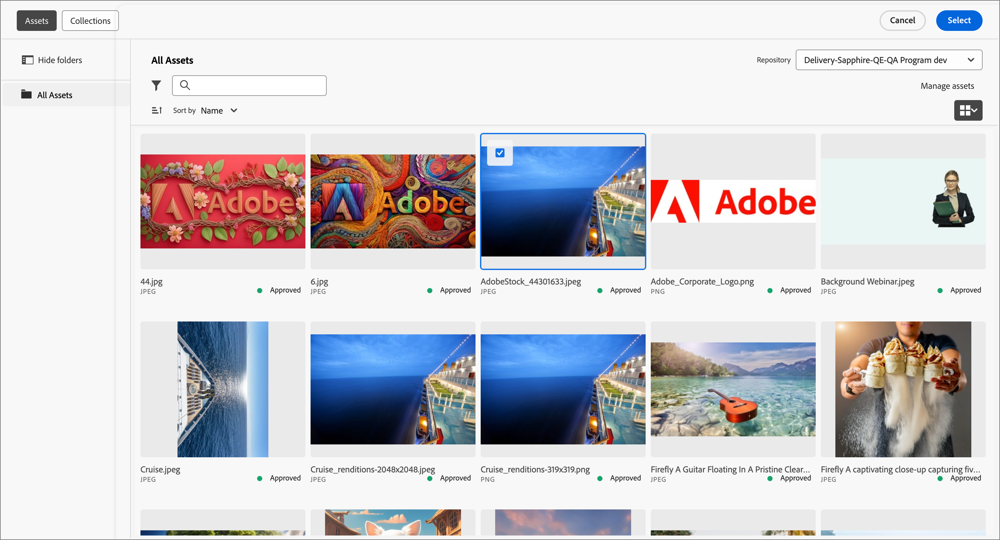

# Assets

In [!DNL Adobe Journey Optimizer B2B Edition], assets are typically the images used when designing content to support account journeys. You can use these images within your emails, email templates, and fragments from the asset selector or a simple drag-and-drop interface within the visual design space.

[!DNL Journey Optimizer B2B Edition] offers designers and marketers access to two types of assets libraries: an internal [!DNL Journey Optimizer B2B Edition] asset repository and [!DNL Adobe Experience Manager Assets as a Cloud Service]. You might use only the  built-in repository, or use both library types at the same time (based on the [!DNL Experience Manager Assets] license that you have).

## Asset management

If you are provisioned with [!DNL Adobe Experience Manager as a Cloud Services] and it is configured as an asset source in [!DNL Journey Optimizer B2B Edition], you have access to both repository types when your user account has the required permissions. These repositories are separate and not in sync. You can use images from either source.

### Internal assets

The internal assets repository is provided by default with every [!DNL Journey Optimizer B2B Edition] subscription. This means that you have access to any of the image assets stored in the connected [!DNL Adobe Marketo Engage] asset file system. You can use this repository as your local assets library, including upload and download assets functions. You can also use these assets within your journey content.

You can [edit these assets using Adobe Express](./image-edit-adobe-express.md), and move them into folders to organize them for use across your emails, templates, and fragments.

Supported file formats: JPG, JPEG, GIF, PNG, EPS, SVG, and RGB

### Adobe Experience Manager Assets as a Cloud Service

Bring marketing and creative workflows together using [!DNL Adobe Experience Manager Assets]. It is natively integrated with [!DNL Journey Optimizer B2B Edition], so you can easily access Assets as a Cloud Service to discover and use digital assets. It provides access to your Assets repository for assets that you can use to populate your messages.

[!DNL Adobe Journey Optimizer B2B Edition] can connect to [!DNL Adobe Experience Manager Assets as a Cloud Service] for centralized asset management that extends your creative system and unify digital assets for experience delivery. [!DNL Adobe Experience Manager Assets as a Cloud Service] offers an easy-to-use cloud solution for efficient Digital Asset Management and Dynamic Media operations. It seamlessly incorporates advanced features, including Artificial Intelligence and Machine Learning.

Learn more in the [Adobe Experience Manager as a Cloud Service documentation](https://experienceleague.adobe.com/en/docs/experience-manager-cloud-service/content/assets/overview){target="_blank"}.

{{aem-assets-licensing-note}}

Access [!DNL Adobe Experience Manager Assets] directly within [!DNL Journey Optimizer B2B Edition] from the **[!UICONTROL Experience Manager Assets]** item in the content design left navigation. You can also access assets and folders when designing your email, email template, and visual fragment content.

Currently, you can use only images from Adobe Experience Manager Assets in Adobe Journey Optimizer B2B Edition.

## Use assets for content authoring

Use assets as you author your emails, email templates, and visual fragments. The visual content editor provides access to the images in your connected asset repositories. If you also have a subscription for Experience Manager Assets as a Cloud Service, you can choose image assets from either source. You can also upload an image asset, which places it in the internal assets repository.

You can choose the image source when you edit the settings for an image component or directly on the canvas:

* **_Image component settings_** - When you have an image component selected in the visual design space, you can view and edit the settings in the right panel. To add or change the image file displayed in the component, choose the source type and select an image file.

   {width="350"}

* **_Empty component_** - When you add an image component in the visual design space, it is empty and provides easy access to choose a source and select an image file.

   {width="500"}

* **_Image component toolbar_** - When you have an image component selected in the visual design space, the toolbar provides easy access to choose a source and select the image file.

   {width="500"}

You can add an image asset as you author your content, depending on the image asset source. You can also choose an image asset in the background settings for a structure component.

>[!BEGINTABS]

>[!TAB Select Asset]

Click **[!UICONTROL Select Asset]** to open the asset selector, where you can choose an image from the Journey Optimizer B2B Edition asset repository.

{width="700" zoomable="yes"}

You can use search and filters to locate the desired image asset. Select the asset and click **[!UICONTROL Select]** to use it for the image component.

For more detailed information about using internal image assets, see [Use assets in your content](./internal-image-assets.md#use-assets-in-your-content).

>[!TAB Experience Manager Assets]

Click **[!UICONTROL Experience Manager Assets]** to open the asset selector, where you can choose an image from the Experience Manage Assets repository.

{width="700" zoomable="yes"}

You can use search and filters to locate the desired image asset. Select the asset and click **[!UICONTROL Select]** to use it for the image component.

For more detailed information about using image files from [!DNL Experience Manager Assets], see [Access AEM Assets images](./aem-assets.md#access-aem-assets-images).

>[!TAB Import media]

Click **[!UICONTROL Import media]** to select an image file and import it as an asset that can be used for Journey Optimizer B2B Edition content. 

{width="450" zoomable="yes"}

After you drag and drop the file or select it from your file system, click **[!UICONTROL Import]**. The imported asset is stored within the [!DNL Journey Optimizer B2B Edition] asset repository.

>[!ENDTABS]
