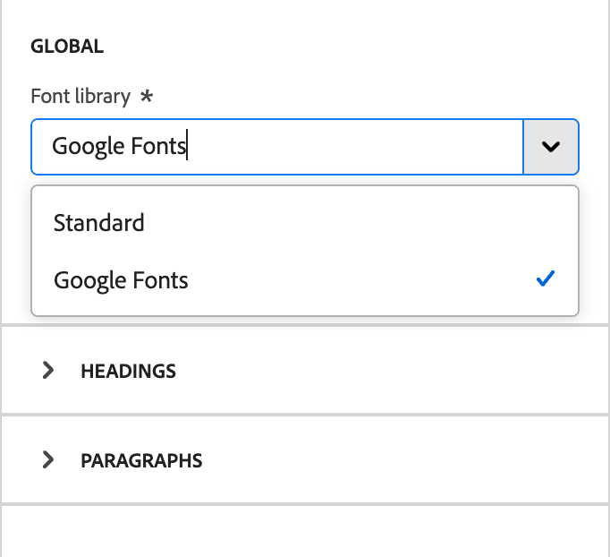
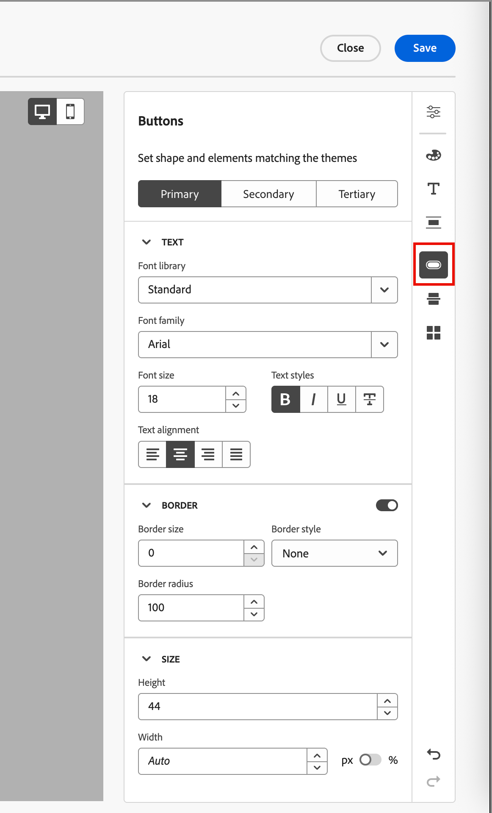
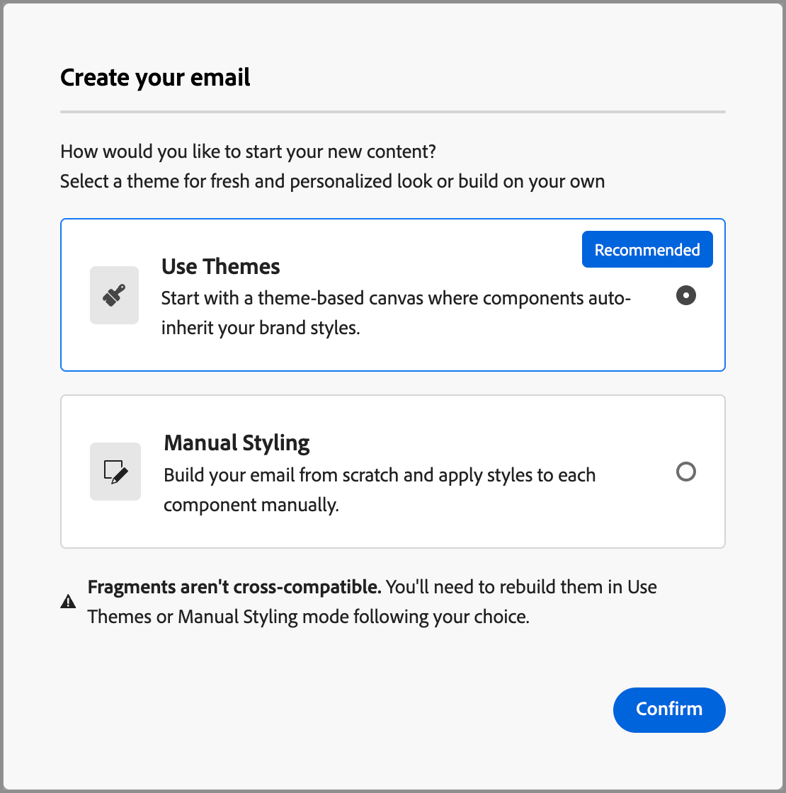
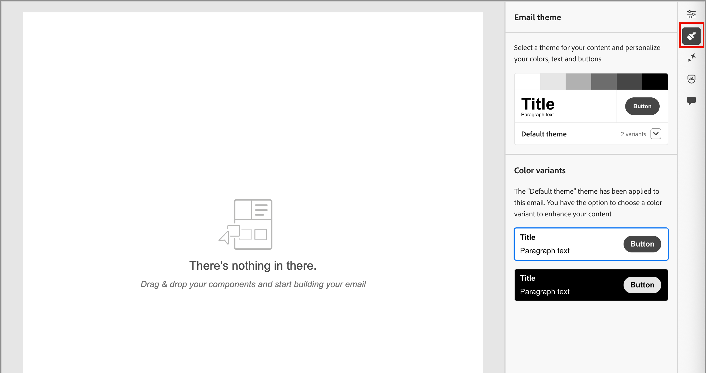

# Use brand themes for email content {#email-brand-themes}

>[!CONTEXTUALHELP]
>id="ajo-b2b_email_brand_theme"
>title="Apply a brand theme to your email or email template"
>abstract="Select a theme for your email or email template to apply a specific styling that fits your brand and design."

With themes, non-technical designers have the ability to create reusable email content design guidelines that align to a specific brand and styling. Themes empower marketers to leverage visually appealing, brand-consistent emails faster and with less effort, and provide advanced customization options for unique design needs.

## Theme guidelines and limitations {#themes-guidelines}

As you work with themes, keep the following guidelines and limitations in mind:

* When you create an email or email template from scratch, you can start building your content using a theme to apply specific styling that fits your brand and design (_Theme mode_). If you use the _Manual mode_, you cannot apply a theme unless you reset the email or email template.

* [Fragments](./fragments.md) are not cross-compatible between the _Theme mode_ and _Manual mode_. To use a fragment in email content where a theme is applied, the fragment must also be created in _Theme mode_.

* Changes to a custom theme do not automatically cascade to all emails or email templates that already use it. Edit the content for each to refresh the theme.

* If you delete a theme, it does not affect any email or email template where it was already applied.
<!-- 
* If using a content created in HTML, you will be in [compatibility mode](existing-content.md) and you cannot apply themes to this content.
-->

## Create a brand theme {#create-theme}

Define your own brand theme that you can apply to your email and email template content in your future email content.

1. Access the theme tools using one of the following methods:

   * [Create a new email template](./email-templates.md#create-an-email-template) and click **[!UICONTROL Edit email template]** to launch the _[!UICONTROL Design your template]_ page.

   * Click **[!UICONTROL ... More]** at the top-right of the email content design space and choose **[!UICONTROL Change your design]**.

      {width="700" zoomable="yes"}

      In the confirmation dialog, click **[!UICONTROL Change template]** to open the design page.

1. In the design page, choose **[!UICONTROL Create or edit themes]**.

   {width="800" zoomable="yes"}

1. Select the default theme, or use any of the Adobe themes to use as the starting point.

   >[!NOTE]
   >
   >If you want to use one of your custom themes (_[!UICONTROL My themes]_) as a starting point, you can [duplicate it](#delete-or-duplicate-a-theme) and change the theme name when you [edit the theme](#edit-a-theme). 

1. Click **[!UICONTROL Create]**.

   {width="750" zoomable="yes"}

   The _[!UICONTROL Create a theme]_ page provides a canvas with the existing elements of all types of text, buttons, and containers from the starting theme. 

1. Use the right navigation to access the different theme style tabs and change the theme settings:

   * [General settings](#general-settings)
   * [Colors](#colors)
   * [Text settings](#text-settings)
   * [Spacing and border](#spacing-and-border)
   * [Button](#button)
   * [Divider](#divider)
   * [Grid](#grid)

   The visual elements change on the canvas as you define the new theme settings. If the result is not what you want, you can click the _Undo_ ( {width="16"} ) icon at the bottom of the right panel. Click the _Redo_ ( {width="16"} ) icon to re-apply the change. 

1. When your theme definition is complete, click **[!UICONTROL Save]**.

1. Click **[!UICONTROL Close]** to return to the _[!UICONTROL Create a theme]_ page, and then **[!UICONTROL Cancel]** to return to the design page.

   You can then choose **[!UICONTROL Design from scratch]** to open the visual design space and [use the theme](#use-your-theme-for-email-content-authoring) for the email or template.

### General settings

In the **[!UICONTROL General settings]** tab, define the basic parameters for your theme:

* Enter a unique **[!UICONTROL Theme name]**. 

* Adjust the **[!UICONTROL Viewport width]** for the email content (body). Use the up and down arrows to increase or decrease the width, or enter the value (in pixels).

{width="450"}
 <!--  and also export the current theme to [share it across sandboxes](../configuration/copy-objects-to-sandbox.md).-->

### Colors

Select the **[!UICONTROL Colors]** tab and use the settings to define the theme color palette.

{width="450"}

* Click **[!UICONTROL Edit]** to display the color palette that includes the colors for your theme.
   
   Choose a **[!UICONTROL Preset]** to use a color scheme for the theme, or adjust each color in the set. You can also use a combination of both.
   
   {width="350"}

   For the selected color square at the top, you can  set the color by entering a known RGB, HSL, HSB, or hexadecimal value. Or, you can use the color slider and the color field to select the color.

   Click the _Back_ arrow to close the color palette tools.

* Click **[!UICONTROL Add variant]** to create multiple color variants, such as a _light_ and _dark_ mode, where each variant has its own color palette and nuance controls. You can have up to six variants.

    For each variant, click the _Edit_ (  ) icon. You can use the default palette, or any custom colors.
   
    {width="450"}

    For each color that you want to change for the variant, move the toggle to the left or right to disable or enable it. For an enabled color setting, click the color square to choose the color.

    {width="450"}

    +++Variant color settings

    The settings are grouped according to type:

    | Type | Settings | Description |
    | ---- | -------- | ----------- |
    | [!UICONTROL General] |  {width="300"} | These settings allow you to set colors for body, structures, containers, backgrounds, links, grids, and borders.|
    | [!UICONTROL Headings] | {width="300"} |  These setting apply to `Heading` elements, where you can set text and border colors for each of six heading levels. Expand each heading level that you want to set the color for the variant.| 
    | [!UICONTROL Paragraphs] | {width="300"} | These settings apply to `Paragraph` elements, where you can set text and border colors for each of three paragraph types. Expand each paragraph type that you want to set the color for the variant. |
    | [!UICONTROL Buttons] | {width="300"} | The settings apply to button elements, where you can set the fill color, border color, and text color for each of the three button presets: _Primary_, _Secondary_, and _Tertiary_. |

    +++

### Text settings

In the **[!UICONTROL Text settings]** tab, you can set the global font types, styles, and sizes that you want to use for your theme. For more granular control, you can also edit these parameters for heading and paragraph types.

{width="450"}

+++Text settings by type

| Type | Settings | Description |
| ---- | -------- | ----------- |
| [!UICONTROL Global] | {width="300"} |  Set the **[!UICONTROL Font library]** to _[!UICONTROL Standard]_ or _[!UICONTROL Google Fonts]_. Then, choose the font family that you want to use. These global text settings are applied throughout, unless you set different text styles for the heading levels and paragraph types. |
| [!UICONTROL Headings] | {width="300"} | For the heading level that you want to set, select **[!UICONTROL H1]**, **[!UICONTROL H2]**, and so on. Set the **[!UICONTROL Font library]** to _[!UICONTROL Standard]_ or _[!UICONTROL Google Fonts]_. Then, choose the font family, size, and style. Choose the **[!UICONTROL Text alignment]**: _Left_, _Centered_, _Right_, or _Justified_.  |
| [!UICONTROL Paragraphs] | {width="300"} | For the heading level that you want to set, select **[!UICONTROL P1]**, **[!UICONTROL HP]**, and so on. Set the **[!UICONTROL Font library]** to _[!UICONTROL Standard]_ or _[!UICONTROL Google Fonts]_. Then, choose the font family, size, and style. Adjust the **[!UICONTROL Line height]** as needed. Choose the **[!UICONTROL Text alignment]**: _Left_, _Centered_, _Right_, or _Justified_.  |

+++

### Spacing and border

In the **[!UICONTROL Spacing]** tab, you can set the padding and margin for the different element types. For **[!UICONTROL Select type]**, choose the content type. Then, set the padding, margins, corners, and borders that are applicable for that element type.

{width="450"}

+++Spacing settings

| Type | Settings | Description |
| ---- | -------- | ----------- |
| [!UICONTROL Margins] | {width="300"} | Choose the _Margin_ icon to display settings that replicate the CSS `margin` parameter, which controls to the space outside a component border and separates it from other components/elements. It creates a gap around the component to influence its positioning and the layout of surrounding content. Set the margin values in pixels according to your design needs. You can set the margin for all sides, the top-botton, the left-right, or each side of the component independently. Click the _Lock_ and _Unlock_ icons to synch or unsynch the top-bottom and left-right margin values.|
| [!UICONTROL Paddings] | {width="300"} | Choose the _Padding_ icon to display settings that replicate the CSS `padding` parameter, which is the space between the content of a component/element and its border. The padding provides internal spacing that you can use to control the distance between the content and the border of the component. Set the padding values in pixels according to your design needs. You can set the padding for all sides, the top-botton, the left-right, or each side of the component independently. Click the _Lock_ and _Unlock_ icons to synch or unsynch the top-bottom and left-right padding values. |
| [!UICONTROL Corners] | {width="300"} | Choose the _Corners_ icon to display settings that replicate the CSS `border-radius` parameter, which defines the radius of the component/element corners. Set the numerical value according to the curve that you want for the corners. A value of 0 (default) produces a squared corner.  |

+++

+++Border settings

Move the **[!UICONTROL Border]** toggle to the right to enable the border display options and set them according to your design criteria:

* To set the **[!UICONTROL Border size]** (line width), click the up and down arrow icons to increase or decrease the number of pixels.

* To set the **[!UICONTROL Border style]**, choose a value from the list of standard CSS `border-style` values, such as _Solid_, _Dotted_, and _Dashed_.  

* To determine where the border is displayed, select each **[!UICONTROL Border position]** checkbox.

{width="250"}

+++

### Buttons

In the **[!UICONTROL Buttons]** tab, you can set different attributes (other than color) for button elements, such as border radius (shape), text, and size. You can change the settings for each of the three button presets: _[!UICONTROL Primary]_, _[!UICONTROL Secondary]_, and _[!UICONTROL Tertiary]_.

{width="450"}

+++Button settings

| Type | Settings | Description |
| ---- | -------- | ----------- |
| [!UICONTROL Text] | {width="300"} | Set the **[!UICONTROL Font library]** to _[!UICONTROL Standard]_ or _[!UICONTROL Google Fonts]_. Then, choose the font family, size, and style. Choose the **[!UICONTROL Text alignment]**: _Left_, _Centered_, _Right_, or _Justified_. |
| [!UICONTROL Border] | {width="300"} | Move the **[!UICONTROL Border]** toggle to the right to enable the button border display options and set them according to your design criteria. Set the **[!UICONTROL Border size]** (line width) by increasing or decreasing the number of pixels. Set the **[!UICONTROL Border style]** by choosing a value from the list of standard CSS `border-style` values, such as _Solid_, _Dotted_, and _Dashed_.   |
| [!UICONTROL Size] | {width="300"} | For the **[!UICONTROL Height]** option, click the up and down arrow icons to increase or decrease the number of pixels. An empty value (Auto) is the default and sizes the height of the button according to its contents. For the **[!UICONTROL Width]**, use the toggle to set the width by pixels or percentage. For a percentage width, use the slider to set the percentage value. The percentage determines the button size based on the content box of the containing block, which excludes padding and borders. For example, a value of 50 sets the button width to 50% of its containing block content width. For a pixel-based width, click the up and down arrow icons to increase or decrease the number of pixels. An empty value (_Auto_) is the default and sizes the width of the button according to its contents. |

+++

### Divider

In the **[!UICONTROL Divider]** tab, you can set the line styling and container settings for a divider component. 

{width="450"}

+++Divider settings

| Type | Settings | Description |
| ---- | -------- | ----------- |
| [!UICONTROL Line] | {width="300"} | Set the **[!UICONTROL Border style]** by choosing a value from the list of standard CSS `border-style` values, such as _Solid_, _Dotted_, and _Dashed_.   |
| [!UICONTROL Container size] | {width="300"} | For the **[!UICONTROL Height]** option, click the up and down arrow icons to increase or decrease the number of pixels for the component/element. An empty value (Auto) is the default and sizes the height according to its contents (line styling). For the **[!UICONTROL Width]**, use the toggle to set the width by pixels or percentage. For a percentage width, use the slider to set the percentage value. The percentage determines the element width based on the content box of the containing block. For example, a value of 50 sets the divider width to 50% of its containing block content width. For a pixel-based width, click the up and down arrow icons to increase or decrease the number of pixels. An empty value (_Auto_) is the default and sizes the width of the divider according to its contents. |
| [!UICONTROL Alignment] | {width="300"} | Choose the horizontal alignment within the containing block: _Left_, _Centered_, or _Right_. |

+++

### Grid

In the **[!UICONTROL Grid]** tab, you can control column and row gaps for a grid element:

* **[!UICONTROL Column gap]** - Click the up and down arrow icons for either to increase or decrease the number of pixels for the gap between the grid columns. Or you can enter a number in the field.

* **[!UICONTROL Rows gap]** - Click the up and down arrow icons for either to increase or decrease the number of pixels for the gap between the grid rows. Or you can enter a number in the field.

{width="700" zoomable="yes"}

## Edit a theme

You can edit a theme using the same workflow and tools that you use when you create a theme. The difference is that you select the **[!UICONTROL My themes]** tab and select the custom theme that you want to change.

{width="750" zoomable="yes"}

Use the rail on the right to navigate through the different tabs and change theme settings:

* [General settings](#general-settings)
* [Colors](#colors)
* [Text settings](#text-settings)
* [Spacing and border](#spacing-and-border)
* [Button](#button)
* [Divider](#divider)
* [Grid](#grid)

{width="800" zoomable="yes"}

The displayed visual elements change as you change the settings. If the result on the canvas is not what you want, you can click the _Undo_ ( {width="16"} ) icon at the bottom of the right panel. Click the _Redo_ ( {width="16"} ) icon to re-apply the change. 

When your theme changes are complete, click **[!UICONTROL Save]**.

>[!NOTE]
>
>The saved changes do not automatically cascade to all emails or email templates that are currently using the theme. Edit the content for each to refresh the theme and match the updated styles.

## Manage custom themes

You can manage your custom themes using the same workflow and tools that you use when you create a theme. The difference is that you select the **[!UICONTROL My themes]** tab and manage your themes within the displayed list. 

If you have a large list of custom themes, use the _Search_ field and other filters to reduce the displayed list. As you manage your list of available themes, you can edit, delete, or duplicate a custom theme at any time.

{width="750" zoomable="yes"}

### Edit a theme

1. Select the theme that you want to change and click **[!UICONTROL Edit]** at the top right.

   {width="750" zoomable="yes"}

1. Use the navigation on the right to use the different styling tabs and change theme settings:

   * [General settings](#general-settings)
   * [Colors](#colors)
   * [Text settings](#text-settings)
   * [Spacing and border](#spacing-and-border)
   * [Button](#button)
   * [Divider](#divider)
   * [Grid](#grid)

   {width="800" zoomable="yes"}

   The displayed visual elements change as you change the settings. If the result on the canvas is not what you want, you can click the _Undo_ icon at the bottom of the right rail. Click the _Redo_ icon to re-apply the change.

1. When your theme changes are complete, click **[!UICONTROL Save]**.

>[!NOTE]
>
>The saved theme changes do not automatically cascade to all emails or email templates that are currently using the theme. Edit the content for each to refresh the theme and match the updated styles.

### Delete or duplicate a theme

When you locate the theme, click the _More menu_ (**...**) icon at the lower right of the theme card and choose the action that you want to take:

{width="220"}

* **[!UICONTROL Duplicate]** - Choose this action to duplicate the theme. The new theme is identical with _Copy of_ appended to the name of the original. You can change the name when you [edit the theme](#edit-a-theme).

* **[!UICONTROL Delete]** - Choose this action to remove the custom theme. In the confirmation dialog, click **[!UICONTROL Delete]**.

   >[!NOTE]
   >
   >Deleting the theme does not affect any email or email template where it is applied already.

## Use a theme for email content authoring {#use-email-theme}

When you create a new email or email template, you can choose to use a brand theme to streamline the content authoring process and make sure that the design aligns with defined standards.

1. You can either select one of the following actions:

   * Select an email template that incorporates a theme (created in _Theme mode_). The theme that is specific to each template is automatically applied.

   * Use the Design from scratch option and select **[!UICONTROL Use Themes]** to start with a predefined styling theme.

      {width="450"}

      >[!IMPORTANT]
      >
      >If you choose the _[!UICONTROL Manual Styling]_ mode, you must reset the email design to apply a theme.
      >
      >If you choose _[!UICONTROL Themes]_ mode, only [fragments](./fragments.md) that are create in _Themes_ mode are available to add to the email content.

1. In the email design space, click the _Themes_ (  ) icon on the right. 

   {width="600" zoomable="yes"}

    The default theme or the theme applied to the template is displayed. You can switch between the color variants for this theme.

1. Click the arrow next to the displayed theme to view the list of available custom and Adobe themes.

1. Click **[!UICONTROL My themes]** and select your custom theme.

   {width="325"}

1. Click outside of the list.

   The newly selected custom theme applies the styles to all email components in the canvas. You can toggle between the color variants.

1. If you need to override the theme styles for a selected component, click the _Unlock component styles_ (  ) icon. 

   {width="600" zoomable="yes"}

   In the confirmation dialog, click **[!UICONTROL Unlock]**.

   Select the **[!UICONTROL Styles]** tab in the right panel to change the settings for the component.

   {width="600" zoomable="yes"}

## Change the theme for your email content

For an email or email template created in _Theme mode_, you can change the theme at any time. The email content remains unchanged, but the styles are updated to reflect the new theme.

1. Open the email or email template in the design space.

1. Click the _Themes_ (  ) icon on the right.

   The applied theme is displayed in the right panel.

1. Click the arrow next to the displayed theme to view the list of available custom and Adobe themes.

1. Select another theme.

1. Click outside of the list.

   The selected theme applies the styles to all email components in the canvas. You can toggle between the color variants.

<!--
>[!NOTE]
> - Themes apply styles globally. Ensure your theme is finalized before applying it to multiple emails.
> - Switching themes may override custom styles applied to individual components.

>[!CAUTION]
> - When using fragments, the email's theme will override the fragment's styles. A warning will be displayed in the editor if there is a conflict.

## Example Use Cases {#example-use-cases}

### 1. Creating a New Theme
- A designer creates a theme with their brand's colors, fonts, and button styles.
- The theme is saved and reused by marketers to author multiple emails.

### 2. Switching Themes
- A marketer applies a holiday-themed design to an existing email by switching to a pre-designed holiday theme.-->
