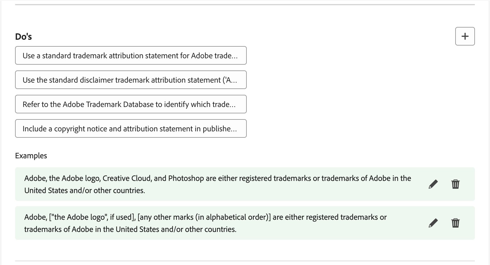
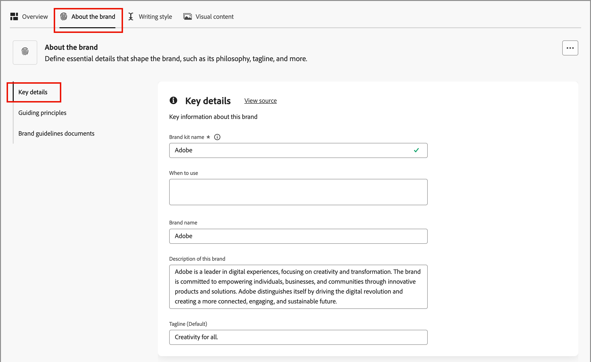
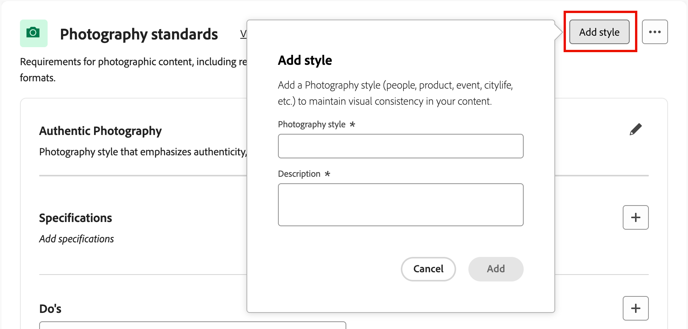

# Create and manage your brands {#brand-library}

Define a brand to provide a detailed set of rules and standards that establish a visual and verbal identity. These guidelines provide a reference to maintain consistent brand representation across all marketing and communication platforms. By leveraging well-defined brand guidelines, organizations can ensure that all content creation efforts are aligned with the strategic goals and overall brand identity. This consistency not only enhances brand recognition and trust, but also contributes to a more cohesive and impactful customer experience across all touchpoints. 

In Journey Optimizer B2B Edition, you can manually define and organize your brand definitions and assets or upload brand guideline documents for automatic information and visual asset extraction.

>[!AVAILABILITY]
>
>This capability is currently available as a private beta, with progressive availability planned for all customers in future releases.
>
> 
>
>A [user agreement](https://www.adobe.com/legal/licenses-terms/adobe-dx-gen-ai-user-guidelines.html){target="_blank"} is required before you can use AI-powered features in Adobe Journey Optimizer B2B Edition. For more information, contact your Adobe representative.
>
> 
>
>See [Brand-related permissions](./brands-overview.md#brand-related-permissions) for information about how product administrators can enable these features.

## Access your brand library

To access brands kits in Adobe Journey Optimizer B2B Edition, go to the left navigation and click **[!UICONTROL Content Management]** > **[!UICONTROL Brands]**. This action opens a page where the created brands are displayed as cards.

{width="800" zoomable="yes"}

If there are no brands created yet, a single graphic is displayed with a button to [create your first brand](#create-and-define-a-brand).

### Brand management actions

For each card, you can click the _More menu_ (  ) icon and choose an action for the brand:

* **[!UICONTROL View brand]** - Open the brand page and display the definitions.
* **[!UICONTROL Mark as default brand]** (Live only) - [Mark the brand as the default](#default-brand) for content alignment and generation.
* **[!UICONTROL Edit]** - Open the brand page and edit the brand guidelines, exclusions, and examples.
* **[!UICONTROL Duplicate]** - Create a copy as a new draft brand.
* **[!UICONTROL Publish]** (Draft only) - [Publish the brand](#publish-the-brand) to make it available for use with content alignment and generation.
* **[!UICONTROL Unpublish]** (Live only) - Unpublish the brand to remove it from use for content alignment and generation.
* **[!UICONTROL Delete]** - Remove the brand from your brand library.

{width="440"}

### Default brand

You can designate a default brand to be automatically applied when generating content and calculating alignment scores during content creation. Only a published (_Live_) brand can be the default.

In the Brands library, the default brand card is displayed with a flag.

{width="200"}

You can set any published (_Live_) brand as the default brand. On the brand card, click the _More menu_ (  ) icon and choose **[!UICONTROL Mark as default brand]**.

{width="350"}

## Create and define a brand {#create-brand}

>[!CONTEXTUALHELP]
>id="ajo-b2b_brands_create"
>title="Create your brand"
>abstract="Enter your brand name and upload your brand guidelines file. The tool automatically extracts key details, making it easier to maintain your brand identity."

To create and define your brand guidelines, you can either enter the details or upload your brand guideline documents to use for automatic extraction.

### Add the brand

1. At the top-right of the _[!UICONTROL Brands]_ page, click **[!UICONTROL Create brand]**.

1. Enter a **[!UICONTROL Name]** for your brand.

1. Drag and drop or select your file to upload your brand guidelines and extract automatically relevant brand information.

   {width="500"}

   >[!NOTE]
   >
   >If you don't have a document saved in PDF format, you can manually add the guidelines and upload individual visual assets after brand creation.

1. Click **[!UICONTROL Create brand]**.

    If you include one or more files to create the brand, the information extraction process begins. It may take several minutes to complete.

    When the extraction process is complete, your content and visual creation standards are automatically populated.

   {width="700" zoomable="yes"}

### Refine and update the brand guidelines

1. Browse through the different tabs to adapt and define more detailed information as needed.

   * [!UICONTROL Overview]

   * [[!UICONTROL About the brand]](#about-the-brand)

   * [[!UICONTROL Writing style]](#writing-style)

   * [[!UICONTROL Visual content]](#visual-content)

   If you included one or more documents when you created the brand, the information extraction process created definitions for the tabs and sections. The completeness depends on the scope and details included in any documents. As you review the result, you can change or remove any of the information.

   From the  _More menu_ (  ) for each tab or category, you can add documents to extract relevant brand information automatically. You can also clear the existing content.

   {width="500" zoomable="yes"}
   
   If you want to review the source for the extracted information in a sub-section, click the **[!UICONTROL View source]** link. 

   {width="700" zoomable="yes"}

1. In each details tab, review the categories and improve the brand by adding, removing, and changing your definitions.

   A sub-section in a category labeled **[!UICONTROL Do's]** outlines the guidelines. Use this area to add descriptions for guidelines and examples of the guidelines.

   {width="500" zoomable="yes"}

   A sub-section labeled **[!UICONTROL Don'ts]** outlines the exclusions. Use this area to add descriptions for exclusions and examples of the exclusions.

   {width="500" zoomable="yes"}

   * **Add a guideline or exclusion**.

     In the section where you want to add a guideline, click the _Add_ (  ) icon on the right. In the popup dialog, enter the guideline and select the checkboxes to designate the channels and elements for which the guideline applies. Then, click **[!UICONTROL Add]**.

      {width="600" zoomable="yes"}

   * **Change a guideline or exclusion**.
   
    In the section where you want to remove a guideline, click the guideline widget. In the popup dialog, change the content for the guideline and the selected checkboxes as needed. Then, click **[!UICONTROL Update]**.

      {width="600" zoomable="yes"}
   
   * **Remove a guideline or exclusion**.

     In the section where you want to remove a guideline, click the guideline widget. In the popup dialog, click the _Delete_  (  ) icon at the top.

   * **Add or revise examples of your guidelines and exclusions**.

     In the displayed example tile, click the _Edit_ (  ) to change the example, or click the _Delete_ (  ) icon to remove it.

1. When you have everything defined, click **[!UICONTROL Save]**.

   You can continue to make changes to the draft brand until you decide it is ready to publish.

### Publish the brand

When your brand includes a complete set of definitions and meets your requirements, click **[!UICONTROL Publish]** to make your brand guidelines available for content alignment and generation.

Published brands are accessible from the **[!UICONTROL Brand]** option in the AI [brand alignment](./brand-alignment.md) and content generation tools. <!-- [Learn more about content generation](gs-generative.md) -->

{width="300"}

## Brand definitions

The brand definitions are organized into three categories, displayed as tabs. Select each tab to complete and update the brand guidelines.

### About the brand {#about-brand}

Use the **[!UICONTROL About the brand]** tab to establish the core identity of your brand. This information outlines its purpose, personality, tagline, and other high-level attributes.

1. Add the foundational information for your brand in the **[!UICONTROL Key details]** category:

    * **[!UICONTROL Brand kit name]** - Update the brand name.

    * **[!UICONTROL When to use]** - Specify scenarios or contexts where this brand should be applied.

    * **[!UICONTROL Brand name]** - Enter the official name of the brand.

    * **[!UICONTROL Description of this brand]** - Provide an overview of what this brand represents.

    * **[!UICONTROL Tagline (Default)]** - Add the primary tagline associated with the brand.

    {width="600" zoomable="yes"}

1. In the **[!UICONTROL Guiding principles]** category, clarify the core direction and philosophy of your brand:

    * **[!UICONTROL Mission]** - Detail the brand purpose.

    * **[!UICONTROL Vision]** - Describe the long-term goal or desired future state.

    * **[!UICONTROL Market positioning]** - Explain how the brand is positioned in the market.

    {width="600" zoomable="yes"}

   From the **[!UICONTROL Core brand values]** category, review the defined brand values and adjust them as needed. 
   
   * To define a new core value, click the _Add_ (  ) icon on the right and complete the details:

     {width="500" zoomable="yes"}

      * **[!UICONTROL Value]** - Enter the name for the core brand value.

      * **[!UICONTROL Description]** - Explain what this value means to your brand.

      * **[!UICONTROL Behaviors]** - Outline the actions or attitudes that reflect this value in practice.

      * **[!UICONTROL Manifestations]** - Provide examples of how this value is expressed in real-world branding.

   * To change or delete a core value, click the _Edit_ (  ) icon to update or delete a core brand value.

     {width="500" zoomable="yes"}

     Change the details and click **[!UICONTROL Update]**. Or, click the _Delete_ (  ) icon at the top to remove the core value. 

1. In the **[!UICONTROL Brand guidelines documents]** category, review the documents used to generate the brand guidelines.   

   Click the More menu icon and choose an option to update the brand guidelines using uploaded reference documents:

   * **[!UICONTROL Re-extract guidelines]** - Choose this action to run an extraction job using the current documents.
   * **[!UICONTROL Add reference for extraction]** - Choose this action to upload another document and run an extraction job.

   {width="600" zoomable="yes"}

You can proceed to refine the [writing style](#writing-style) or [visual content](#visual-content) guidelines, exclusions, and examples, or you can [publish your brand](#publish-the-brand).

### Writing style {#writing-style}

>[!CONTEXTUALHELP]
>id="ajo_brand_writing_style"
>title="Writing style alignment score"
>abstract="The Writing style section defines standards for language, formatting, and structure to ensure clear, consistent content. The alignment score, rated from high to low, shows how well your content follows these guidelines and highlights areas for improvement."

The _[!UICONTROL Writing style]_ definitions outline the standards for writing content, and details how language, formatting, and structure should be used to maintain clarity, coherence, and consistency across all materials.

Select the **[!UICONTROL Writing Style]** tab, and review each category.

{width="600" zoomable="yes"}

| Category                   | Subcategory    | Guidelines Example    | Exclusions Example    |
|----------------------------|----------------|-----------------------|-----------------------|
| [!UICONTROL Brand communication style]  | [!UICONTROL Brand Personality Traits] | Friendly and approachable. | Do not be defeatist. |
|                            | [!UICONTROL Writing Mechanics] | Keep sentences short and impactful. | Do not use excessive jargon. |
|                            | [!UICONTROL Situational Tone] | Maintain a professional tone in crisis communications.  | Do not be dismissive in support communications. |
|                            | [!UICONTROL Word Choice Guidelines] | Use words like _innovative_ and _smart_. | Avoid words like _cheap_ or _hack_. |
|                            | [!UICONTROL Language Standards] | Follow American English conventions.  | Do not mix British and American spellings. |
| [!UICONTROL Brand messaging standards] | [!UICONTROL Brand messaging standards] | Highlight innovation and customer-first messaging. | Do not overpromise product capabilities. |
|                            | [!UICONTROL Tagline usage] | Place the tagline beneath the logo on all digital marketing assets. | Do not modify or translate the tagline. |
|                            | [!UICONTROL Core messaging] | Emphasize the key benefit statement, such as improved productivity. | Do not use unrelated value propositions. |
|                            | [!UICONTROL Naming standards] | Use simple, descriptive names such as _ProScheduler_.| Do not use complex terms or special characters. |
| [!UICONTROL Legal compliance standards] | [!UICONTROL Trademark standards] | Always use the &#8482; or &#174; symbol. | Do not omit legal symbols when required. |
|                            | [!UICONTROL Copyright standards] | Include copyright notices on marketing materials. | Do not use third-party content without permission. |
|                            | [!UICONTROL Disclaimer standards] | Display disclaimers legibly on digital assets. | Do not hide disclaimers in non-visible areas. |

<!-- #### Preferred and avoided terms

Supplement your work choice guidelines by adding preferred and avoided terms. 

#### Primary tagline and variations

#### Brand names and variations

#### Approved and restricted statements
-->

### Visual content {#visual-content}

>[!CONTEXTUALHELP]
>id="ajo-b2b_brand_imagery"
>title="Visual content alignment score"
>abstract="The Visual Content Alignment Score indicates how well your content matches your configured brand guidelines. Scored from high to low, it helps you assess alignment at a glance. Explore the different categories to identify areas for improvement and pinpoint elements that may be off-brand."

The _[!UICONTROL Visual content]_ definitions outline the standards for imagery and design, and detail the specifications needed to maintain a unified and consistent brand look.

Select the **[!UICONTROL Visual content]** tab, and review each category.

{width="600" zoomable="yes"}

| Category               | Guidelines example  | Exclusions example  |
|------------------------|---------------------|---------------------|
| [!UICONTROL Photography standards]  | Use natural lighting for outdoor shots. | Avoid overly edited or pixelated images. |
| [!UICONTROL Illustration standards] | Use clean, minimalistic styles. | Avoid overly complex. |
| [!UICONTROL Icon standards]         | Use a consistent 24px grid system. | Do not mix icon dimensions, use inconsistent stroke weights, or deviate from grid rules. |
| [!UICONTROL Usage guidelines]       | Choose lifestyle images that reflect real customers using the product in professional environments. | Do not use imagery that contradicts brand tone or appears out of context. |

<!-- #### Styles

To define the overall style for the category, click **[!UICONTROL Add style]**. In the popup dialog, enter the style type and description. 

{width="500" zoomable="yes"}

#### Specifications

-->

#### Example images

To add an image showing correct or incorrect usage, choose **[!UICONTROL Example]** in the _[!UICONTROL Add guideline]_ or _[!UICONTROL Add exclusion]_ popup dialog. Click **[!UICONTROL Select image]** to choose and image file from your system. Click **[!UICONTROL Add]** to upload the image and display the thumbnail for the area.

{width="500" zoomable="yes"}

## Edit a published brand

You cannot make modifications to a published (Live) brand, but you can create a draft copy to edit. When you publish the draft with your edits, that version replaces the live version.

1. Open the brand page and click **[!UICONTROL Edit brand]** at the top right.

1. In the confirmation dialog, click **[!UICONTROL Edit Brand]**.

    This action creates a draft copy of the brand.

1. Browse through the different tabs to update the brand information as needed.

   * Overview

   * [About the brand](#about-the-brand)

   * [Writing style](#writing-style)

   * [Visual content](#visual-content)

1. Click **[!UICONTROL Save]** as you work with the draft updates, and then **[!UICONTROL Publish]** when you are ready to replace the _Live_ version.
