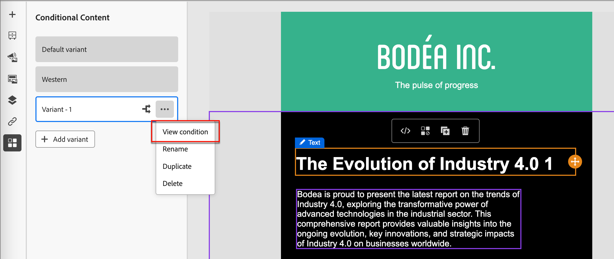

# Conditional content

Conditional content allows you to adapt email and fragment content based on conditional rules. These rules are defined using profile attributes or contextual events. You can create conditional rules in the rule builder, and you can store them for reuse across your account journeys.

To add conditional content to your fragments and email messages, Adobe Journey Optimizer allows you to apply conditional rules that are stored in the _Conditions_ library. Apply conditional rules within the visual design space as you author [email content for an account journey](./email-authoring.md) or a [visual fragment](./fragment-authoring.md).

## Add conditional content {#email-fragment-content}

>[!CONTEXTUALHELP]
>id="ajo-b2b_conditional_content"
>title="Conditional content"
>abstract="Use conditional rules to create multiple variants of a content component. If none of the conditions are met when sending the message, the content from the Default variant displays."

>[!CONTEXTUALHELP]
>id="ajo-b2b_conditional_rule_select"
>title="Conditional content"
>abstract="Use a conditional rule saved into the library or create a new one."

As you author a fragment or an email in the visual design space, use conditional rules to define multiple variants for a content component.

1. Select a content component and click the **[!UICONTROL Enable conditional content]** icon in the component toolbar.

    The component is outlined in orange to indicate that it is activated as a conditional component. The **[!UICONTROL Conditional Content]** pane displays on the left with the _Default variant_ and _Variant - 1_.

    {width="700" zoomable="yes"}
    
   The original content that you selected and activated is the default and applies when none of the conditional rules are satisfied for any of the variants that you define.

   From this pane, you can define multiple variants for the selected content component using conditional rules.

1. Hover over the first variant (_Variant - 1_) and click the _Select condition_ icon (  ).

   {width="700" zoomable="yes"}

   The _[!UICONTROL Select condition]_ dialog opens and displays the conditions library.

   If you want to view details for a condition to ensure it is what you want, click the _More menu_ icon (**...**) and choose **[!UICONTROL View Info]**.

   {width="600" zoomable="yes"}

   If the condition that you need does not exist, [create a conditional rule](#create-condition) by clicking **[!UICONTROL Create new]**.

1. Select the conditional rule and click **[!UICONTROL Select]** to associate it with the variant.

    You can review the associated condition by clicking the _More menu_ icon (**...**) for the variant and choosing **[!UICONTROL View condition]**.

    {width="600" zoomable="yes"}

    Click X at the top right to close the popup.

    {width="500"}
    
1. For better readability, rename the variant by clicking the _More menu_ icon (**...**) for the variant and choosing **[!UICONTROL Rename]**. 

   Enter a meaningful name for the variant that helps you to identify the variant and its intent.

   {width="600" zoomable="yes"}

1. With the variant selected in the left pane, change the component to alter how it appears in the email message when the condition is true.

   In this example, the variant for the text component uses a different description based on the region of the recipient.

   {width="600" zoomable="yes"}
    
1. If needed, define another variant by clicking **[!UICONTROL Add variant]**.

   Repeat steps 2-5 to select a condition, rename the variant, and change the component for the variant.

   You can add as many variants as needed for the content component. Change the selected variant in the left pane at any time to check how the content component appears for the condition.

    >[!IMPORTANT]
    >
    >Conditional content is evaluated against associated rules in the order in which the variants are listed. The first variant with a condition that evaluates as true is used for the component.
    >
    >If none of the defined variant conditions evaluates as true when sending the email, the content component appears according to the **[!UICONTROL Default variant]**.

1. To delete a variant, click the _More menu_ icon (**...**) for the variant and choose **[!UICONTROL Delete]**.

   Click **[!UICONTROL Delete]** in the confirmation dialog.

## Conditional rules 

Conditional rules are a set of conditional expressions that can be evaluated as true or false. You can use these rules to determine which content variant to display in an email message based on various filters, such as profile attributes or contextual events.
The rules are stored in the conditions library, where they are available for reuse across email and fragment content for your organization.
<!--
>[!NOTE]
>
>You need the [Manage Library Items](../administration/ootb-product-profiles.md) permission to save or delete conditional rules. Saved conditions are available for use by all users within an organization.-->

### Condition filters {#condition-filters}

| Condition type | Filters | Description |
| -------------- | ------- | ----------- |
| **Account** | Account Attributes | Attributes from the account profile, including: <li>Annual revenue</li><li>City</li><li>Country</li><li>Employee size</li><li>Industry</li><li>Name</li><li>SIC code</li><li>State</li> |
| | [!UICONTROL Special filters] > [!UICONTROL Has Buying Group] | The account does or does not have members of buying groups. The filter can also be evaluated against one or more of the following criteria: <li>Solution Interest</li><li>Buying Group status</li><li>Completeness Score</li><li>Engagement Score</li> |
| **Person** | [!UICONTROL Activity history] > [!UICONTROL Email] | Email activities associated with the journey: <li>[!UICONTROL Clicked link in email]</li><li>Opened Email</li><li>Was delivered email</li><li>Was sent email</li> These conditions are evaluated using a selected email message from earlier in the journey.  |
|  | [!UICONTROL Person Attributes] | Attributes from the person profile, including: <li>City</li><li>Country</li><li>Date of birth</li><li>Email address</li><li>Email invalid</li><li>Email suspended</li><li>First name</li><li>Inferred state region</li><li>Job title</li><li>Last name</li><li>Mobile phone number</li><li>Phone number</li><li>Postal code</li><li>State</li><li>Unsubscribed</li><li>Unsubscribed reason</li>|
| | [!UICONTROL Special filters] > [!UICONTROL Member of Buying Group] | The person is or is not a buying group member evaluated against one or more of the following criteria: <li>Solution Interest</li><li>Buying Group status</li><li>Completeness Score</li><li>Engagement Score</li><li>Role</li>|

### Create a conditional rule {#create-condition}

>[!CONTEXTUALHELP]
>id="ajo-b2b_conditions_rule_editor"
>title="Create condition"
>abstract="Combine attributes and contextual events to build rules that determine which content variant to display in email messages."

You can access the conditional rule builder from the email design space when you are selecting a condition for a component variant. 

1. In the _[!UICONTROL Select condition]_ dialog, click **[!UICONTROL Create new]** and choose the condition type:

   * **[!UICONTROL Person condition]** - Choose this type to build the conditional rule using person attributes and contextual events.
   * **[!UICONTROL Account condition]** - Choose this type to build the conditional rule using account attributes.

   {width="600" zoomable="yes"}

1. Build the conditional rule according to your needs.

   For each attribute or event that you want to include in the rule, drag and drop the item onto the rule canvas. Expand the filter and complete the expression.

   {width="600" zoomable="yes"}

   If you include more than one filter, set the **[!UICONTROL Filter logic]**:

   * **[!UICONTROL Apply all filters]** - The rule evaluates as true if **all** the filters are true. 
   * **[!UICONTROL Apply any filters]** - The rule evaluates as true if **any** of the filters is true.
   
1. On the right, enter the **[!UICONTROL Name]** and a **[!UICONTROL Description]** (optional) for the rule.

   Use a meaningful name and useful description to help others in your organization so that they can reuse it instead of creating another duplicate condition.

    {width="600" zoomable="yes"}

1. When your conditional rule is complete, click **[!UICONTROL Save]**.

   The conditional rule is saved to the library and you can select it for the current variant. It is also included in the library for use by any other dynamic content variants across account journeys.

### Duplicate a rule

Conditional rules saved to the library cannot be modified. However, you can duplicate an existing rule and change it to create a new rule. 

1. Click the _More menu_ icon (**...**) for the variant and choose **[!UICONTROL Duplicate]**.

   A duplicate of the rule opens in the rule builder. Use the duplicate as a starting point for the rule that you want to build.

   {width="600" zoomable="yes"}

1. In the rule builder, change, add, or delete conditions according to what you need.

1. Change the name and description to match the purpose or items in the rule.

1. When your conditional rule is complete, click **[!UICONTROL Save]**.
