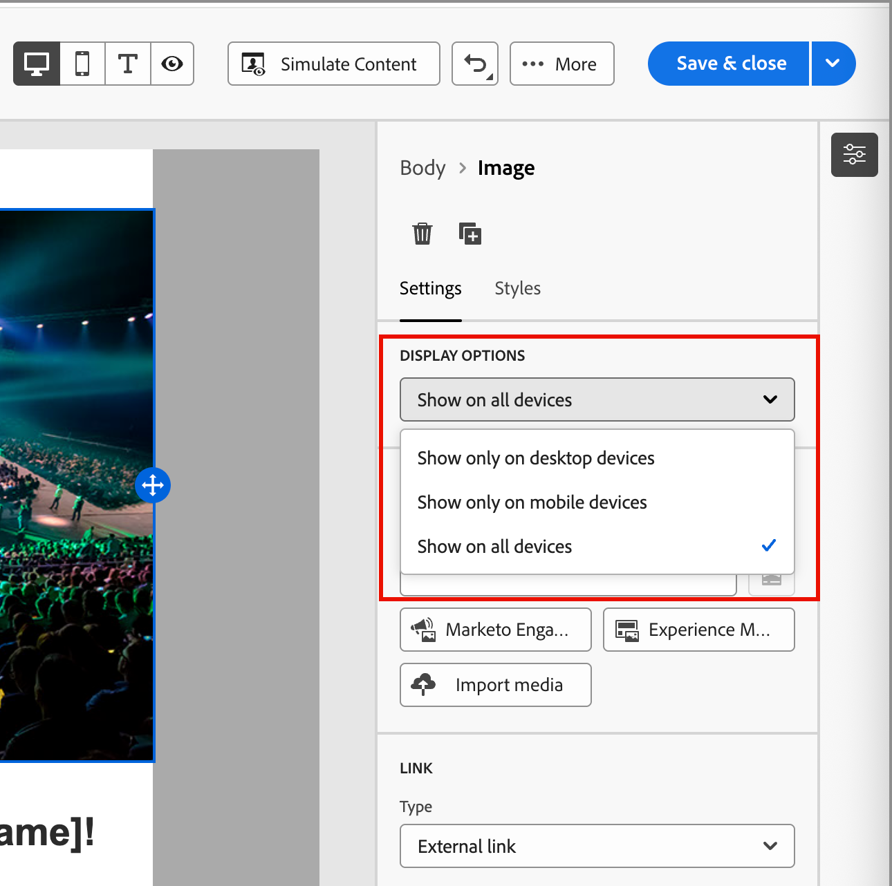

# Content components {#content-components}

>[!CONTEXTUALHELP]
>id="ajo-b2b_content_components_email"
>title="About Content components"
>abstract="Content components are empty content placeholders that you can use to design an email."

>[!CONTEXTUALHELP]
>id="ajo-b2b_content_components_landing_page"
>title="About Content components"
>abstract="Content components are empty content placeholders that you can use to design a landing page."

>[!CONTEXTUALHELP]
>id="ajo-b2b_content_components_fragment"
>title="About Content components"
>abstract="Content components are empty content placeholders that you can use to design a fragment."

>[!CONTEXTUALHELP]
>id="ajo-b2b_content_components_template"
>title="About Content components"
>abstract="Content components are empty content placeholders that you can use to design a template."

When you design content for emails, landing pages, templates, and visual fragments, use the [!UICONTROL Content components] to add visual design elements. You can add as many content components as you need inside one or more structure components, which define the layout.

## Contents library

The **[!UICONTROL Contents]** section at the bottom of the Components library displays the available content components:

| Icon | Component | Description | 
| --------- | ---- | ----------- |
|  | [Container](#container) | Add this component to your design to include a rectangular container that you can use to group components or apply background or border styling to an area. |
|  | [Button](#button) | Add this component to your design to include a clickable button element. |
|  | [Text](#text) | Add this component to your design to include a body of text. |
|  | [Divider](#divider) | Add this component to your design to include a horizontal line to separate areas of your content. |
|  | [HTML](#html) | Add this component to your design to copy-paste the different parts of your existing HTML. Use this component to create a free modular HTML block to reuse some external content. |
|  | [Image](#image) | Add this component to your design to insert an image file.|
|  | [Social](#social) | Add this component to your design to insert links to social media pages. |
|  | [Form](#form) | **_Available for landing pages only._** Add this component to your design to insert a created form. |

## Content component toolbars

Each content component type displays a toolbar when you select it in the canvas. The available tools, which vary by the component type, provide an easy way to work with the component directly in the rendered content. It includes formatting and functional capabilities that are applicable for the component type.

{width="450"}

### Formatting tools

+++Change text style

<table>
    <tr>
        <th style="width: 30%;">Tool</th>
        <th style="width: 50%;">Usage</th>
        <th style="width: 20%;">Components</th>
    </tr>
    <tr>
        <td></td>
        <td>Apply bold, italic, underline, or strike-through, superscript, or subscript to the selected text string.</td>
        <td><li>Button <li>Text</td>
    </tr>
</table>

+++

+++Horizontal alignment

<table>
    <tr>
        <th style="width: 30%;">Tool</th>
        <th style="width: 50%;">Usage</th>
        <th style="width: 20%;">Components</th>
    </tr>
    <tr>
        <td></td>
        <td>Apply a horizontal alignment type to the component content. Choose left, centered, right or justified. </td>
        <td><li>Button <li>Text</td>
    </tr>
</table>

+++

+++Create list

<table>
    <tr>
        <th style="width: 30%;">Tool</th>
        <th style="width: 50%;">Usage</th>
        <th style="width: 20%;">Components</th>
    </tr>
    <tr>
        <td></td>
        <td>Apply ordered or unordered list formatting to the component text.</td>
        <td><li>Text</td>
    </tr>
</table>

+++

+++Set heading

<table>
    <tr>
        <th style="width: 20%;">Tool</th>
        <th style="width: 60%;">Usage</th>
        <th style="width: 20%;">Components</th>
    </tr>
    <tr>
        <td></td>
        <td>Apply heading level formatting to the paragraph for the cursor location.</td>
        <td><li>Button <li>Text</td>
    </tr>
</table>

+++

+++Font size

<table>
    <tr>
        <th style="width: 20%;">Tool</th>
        <th style="width: 60%;">Usage</th>
        <th style="width: 20%;">Components</th>
    </tr>
    <tr>
        <td></td>
        <td>Apply font size to a selected text. Click the tool and choose the size or enter the px value.</td>
        <td><li>Button <li>Text</td>
    </tr>
</table>

+++

+++Font color

<table>
    <tr>
        <th style="width: 40%;">Tool</th>
        <th style="width: 40%;">Usage</th>
        <th style="width: 20%;">Components</th>
    </tr>
    <tr>
        <td></td>
        <td>Apply font color to the selected text. Choose a color from the picker and use the color slider and the color field to select the color. Or, you can enter a known RGB, HSL, HSB, or hexadecimal value. </td>
        <td><li>Button <li>Text</td>
    </tr>
</table>

+++

+++Insert link

<table>
    <tr>
        <th style="width: 40%;">Tool</th>
        <th style="width: 40%;">Usage</th>
        <th style="width: 20%;">Components</th>
    </tr>
    <tr>
        <td></td>
        <td>Create a clickable link (external URL or landing page) for the selected text or element.</td>
        <td><li>Button <li>Text <li>Image </td>
    </tr>
</table>

+++

+++Remove link

<table>
    <tr>
        <th style="width: 15%;">Tool</th>
        <th style="width: 60%;">Usage</th>
        <th style="width: 25%;">Components</th>
    </tr>
    <tr>
        <td></td>
        <td> Remove the clickable link (external URL or landing page) for the selected text or element.</td>
        <td><li>Button <li>Text <li>Image </td>
    </tr>
</table>

+++

### Functional tools

| Tool | Name | Usage | 
| ---- | ---- | ----- |
| {width="40"} | Add personalization|  Use the personalization editor to insert personalization tokens in the component content. [Learn more](./email-authoring.md#personalize-content) |
| {width="40"} | Show the source code| Display the HTML source code for the component in a read-only popup.  {width="200"} |
| {width="40"} | Enable conditional content | Enable conditional variants for the component. [Learn more](./conditional-content.md) |
| {width="40"} | Duplicate | Create a copy of the component and add it directly below. |
| {width="40"} | Delete | Remove the component. |

## Add a content component to your design

1. In the visual design space, use an existing template or add the needed structure components into an empty canvas to define the layout.

1. In the **[!UICONTROL Components]** library, grab the _Drag handle_  for the content component of your choice, then drag and drop it onto the structure components.

   You can add several components into a single structure component and into each column of a structure component.

   {width="600" zoomable="yes"}

1. Adjust the component display using the **[!UICONTROL Settings]** and **[!UICONTROL Style]** tabs on the right, or the context toolbar displayed in the canvas.

   For example, you can change the text style, padding, or margin of the component.

   {width="600" zoomable="yes"}

As you are working with your design, you can also [remove](#remove-a-content-component) or [duplicate](#duplicate-a-content-component) a component.

## Content component settings and styles

After you add a component, it is selected in the visual design space and its properties are displayed in the right panel. You can also select a component at any time to change the settings and styles. Many settings and styles are specific to the component, but there are some standard settings and styles that you can apply to any selected content components.

### Display options

If you want to exclude the component from desktop or mobile device display, change the **[!UICONTROL Display Options]** setting. The default, _[!UICONTROL Show on all devices]_, enables display across all devices. Choose another setting to make the component exclusive by device type:

* _[!UICONTROL Show only on desktop devices]_ - Choose this setting when you want to display the component on desktop devices and exclude it for mobile devices.
* _[!UICONTROL Show only on mobile devices]_ - Choose this setting when you want to display the component on mobile devices, such as phones and tablets, and exclude it for desktop devices.

{width="400" zoomable="yes"}

### Container

Use a container to apply specific styling to a group of content components. Add a [!UICONTROL Container] component and then add other content components inside it. This component is similar to how you might use a `div` element in HTML. You can apply a distinct style to the container that differs from the style applied to the content components that it contains. 

For example, add a _[!UICONTROL Container]_ component and then add a _[!UICONTROL Button]_ component inside that container. You can use a specific area styling for the container, and style the button and its background as you need. 

{width="600" zoomable="yes"}

+++Background

{{styles-background}}

+++

+++Border

{{styles-border}}

+++

+++Size

{{styles-size}}

+++

+++Margin

{{styles-margin}}

+++

+++Padding

{{styles-padding}}

+++

### Button

Use the [!UICONTROL Button] component to insert one or multiple clickable buttons into your content. Use buttons to redirect page viewers or email recipients to supporting content (published landing page or an external link).

#### Add the button text

When the button component is displayed in the canvas, the toolbar includes options for text formatting, as well as personalization and conditional variants. For more information about the editor toolbar options, see #.

When you enter the button label text and set the formatting, the button resizes to accommodate the content. 

{width="500" zoomable="yes"}

#### Set link options

On the _[!UICONTROL Settings]_ tab, use the **[!UICONTROL Link]** options to define the button text, link destination, and the browser behavior for loading the target page.

1. Set the **[!UICONTROL Type]** for the link:

   * **[!UICONTROL External link]** - Choose this type to use a standard URL as the link destination.

      In **[!UICONTROL Url]**, enter the URL for the link destination. Click the _Personalize_ icon (  ) to use a personalization token as a parameter in the URL.
      
      {width="200"}       

   * **Landing page** - Choose this type to select a published landing page in <!-- Journey Optimizer B2B Edition (_Beta_) or -->the connected Marketo Engage instance.

      For the **[!UICONTROL Landing Page]** option, select the published landing page. Click the _Select page_ icon (  ) and [select the published landing page](./landing-pages.md#link-to-a-landing-page).
      
      {width="200"}

1. For **[!UICONTROL Label]**, enter the text that you want to display inside the button.

   The button sizing adjusts according to the text and the styling that set.

1. For **[!UICONTROL Target**], choose how the linked destination is redirected from the email or page: 

   * _[!UICONTROL None]_ - Opens the link using the default browser or client behavior (default).
   * _[!UICONTROL Blank]_ - Opens the link in a new window or tab. 
   * _[!UICONTROL Self]_ - Opens the link in the same frame. 
   * _[!UICONTROL Parent]_ - Opens the link in the parent frame.
   * _[!UICONTROL Top]_ - Opens the link in the full body of the window.

#### Set styles

Customize the button styling in the **[!UICONTROL Styles]** tab.

+++Background

{{styles-background}}

+++

+++Text

{{styles-text}}

+++

+++Border

{{styles-border}}

+++

+++Size

{{styles-size}}

+++

+++Alignment

+++

+++Button margin

+++

+++Container margin

{{styles-margin}}

+++

+++Padding

{{styles-padding}}

+++

+++Advanced

{{styles-advanced}}

+++

### Text

Use the Text component to insert a text block into your content. When the text component is selected in the canvas, enter the text and use the toolbar options to add inline formatting and options, including personalization tokens and conditional variants. For detailed information about crafting text, including inline styling and options, in the design space, see Text authoring.

Customize the text component styling in the **[!UICONTROL Styles]** tab.

+++Background

{{styles-background}}

+++

+++Text

These styles are applied to the whole text block. You can apply inline styling to a selected text string.

{{styles-text}}

+++

+++Border

{{styles-border}}

+++

+++Size

{{styles-size}}

+++

+++Margin

{{styles-margin}}

+++

+++Padding

{{styles-padding}}

+++

+++Advanced

{{styles-advanced}}

+++

### Divider

Add a _Divider_ component to incorporate a linear division between sections of your content.

+++Background

{{styles-background}}

+++

+++Line

+++

+++Size

{{styles-size}}

+++

+++Alignment

{{styles-alignment-h}}

+++

+++Margin

{{styles-margin}}

+++

+++Padding

{{styles-padding}}

+++

+++Advanced

{{styles-advanced}}

+++

### HTML

Use the HTML component to add parts of your existing HTML. This component provides an easy way to create modular HTML elements that reuse your external content. 

1. Select the component on the canvas and click the _Show the source code_ icon in the toolbar.

   [Open the code editor to add the HTML](./assets/content-components-html-show-code.png){width="450"}

1. Paste the HTML in the text box and click **[!UICONTROL Save]**.

   [Edit HTML dialog](./assets/content-components-html-edit-dialog.png){width="600" zoomable="yes"}   

   If the HTML is valid, it renders the element on the canvas. If it is an element that maps to one of the other content components, you can change the settings and styles in the right panel according to the component type. If it does not, it remains as an HTML component.

For an HTML component, you can set the following styles for the whole HTML component in the right panel:

+++Background

{{styles-background}}

+++

+++Border

{{styles-border}}

+++

+++Size

{{styles-size}}

+++

+++Alignment

{{styles-alignment-h-v}}

+++

+++Margin

{{styles-margin}}

+++

+++Padding

{{styles-padding}}

+++

+++Advanced

{{styles-advanced}}

+++

### Image

Use the [!UICONTROL Image] component to insert an image asset into your content. When the _Image_ component is selected in the canvas, you can add or change the displayed image asset file.

{width="400" zoomable="yes"}

#### Add the image asset

Choose the [asset source type](./assets-overview.md) and select an image file:

* **[!UICONTROL Marketo Engage Assets]** - Choose this type to browse and select an image asset from the Journey Optimizer B2B Edition library or from the connected Market Engage instance. 

  {width="700" zoomable="yes"}
  
   From the dialog, you can choose an image from the selected repository and workspace. Click **[!UICONTROL Select]** to add the asset.
     
   There are tools available to help you locate the asset that you need: 
  
   * Click the _Filter_ icon on the top left to filter the displayed items according to your criteria.
  
   * Enter text in the _Search_ field to filter the displayed items for a match of the asset name.
  
     {width="700" zoomable="yes"}

* **[!UICONTROL Experience Manager Assets]** - Choose this type to browse and select an image asset from a [configured Experience Manage Assets repository](../admin/configure-aem-repositories.md). 

   From the _[!UICONTROL Select Assets]_ dialog, choose an image using the available tools to locate the asset that you need and click **[!UICONTROL Select]**.:
   
   * Change the **[!UICONTROL Repository]** at the top right.

   * Click **[!UICONTROL Manage assets]** at the top right to open the Assets repository in another browser tab and use AEM Assets management tools.

   * Click the _View type_ selector at the top right to change the display to **[!UICONTROL List View]**, **[!UICONTROL Grid View]**, **[!UICONTROL Gallery View]**, or **[!UICONTROL Waterfall View]**.

   * Click the _Sort order_ icon to change the sort order between ascending and descending.

      {width="700" zoomable="yes"}

   * Click the **[!UICONTROL Sort by]** menu arrow to change the sort criteria to **[!UICONTROL Name]**, **[!UICONTROL Size]**, or **[!UICONTROL Modified]**.

   * Click the _Filter_ icon on the top left to filter the displayed items according to your criteria.

   * Enter text in the _Search_ field to filter the displayed items for a match of the asset name.

   {width="700" zoomable="yes"}

* **[!UICONTROL Import media]** - Choose this type to select a file from your system and import it into the Journey Optimizer B2B Edition asset library.

   In the _[!UICONTROL Upload image]_ dialog, drag and drop a file from your system to the file box. The maximum file size is 100 MB.

   {width="450"}

   The file names of the selected images are displayed in the dialog. Asset file names must be unique (across folders), and if a file with the name already exists, a message is displayed. Names can have a maximum of 100 characters, and cannot contain special characters (such as `;`, `:`, `\`, and `|`). 

   Click **[!UICONTROL Import]**.

You can add an image title and alt text for the image in the right panel.

{width="250"}

#### Set link options

On the _[!UICONTROL Settings]_ tab, use the **[!UICONTROL Link]** options to link the image with a destination and the browser behavior for loading the target page.

1. Set the **[!UICONTROL Type]** for the link:

   * **[!UICONTROL External link]** - Choose this type to use a standard URL as the link destination.

      In **[!UICONTROL Url]**, enter the URL for the link destination. Click the _Personalize_ icon (  ) to use a personalization token as a parameter in the URL.
      
      {width="250"}       

   * **Landing page** - Choose this type to select a published landing page in <!-- Journey Optimizer B2B Edition (_Beta_) or -->the connected Marketo Engage instance.

      For the **[!UICONTROL Landing Page]** option, select the published landing page. Click the _Select page_ icon (  ) and [select the published landing page](./landing-pages.md#link-to-a-landing-page).
      
      {width="250"}

1. For **[!UICONTROL Label]**, enter the text that you want to display inside the button.

   The button sizing adjusts according to the text and the styling that set.

1. For **[!UICONTROL Target**], choose how the linked destination is redirected from the email or page: 

   * _[!UICONTROL None]_ - Opens the link using the default browser or client behavior (default).
   * _[!UICONTROL Blank]_ - Opens the link in a new window or tab. 
   * _[!UICONTROL Self]_ - Opens the link in the same frame. 
   * _[!UICONTROL Parent]_ - Opens the link in the parent frame.
   * _[!UICONTROL Top]_ - Opens the link in the full body of the window.

#### Set the styles 

Set the styles for the image component in the right panel.

+++Background

{{styles-background}}

+++

+++Border

{{styles-border}}

+++

+++Size

{{styles-size}}

+++

+++Alignment

{{styles-alignment-h}}

+++

+++Margin

{{styles-margin}}

+++

+++Padding

{{styles-padding}}

+++

+++Advanced

{{styles-advanced}}

+++

### Social

Use the _Social_ component to insert links to social media pages into your content. It includes three default social media types, but you can add or remove the types according to your needs.

{width="600" zoomable="yes"}

* To add a social media type, click the _Add_ ( **+** ) icon and choose a social media type that you want to add. 

   {width="250"}

* To remove a social media type, click the **X** next to the social media icon.

With a social media type selected, set the options for that type:

* **[!UICONTROL URL]** - Enter the social media URL that you want to link to the social media graphic or icon. 
* **[!UICONTROL Source]** - If you want to use your own image instead of the default, choose and image asset. You can select an image from the connected Marketo Engage asset repository, an Experience Manager Assets repository (if configured), or import an image file from your system. Refer to the [Image component information](#add-the-image-asset) for details about selecting and importing image assets.
* **[!UICONTROL Alt text]** - Enter the alt text for the displayed image.

   {width="250"}

To define a consistent display size for all social media graphics, set the **[!UICONTROL Size of images]**.

You can set the following style options for the _Social_ component:

+++Background

{{styles-background}}

+++

+++Border

{{styles-border}}

+++

+++Size

{{styles-size}}

+++

+++Alignment

{{styles-alignment-h}}

+++

+++Margin

{{styles-margin}}

+++

+++Padding

{{styles-padding}}

+++

+++Advanced

{{styles-advanced}}

+++

### Form (landing pages)

[!BADGE Beta]{type=Informative url="/help/user/content/forms.md" tooltip="Beta feature"}

Use the _Form_ component to add a published form to a landing page or landing page template. For more information about creating and publishing forms, see [Forms](./forms.md).

1. Click the _Form_ tool in the component toolbar, or use the **[!UICONTROL Embed Form]** properties on the right to select the published form. 

   {width="600"}

1. If you want to override the default **[!UICONTROL Follow up type]** for the form, change the setting according to the requirements for your page or template.

   This page is also known as the _Thank-you page_ for the form and this setting determines what happens when a visitor submits the form:

   * **[!UICONTROL Stay on page]** - Choose this option to keep the visitor on the same page when the form is submitted.

   * **[!UICONTROL Landing page]** - Choose this option to select any Journey Optimizer B2B Edition or Marketo Engage landing page as the follow-up.

   * **[!UICONTROL External URL]** - Choose this option to specify any URL as the follow-up page. After the visitor submits the form, the browser loads the designated URL.

      >[!TIP]
      >
      >If you want the use the form for downloading a file, you can specify a URL for the hosted file. With this configuration, the submit button functions as a download button.
    
     {width="280"} 

If needed, select the **[!UICONTROL Styles]** tab in the right panel to set the form margins within the structure component.

{{styles-margin}}
