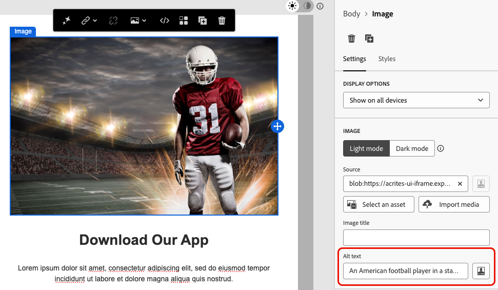

# Design accessible content {#accessible-content}

The [European accessibility act](https://eur-lex.europa.eu/legal-content/EN/TXT/?uri=CELEX%3A32019L0882){target="_blank"} is a directive designed to enhance the internal market for accessible products and services by eliminating barriers caused by differing national rules across Member States.

This regulation states that all digital communications, including emails, newsletters, PDFs, and downloadable content, should be accessible. When creating content for your recipients, you are therefore required to follow specific guidelines such as using accessible fonts, readable formats, and provide alternative text for images. 

The [!DNL Journey Optimizer B2B Edition] design tools enable marketers to build content both for **emails** and **landing pages**. Use these tools to comply with this directive, based on Web Content Accessibility Guidelines (WCAG) 2.1, level AA.

The following sections outline the best practices for designing accessible content with [!DNL Journey Optimizer B2B Edition]. This information focuses on designing content that is accessible to all your recipients, so that people with disabilities can read, understand, and interact with your emails and landing pages.
  
## Ensure text readability {#text-readability}

Leverage the **[!UICONTROL Styles]** tab of the **[!UICONTROL Text]** component to ensure that your text is readable, such as using a proper color contrast and simple fonts. For more information about text component styling, see [Content components](content-components.md#text)

{width="700" zoomable="yes"}

For fonts and text, make sure you follow the guidelines below: 

### Font selection

* Use sans-serif fonts, such as Arial, Verdana, Tahoma, Helvetica, or Open Sans.
* Avoid serif, cursive, or decorative fonts in body content.
* Stick to a limited font set for consistency and fallback (for example: `font-family: Arial, Helvetica, sans-serif;`).

### Font sizing

* Ensure a minimum font size of 16px for body text.
* Use a proper hierarchy for headings. 

### Color contrast

* Maintain a contrast ratio of at least 4.5:1 between text and background.
* For large text (≥24px or bold 18px), ensure at least a 3:1 contrast.
* Avoid light gray or pastel text on white backgrounds.
* Do not rely on color alone to convey meaning, but instead use underlines, icons, etc.

### Text accessibility

* Avoid text in images.
* Do not use all caps in body text.
* Ensure that text can be zoomed up to 200% without breaking the layout.

## Ensure visual accessibility {#visual-accessibility}

To make sure your content is visually accessible, follow the best practices below:

* Avoid using color-only indicators for important information.
* Use text labels or icons to ensure clarity.
* Optimize your design for mobile and responsive layouts, ensuring buttons are large and properly spaced.
* Regularly test across devices and screen sizes to maintain accessibility. 

In [!DNL Journey Optimizer B2B Edition], the size and spacing of the different elements in your content can be further refined using the styling parameters and attributes from the Email Designer **[!UICONTROL Styles]** pane.

For example, you can update the background, or change the margins, padding and alignment to improve the visual accessibility of your content.

{width="700" zoomable="yes"}

Moreover, the [!DNL Journey Optimizer B2B Edition] Email Designer enables you to preview and optimize design for different devices and screen sizes. At any time, you can **[!UICONTROL Switch to live view]** to check how your content might render on various device sizes.

{width="700" zoomable="yes"}

>[!CAUTION]
>
>The live view is a generic preview designed to compare how the rendering might look across various device sizes. The final rendering may vary according to the recipient's email client.

## Use alternative text for images {#alt-text}

Use the **[!UICONTROL Image]** component to provide alternative text for images. For more information about image component settings, see [Content components](content-components.md#image)

{width="700" zoomable="yes"}

For effective alternative text in digital products, follow the guidelines below:

* Describe the image's purpose concisely and contextually.
* Avoid redundant phrases like "Image of ..." and use empty alt text for decorative images.
* For icons with meaning, provide meaningful labels, and for complex images, use a brief alt text plus a longer description elsewhere.

## Use readable format {#readable-format}

Use the Email Designer relevant structure and [content components](content-components.md), as well as the options in the **[!UICONTROL Styles]** pane, to organize your content in a clear, logical and concise way that is accessible to all.

{width="800" zoomable="yes"}

* Use structured, semantic HTML with proper headings, paragraphs, lists, and tables.
* Ensure that content follows a logical left-to-right, top-to-bottom flow.
* Use clear, concise language.
* Provide alternative formats for PDFs and infographics.
* Allow text resizing and reflow, and ensure that typography is readable with adequate color contrast in all formats.

## Ensure content readability {#readability}

To be readable, your content must be clear, well-structured, and usable by everyone, including people with visual, cognitive, or reading difficulties and those using assistive technologies. Some points to consider when creating accessible content include:

* Keeping sentences to around 20 words or less. 
* Edit your copy to be direct and to the point. 
* Use active voice to keep the sentence structure simpler. 
* Avoid slang, jargon, or regional words that some people might be unfamiliar with.

To evaluate your email readability, use the popular [Flesch Reading Ease test](https://support.microsoft.com/en-us/office/get-your-document-s-readability-and-level-statistics-85b4969e-e80a-4777-8dd3-f7fc3c8b3fd2){target="_blank"} in Microsoft Word. It calculates how easy your content is to read on a scale of 0-100.

## Test your content {#test}

To verify your content's accessibility, you can use the testing capabilities provided by [!DNL Journey Optimizer B2B Edition]. They are not specifically designed to check if your content is fully accessible, but they can provide a first level of verification.

* Preview your content using test profiles.

* Use the [Email rendering](email-test-rendering.md) option that leverages Litmus to simulate your designs across major email clients (Apple Mail, Gmail, Outlook) and see if text, colors and images make your content accessible. <!--Litmus includes accessibility testing-->

* Send proofs to test the rendering of your content before sending it to your real audience.

{width="800" zoomable="yes"}

To check in a more consistent way if your content is reliably accessible, go for specific external tools such as:

* The [WebAim contrast checker](https://webaim.org/resources/contrastchecker/){target="_blank"} and the [WAVE web accessibility evaluation tool](https://wave.webaim.org/){target="_blank"} to evaluate contrast and compliance;

* Assistive technologies like screen readers (for example: [NVDA](https://www.nvaccess.org/download/){target="_blank"}, or [VoiceOver](https://support.apple.com/en-ie/guide/iphone/iph3e2e415f/ios){target="_blank"} on iPhone) to experience emails from the perspective of visually impaired users.
 
## Use dark mode {#dark-mode}


Dark mode enhances visual accessibility for users with light sensitivity or visual impairments, for an improved viewing experience.

{width="800" zoomable="yes"}

When designing for dark mode, use transparent PNG or SVG images and set appropriate meta tags and CSS. Provide accessible fallback styling if dark mode is not supported. Finally, test all email content and UI elements in both light and dark modes.

## Use specific attributes for accessibility {#attributes}

### Language attributes {#language}

When creating designs, include the `lang` (language) and `dir` (text direction) attributes in the content body. These attributes help assistive technologies such as screen readers to interpret and present your content in an appropriate manner.

* The `lang` attribute indicates the language of the email to assistive technologies, ensuring that words are pronounced correctly.

    +++Examples

    Example for English: 

    ```
    <body lang="en">
    ```

    Example for French: 

    ```
    <body lang="fr">
    ```

    +++

* The `dir` attribute specifies text direction. Most languages, including English and French, are read left-to-right (ltr), whereas languages such as Arabic and Hebrew are read right-to-left (rtl).

    +++Examples

    Example for English (left-to-right): 

    ```html
    <body lang="en" dir="ltr">
    ```

    Example for Arabic (right-to-left): 

    ```html
    <body lang="ar" dir="rtl">
    ```

    +++

Screen readers rely on the `lang` attribute to apply the correct pronunciation rules. Text direction ensures content flows naturally for left-to-right or right-to-left languages. Without these attributes, users may experience confusing reading order or mispronunciation. Consequently, always wrap your email body with the appropriate `lang` and `dir` attributes.

>[!TIP]
>
>If your email contains multiple languages, assign the appropriate language attributes to specific sections (such as `<table>` or `<td>` blocks) to ensure that each part is read correctly. 

### Tables {#tables}

In HTML contents, tables are often used for layout. By default, screen readers treat every `<table>` as a data table, announcing rows, columns, and structure. This structure can be confusing if the table is only used for formatting. 

Add `role="presentation"` (or `role="none"`) to layout tables to ensure assistive technologies skip their structure and focus only on the actual content.

+++Example – Layout table (with `role="presentation"`)

```html
<table role="presentation" border="0" cellpadding="0" cellspacing="0" width="100%"> 
  <tr> 
    <td align="center"> 
      <h1>Hello World</h1> 
      <p>Welcome to our newsletter</p> 
    </td> 
  </tr> 
</table>
```

The screen readers read: 
"Hello World. Welcome to this newsletter." *(No mention of rows, columns, or table)*

+++

+++Example – Data table (without `role="presentation"`)

```html
<table border="1" cellpadding="5" cellspacing="0"> 
  <tr> 
    <th scope="col">Name</th> 
    <th scope="col">Score</th> 
  </tr> 
  <tr> 
    <td>Alice</td> 
    <td>95</td> 
  </tr> 
  <tr> 
    <td>Bob</td> 
    <td>88</td> 
  </tr> 
</table> 
```

The screen readers read: 
"Table with 2 columns and 3 rows." 

"Name, Alice. Score, 95." 

"Name, Bob. Score, 88."

+++

>[!TIP]
>
>Use `role="presentation"` exclusively for layout tables. For data tables, retain the semantic `<table>` structure so screen readers can correctly announce headers and relationships. 

### Text for links {#links}

Screen readers read out links using their text. If a link is labeled only _Click here_ or _Read more_, users of assistive technologies don't know the destination. To ensure accessibility, they need descriptive text that clearly indicates the target or action.

Use the Email Designer to add a link to your content and edit the label to make it discernible (visible) and descriptive (clear about purpose). Avoid vague labels like _here_ or _more_.

{width="600" zoomable="yes"}

+++Example – Good link (descriptive): 

```
<p>Learn more in the  
<a href="https://adobe.com/release-notes">August release notes</a>. 
</p>
```

The screen readers read: 
"Link, August release notes."

+++

+++Example – Bad link (not descriptive)

```
<p>Learn more about our new features.  
  <a href="https://adobe.com/release-notes">Click here</a>. 
</p>
```

The screen readers read: 
"Link, click here." *(Provides no context out of reading order)*

+++

## Provide keyboard navigation and focus support {#keyboard}

<!--for landing pages-->

Providing keyboard navigation and focus support allows people who cannot use a mouse to access and interact with content. It also improves overall usability by giving all users a clear and consistent way to move through information.

* Focus via keyboard
    * Ensure all interactive elements (such as buttons, checkboxes, links) have `tabindex="0"` so they are included in the natural tab order. 
    * Allow navigation using the Tab and arrow keys (↑ ↓ ← →), which should visibly highlight the focused element. 
* Custom focus styling 
    * Apply clear and distinguishable styles for focusing on actionable elements: 
        +++Example (CSS)

        ```
        [tabindex="0"] : focus { 
        outline: 2px solid #00AEEF;  /* Cyan border */ 
        background-color: #20CEFF;   /* Optional background */ 
        }
        ```
        
        +++

    * Ensure that focus indicators meet the WCAG 2.2 focus appearance standards, including: 
        * Minimum area: 2 CSS pixel thick outline.
        * Contrast ratio: ≥ 3:1 between focused and unfocused state. 

* Keyboard activation support 
    * Ensure checkboxes and buttons respond to the Enter and Space keys. 
    * Validate the interaction using the keyboard alone: 
        * Enter or Space should toggle checkboxes.
        * Enter or Space should trigger the buttons.
