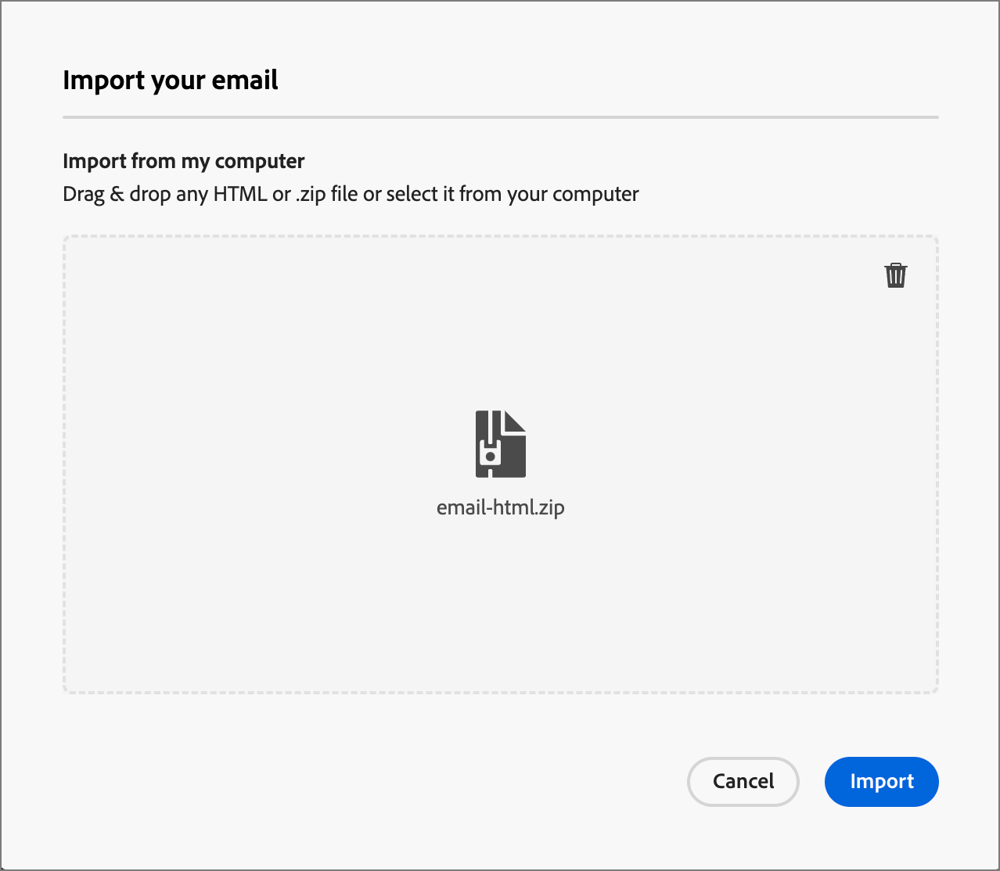
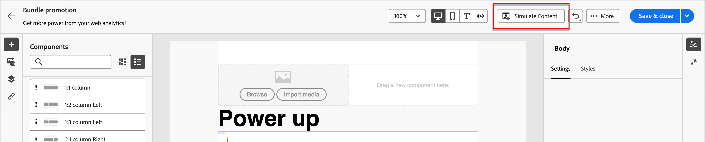

# Email authoring

Use Adobe Journey Optimizer B2B Edition to send email messages to your customers. You can create, personalize, and preview messages in the visual designer.

## Add an email action in an account journey

You can set up email deliveries in an Account Journey when you add a _[!UICONTROL Take an action]_ node and do the following:

1. For the _[!UICONTROL Action on]_ target, choose **[!UICONTROL People]**.
1. For the _[!UICONTROL Action on people]_, choose **[!UICONTROL Send email]**.
1. For the _[!UICONTROL Email source]_, choose **[!UICONTROL Create new email]**.

   Alternatively, you can also select the _[!UICONTROL Select email from Adobe Marketo Engage]_ option to use one of the pre-authored emails in Marketo Engage and send it as a part of the Account Journey.

   >[!NOTE]
   >
   >If you are creating an email for the first time, make sure that the email channel is configured from within Adobe Marketo Engage. To learn more, see [Ensure Email Deliverability](https://experienceleague.adobe.com/en/docs/marketo/using/getting-started/initial-setup/setup-steps#ensure-email-deliverability){target="_blank"} in the Marketo Engage documentation.

   {width="700" zoomable="yes"}

1. At the bottom of the _[!UICONTROL Take an action]_ panel, click **[!UICONTROL Create email]**.

1. In the dialog, enter a unique **[!UICONTROL Name]** for the email and a **[!UICONTROL Subject line]**.

   {width="400"}

1. Click **[!UICONTROL Create]**.

   In the _[!UICONTROL Email properties]_ section of the email content page, the _[!UICONTROL From email]_ and _[!UICONTROL Reply to address]_ fields are already configured. You can enter values for the _[!UICONTROL From name]_ and _[!UICONTROL Description]_ (optional) fields.

## Create the email content

Click **[!UICONTROL Add email content]** at the top of the _[!UICONTROL Email]_ preview panel.

{width="700" zoomable="yes"}

This action launches the Email Designer, where you can choose how you want to design your email from the following options:

* [Design your email from scratch](#design-your-email-from-scratch) using the Email Designer interface.

* [Import existing HTML content](#import-existing-html-content) from a file or a .zip folder.

* [Select an existing template](#select-a-template) from a list of built-in or custom email templates.

To configure and personalize the subject line with the expression editor, click the _Personalization_ icon and add any of the Marketo Engage tokens.

After you create and personalize the email content, you can export the content for validation or for later use. Click **[!UICONTROL Export HTML]** to save the content as a .zip file that includes your HTML and assets.

>[!TIP]
>
>Use AI Assistant in Adobe Journey Optimizer B2B Edition, powered by generative AI to elevate your content to the next level. AI Assistant can help you optimize the impact of your deliveries by generating entire emails, targeted text content, and getting AI Assistant recommendations for images that resonate with your audience. [Learn more](./ai-assistant-emails.md)

### Design your email from scratch {#design-from-scratch}

>[!CONTEXTUALHELP]
>id="ajo-b2b_structure_components_landing_page"
>title="Add Structure components"
>abstract="Structure components define the layout of the landing page. Drag and drop a **Structure** component into the canvas to start designing the content of your landing page."

>[!CONTEXTUALHELP]
>id="ajo-b2b_content_components_landing_page"
>title="About Content components"
>abstract="Content components are empty content placeholders that you can use to create the layout of a landing page."

Use the visual content editor to define the structure of the email content. By adding and moving structural components with simple drag-and-drop actions, you can design the shape of the reusable email content within seconds.

1. From the _[!UICONTROL Design your template]_ home page, select the **[!UICONTROL Design from scratch]** option.

1. [Add structure and content](#add-structure-and-content) to the email message.
1. [Add image assets](#add-assets) to the email message.
1. [Personalize the email content](#personalize-content).
1. [Review and update links](#preview-and-edit-linked-urls).

<!-- If needed, you can further personalize your email by clicking **[!UICONTROL Switch to code editor]** from the advanced menu. The code editor allows you to edit the email source code, such as adding tracking or custom HTML tags.

>[!CAUTION]
>
>You cannot revert back to the visual designer for this email after switching to the code editor. -->

When your content is done, click **[!UICONTROL Simulate content]** at the top to check rendering. You can choose the desktop or mobile view.

When you are satisfied with the content, click **[!UICONTROL Save]**.

### Import existing HTML content

{{$include /help/_includes/content-design-import.md}}

   {width="500"}

>[!NOTE]
>
>Using a `<table>` tag as the first layer in an HTML file can cause style loss, including background and width settings in the top layer tag.

You can personalize the imported content as needed with the visual email editor tools.

### Select a template

{{$include /help/_includes/content-design-select-template.md}}

>[!NOTE]
>
> Saved templates may have governance (content locking) settings applied to one or more components. The visual designer provides guidelines about locked components when you [author an email from a governed template](./email-authoring-governance.md).

## Add structure and content {#structure-content}

>[!CONTEXTUALHELP]
>id="ajo-b2b_structure_components_email"
>title="Add Structure components"
>abstract="Structure components define the layout of the email. Drag and drop a **Structure** component into the canvas to start designing your email content."

>[!CONTEXTUALHELP]
>id="ajo-b2b_content_components_email"
>title="About Content components"
>abstract="Content components are empty content placeholders that you can use to create the layout of an email."

{{$include /help/_includes/content-design-components.md}}

### Add fragments

{{$include /help/_includes/content-design-use-fragments.md}}

After the email is saved, it appears in the fragment details page when you select the _[!UICONTROL Used By]_ tab in the summary.

### Add assets

{{$include /help/_includes/content-design-assets.md}}

### Navigate the layers, settings, and styles

{{$include /help/_includes/content-design-navigation.md}}

### Personalize content

{{$include /help/_includes/content-design-personalization.md}}

>[!NOTE]
>
>If _[!UICONTROL My Tokens]_ are defined for the account journey, you can also use these journey-specific tokens for your email content. See [Custom tokens for email personalization](./personalization-my-tokens.md) for more information.

### Edit linked URL tracking

{{$include /help/_includes/content-design-links.md}}

### View options

Leverage the view and content validation options that are available in the visual email editor.

* Zoom in/out on the content across preset zoom options.

* Switch viewing the content across Desktop, Mobile, or Text-only/Plain-text.
   * Click the _View_ icon for content preview across devices.
   * Select one of the out-of-the-box devices or enter custom dimensions to preview the content.

### More options

From the _[!UICONTROL More ...]_ menu at the top of the email designer, you can take the following actions:

{width="500"}

* **[!UICONTROL Reset email]** - Click this option to clear the visual email designer canvas to a blank slate and restart building your content.
* **[!UICONTROL Save as fragment]** - Save all or portions of the email as a fragment to be reused across multiple emails or email templates. You provide a name and description for the fragment and save it to the list of available fragments. 
* **[!UICONTROL Change your design]** - Return to the _Design your email_ page. From there, you can choose another template to restart the design process, or choose to design the content from scratch in a black canvas.\
* **[!UICONTROL Save as content template]** - Save the email body as an email template to be reused across multiple emails or email templates. You provide a name and description for the template and save it to the list of saved email templates.
* **[!UICONTROL Export HTML]** - Download the content in the visual canvas to your local system in HTML format packaged as a zip file.

## Check alerts

As you design your email message content, alerts are displayed in the interface (top-right of the page) when key settings are missing.

If you do not see this button, there are no detected issues.

Two types of alerts can be detected:

* **_Warnings_** that refer to recommendations and best practices, such as:

   * `The opt-out link is not present in the email body`: adding an unsubscription link into your email body is a best practice.

      >[!NOTE]
      >
      >Marketing-style email messages must include an opt-out link, which is not required for transactional messages. 

   * `Text version of HTML is empty`: do not forget to define a text version of your email body, which is used when HTML content cannot be displayed.

   * `Empty link is present in email body`: check that all the links in your email are correct. 

   * `Email size has exceeded the limit of 100KB`: for optimal delivery, make sure that the size of your email does not exceed 100KB. 

* **_Errors_** that prevent you from testing or activating the journey/campaign as long as they are not resolved, such as:

   * `The subject line is missing`: email subject line is mandatory.

   * `The email version of the message is empty`: this error is displayed when the email content has not been configured.

## Check and test the email {#preview-test}

>[!CONTEXTUALHELP]
>id="ajo-b2b_email_preview_simulate"
>title="Check how your content is rendering"
>abstract="When your content is defined, you can preview it and check if the rendering is correct for the channel that you are using."

When your message content is defined, you can use test profiles to preview it, send proofs, and control its rendering in popular desktop, mobile, and web-based clients. If you inserted personalized content, you can preview how this content is displayed in the message using test profile data.

To preview the email content, click **[!UICONTROL Simulate content]** and then add a test profile to check your message using the test profile data.

{width="700" zoomable="yes"}
