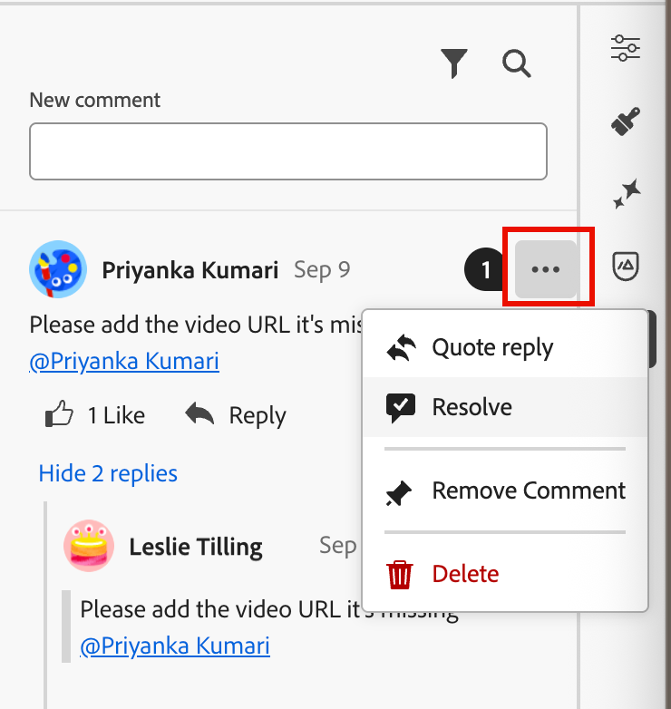
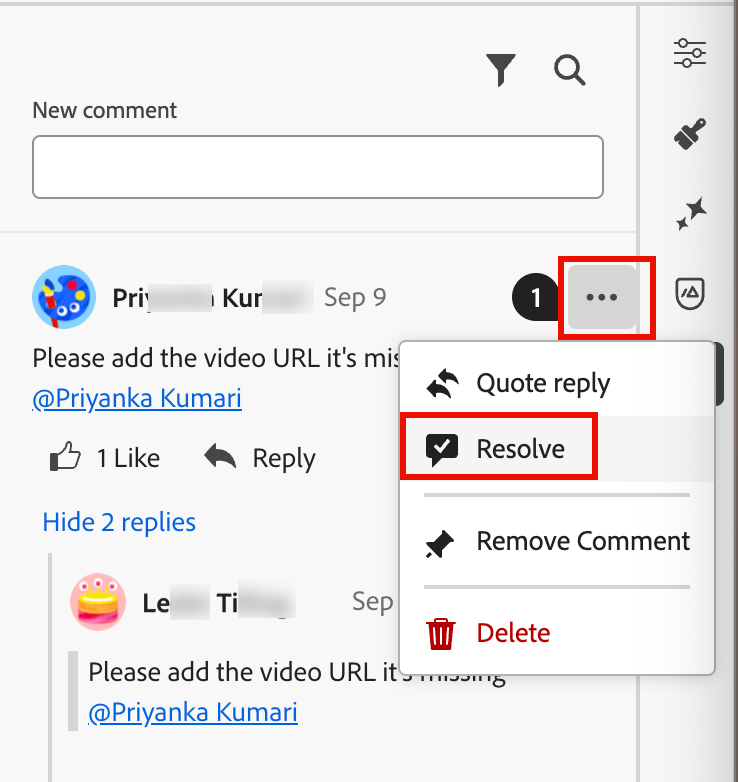
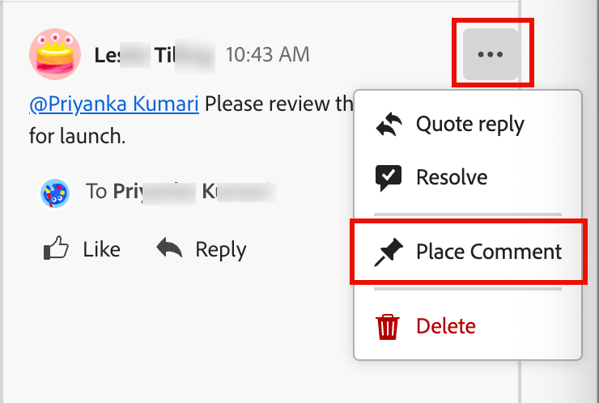
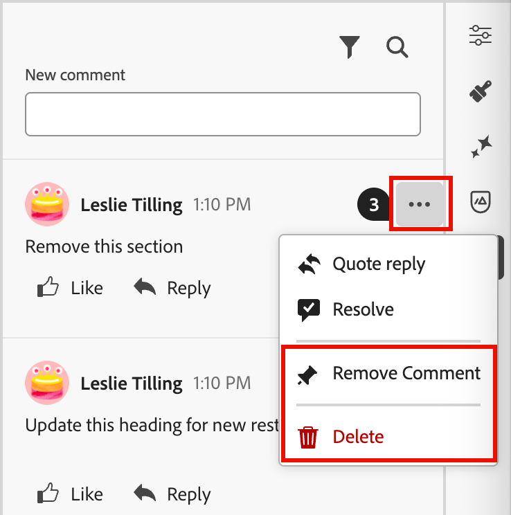

# Email collaboration tools

The [email design space](./email-authoring.md) includes collaboration tools for commenting and resolution so that marketing teams can seamlessly review, discuss, and finalize email assets directly within [!DNL Journey Optimizer B2B Edition]. Instead of sharing drafts over external tools (like chat, email threads, or spreadsheets), users can comment, suggest edits, and resolve feedback within the email design space. Use these tools to streamline your workflow, reduce errors, and ensure that stakeholders are aligned before launching your email campaign within an account journey:

* **_Centralized feedback_** - Collect and track all feedback in one place. 

* **_Faster reviews_** - Collaborators can review the email copy and assets within the authoring environment.

* **_Improved accuracy_** -  Reduces the risk of miscommunication by keeping all edits tied to the email itself.

* **_Transparency_** - All comments and resolutions remain logged, making it clear what changes were suggested and implemented.

* **_Collaboration in context_** - Review email body copy, images, and call-to-action (CTA) elements within the layout.

<!-- Enable asynchronous collaboration between team members for an email asset
Allow users to attach comments to specific design elements
Provide a unified interface for viewing and managing all comments within a project
Support comment placement, editing, deleting, and navigation
Display visual indicators (badges) for elements with associated comments -->

## Enable email collaboration tools for reviewers

Product administrators can enable access to the email collaboration tools by assigning the **[!UICONTROL Manage B2B Emails]** permission through the _Permissions_ UI in Adobe Experience Cloud.

+++ Enable email permissions

1. In the Permissions app, go to the **[!UICONTROL Roles]** tab and select the desired [role](https://experienceleague.adobe.com/en/docs/experience-platform/access-control/abac/permissions-ui/roles){target="_blank"}.

1. Click **[!UICONTROL Edit]** to modify the permissions.

1. Add the **[!UICONTROL B2B Assets]** resource, then select **[!UICONTROL Manage B2B Emails]**.

    {width="700" zoomable="yes"}

1. Click **[!UICONTROL Save]** to apply the changes.

    Permissions are automatically updated for any users that are already assigned to the role.

1. To assign this role to new users, select the **[!UICONTROL Users]** tab within the _[!UICONTROL Roles]_ dashboard and click **[!UICONTROL Add User]**.

   * Enter the user name and email address, or choose an existing user from the list.

      If the user is not yet created, refer to the [Experience Platform documentation](https://experienceleague.adobe.com/en/docs/experience-platform/access-control/abac/permissions-ui/users){target="_blank"}.

   * Click **[!UICONTROL Save]** to apply the changes.

+++

## Display collaboration tools and comments

While creating, editing, or reviewing content in the email design space, you can access the _Collaboration_ panel to add or manage comments for the email content.

Click the _Collaboration_ (  ) icon in the right navigation.

{width="700" zoomable="yes"}

## Collaboration workflow

You can use the collaboration tools to follow a standard content workflow:

1. [Invite](#invite-collaborators-and-reviewers) your collaborators and reviewers.
1. Reviewers [add comments](#add-comments).
1. Read comments, [add replies](#reply-to-a-comment) to discuss feedback, and make needed edits.
1. Reviewers or authors [resolve comments](#resolve-comments).

>[!BEGINSHADEBOX]

**Best practices for using the collaboration tools**

* Use `@` tagging so that feedback reaches the right team member quickly.

* Group related feedback into a single comment thread instead of multiple scattered notes.

* Always resolve comments as soon as they are addressed to maintain a clean workflow.

* Save a final approved version for compliance/audit purposes.

>[!ENDSHADEBOX]

### Invite collaborators and reviewers

1. Select the body of the email.

1. Click the _Collaboration_ (  ) icon in the right navigation.

1. At the top of the right panel, enter your invitation text for users to collaborate and provide feedback.

   Use the `@` symbol to address and notify users. These users receive email and in-product pulse notifications.
   
   As you enter the first few letters of the name after the symbol, a popup list displays matching user names. You can enter more letters in the name to improve the results.

   {width="550"}

   Select the name to add for notification.

   Add as many collaborators or reviewers that you want to include in the invitation.

   {width="700" zoomable="yes"}

1. Click **[!UICONTROL Submit]**.

### Add comments

As an email collaborator or reviewer, open the email in the design space and add your feedback. You can enter general feedback in the _Collaboration_ panel, or you can select components in the canvas and add a comment that is specific to that design element. Tag teammates using `@`, such as _@John Doe Please update CTA copy_.

Each new comment starts a thread where collaborators can use _Reply_ to continue the discussion. Each comment/thread that is associated with a design element is numbered so that you can easily identify the element where it applies.

#### General comments and feedback

In the _Collaboration_ panel, use the text field at the top to enter a general comment about the email content. Use the `@` symbol to address and notify users.

{width="400"}

Click **[!UICONTROL Submit]** to log the comment and send notifications to any tagged users.

#### Component comments

1. Select a structure or content component. 

1. In the toolbar, click the _Collaboration_ tool.

   {width="600"}

1. Enter your comment in the text field.

1. Click **[!UICONTROL Submit]**.

Collaborators can click the numbered pin icon on the email canvas to view to comment.

{width="450"}

#### Reply to a comment

For each comment, you can use the _[!UICONTROL Reply]_ function to continue a discussion or answer a question. 

Click **[!UICONTROL Reply]** at the bottom of the comment and enter the text for your reply. To include a quote of the current comment in your reply, click the _More menu_ ( **...** ) icon and choose **[!UICONTROL Quote reply]**.

{width="350"}

### Resolve comments

As an author or designer, assess the feedback from reviewers and determine what changes that you want to make. When changes are complete and the request is satisfied, click the _More menu_ ( **...** ) icon and choose **[!UICONTROL Resolve]**. 

{width="350"}

In the confirmation dialog, click **[!UICONTROL Resolve]**.

## Manage comments

Manage the comments and threads to assess the status of your collaboration effort. 

### Place a comment

If a comment is not associated with an element on the email canvas, you can _pin_ the comment to an element as needed. Click the _More menu_ ( **...** ) icon and choose **[!UICONTROL Place the comment]**. Then, select the design component on the canvas.

{width="350"}

### Remove or delete comments

You can clean up your comments log by removing and deleting them. Click the _More menu_ ( **...** ) icon and choose **[!UICONTROL Remove Comment]** or **[!UICONTROL Delete]**.

{width="350"}

* When you remove a comment, the action decouples that comment from the design element (selected when the comment was created). The comment is still part of the comment record for the email.

* When you delete a comment, the action permanently deletes it from the record.

### Resolved comments

By default, resolved comments are hidden in the _Collaboration_ panel. You can display resolved comments at any time by clearing the filter. Click the _Filter_ (  ) icon and clear the **[!UICONTROL Hide resolved comments]** checkbox. 

{width="350"}

The resolved comments include an _Unresolve_ (  ) icon. If you determine that a comment/thread is not resolved and further changes are needed, click the icon to remove the _[!UICONTROL Resolved]_ designation.

{width="300"}
