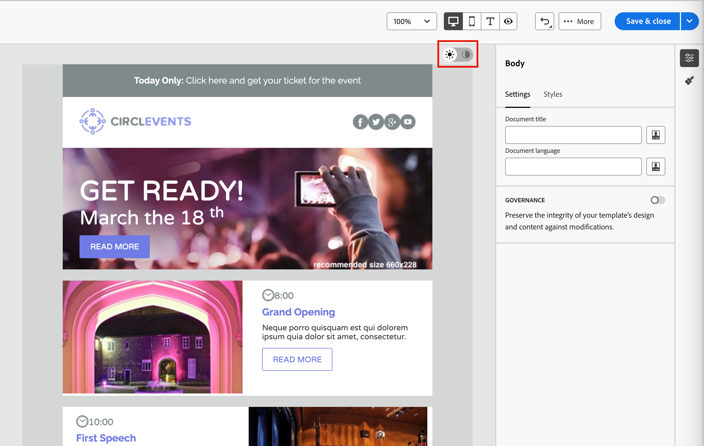

# Dark mode for email content {#dark-mode}

>[!CONTEXTUALHELP]
>id="ajo-b2b_dark_mode"
>title="Switch to dark mode"
>abstract="Switch to dark mode where you can preview how it may render, and define specific custom settings.  The final rendering depends on the recipient's email client. Note that all email clients do not support custom dark mode."

>[!CONTEXTUALHELP]
>id="ajo-b2b_dark_mode_preview"
>title="Switch to dark mode"
>abstract="Switch to dark mode to preview how it may render on supporting email clients.  The final rendering depends on the recipient's email client. Note that all email clients do not support dark mode."

_Dark mode_ allows a supporting email client or app to display emails with darker backgrounds and lighter colors for text, buttons, and other visual elements. This type of display can reduce eye strain, save battery life, and improve readability in low-light environments for a more comfortable viewing experience. As a growing trend across major operating systems and apps, it is now an important consideration in modern email design to ensure that content remains legible and visually appealing for all users.

As you [create your email content](./email-authoring.md) in the [!DNL Journey Optimizer B2B Edition] visual design space, you can switch to the _**[!UICONTROL Dark mode]**_ view. In this view, you can also define specific custom settings to be displayed by the supporting email clients when their dark mode is enabled.

## Email client considerations

There is significant variance in the way that different email clients and apps apply dark mode. For this reason, you should consider the expectations for dark mode rendering with caution. Before you use dark mode in the email design space, consider the following email client use cases:
<!--
* Check out the list of [email clients supporting dark mode](https://www.caniemail.com/search/?s=dark){target="_blank"}

* Learn more on Dark mode in this [Litmus blog post](https://www.litmus.com/blog/the-ultimate-guide-to-dark-mode-for-email-marketers){target="_blank"}
-->

+++Clients that do not support dark mode

Some email clients do not support this feature at all, such as:

* [!DNL Yahoo! Mail]
* [!DNL AOL]

If you define dark mode custom settings in the email design, these email clients cannot display any dark mode rendering. <!--Regardless of whether the interface is in light or dark mode, your email will render the same.-->

+++

+++Clients applying their own dark mode {#default-support}

Some email clients systematically apply their own default dark mode to all received emails. They automatically adjust colors, backgrounds, images, and other elements according to their dark mode settings and external settings are not possible. These clients include:

* Gmail (Desktop Webmail, iOS, Android&trade;, Mobile Webmail)
* Outlook Windows
* Outlook Windows Mail

<!--It is important to note that less than 25% of email clients offer customization options for dark mode. Clients such as Gmail implement their own dark mode rendering, which is not subject to external modification.-->
In this case, the client dark mode settings override the custom dark mode settings that you define in [!DNL Journey Optimizer B2B Edition]

+++

+++Clients that support custom dark mode

Many of the most popular email clients offer the option to render custom dark mode with the `@media (prefers-color-scheme: dark)` query, which is the method used by the [!DNL Journey Optimizer B2B Edition] email styles. This list of clients includes:

* Apple Mail macOS
* Apple Mail iOS
* Outlook macOS
* Outlook.com
* Outlook iOS
* Outlook Android&trade;

In this case, the specific settings you define in the [!DNL Journey Optimizer B2B Edition] are rendered. However, some restrictions could apply according to each email client. For example, some clients (such as Apple Mail 16 (macOS 13)) do not generate dark mode if images are present in the email content. 

For optimal results, test your content with the email clients that you are targeting. To see a simulation that comes as close as possible to the final result for each client, use the [Litmus email test rendering](./email-test-rendering.md) integration in the email design space.

+++

## Design for dark mode

As you style your email content for dark mode in [!DNL Journey Optimizer B2B Edition], the visual design space provides two types of tools:

* Use the [preview function](#preview-default-dark-mode) to review the default dark mode rendering for most supporting email clients.

* If you want to override the default settings of supporting email clients, define and apply custom dark mode settings to your email content. [Learn more](#define-custom-dark-mode)

### Preview default dark mode {#preview-dark-mode}

<!-- Should work with templates and themes, NOT for LP and fragments - but TBC with eng. 
>[!NOTE]
>
>Currently you may not be able to switch to dark mode if you select an [email template](use-email-templates.md) or if you apply a [theme](apply-email-themes.md).-->

1. Open the email content in the email design space.

   At the top right of the canvas, there is a light-dark selector that toggles the content display between light (default) and dark mode.

    {width="700" zoomable="yes"}

1. Change the selector to _Dark mode_ (  ).

   The canvas displays the content using the default dark mode preview.x

   By default, the dark mode preview applies the `full color invert` color scheme to all elements except images and icons. This color scheme detects areas with light and dark elements and inverts them. Light backgrounds become dark and dark text becomes light, or dark backgrounds become light and light text becomes dark.

   {width="700" zoomable="yes"}

>[!CAUTION]
>
>The final rendering could vary according to the recipient's email client. To see a simulation that comes as close as possible to the final result for each email client, use the [Litmus test email rendering](./email-test-rendering.md) integration.

### Define custom dark mode settings {#custom-dark-mode}

>[!CONTEXTUALHELP]
>id="ajo-b2b_dark_mode_image"
>title="Use a specific image for dark mode"
>abstract="You can select another image to display when dark mode is on.  Adding a specific image for dark mode does not guarantee that it renders correctly in all email clients. Note that all email clients do not support custom dark mode."

After switching to dark mode, you can choose to edit specific styling elements of your content to be displayed only when dark mode is enabled in the recipient's email client (provided it supports that feature).

>[!NOTE]
>
>The dark mode final rendering depends on each email client, so results can vary from one to another. Review the [email client considerations](#email-client-considerations) for more information.

The custom dark mode styling in the email design space uses the<!-- `@media (prefers-color-scheme: dark)` method--> `@media (prefers-color-scheme: dark)` CSS query, which detects if the email client is set to dark mode and applies the dark-themed design that is defined in your email.

_To define custom dark mode settings:_

1. If needed, move the selector to _Dark mode_ (  ) at the top right of the design canvas.

1. Edit any styling color attributes, such as text, backgrounds, or buttons.

    {width="700" zoomable="yes"}

1. For the images and icons, define specific assets for dark mode only.

   You cannot change the colors of images and icons, but you can define alternative assets to be used for dark mode. You can experiment with different color combinations for your icons or make adjustments for color and saturation for photographic images.

    {width="80%"}
   
   Select any image and switch to **[!UICONTROL Dark mode]** using the dedicated toggle in the **[!UICONTROL Settings]** pane. Then, select a different image asset.

    {width="700" zoomable="yes"}

    See [Add image assets](./email-authoring.md#add-image-assets) for more information about selecting an image asset.

1. At any point during your design changes, select **[!UICONTROL Switch to live view]** to check how your content might render on various device sizes.

   From this view, change the selector to _Dark mode_ (  ) to preview the dark mode version of your content across the different devices.

    {width="800" zoomable="yes"}

    >[!CAUTION]
    >
    >The live view is a generic preview designed to compare how the rendering might look across various device sizes. The final rendering could vary depending on the recipient's email client.

1. When your dark mode changes are complete, click **[!UICONTROL Simulate Content]**.

   {width="700" zoomable="yes"}

    Use the preview and proofing tools to test your email design. See [Preview and test your email content](./email-simulate-content.md) for more information.

1. If you have a Litmus Enterprise account, select **[!UICONTROL Render email]** to see the final dark mode rendering for various email clients in the Litmus . 

   See [Test email rendering with Litmus](./email-test-rendering.md) for more information.

    >[!CAUTION]
    >
    >While simulation closely approximates how emails appear in dark mode, actual rendering could differ due to variations in email service providers or device-level settings.

## Best practices {#best-practices}

As dark mode adoption increases across major email clients, it is essential to consider how your emails render in both light and dark environments - whether you are using [custom dark mode](#define-custom-dark-mode) or not.

Dark mode can alter colors, backgrounds, and images — sometimes overriding design choices. To ensure visual consistency, accessibility, and brand integrity, follow these best practices:

| Practice | Check list |
| -------- | ---------- |
| Optimize your images and logos |<li>Save logos and icons as PNG files with transparent backgrounds to avoid visible white boxes in dark mode. <li>Avoid images with hardcoded white or light backgrounds. <li>If transparency is not an option, place images on a solid background in your design to prevent awkward color inversions. |
| Watch your backgrounds | <li>Ensure sufficient contrast between text and background colors for readability in both light and dark modes. <li>Avoid relying on background colors alone for critical content. Some clients override background colors in dark mode, so ensure that key information is still visible. |
| Design accessible content in dark mode |<li>Use color combinations easy to distinguish for people with color blindness. <li>Use a midtone palette to ensure contrast against both light and dark backgrounds. <li>Use accessible color combinations with high contrast to improve readability and meet [!DNL Web Content Accessibility Guidelines (WCAG)] standards. Use tools like [!DNL WebAIM Contrast Checker] to verify color contrast. <li>Avoid thin fonts as it can impact readability. If your brand requires a thin font, bold it in dark mode. <li>Skip pure white on pure black, which can cause eye strain and could be inverted automatically in some email clients. <li>Provide accessible fallback styling if dark mode is not supported. |
| Test your emails in a dark mode environment |<li>Use the [dark mode preview](#preview-dark-mode) in the email design space, which uses inverted color schemes to spot issues early. <li>Use a Litmus Enterprise account with the [[!UICONTROL Render email]](./email-test-rendering.md) option to simulate your designs across major email clients (such as Apple Mail, Gmail, and Outlook) and see how colors and images behave in dark mode. |

<!--KEEP dark mode accessibility best practices IN ONE SINGLE LOCATION - for now listed on this page.
If needed, it can be moved to the Design accessible content page:
The best practices for designing accesible content in dark mode are listed in [this section](accessible-content.md#dark-mode).-->

<!--**Inline critical styles**

Inline CSS helps maintain more control over styling, as some clients strip external styles in dark mode.-->
<!--

## Email clients supporting dark mode {#supporting-email-clients}

Below is a list of the main email clients supporting dark mode using the with the `@media (prefers-color-scheme: dark)` query.

>[!NOTE]
>
>Some versions of these email clients do not support dark mode, so they are also presented in this table for the sake of clarity.

| Email clients supporting custom dark mode| Compatible versions | *Unsupported versions* |
|---------|----------|---------|
| Apple Mail macOS| 12.4, 16.0 | *10.3* |
| Apple Mail iOS | 13.0, 16.1 | *12.2* |
| Outloook macOS | 2019, 16.70, 16.80 | NA |
| Outlook.com | 2019-07, 2022-12 | NA |
| Outloook iOS | 2020-01, 2022-12 | NA |
| Outloook Android | 2023-03 | *2020-01, 2022-12* |

| Other email clients supporting custom dark mode| Compatible versions | *Unsupported versions* |
|---------|----------|---------|
| Samsung Email (Android) | 6.1 | *6.0* |
| Mozilla Thunderbird (macOS) | 68.4 | *60.8, 78.5, 91.13* |
| Fastmail (Desktop Webmail)| 2022-12 | *2021-07* |
| HEY (Desktop Webmail)| 2020-06 | *2022-12* |
| Orange Desktop Webmail| 2019-08, 2021-03, 2022-12, 2024-04 | NA |
| Orange iOS | 2022-12, 2024-04 | *2020-01* |
| Orange Android | 2024-04 | *2020-01, 2022-12* |
| LaPoste.net | 2021-08, 2022-12 | NA |
| SFR  Desktop Webmail | 2019-08, 2022-12 | NA |
| GMX (iOs and Android) | 2022-06 | NA |
| 1&1 (Desktop Webmail and Android) | 2022-06 | NA |
| WEB.DE (iOs and Android) | 2022-06 | NA |
| Free.fr | 2022-12 | NA |

>[!WARNING]
>
>The dark mode final rendering depends on each email client, so results can vary from one to another.

## Email clients not supporting dark mode {#non-supporting-email-clients}

Some email clients allow users to switch their interface to dark mode, but this setting does not affect how HTML emails are displayed.  Here is a list of those clients:

| Main email clients with their own dark mode| 
|---------|
| Gmail (Desktop Webmail, iOS, Android, Mobile Webmail) | 
| Outloook Windows |
| Outlook Windows Mail |

Other email clients do not support dark mode at all:

| Main email clients not supporting dark mode| 
|---------|
| Yahoo!Mail | 
| AOL | 

| Other mail clients not supporting dark mode| 
|---------|
| ProtonMail |
| SFR iOS |
| SFR Android | 
| GMX Desktop Webmail | 
| Mail.ru | 
| WEB.DE Desktop Webmail | 
| T-online.de |

-->