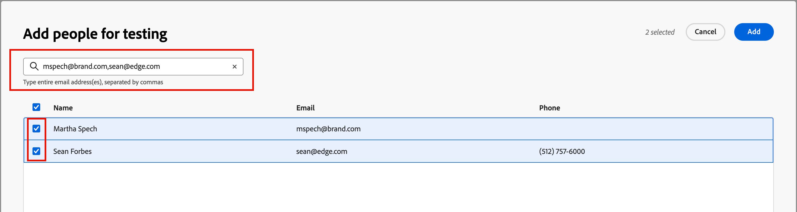

# Preview and test your email content

Use the _Simulate content_ feature to preview the email content and send test deliveries to specific recipients. The required email fields must be defined, including _[!UICONTROL From name]_, _[!UICONTROL From address]_, _[!UICONTROL Reply-to address]_ and _[!UICONTROL Subject line]_, to access the preview and testing features.

>[!IMPORTANT]
>
>You cannot preview the email if there are errors. Check the _Alerts_ to ensure that no errors are blocking the preview functions. Warnings do not block preview, but you should address them before you publish the journey that triggers the email delivery.

## Display the email preview

You can access the rendering preview from the [email design space](./email-authoring.md), or from the _[!UICONTROL Summary]_ when you [open an email from the Emails list](./emails-list.md#edit-emails).

1. Click **[!UICONTROL Simulate Content]** at the top.

   {width="800" zoomable="yes"}

   >[!NOTE]
   >
   >This button is not available if there are errors or required fields are not defined for the email.

1. In the _[!UICONTROL Simulate]_ page, select a person profile in the **[!UICONTROL People]** list to use for rendering the email.

   In the content preview, personalized elements are populated according to the selected person profile.

   {width="800" zoomable="yes"}

   If the _[!UICONTROL People]_ list on the left is empty, [add people](#add-people-to-the-profiles-list) using contacts from the connected Marketo Engage instance.

   >[!TIP]
   >
   >You can also use the [Litmus test rendering integration](./email-test-rendering.md) to check email message rendering in popular desktop, mobile, and web-based clients.

## Adjust the display options

Use the display tools to change the preview according to the device type or zoom level:

* Select the _Desktop_ (  ) icon to display the preview using the desktop styling and aspect ratio.
* Select the _Mobile_ (  ) icon to display the preview using the mobile device styling and aspect ratio.
* Click the _Zoom level_ arrow and select a zoom percentage to review how the content changes according to the zoom level.

{width="600" zoomable="yes"}

## Send proofs

A proof is a delivered test message that allows you and your team members to review an email message before sending it to members of an audience. Recipients of the proof can check the message rendering, content, personalization settings, and configuration. You can send proofs using a selected test profile.

1. Click **[!UICONTROL Send proof]** at the top right.

   {width="500"}

1. In the _Send proof_ page, enter the first recipient's email address.

1. For each additional recipient that you want to include in the review, click **[!UICONTROL Add recipient]** and enter their email address in the **[!UICONTROL Send to]** field. 

   You can add up to ten recipients for your proof delivery.

1. For each recipient, set the **[!UICONTROL Simulate as]** field by selecting a test profile to use for personalizing the message content.

   {width="700" zoomable="yes"}

1. Click **[!UICONTROL Send proof]**.

## Add people to the profiles list

1. At the top of the _[!UICONTROL People]_ list, click **[!UICONTROL Add People]**.

   {width="500"}

1. In the _[!UICONTROL Add people for testing]_ dialog, enter the full email address for the contact.

   To add multiple contacts, enter multiple addresses separated by a comma.

1. Select the checkbox for each matched contact that you want to add to the list of test profiles.

   {width="700" zoomable="yes"}

1. Click **[!UICONTROL Add]** at the top right.
