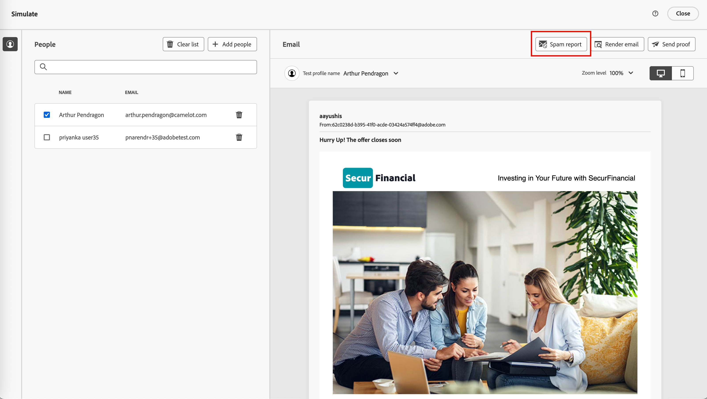

# Review the spam report

Many email inbox providers and most corporate systems employ a spam filtering process. Sending emails that trigger these filters can severely impact deliverability. In Journey Optimizer B2B Edition, you can check email content spam scoring by generating a Spam report. This report uses [[!DNL SpamAssassin]](https://spamassassin.apache.org/) to test the email and helps you to determine whether a message could be considered as spam by anti-spam tools. You can use the information in the report to take actions that improve the email content score and deliverability. 

When you review your email settings or edit the content, open the _[!UICONTROL Simulate]_ page and generate a _Spam report_ to review scoring and flagged elements that can trigger anti-spam filtering.

1. From the _[!UICONTROL Simulate]_ page, click **[!UICONTROL Spam report]** at the top right.

    {width="700" zoomable="yes"}

   The reporting process scans the email content and generates a score with a list of the triggered filtering rules used to generate the score. Factors include body layout, structure, image size, spam trigger words, and other elements. For a list of the rule evaluation tests for the email elements, refer to the [[!DNL SpamAssassin] test list](https://spamassassin.apache.org/old/tests_3_0_x.html).

1. Check the scores and descriptions for each item.

   >[!NOTE]
   >
   >The spam score is calculated through SpamAssassin, and Adobe does not own the rules or scoring logic. For more details about the [!DNL SpamAssassin] open source project, refer to the [[!DNL SpamAssassin] documentation](https://cwiki.apache.org/confluence/display/SPAMASSASSIN/).

   The lower the score, the less likely that the email would be marked as spam.

   {width="600" zoomable="yes"}

   With a score that is greater than 5, the report includes a warning that some messages may be blocked or marked as spam when received. It is a best practice to ensure that the score is lower than 2.

   {width="600" zoomable="yes"} 

1. If there are some elements within the email content that can be improved, edit your content to apply the necessary updates.

1. When your changes are complete, return to the _[!UICONTROL Simulate]_ page and  click **[!UICONTROL Spam report]** again to check for the resulting score improvements.
