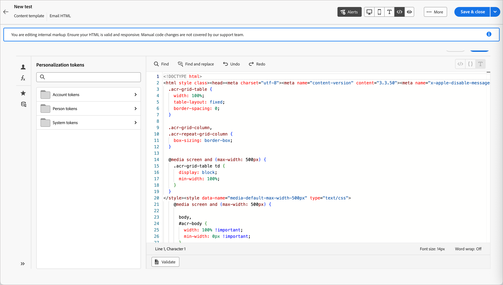

# Advanced HTML mode for email template design

_Advanced HTML mode_ provides a view that lets experienced users directly view and edit the raw source code for email template content. This mode is ideal when you want to insert sophisticated expressions, such as conditional logic, directly into the source. It is also useful for making structural adjustments that go beyond what the visual design tools expose.

<!-- We don't have the code editor at this point 
>[!NOTE]
>
>_Advanced HTML mode_ is different from the code editor option that is available when you start a new design. The code editor does not allow you to change to the visual design space. With _advanced HTML mode_, you can toggle back and forth between the HTML source view and the visual design view at any time. -->

>[!AVAILABILITY]
>
>This feature is currently in _Limited Availability_ and is not available to all users.

## Important limitations

Before you use advanced HTML mode for [email template authoring](./email-template-authoring.md), make sure that you understand the following limitations:

* **No validation** — The HTML editor does not perform syntax checking or layout verification. Review your code carefully before saving.

* **Content updates** — Future system changes may affect or overwrite modifications made to default markup in advanced HTML mode. Check your content after product updates to ensure that it renders as expected.

* **Limited support** — Adobe cannot troubleshoot rendering issues or content errors that result from custom code modifications made in advanced HTML mode.

* **Preview restrictions** — Content simulation (preview with profiles) is only available in desktop view, not directly from the HTML source view.

### Access advanced HTML mode

Advanced HTML mode is accessible from the toolbar at the top of the visual design space when you have an email template loaded in the canvas.

1. Open or [create an email template](./email-templates.md#create-an-email-template) and open the design space to edit the content.

1. In the design space, click the _[!UICONTROL HTML]_ (  ) icon in the toolbar.

   {width="750" zoomable="yes"}

   If this is your first time opening advanced HTML mode (or a month or more has elapsed), a warning message is displayed. Review the information and click **[!UICONTROL OK]** to proceed.

   {width="500"}

   The design canvas switches to the raw HTML source view.

1. Review the code and add the desired changes to the email content.

   In _Advanced HTML mode_, you have direct access to the full HTML source of your email template content:

   * View and modify any part of the raw HTML markup.
   * Insert advanced [personalization expressions](./personalization.md) directly into the source.
   * Add [conditional content](./conditional-content.md) logic using expression syntax.
   * Add custom HTML attributes, tracking tags, or other markup that is not available through the visual editor controls.

   {width="800" zoomable="yes"}

   >[!IMPORTANT]
   >
   >Make sure to enter correct HTML and CSS code; Adobe does not provide syntax validation or support for custom code.

   Content simulation and saving are not available in advanced HTML mode for compatibility reasons. You can switch back to the desktop view to preview your content and save the template. Any edits you make are preserved when you switch between the HTML source view and the visual design view.

   If you click **[!UICONTROL Save]** or **[!UICONTROL Save & close]** at the top right while you are in advanced HTML mode, an alert dialog appears to inform you that you must switch out of advanced HTML mode before saving the template and exiting the design space. 

   {width="500"}

1. Click the _[!UICONTROL Desktop]_ (  ) icon in the toolbar to switch from advanced HTML mode (the HTML source view) to the visual design canvas. 

   Your edits are preserved when you switch views.
