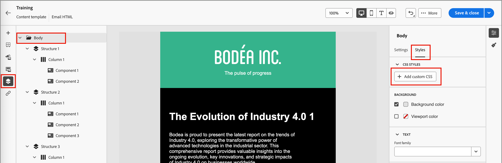

# Email template authoring

After you [create an email template](./email-templates.md#create-an-email-template), use the visual design space to author the structural and content components in your email template.

## Add structure and content {#structure-content}

{{$include /help/_includes/content-design-components.md}}

### Add custom CSS

You can add your own custom CSS directly within the email template design space. Use custom CSS to apply advanced and specific styling, for greater flexibility and control over the appearance of your content. It is a best practice to add this highest-level styling before you include components, such as images, buttons, and text.

With at least one content component in the canvas, select the **[!UICONTROL Body]** component in the left navigation tree to access the custom CSS editor.

{width="800" zoomable="yes"}

{{$include /help/_includes/content-design-custom-css.md}}

### Add fragments

>[!NOTE]
>
>Fragments are not cross-compatible between the _Theme mode_ and _Manual mode_ in the email content. To use a fragment in email content where a theme is applied, the fragment must also be created in _Theme mode_.

{{$include /help/_includes/content-design-use-fragments.md}}

After the template is saved, it appears in the fragment details page when you select the _[!UICONTROL Used By]_ tab in the summary.

### Add assets

{{$include /help/_includes/content-design-assets.md}}

### Navigate the layers, settings, and styles

{{$include /help/_includes/content-design-navigation.md}}

### Personalize content

{{$include /help/_includes/content-design-personalization-email.md}}

### Edit linked URL tracking

{{$include /help/_includes/content-design-links.md}}

## View options

Leverage the view and content validation options that are available in the visual design space.

* Zoom in/out on the content across preset zoom options.

* Switch viewing the content across Desktop, Mobile, or Text-only/Plain-text.
   * Click the _Eye_ icon for content preview across devices.
   * Select one of the out-of-the-box devices or enter custom dimensions to preview the content.

### More options

From the _[!UICONTROL More ...]_ menu at the top of the email design space, you can take the following actions:

{width="500"}

* **[!UICONTROL Reset template]** - Click this option to clear the design canvas to a blank slate and restart building content.
* **[!UICONTROL Save as fragment]** - Save all or portions of the template as a fragment to be reused across multiple emails or email templates. You provide a name and description for the fragment and save it to the list of available fragments. 
* **[!UICONTROL Change your design]** - Return to the _Design your email_ page. From there, you can choose another template to restart the design process. You can also choose to design the content from scratch with a blank canvas (_Classic mode_) or using a [brand theme](./brand-themes.md) (_Theme mode_).
* **[!UICONTROL Export HTML]** - Download the content in the visual canvas to your local system in HTML format packaged as a zip file.
