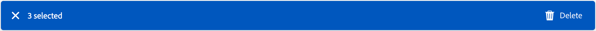

# Email templates

For an accelerated and improved design process, you can create standalone email templates to reuse custom content across Adobe Journey Optimizer B2B Edition account journeys. Through templates, your content-oriented team members can work on email content outside of journeys. Marketing strategists can then reuse and adapt these standalone templates inside their account journeys. For example, one team member is in charge of content only, with no access to account journeys. However, they can create an email template that marketers can select as a starting point for email communications and customize it according to the requirements for the journey.

## Access and manage email templates

To access email templates in Adobe Journey Optimizer B2B edition, go to the left navigation and click **[!UICONTROL Content Management]** > **[!UICONTROL Templates]**. This action opens a listing page with all the email templates created in the instance listed in a table.

The table is sorted by the _[!UICONTROL Modified]_ column by default, with the most recently updated templates at the top. Click the column title to change between ascending and descending.

To search for a template by name, enter a text string in the search bar. Click the _Filter_ icon at the top left to filter the list according to creation or modification dates, and templates that you have created or modified.

{width="700" zoomable="yes"}

Customize the columns that you want to display in the table by clicking the _Customize table_ icon on the top right. Select the columns to display and click **[!UICONTROL Apply]**.

From the displayed list of templates, you can take the actions described in the following sections.

## Create an email template

You can create an email template from the email template listing page by clicking **[!UICONTROL Create template]** at the top right.

1. In the dialog, enter a useful **[!UICONTROL Name]** and **[!UICONTROL Description]** (optional).

   {width="400"}

1. Click **[!UICONTROL Create]**.

The _[!UICONTROL Design your template]_ page opens and provides multiple options for creating the template: _[!UICONTROL Design from scratch]_, _[!UICONTROL Import HTML]_, or _[!UICONTROL Select design template]_.

{width="800" zoomable="yes"}

After you select the method that you want to use to start your email template design, use the visual designer to [author your email template content](./email-template-authoring.md).

### Design from scratch

Use the visual content editor to define the structure of the email content. By adding and moving structural components with simple drag-and-drop actions, you can design the shape of the reusable email content within seconds.

>[!NOTE]
>
>The available design tools are equivalent to the tools used for [email authoring](./email-authoring.md). The difference is that this content is then saved as a template that can be reused across multiple _send email_ nodes within account journeys.

1. From the _[!UICONTROL Design your template]_ home page, select the **[!UICONTROL Design from scratch]** option.

1. [Add structure and content](./email-authoring.md#add-structure-and-content) to the template.

### Import HTML

Adobe Journey Optimizer B2B Edition allows you to import existing HTML content to design your email templates.

{{$include /help/_includes/content-design-import.md}}

   {width="500"}  

>[!NOTE]
>
>Using a `<table>` tag as the first layer in an HTML file can cause style loss, including background and width settings in the top layer tag.

You can personalize the imported content as needed with the visual designer.

### Select a design template

{{$include /help/_includes/content-design-select-template.md}}

## View email template details

In the Templates listing page, click the name of an email template to open the email template details page. From here, you can view basic properties for the email template and access the visual content editor to make changes to the template content.

{width="700" zoomable="yes"}

* View the email template details, such as name and description. These settings can be edited. Click outside of the description box to save changes automatically.

* View the email template properties such as created by, created on, last updated on, and modified by.

* Click **[!UICONTROL More]** at the top right to take quick actions on the email template, such as _Duplicate_ and _Delete_.

* If there are active alerts (errors and warning for the email template), click **[!UICONTROL Alerts]** at the top right to view the information.

   These alerts do not prohibit use of the email template for email creation. The information provides visibility for marketers on your team about what might not work and the required updates before it can be used for delivery.

## View email template used-by references

Within the email templates details page, click the **[!UICONTROL Used By]** tab to view details of where this email template is used in emails across account journeys.

{width="400"}

Emails in Journey Optimizer B2B Edition are embedded and authored within journeys, so the parent journey of the email that uses the template is displayed in references.

* Clicking the link takes you to the corresponding journey email where the email template is used.

* Exit the view at any time by clicking the Back arrow, which returns you to the listing page.

## Edit email templates

This action can be taken from:

* The details page - Click **[!UICONTROL Edit email template]**.
* The listing page - Click the ellipsis (**...**) next to an email template and choose **[!UICONTROL Edit]**.

This action takes you to the _Design your template_ page or the visual content editor page (based on the last saved status of the email template). From here, you can edit your email template content as needed. See [Create email templates](#create-email-templates) for information about the editing options.

## Duplicate email templates

You can duplicate an email template using either of the following methods:

* From the email template details on the right, expand **[!UICONTROL More]** and click **[!UICONTROL Duplicate]**.

   {width="400"}

* From the _Email Templates_ listing page, click the ellipsis (...) next to the template and choose **[!UICONTROL Duplicate]**.

In the dialog, enter a useful name (unique) and description. Click **[!UICONTROL Duplicate]** to complete the action.

The duplicated (new) email template then appears in the _Email Templates_ listing.

## Delete email templates

An email template removal cannot be undone, so check before initiating a delete action. You can delete an email template using either of the following methods:

* From the template details on the right, expand **[!UICONTROL More]** and click **[!UICONTROL Delete]**.
* From the _Email Templates_ listing page, click the ellipsis (...) next to the template and choose **[!UICONTROL Delete]**.

   {width="500"}

This action opens a confirmation dialog. You can abort the process by clicking **[!UICONTROL Cancel]**, or click **[!UICONTROL Delete]** to confirm removal.

## Take bulk actions

From the email templates listing page, select multiple templates at a time by selecting the checkboxes to the left. A banner appears at the bottom when you select multiple templates.

{width="600"}

**[!UICONTROL Delete]** -- You can delete up to a maximum of 20 templates at one time. A confirmation dialog allows you to abort the action or confirm the removal of the templates.

## Author an email from a saved template

From the _Create your email_ screen, use the _Select design template_ section to start building your content from a template.

To start building your content with one of the email templates created, use the following steps:

1. Access the Email Designer from the _Edit content_ page.

   On the _Create your email_ page, the _Sample templates_ tab is selected by default.

1. To use a custom email template, select the **[!UICONTROL Saved templates]** tab.

   This tab displays a list of all email templates created on the sandbox. You can sort them _By name_, _Last modified_, and _Last created_.

1. Select the template of your choice from the list.

   After selection, this displays a preview of the template. In preview mode, you can navigate between all the templates of one category (sample or saved, depending on your selection) using the right and left arrows.

1. Click **[!UICONTROL Use this template]** at the top right.

1. From the visual content designer, edit your content as needed.
