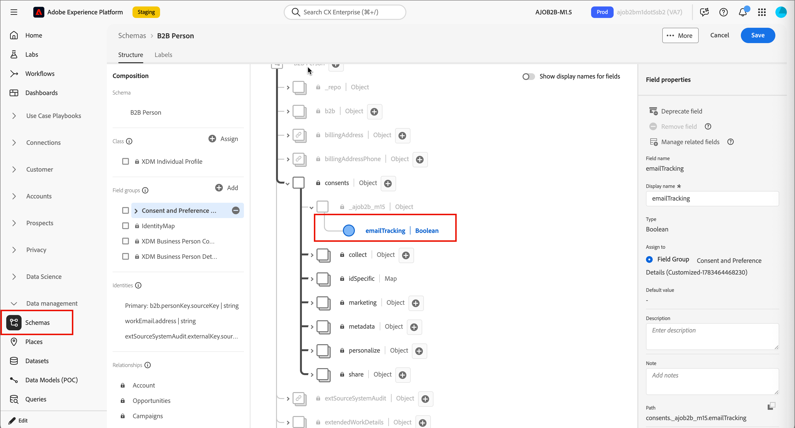

# Manage email open tracking

You can disable open tracking for an individual email, or capture each person's tracking preference in Adobe Experience Platform and use a split path to route people to tracking and non-tracking email variants.

>[!BEGINSHADEBOX "CNIL guidance on email tracking pixels"]

On April 14, 2026, the *Commission Nationale de l'Informatique et des Libertés* (CNIL) published a [recommendation on the use of tracking pixels within emails](https://www.cnil.fr/sites/default/files/2026-04/recommandation-pixels_de_suivi.pdf). The guidance clarifies when consent is required and highlights the importance of proper consent practices for email pixel tracking. This policy could impact sending practices for any entity delivering emails to subscribers based in France.

An email tracking pixel is a 1x1 transparent image embedded in the HTML of an email. When the recipient's email client loads that image, the pixel pings a server that records data such as a timestamp, device type, email client, and sometimes an IP address for approximate location. That log is then tied to a recipient's record, allowing marketers to know whether an email is opened.

The [!UICONTROL Journey Optimizer B2B Edition] product capabilities described here are building blocks that, configured and operated appropriately, may support a compliant implementation. Each customer is responsible for determining and complying with their obligations under applicable law.

>[!ENDSHADEBOX]

## Disable tracking for a single email {#disable-tracking-single-email}

Use this option when you want a specific email to never report open activity, regardless of who receives it.

1. From the journey node properties on the right, open the email.

1. In the email properties, select the **[!UICONTROL Disable open tracking]** checkbox.

   {width="500" zoomable="yes"}

   See [Define the email settings](./add-email.md#define-the-email-settings) for the full list of email properties.

## Segment people by tracking preference {#segment-people-tracking-preference}

If you want to let each person choose whether their email opens are tracked, capture that preference as a person attribute in Adobe Experience Platform (AEP). You can use this field in a [landing page form](./forms.md) so that your contacts have the opportunity to opt out of email open tracking. You can then use a _Split paths_ node in your journeys to route tracking and non-tracking people to different email variants. This lets you honor an individual opt-out without disabling open tracking for everyone.

The workflow has three parts:

1. [Add a custom field for tracking preference](#add-custom-field-tracking-preference) in AEP and send an opt-out communication with a form link.
1. [Add a split path for tracking opt-out](#add-split-path-tracking) in the journey.
1. [Configure tracking and non-tracking email variants](#configure-tracking-and-non-tracking-email-variants) for each path.

### Add a custom field for tracking preference {#add-custom-field-tracking-preference}

>[!NOTE]
>
>Adding and mapping custom XDM fields is an Adobe Experience Platform administration task. Work with your AEP administrator or data engineering team to complete this step.

1. In AEP, open the schema used for your B2B Person profile (for example, _B2B Person_).

1. Under the tenant ID, locate or create a field group for your organization's consent management fields (for example, `consents`).

1. Add a field to the field group, such as a Boolean field named `emailTracking`, to represent whether the person has consented to open tracking.

1. Enter the field name and display name, set the type, assign it to the field group, and click **[!UICONTROL Apply]**.  

1. Click **[!UICONTROL Save]** to save the schema changes.

   {width="800" zoomable="yes"}

1. Make the field available in [!DNL Journey Optimizer B2B Edition] by selecting it as a _Managed field_ for the [!UICONTROL XDM Individual Profile] class in [XDM field management](../admin/xdm-field-management.md#managed-fields).

   {width="450"}

   This makes the field available as a condition in split path nodes.

### Add a split path for tracking opt-out {#add-split-path-tracking}

Add a [_Split paths by people_ node](../journeys/split-merge-paths-nodes.md#split-paths-by-people) to your journey and define a path for each tracking preference value.

1. Add a **[!UICONTROL Split paths]** node and choose **[!UICONTROL People]** for the split.

1. For the first path, apply a condition using your custom tracking preference field (for example, `emailTracking` is `true`) to identify people who allow open tracking.

    {width="700" zoomable="yes"}

1. Add a second path and apply the inverse condition (`emailTracking` is `false`) to identify people who opted out of tracking.

   For general steps on adding paths, applying conditions, and reordering paths, see [Add a split path by people node](../journeys/split-merge-paths-nodes.md#add-a-split-path-by-people-node).

    {width="500" zoomable="yes"}

### Configure tracking and non-tracking email variants {#configure-tracking-and-non-tracking-email-variants}

Add a [_[!UICONTROL Send email]_ action node](./add-email.md) to each path so that every person receives the email variant that matches their tracking preference.

1. On the tracking-enabled path, add a **[!UICONTROL Send email]** action and select or create the email as usual, leaving **[!UICONTROL Disable open tracking]** cleared in the email properties.

1. On the opted-out path, add a **[!UICONTROL Send email]** action using the same or a duplicated email, then select the **[!UICONTROL Disable open tracking]** checkbox in the email properties on the right.

    {width="600" zoomable="yes"}

1. [Publish the journey](../journeys/create-publish-journey.md#publish-a-journey).

   People are automatically routed to the email variant that matches the value of their tracking preference field, and any updates they make to their preference are reflected the next time they enter the journey.
