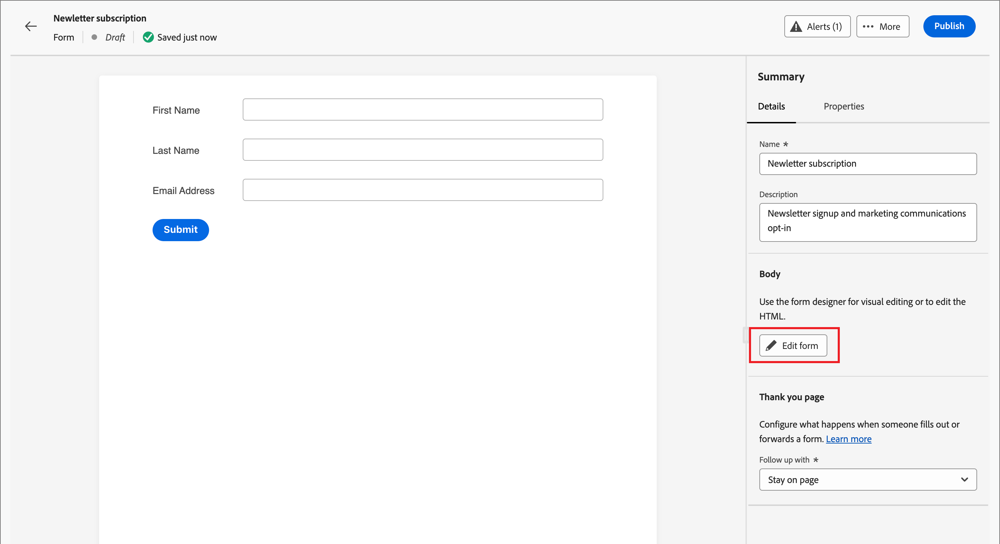
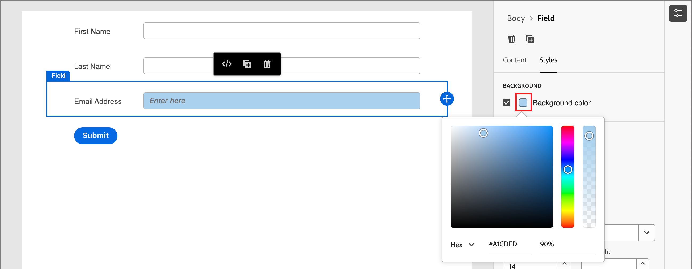
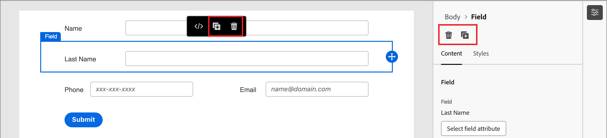
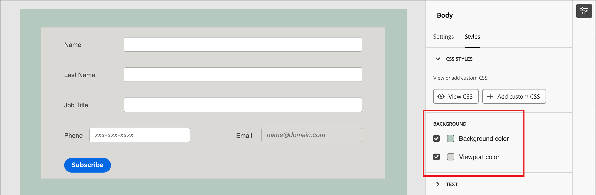

# Form design

After you [create a form](./landing-pages.md#create-a-landing-page), the visual design space opens a draft with a default basic form definition. In the _[!UICONTROL Summary]_ panel on the right, click **[!UICONTROL Edit form]** and use the visual design space to define the form styling and field components.

{width="700" zoomable="yes"}

## Fields

Form fields are used to capture person profile data that can be used to target people and associate them with accounts and buying groups. All new forms start with the following fields in a single column layout:

* First name
* Last name
* Email address

Use the field design tools to construct the set of fields and layout that you need for gathering the data that you need for your account-based marketing activities.

### Add a field {#add-field}

1. In the _[!UICONTROL Components]_ panel on the left, drag the **[!UICONTROL Field]** content component and drop it onto the canvas.

   {width="700" zoomable="yes"}

1. Click **[!UICONTROL Select field attribute]**.

1. In the _[!UICONTROL Select field attribute]_ dialog, select the checkbox for the person profile attribute that you want to use for the field and click **[!UICONTROL Select]**.

   The [XDM business schemas](../data/field-mapping.md#xdm-business-person-attributes) determine the available attributes.  Any custom fields that are defined for your Journey Optimizer B2B Edition instance are also available. Use the Search text box to filter the list by name, or click the Filter icon to filter the list by schema/data type. 

   {width="700" zoomable="yes"}

   On the canvas, the default field label for the selected attribute is populated on the canvas. The **[!UICONTROL Field details]** are displayed in the panel on the right.

1. If needed, change the **[!UICONTROL Label]** text. 

   This text is displayed next to the field in the form. The default text is populated from the field attribute.

1. Set **[!UICONTROL Field type]** according to the type of data for the field:

   | Field type | Usage | Example |
   | ---------- | ----- | ------- |
   | **[!UICONTROL Checkbox]** | Use this type so that visitors can select a _true_ (checked) or _false_ (unchecked) value. | |
   | **[!UICONTROL Checkbox Group]** | Use this type so that visitors can select a _true_ (checked) or _false_ (unchecked) value for multiple items. | |
   | **[!UICONTROL Currency]** | Use this type to allow a float field that represents the default currency type selected for the Journey Optimizer B2B Edition instance. | |
   | **[!UICONTROL Date]** | Use this type to restrict entry to a date format and provide a calendar selector in the field. | |
   | **[!UICONTROL Double]** |  | |
   | **[!UICONTROL Email]**  |  Use this type to restrict entry to an email address format. | |
   | **[!UICONTROL Number]** | Use this type to restrict the field to a numerical value. | |
   | **[!UICONTROL Radio Group]** | Use this type to allow visitors to select one of a set of options. | |
   | **[!UICONTROL Select]** | Use this type to allow visitors to select one of a set of options using a drop-down list. | |
   | **[!UICONTROL Slider]** | Use this type to allow visitors to set a numeric value using a slider. | |
   | **[!UICONTROL Telephone]** | Use this type for a telephone number entry field.  | |
   | **[!UICONTROL Text]** | Use this type for a standard text (string) entry field. | |
   | **[!UICONTROL Textarea]** | Use this type to support longer text entry.  | |
   | **[!UICONTROL URL]** | Use this type to restrict text input to a URL, including the standard URL protocol. | |

1. Depending on the selected field type, set the other options for the field entry and validation:

   {width="400" zoomable="yes"}

   * **[!UICONTROL Placeholder]** - The placeholder value for the field that gives the visitor an example of what is expected for the field.

   * **[!UICONTROL Instructions]** - Instructive text that helps the visitor to complete the field. Enter the text that you want to display as _hover text_ for the field.

      >[!TIP]
      >
      >_Instructions vs. placeholder text_ 
      >
      >Use these two properties to guide visitors for filling out the field. Instruction text appears as a tool tip/popup text when hovering the pointer over the field. Placeholder text appears _dimmed_ inside the field and disappears as the visitor engers their text into the field. You can use both methods, or just one.

   * **[!UICONTROL Default value]** - Use this option to specify a default value for the field. 

   * **[!UICONTROL Validation message]** - Use this option to specify a validation message for the field. This message is displayed if the visitor enters an invalid value for the field. The _[!UICONTROL Standard]_ message is set by default. Choose **[!UICONTROL Custom]** and enter your own message. 

   * **Max length** - Enter the maximum number of characters that can be entered into the field.

1. Set the **[!UICONTROL Field behaviors]** as needed: 

   * **Required** - Select the checkbox to make the field input required for submitting the form.

   * **Enable input mask** - Select the checkbox to restrict input from your visitor using an input mask. For example, you may want visitors to enter phone numbers in a specific format. In the dialog, enter the mask using `9` for any number, `a` for any letter, and `*` for either. Click Save to enable the specified input mask.

      {width="500" zoomable="yes"}

### Change field styling {#field-styling}

Select the **[!UICONTROL Styles]** tab in the right panel to change the styling for the selected field.

* **[!UICONTROL Background]** - Select the checkbox to apply a background color for the field. White is the default color. Click the **[!UICONTROL Background color]** square to open the popup color picker and choose a color for the field background.

   {width="600" zoomable="yes"}

* **[!UICONTROL Label]** - The label styling controls the visual characteristics for the text displayed next to the field. Choose a top or a side label display relative to the field. You can set the font size, line height, text style, and text alignment. Click the **[!UICONTROL Font color]** square to open the popup color picker and choose a color for the label text.

   {width="600" zoomable="yes"}

* **[!UICONTROL Border]** - Click the **[!UICONTROL Border color]** square to open the popup color picker and choose a color for the border. You can define a border for the field, including the color and line width. Clear the checkbox to remove the displayed field border. You can also change the border size (pixel width), style, and radius setting for the corners.

   {width="600" zoomable="yes"}

* **[!UICONTROL Size]** - Select a size setting to determine the display width for the field. Choose _[!UICONTROL Full width]_, _[!UICONTROL Half width]_, or _[!UICONTROL Auto]_. 

* **[!UICONTROL Margin]** - Set margins (in pixels) around the field. You can set the same margin on all four sides, or select the **[!UICONTROL Different margin for each side]** checkbox to set the horizontal and vertical margins separately.

* **[!UICONTROL Padding]** - Set padding (in pixels) around the field. You can set the same margin on all four sides, or select the **[!UICONTROL Different padding for each side]** checkbox to set the horizontal and vertical margins separately.

   {width="600" zoomable="yes"}

### Reorder fields {#field-reorder}

You can move form fields directly in the visual workspace. Click the _Move_ tool on the right edge of the selected field and drag it to a new location.

Add structural components to the form and move fields into columns to group them and change the layout. Click the _Move_ tool on the left edge of the selected column component and drag it to a new location within the form.

{width="500"}

### Delete or duplicate a field {#field-delete-duplicate}

Click the _Delete_ icon (  ) in the toolbar or the right panel to delete a selected field. In the confirmation dialog, click **[!UICONTROL Delete]**.

Click the _Duplicate_ icon (  ) in the toolbar or the right panel to duplicate a selected field. The new field is displayed just below the original field. Click **[!UICONTROL Select field attribute]** to set the attribute for the field. Set the field type, details, and styles as needed.

{width="600" zoomable="yes"}

## Submit button

The submit button (footer field) is part of the form by default and cannot be removed. Select the butto/footer component in the form to change the text and styling for the button.

### Edit the button content {#button-content}

Withe the _[!UICONTROL Content]_ tab displayed in the right panel, change the text in the **[!UICONTROL Button text]** field. The button sizing adjusts to accommodate the length of the text.

{width="600" zoomable="yes"}

### Style the submit button {#button-styles}

Select the **[!UICONTROL Styles]** tab in the right panel to change the styling for the selected button/footer component.

* **[!UICONTROL Background]** - Select the checkbox to apply a background color for the button. Blue is the default color. Click the **[!UICONTROL Background color]** square to open the popup color picker and choose a color for the button background.

   {width="600" zoomable="yes"}

* **[!UICONTROL Label]** - The label styling controls the visual characteristics for the text inside the button. You can set the font size, line height, text style, and text alignment. Click the **[!UICONTROL Font color]** square to open the popup color picker and choose a color for the label text.

* **[!UICONTROL Border]** - Click the **[!UICONTROL Border color]** square to open the popup color picker and choose a color for the border. You can define a border for the button, including the color and line width. Clear the checkbox to remove the displayed button border. You can also change the border size (pixel width), style, and radius setting for rounded corners.

* **[!UICONTROL Size]** - Select a size setting to determine the display width for the button. Choose _[!UICONTROL Full width]_, _[!UICONTROL Half width]_, or _[!UICONTROL Auto]_. The padding adjusts according to the size and alignment settings.

   {width="600" zoomable="yes"}

* **[!UICONTROL Button Alignment]** - When you choose a _Half width_ or _Auto_ size for the button, set the alignment at left, right, or center. The padding adjusts according to the size and alignment settings.

* **[!UICONTROL Margin]** - Set margins (in pixels) around the field. You can set the same margin on all four sides, or select the **[!UICONTROL Different margin for each side]** checkbox to set the horizontal and vertical margins separately.

* **[!UICONTROL Padding]** - Set padding (in pixels) around the field. You can set the same margin on all four sides, or select the **[!UICONTROL Different padding for each side]** checkbox to set the horizontal and vertical margins separately. The padding adjusts if you change the size and alignment settings.

   {width="600" zoomable="yes"}

## Form styling {#form-styling}

You can change styles for the form area when you click outside of the structural or form components. The form components (fields and button) inherit the _Body_ styles defined the top-level styles, unless other styles are defined at the field or button/footer level.

{width="600" zoomable="yes"}

### CSS styles

New forms use the default CSS for styling. If you want to change the styles by modifying the CSS, you can copy it and then use it to define a custom CSS for the form.

_To define a custom CSS for the form:_

1. Click **[!UICONTROL View CSS]** in the right panel to review the CSS code.

   {width="450" zoomable="yes"}

1. Select the CSS code in the scrolling window and copy it to your clipboard.

1. Click **[!UICONTROL Close]**.

1. (Optional) Paste the copied code into your favorite CSS tool and edit the CSS to reflect the styling that you want.

1. Click **[!UICONTROL Add custom CSS]** in the right panel.

1. Paste the CSS code into the window.

   {width="450" zoomable="yes"}

   You can edit the pasted text in this window.

1. Click **[!UICONTROL Save]**.

### Manual styling

Change the settings in the right panel to define the display for the whole form. 

* **[!UICONTROL Background color]** - Select the checkbox to apply a background color around the form area. White is the default color. Click the color square to open the popup color picker and choose a color for the form background.

* **[!UICONTROL Viewport background]** - Select the checkbox to apply a background color to all form components. The default is no color (inherit from the outer background). Click the color square to open the popup color picker and choose a color for the form structural components.

   {width="600" zoomable="yes"}

* **[!UICONTROL Text]** - Choose a **[!UICONTROL Font family]** for the form, which affects the labels, hint, and placeholder text for form fields. It also affects the default submit button text. 

* **[!UICONTROL Size]** - Change the size (width) for the form in pixels.

* **[!UICONTROL Margin]** - Set margins (in pixels) around the form components. You can set the same margin on all four sides, or select the **[!UICONTROL Different margin for each side]** checkbox to set the horizontal and vertical margins separately.

   {width="600" zoomable="yes"}
