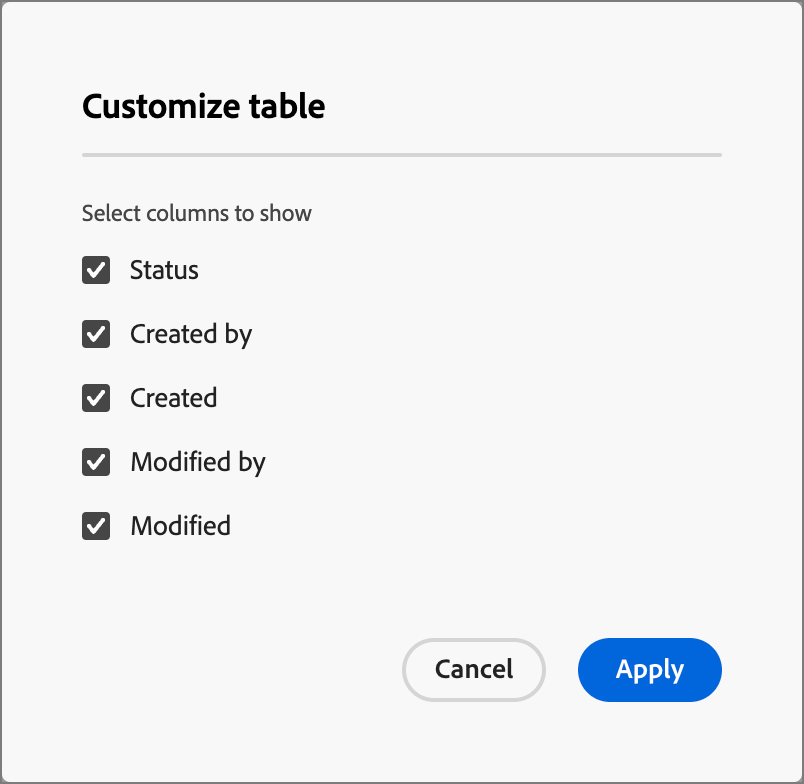
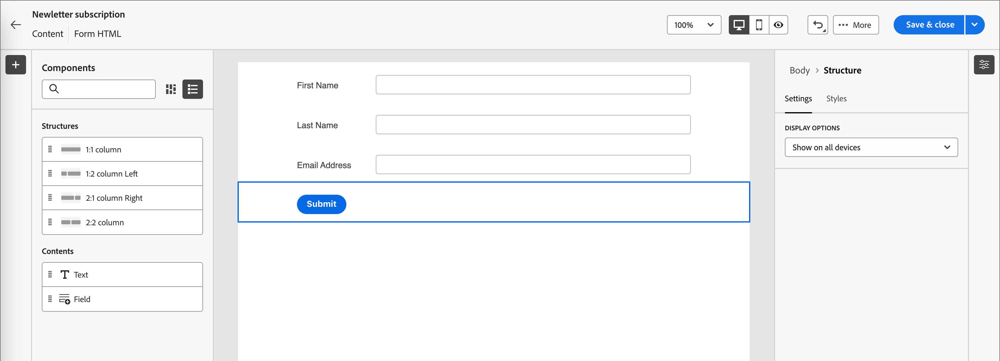
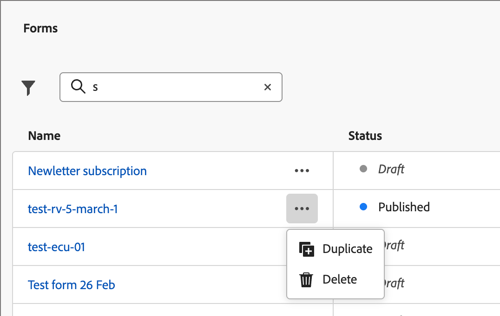

# Forms

To capture information from web page visitors, create forms and add them to your landing pages. A form is a set of fields that page visitors complete and submit to obtain some kind of content or offer, such as a white paper, on-demand webinar, or a free trial. 

The amount of information that the form should capture depends on the value of the content or offer. If you are offering something simple, like a white paper, you should collect only minimal information, such as their name, email, and company. If the offer is something of higher value, like a demo or a free trial, you can collect more information. Requiring a submitted form to permit content viewing is called _gated content_. Your organization decides which content should be gated and which is not (_free_). The best practice is to allow some content for free and gate only your premium or high demand content.

## Access and manage forms

To access forms in Journey Optimizer B2B Edition, go to the left navigation and click **[!UICONTROL Content Management]** > **[!UICONTROL Forms]**. This action opens a listing page with all the forms created in the instance listed in a table.

{width="700" zoomable="yes"}

The table is sorted by the _[!UICONTROL Modified]_ column, with the most recently updated forms at the top by default. Click the column title to change between ascending and descending.

### Form status and lifecycle

The form status determines its availability for use in a landing page or landing page template, and the changes that you can make to it. 

| Status               | Description |
| -------------------- | ----------- |
| Draft                | When you create a form, it is in draft status. It remains in this status as you define or edit the fields until you publish it for use in a landing page or landing page template. Available actions: <ul><li>Edit all details<li>Edit in visual design space<li>Publish<li>Duplicate<li>Delete|
| Published            | When you publish a form, it becomes available for use in a landing page or landing page template. Published form content cannot be modified in the visual design space. Available actions: <ul><li>Edit name, description, or thank-you page<li>Add to a landing page or landing page template<li>Create draft version<li>Duplicate<li>Delete (if not in-use)<li>Embed code|
| Published with draft | When you create a draft from a published form, the published version remains available for use in a landing page or landing page template, and the draft content can be modified in the visual design space. If you publish the draft version, it replaces the current published version and the content is updated in the landing pages or landing page templates where it is in use. Available actions: <ul><li>Edit name, description, or thank-you pages<li>Add to a landing page or landing page template<li>Edit draft version in visual design space<li>Publish draft version<li>Duplicate<li>Delete (if not in-use)<li>Embed code|

{zoomable="yes"}

### Filter the forms list

To search for a form by name, enter a text string into the search bar for a match. Click the _Filter_ icon (  ) to show the available filter options and change the settings to filter the displayed items according to your specified criteria.

{width="700" zoomable="yes"}

### Customize the column display

Customize the columns that you want to display in the table by clicking the _Customize table_ icon (  ) at the top right. 

In the dialog, select the columns to display and click **[!UICONTROL Apply]**.

{width="300"}

## Create forms

There are several things to consider before you start building reusable forms in Journey Optimizer B2B Edition:

* Determine what forms you need. 

   It may be possible to use only four standard forms. One for accessing downloadable content, one for accessing premium webpages, one for viewing videos, and one for registering for things like webinars. If you ever need to change a field in a form, it's easier to update four standard forms that are used globally instead of changing multiple forms spread across all of your marketing programs. <!-- Global forms also make progressive profiling much easier to implement. -->
   
* For each standard form, determine which fields to use and how to present them.

   Consider using shorter forms, since they are proven to be better for conversions. When you think through each form, decide what fields are reasonable and necessary for its purpose.

   Consider whether to pre-fill form fields, so that basic information, such as name and email are pre-filled. But other information, such as job title and size of the organization, are not. This way, the visitor needs to fill only two fields and submit the form. You can also use a social form fill with data from Facebook or Twitter. 

* Plan what follow-up page is displayed after a visitor submits a form (_thank you_ page). 

   Does everyone get the same page or is it dynamic and based on their data? For example, someone in the healthcare industry might see a different page content than someone in the tech industry.
   
* Consider whether to bypass a form entirely if you already have the information you need.

   When you allow a form bypass for a known person who visits your landing page, they can simply access the content directly. Bypassing the form provides a more streamlined visitor experience.

### Add a new form

You can create a form in Journey Optimizer B2B Edition by clicking **[!UICONTROL Create form]** at the top right of the _[!UICONTROL Forms]_ list page.

1. In the _[!UICONTROL Create form]_ dialog, enter a useful **[!UICONTROL Name]** (required) and **[!UICONTROL Description]** (optional).

   Form requirements:

   * Name - Maximum of 100 characters, must be unique, case-insensitive

   * Description - Maximum of 300 characters

   * Alpha, numeric, and special characters are allowed

   * Reserved characters are **_not allowed_**: `\ / : * ? " < > |`

   {width="400"}

1. Click **[!UICONTROL Create]**.

   The form details page opens with a default basic form definition.

   {width="700" zoomable="yes"}

### Change the default form design

Use the visual design tools to change the form content as needed:

* [Add fields](./form-design.md#add-a-field)
* [Change field styling](./form-design.md#change-field-styling)
* [Reorder fields](./form-design.md#reorder-fields)
* [Change submit button text and styling](./form-design.md#edit-and-style-the-submit-button)
* [Change the form styling](./form-design.md#change-form-styling)

Click **[!UICONTROL Save & close]** to save your form content design changes and go to the form details.

### Set the thank you page

In th _[!UICONTROL Summary]_ panel on the right, scroll to the **[!UICONTROL Thank you page]** section and use the **[!UICONTROL Follow up with]** setting to define what happens when a visitor submits the form:

* **[!UICONTROL Stay on page]** - Choose this option to keep the visitor on the same page when the form is submitted.

* **[!UICONTROL Landing page]** - Choose this option to select any Journey Optimizer B2B Edition or Marketo Engage landing page as the follow-up.

* **[!UICONTROL External URL]** - Choose this option to specify any URL as the follow-up page. After the visitor submits the form, the browser loads the designated URL.

   >[!TIP]
   >
   >If you want the use the form for downloading a file, you can specify a URL for the hosted file. With this configuration, the submit button functions as a download button.

### Publish the form draft

When you are ready to make the form available for use in a landing page or landing page template, click **[!UICONTROL Publish]**.

{width="400"}

This action opens a confirmation dialog. You can abort the publishing process by clicking **[!UICONTROL Cancel]**, or click **[!UICONTROL Publish]** to confirm.

## View form details

Click the name of any form in the list page to open the fragment details page. You can choose to edit the form, rename the form, or update the form description. Make updates and click outside of the name or description field to auto-save changes.

>[!NOTE]
>
>If a published form is in use by a landing page or landing page template, you cannot edit the content or change the thank-you page. You can create a draft version if you want to make changes to the form.s

{width="600" zoomable="yes"}

Click **[!UICONTROL Edit form]** to open the fragment in the visual design space.

Exit the view at any time by clicking the _Back_ arrow at the top left, which returns you to the _[!UICONTROL Forms]_ list page.

## View form used-by references

In the _[!UICONTROL Summary]_ panel on the right, click the **[!UICONTROL Used By]** tab to view details of where the form is currently used within Journey Optimizer B2B Edition, across landing pages and landing page templates.

>[!IMPORTANT]
>
>Any form that is currently in use by any landing page or landing page template cannot be deleted.

{width="600" zoomable="yes"}

References are displayed according to category: _Landing page_ or _Landing page template_. Click the link to open the corresponding page or template where the form is used.

## Delete forms

Any form that is currently in use by a landing page or landing page template cannot be deleted. You can check the _used-by_ references before initiating a form removal. Also, a removal cannot be undone, so check before initiating a delete action.

You can delete a form using either of the following methods:

* At the top right, click **[!UICONTROL ... More]** and choose **[!UICONTROL Delete]**.
* From the _[!UICONTROL Forms]_ list page, click the ellipsis next to the form name and choose **[!UICONTROL Delete]**.

This action opens a confirmation dialog. You can abort the process by clicking **[!UICONTROL Cancel]**, or click **[!UICONTROL Delete]** to confirm deletion.

{width="400"}

If the form is currently in use, the action opens an informational dialog that alerts you that it cannot be deleted. Click **[!UICONTROL OK]**, which aborts the delete action.

{width="400"}

## Duplicate forms

Duplicate a form as a quick and easy way to create a new from using an existing form as a starting point for your form design.

You can duplicate a form using either of the following methods:

* At the top right of the form details page, click **[!UICONTROL ... More]** and choose **[!UICONTROL Duplicate]**.
* From the _[!UICONTROL Forms]_ list page, click the ellipsis next to the form name and choose **[!UICONTROL Duplicate]**.

{width="450"}

In the dialog, enter a useful name (unique) and description. Click **[!UICONTROL Duplicate]** to complete the action. 

{width="400"}

Edit the duplicate form to change the name as needed and alter the form for its intended use. 

## Edit forms

CHanges to a form depend on its current status:

* When a form is in _Draft_ status, you can edit any of its details and content (fields, button, and styling).
* When a form is in _Published_ status, you can edit the form name or description. You cannot edit the content.
* When a form is in _Published with draft_ status, you can edit the form name or description. In the draft version, you can also edit the content and the thank-you page.s

>[!BEGINTABS]

>[!TAB Draft]

1. From the _[!UICONTROL Forms]_ list page, click the form name to open it.

   A preview of the form content is displayed, with the form details on the right.

1. Modify any of the details, such as name and description.

   {width="600" zoomable="yes"}

1. To make changes to the form in the visual design space, click **[!UICONTROL Edit form]**.

   Use the visual design tools as needed:

   * [Add fields](./form-design.md#add-a-field)
   * [Change field styling](./form-design.md#change-field-styling)
   * [Reorder fields](./form-design.md#reorder-fields)
   * [Change submit button text and styling](./form-design.md#submit-button)
   * [Change the form styling](./form-design.md#change-form-styling)

   Click **[!UICONTROL Save & close]** to return to the form details.

1. When the form meets your criteria and you want to make it available for use in a landing page or landing page template, click **[!UICONTROL Publish]**.

>[!TAB Published]

1. From the _[!UICONTROL Forms]_ list page, click the form name to open it.

   A preview of the form content is displayed, with the form details on the right.

1. To create a draft version for editing the form, click **[!UICONTROL Edit form]** in the _[!UICONTROL Summary]_ panel on the right.

1. Click **[!UICONTROL Create draft version]** in the dialog to open the draft version in the visual design space.

   {width="400"}

1. Use the visual design tools as needed to update the form content:

   * [Add fields](./form-design.md#add-a-field)
   * [Change field styling](./form-design.md#change-field-styling)
   * [Reorder fields](./form-design.md#reorder-fields)
   * [Change submit button text and styling](./form-design.md#submit-button)
   * [Change the form styling](./form-design.md#change-form-styling)

   Click **[!UICONTROL Save & close]** to return to the form details.

1. When the draft form meets your criteria and you want to make the changes available for use in a landing page or landing page template, click **[!UICONTROL Publish]**.

   When you publish the draft version, it replaces the current published version and the form content is updated in the landing pages or landing page templates where it is already in use.

>[!TAB Published with draft]

1. Click the form name to open it. 

1. Select the **[!UICONTROL Draft]** tab.

   A preview of the draft version form content is displayed, with the form details on the right.

   {width="700" zoomable="yes"}

1. Click **[!UICONTROL Edit form]** in the _[!UICONTROL Summary]_ pane on the right and use the visual design tools as needed:

   * [Add fields](./form-design.md#add-a-field)
   * [Change field styling](./form-design.md#change-field-styling)
   * [Reorder fields](./form-design.md#reorder-fields)
   * [Change submit button text and styling](./form-design.md#submit-button)
   * [Change the form styling](./form-design.md#change-form-styling)

   Click **[!UICONTROL Save & close]** to return to the form details.

1. When the draft form meets your criteria and you want to make the changes available for use in landing pages and landing page templates, click **[!UICONTROL Publish]**.

   When you publish the draft version, it replaces the current published version and the form is updated in the landing pages and templates where it is already in use.

>[!ENDTABS]

## Add forms to a landing page or template

Forms are designed for reuse and can be inserted when you are designing a [landing page](./landing-page-design.md) or [landing page template](./landing-page-templates.md).

{{$include /help/_includes/content-design-add-forms.md}}

## Form actions for page and template authoring

When a form is included in a landing page or landing page template, the form content cannot be changed within the page or template. However, you can apply the following actions:

* **[!UICONTROL Delete]** - This action removes the form from the current page or template content (the fragment source is unaffected).
* **[!UICONTROL Duplicate]** - This action duplicates the form within the same page or template within the editor, with the same dimensions and added just below it.
* **[!UICONTROL View HTML]** - This action opens a popup with the HTML for the form. You can edit the HTML, or copy it for use in other web content.
* **[!UICONTROL Edit Form]** - This action opens a new browser tab with the form editor page and details.

When you select the form on the landing page design space, these actions are available from the context toolbar and the properties panel on the right.

{width="600" zoomable="yes"}
