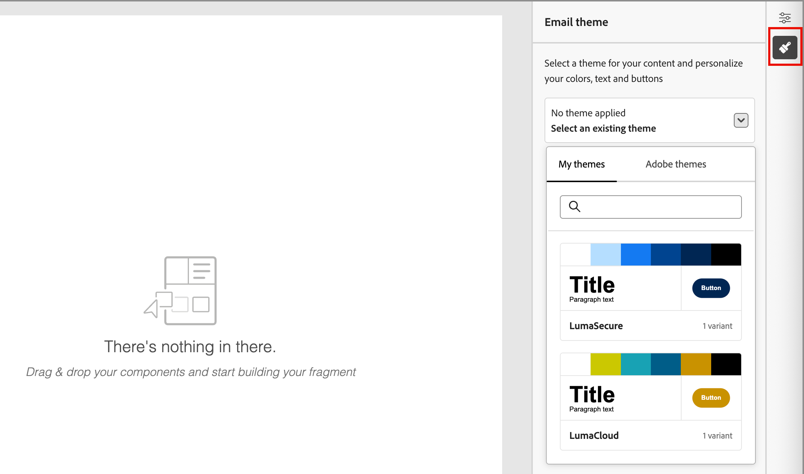

# Fragments

A fragment is a reusable component that can be referenced in one or more emails and email templates across Adobe Journey Optimizer B2B Edition. It is usually a block of content (text, image, or both) that can be pre-created and quickly inserted into an email or email template. With this functionality, you can prebuild multiple custom content blocks for use by your marketing team members to assemble email contents for an improved design process. Common use cases include header/footer content blocks for email, event invite banners, and seasonal greetings.

>[!BEGINSHADEBOX]

**Visual fragments**

Visual fragments are pre-defined visual blocks built using the visual design tools that you can reuse across multiple emails or email templates. The current scope of Journey Optimizer B2B Edition and this documentation are that of visual fragments only. 

>[!NOTE]
>
>Expression-based fragments are not yet supported in [!DNL Journey Optimizer B2B Edition].

>[!ENDSHADEBOX]

To make the best use of fragments in your workflows:

* _Create your own fragments_ - Create visual fragments, either from scratch or by saving content as a fragment from the visual content editor.
* _Reuse fragments_ - Use them as many times as needed in your content.

## Access and manage fragments

To access visual fragments in Adobe Journey Optimizer B2B Edition, go to the left navigation and click **[!UICONTROL Content Management]** > **[!UICONTROL Fragments]**. This action opens a listing page with all the fragments created in the instance listed in a table.

{width="700" zoomable="yes"}

The table is sorted by the _[!UICONTROL Modified]_ column, with the most recently updated fragments at the top by default. Click the column title to change between ascending and descending.

### Fragment status and lifecycle

The fragment status determines its availability for use in an email or email template, and the changes that you can make to it. 

| Status               | Description |
| -------------------- | ----------- |
| Draft                | When you create a fragment, it is in draft status. It remains in this status as you define or edit the visual design space until you publish it for use in an email or email template. Available actions: <ul><li>Edit all details<li>Edit in visual design space<li>Publish<li>Duplicate<li>Delete|
| Published            | When you publish a fragment, it becomes available for use in an email or email template. Published fragment content cannot be modified in the visual design space. Available actions: <ul><li>Edit description<li>Add to an email or template<li>Create draft version<li>Duplicate<li>Delete (if not in-use)|
| Published with draft | When you create a draft from a published fragment, the published version remains available for use in an email or email template, and the draft content can be modified in the visual design space. If you publish the draft version, it replaces the current published version and the content is updated in the emails and email templates where it is in use. Available actions: <ul><li>Edit description<li>Add to an email or template<li>Edit draft version in the visual design space<li>Publish draft version<li>Duplicate<li>Delete (if not in-use)|

{zoomable="yes"}

>[!IMPORTANT]
>
>Fragment status was introduced in the Journey Optimizer B2B Edition August release. All fragments created before this release have the _Draft_ status, even if they are used in an email or template. If you make any change to these fragments, you must publish the fragment to propagate the changes.

### Filter the fragments list

To search for a fragment by name, enter a text string into the search bar for a match. Click the _Filter_ icon (  ) to show the available filter options and change the settings to filter the displayed items according to your specified criteria.

{width="700" zoomable="yes"}

### Customize the column display

Customize the columns that you want to display in the table by clicking the _Customize table_ icon (  ) at the top right. 

In the dialog, select the columns to display and click **[!UICONTROL Apply]**.

{width="300"}

## Create fragments

You can create new visual fragments in Journey Optimizer B2B Edition by clicking **[!UICONTROL Create fragment]** at the top right.

1. In the _[!UICONTROL Create fragment]_ dialog, enter a useful **[!UICONTROL Name]** and **[!UICONTROL Description]** (optional).

   Fragment requirements:

   * Name - Maximum of 100 characters, must be unique, case-insensitive

   * Description - Maximum of 300 characters

   * Alpha, numeric, and special characters are allowed

   * Reserved characters are **_not allowed_**: `\ / : * ? " < > |`

   {width="400"}

1. Click **[!UICONTROL Create]**.

   The visual design space opens with an empty canvas.

1. Use the content design tools to create the visual fragment content:

   * [Add structure and content](./fragment-authoring.md#add-structure-and-content)
   * [Add Assets](./fragment-authoring.md#add-assets)
   * [Navigate the layers, settings, and styles](./fragment-authoring.md#navigate-the-layers-settings-and-styles)
   * [Personalize content](./fragment-authoring.md#personalize-content)
   * [Enable custom fields](./fragment-authoring.md#enable-fragment-customization)
   * [Edit linked URL tracking](./fragment-authoring.md#edit-linked-url-tracking)

1. (Optional) Apply a [brand theme](./brand-themes.md) to the fragment content to streamline the fragment authoring process and make sure that the design aligns with defined standards.

   >[!NOTE]
   >
   >When you apply a theme, fragment compatibility is limited to emails and email templates that are created in _Theme mode_.

   Click the _Themes_ (  ) icon on the right. 
   
   {width="600" zoomable="yes"}

   Select one of the custom themes listed in the **[!UICONTROL My themes]** tab, or you can Select **[!UICONTROL Adobe themes]** to use a built-in theme. When you click outside of the list, the selected theme applies the styles for all components in the canvas. You can toggle between the color variants as needed.

1. Click **[!UICONTROL Save]** at any time to save the draft fragment.

1. When you are ready to make the fragment available for use in an email or email template, click **[!UICONTROL Publish]**.

## View fragment details

Click the name of any fragment in the list page to open the fragment details page. You can choose to edit the fragment, rename the fragment, or update the fragment description. Make updates and click outside of the name or description field to auto-save changes.

>[!NOTE]
>
>If a published fragment is in use by an email or email template, you cannot change the name or edit the content. You can create a draft version if you want to make changes to the fragment.

{width="600" zoomable="yes"}

Click **[!UICONTROL Edit fragment]** to open the fragment in the visual content editor.

Exit the view at any time by clicking the _Back_ arrow at the top left, which returns you to the _Fragments_ list page.

## View fragment used-by references

Within the fragment details page, click the **[!UICONTROL Used By]** tab to view details of where the fragment is currently used within Journey Optimizer B2B Edition, across emails, email templates, and fragments.

>[!IMPORTANT]
>
>Any fragment that is currently in use by any email or email template cannot be deleted.

References are displayed according to category: _Email_ or _Email template_. Emails in Journey Optimizer B2B Edition are embedded and authored within account journeys, so the parent journey of the email that uses the fragment is displayed in references.

{width="600" zoomable="yes"}

Click the link to open the corresponding email or email template where the fragment is used.

## Delete fragments

Any fragment that is currently in use by any email or email template cannot be deleted, so ensure that you check the _used-by_ references before initiating a fragment removal. Also, a removal cannot be undone, so check before initiating a delete action.

You can delete a fragment using either of the following methods:

* From the fragment details on the right, click **[!UICONTROL Delete]**.
* From the _[!UICONTROL Fragments]_ listing page, click the ellipsis next to the fragment and choose **[!UICONTROL Delete]**.

This action opens a confirmation dialog. You can abort the process by clicking **[!UICONTROL Cancel]**, or click **[!UICONTROL Delete]** to confirm deletion.

{width="400"}

If the fragment is currently in use, the action opens an informational dialog that alerts you that it cannot be deleted. Click **[!UICONTROL OK]**, which aborts the delete action.

{width="400"}

## Edit fragments

Edits to a fragment depend on its current status:

* When a fragment is in _Draft_ status, you can edit any of its details and the visual content.
* When a fragment is in _Published_ status, you can edit the fragment description, but not the name. You cannot edit the visual content.
* When a fragment is in _Published with draft_ status, editing the details is limited to the description. You can also edit the visual content for the draft version.

>[!BEGINTABS]

>[!TAB Draft]

1. From the _[!UICONTROL Fragments]_ listing page, click the fragment name to open it.

   A preview of the visual content is displayed, with the fragment details on the right.

1. Modify any of the details, such as name and description.

   {width="600" zoomable="yes"}

1. To make changes to the content in the visual design space, click **[!UICONTROL Edit fragment]**.

   Use the visual design tools as needed:

   * [Add structure and content](./fragment-authoring.md#add-structure-and-content)
   * [Add Assets](./fragment-authoring.md#add-assets)
   * [Navigate the layers, settings, and styles](./fragment-authoring.md#navigate-the-layers-settings-and-styles)
   * [Personalize content](./fragment-authoring.md#personalize-content)
   * [Enable custom fields](./fragment-authoring.md#enable-fragment-customization)
   * [Edit linked URL tracking](./fragment-authoring.md#edit-linked-url-tracking)

   Click **[!UICONTROL Save]**, or **[!UICONTROL Save & close]** to return to the fragment details.

1. When the fragment meets your criteria and you want to make it available for use in an email or email template, click **[!UICONTROL Publish]**.

>[!TAB Published]

1. From the _[!UICONTROL Fragments]_ listing page, click the fragment name to open it.

   A preview of the visual content is displayed, with the fragment details on the right.

1. Modify the description, if needed.

   For a published fragment, all other details cannot be changed.

1. If you want to update the content, click **[!UICONTROL Create draft version]** at the top right.

   Click **[!UICONTROL OK]** in the dialog to open the draft version in the visual design space.

   {width="300"}

   Use the visual design tools as needed:

   * [Add structure and content](./fragment-authoring.md#add-structure-and-content)
   * [Add Assets](./fragment-authoring.md#add-assets)
   * [Navigate the layers, settings, and styles](./fragment-authoring.md#navigate-the-layers-settings-and-styles)
   * [Personalize content](./fragment-authoring.md#personalize-content)
   * [Enable custom fields](./fragment-authoring.md#enable-fragment-customization)
   * [Edit linked URL tracking](./fragment-authoring.md#edit-linked-url-tracking)

   Click **[!UICONTROL Save]**, or **[!UICONTROL Save & close]** to return to the fragment details.

1. When the draft fragment meets your criteria and you want to make the changes available for use in an email or email template, click **[!UICONTROL Publish]**.

   When you publish the draft version, it replaces the current published version and the content is updated in the emails and email templates where it is already in use.

>[!TAB Published with draft]

There are two ways to open the draft version for editing from the _[!UICONTROL Fragments]_ listing page:

* Click the _More_ icon (**...**) next to the fragment name and choose **[!UICONTROL Open draft version]**.

   {width="300"}

* Click the fragment name to open it. Then, click **[!UICONTROL Open draft version]** at the top right.

   A preview of the visual content for the draft version is displayed, with the fragment details on the right.

To update the content:

1. Click **[!UICONTROL Edit fragment]** at the top right. Use the visual design tools as needed:

   * [Add structure and content](./fragment-authoring.md#add-structure-and-content)
   * [Add Assets](./fragment-authoring.md#add-assets)
   * [Navigate the layers, settings, and styles](./fragment-authoring.md#navigate-the-layers-settings-and-styles)
   * [Personalize content](./fragment-authoring.md#personalize-content)
   * [Enable custom fields](./fragment-authoring.md#enable-fragment-customization)
   * [Edit linked URL tracking](./fragment-authoring.md#edit-linked-url-tracking)

   Click **[!UICONTROL Save]**, or **[!UICONTROL Save & close]** to return to the fragment details.

1. When the draft fragment meets your criteria and you want to make the changes available for use in an email or email template, click **[!UICONTROL Publish]**.

   When you publish the draft version, it replaces the current published version and the content is updated in the emails and email templates where it is already in use.

>[!ENDTABS]

## Duplicate fragments

You can duplicate a fragment using either of the following methods:

* From the _[!UICONTROL Fragments]_ listing page, click the _More_ icon (**...**) next to the fragment name and choose **[!UICONTROL Duplicate]**.
* At the top right of the fragment details page, click **[!UICONTROL ... More]** and choose **[!UICONTROL Duplicate]**.

{width="600" zoomable="yes"}

In the dialog, enter a useful name (unique) and description. Click **[!UICONTROL Duplicate]** to complete the action.

{width="400"}

The duplicated (new) fragment then appears in the _Fragments_ listing.

## Save a new fragment from email or template content

When you are creating/editing an email or email template in the visual content editor, you can choose to save all or parts of the content as a fragment so that it is available for reuse.

1. When you have some content to be saved as a fragment, click **[!UICONTROL More]** and choose **[!UICONTROL Save as Fragment]**.

1. Select the different elements to be included in the fragment.

   Select multiple structures by holding the Shift or Control button.

   You can only select structures that are adjacent to each other and the interface does not allow you to select non-adjacent elements.

1. With the content selected, click **[!UICONTROL Create]** at the top right.

1. In the dialog, enter a useful name and description for the fragment. Then click **[!UICONTROL Create]**.

   The new fragment is then displayed in the _Fragments_ listing page and is also available for use within emails and email templates.

## Add visual fragments to your email or template content

Fragments are designed for reuse and can be inserted for email and email template authoring. You can add up to 30 fragments in an email or template. Fragments can be nested up to one level only.

>[!BEGINTABS]

>[!TAB Add fragments to an email]

1. Navigate to **[!UICONTROL Account Journeys]** and open an existing journey or create a new journey.

1. Create a [_[!UICONTROL Send Email]_ node](./add-email.md#add-an-email-action-node-in-a-journey).

1. Create or edit [email content for the node](./email-authoring.md).

1. Drag and drop an item from the **[!UICONTROL Components]** menu to provide a _structure_ for the fragment.

1. To open the listing of published fragments, click the _Fragments_ icon.

   You can:
   * Sort the listing.
   * Browse, search, and filter the listing.
   * Switch between card (thumbnail) and list views.
   * Refresh the list to reflect any of the recently created fragments.

   {width="600"}

1. Drag and drop any of the fragments into the structure component placeholder.

   The editor renders the fragment within the section/element of the email structure.

The content of the fragment is dynamically updated within the structure to render a visual of how the content appears in the email.

>[!TIP]
>
>If you want the fragment to occupy the entire horizontal layout within the email, add a [!UICONTROL 1:1 column] structure and then drag and drop the fragment into it.

After the email is saved, it appears in the fragment details page when the _[!UICONTROL Used By]_ tab is selected. Fragments added to an email are not editable within the email or template -- the published source fragment defines the content.

>[!TAB Add fragments to an email template]

1. From the left navigation, click **[!UICONTROL Content Management]** > **[!UICONTROL Templates]**.

1. Create a new template, or open an existing email template and click **[!UICONTROL Edit Email Template]**.

1. Drag and drop an item from the **[!UICONTROL Components]** menu to provide a _structure_ for the fragment.

1. To open the fragments listing, click the _Fragments_ icon.

   You can:
   * Sort the listing.
   * Browse, search, and filter the listing.
   * Switch between card (thumbnail) and list views.
   * Refresh the list to reflect any of the recently created fragments.

   {width="600"}

1. Drag and drop any of the fragments into the structure component placeholder.

   The editor renders the fragment within the section/element of the email template structure.

1. Drag and drop any of the fragments into the structure component placeholder.

   The editor renders the fragment within the section/element of the email template structure.

>[!TIP]
>
>If you want the fragment to occupy the entire horizontal layout within the email template, add a _[!UICONTROL 1:1 column]_ structure and then drag and drop the fragment into it.

After the email template is saved, it appears in the fragment details page when the _[!UICONTROL Used By]_ tab is selected. Fragments added to an email template are not editable within the template -- the published source fragment defines the content.

>[!ENDTABS]

## Fragment actions during email and template authoring

When a fragment is added to an email or email template, the fragment content cannot be edited within the email or template. However, you can apply the following actions:

* **[!UICONTROL Delete]** - This action removes the fragment from the current email or email template content (the fragment source is unaffected).
* **[!UICONTROL Refresh]** - This action refreshes the content of the fragment in the current email or email template. Refreshing is useful when you want to reflect any recent edits to the fragment after the addition to the email or email template.
* **[!UICONTROL Duplicate]** - This action duplicates the fragment within the same email or email template within the editor, with the same dimensions and added just below it.
* **[!UICONTROL Open Fragment]** - This action opens a new browser tab with the fragment editor page and details.
* **[!UICONTROL Break inheritance]** - This action breaks the inheritance of the fragment (and its changes) from the source. Use this action to make the fragment content available as independent and editable content within the email or email template. This action also removes the email or email template from the _Used By_ reference for the original fragment.

When you select the fragment on the editor page, these actions are available from the context toolbar and the properties panel on the right.

{width="600" zoomable="yes"}
