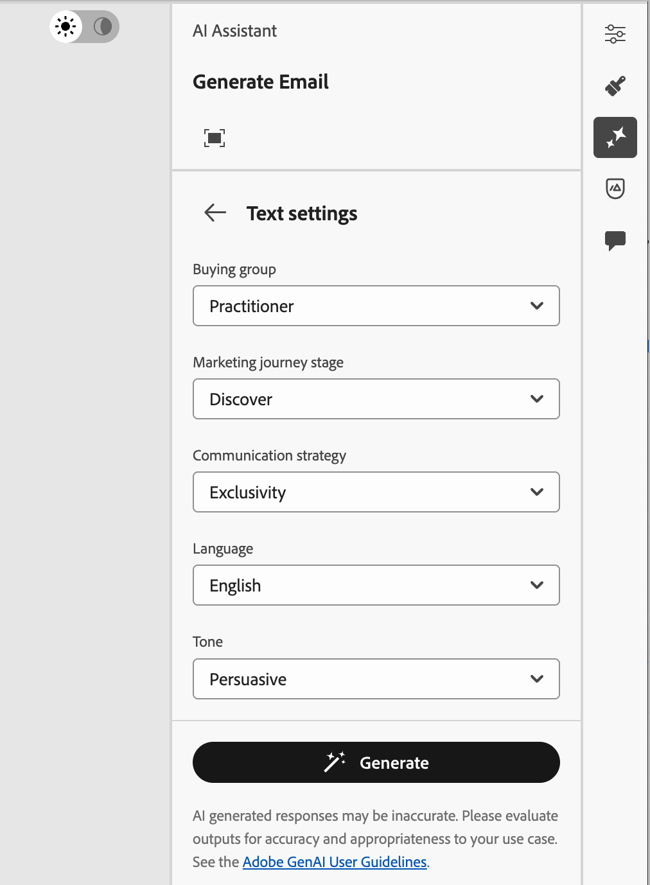
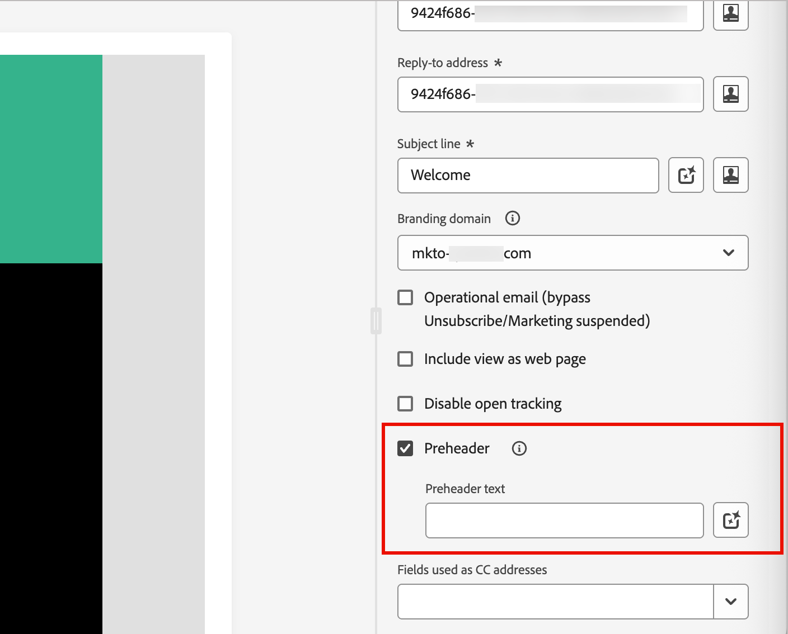
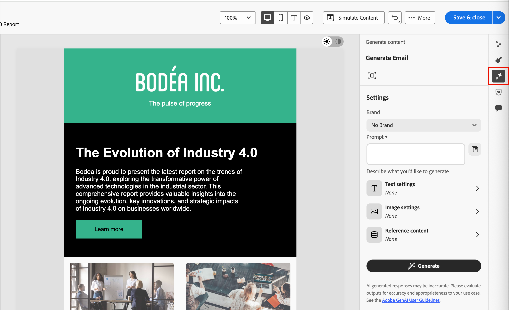
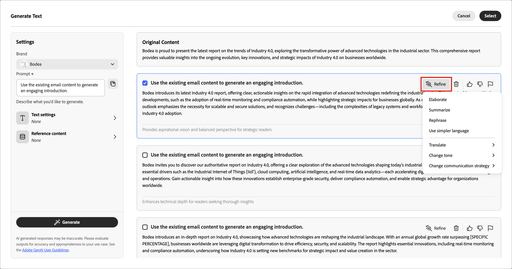
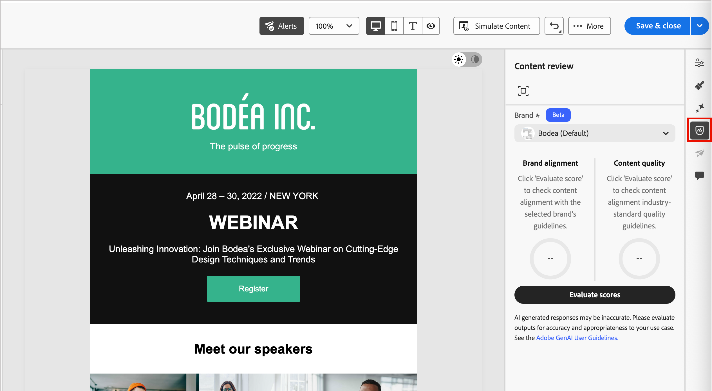

# Generate email content

As the Marketing industry becomes more competitive, brands seek efficient ways to generate impactful content. [!DNL Adobe Journey Optimizer B2B Edition] includes AI-powered content generation that helps marketers create professional, brand-consistent email content. With advanced generative AI models and deep understanding of brand guidelines, it auto-generates personalized, engaging, and effective content. It uses your marketing objective and optimizes the content for brand outlined styles, layouts, tone, and more. Using these tools makes the creation and execution of email marketing campaigns intuitive, simple, and efficient. Adding this capability to your workflows can save you time, improve efficiency, and drive better results.

This new capability provides prompt-based content generation for full email generation or targeted within email structural components. For images, you can generate new image assets or generate recommendations from within the catalog of images in the input brand asset. You can also use this capability to generate optimal subject lines and preheaders to impact the email open rate.

>[!IMPORTANT]
>
>To access these features in Adobe Journey Optimizer B2B Edition, you must have the _[!UICONTROL AI Assistant]_ > _[!UICONTROL Generate Content]_ permission. For more information about how a product administrator can grant feature permissions, see [Edit roles for product permissions](../admin/user-management.md#edit-roles-for-product-permissions).

## Guidelines and limitations

Before you start using this capability, review the [guidelines and limitations](./generative-ai-content.md#general-guidelines-and-limitations). [User agreement](https://www.adobe.com/legal/licenses-terms/adobe-gen-ai-user-guidelines.html){target="_blank"} acceptance is also required before you can use AI capabilities in [!DNL Journey Optimizer B2B Edition]. For more information, contact your Adobe representative.

Adobe applies [content credentials](https://helpx.adobe.com/firefly/web/get-started/learn-the-basics/content-credentials-overview.html){target="_blank"} to Firefly-generated assets upon download or export to promote transparency.

The following limitations and guidelines apply to email content generation in [!DNL Journey Optimizer B2B Edition]:

* English is the only supported language.
* Generated content might not be accurate &#8212; share your feedback so that Adobe engineers can refine the models.
* You can upload multiple content reference assets, but you can leverage only one for a specific generation.
* Use a brand specific or custom template for generating content for a full email. Email templates with up to 8-10 images are recommended.
* Make sure to report any problematic outputs using the thumb up, thumb down, or flag icons when selecting generated variants.

## Input and settings for content generation

You can generate full content for an email, or for selected components in the email. When you use the content generation tools, you provide prompts, reference content, and settings for text and images.

### Prompts

Use well-defined prompts for the generative AI model to interpret with accuracy. The marketing objective/prompt you provide impacts the quality of the generated content. 

{width="320"}

For more information about creating effective prompts, see _[Prompt best practices](./generative-ai-content.md#generative-ai-prompting-guide)_. 

>[!BEGINSHADEBOX]

#### Prompt Library

An effective prompt is essential for generating the best possible content. If you want assistance with crafting your prompt, click the _Prompt library_  icon to access a library of prompt ideas that are organized according to objectives. Enter text in the search field to find a prompt based on a keyword string.

{width="600" zoomable="no"}

Select the prompt that best reflects your intended goals and click **[!UICONTROL Try this Prompt]**. In the _[!UICONTROL Prompt]_ field, replace placeholders (such as `[Key Feature/Information]`) with your brand, offering, campaign, and use case details.

>[!ENDSHADEBOX]

### Text settings

Expand the **[!UICONTROL Text settings]** in the right panel and set the options for generated text.

* **[!UICONTROL Buying group]** - Choose the [buying group role](../buying-groups/buying-groups-role-templates.md) to use for targeting your messaging. [!DNL Journey Optimizer B2B Edition] offers five standard B2B buying group roles pre-configured. Each buying group role has a distinct messaging focus:

   | Role | Messaging focus |
   | ---- | --------------- |
   | Executive Steering Committee | Product information  Pricing   Technical integration details   Product features and functions |
   | Influencer | Proof of quality  Ease of implementation  Subject matter expertise  Competitive advantages |
   | Decision maker | Return on investment  Financial value (RoI)  Customer stories |
   | Practitioner | Ease of use  Product features and functionality  Product compatibility  Ease of product integration |
   | Champion | Educational content  Thought leadership content  Customer stories |

* **[!UICONTROL Marketing journey stage]** - Choose the [buying group stage](../buying-groups/buying-group-stages.md) to use for targeting the messaging.
* **[!UICONTROL Communication strategy]** - Choose the most suitable communication style for your generated text.
* **[!UICONTROL Language]** - Choose the language of your generated content.
* **[!UICONTROL Tone]** - The tone that resonates with your audience. For example, you can adjust the message to sound informative, playful, or persuasive.

{width="350" zoomable="yes"}

Click the left arrow to return to the main _[!UICONTROL Settings]_.

### Image settings

To include images in your generated content, expand the **[!UICONTROL Image settings]** in the right panel and set the options.

The system disables the **[!UICONTROL Generate images using AI]** option by default. Enable this feature and set the following options to include generated images in the proposed content variations:

* **[!UICONTROL Generative model]**: Select from the ready-to-use Adobe-provided model, the partner model for specialized capabilities, or configured custom models trained on your brand assets. For more information about generative models, see _[Generative AI models for brand alignment](generative-ai-models.md)_.
* **[!UICONTROL Aspect ratio]**: When an image component is selected, this setting determines the width and height of the asset. Choose from common ratios like 16:9, 4:3, 3:2, or 1:1, or enter a custom ratio.
* **[!UICONTROL Content type]**: The type categorizes the nature of the visual element, distinguishing between different forms of visual representation, such as photos, graphics, or art.
* **[!UICONTROL Visual intensity]**: Control the image's impact by adjusting its intensity. A lower setting (such as 2) creates a softer, more restrained appearance, while a higher setting (such as 10) makes the image more vibrant and visually powerful.
* **[!UICONTROL Color and tone]**: The overall appearance of the colors within an image and the mood or atmosphere it conveys.
* **[!UICONTROL Lighting]**: The lighting style used for the image, which shapes its atmosphere and highlights specific elements.
* **[!UICONTROL Composition]**: The arrangement of elements within the frame of an image.

{width="350" zoomable="yes"}

Click the left arrow to return to the main _[!UICONTROL Settings]_.

### Reference content

Upload reference content assets to generate accurate, on-brand content. Otherwise, generated content is based on publicly available information. Reference content serves as the source for content generation and image recommendations. For guidelines and best practices, see _[Optimized reference content](./generative-ai-content.md#reference-content)_.

From the **[!UICONTROL Reference content]** settings, click **[!UICONTROL Upload file]** to add any asset that contains content you want to use for additional context.

{width="350" zoomable="yes"}

The file to upload can be in the following formats: PDF, JPEG, PNG, or ZIP files (containing supported file formats). The maximum size for an uploaded brand asset is 50MB. Larger files or a large number of images can work, but this increases the processing time.

If you want to select a previously uploaded file, expand the **[!UICONTROL Uploaded reference content]** list and enable the asset that you want to use for your content generation.

{width="350" zoomable="yes"}

## Generate email properties

When you [add an email action](./add-email.md#add-an-email-action-node-in-a-journey) to an account journey, you define a set of email properties that are used for sending the email. The generative AI tools can help achieve better email engagement by generating recommended content for the email **_subject line_** and **_preheader_**.

When you create an email from a journey or open an existing email from a journey node, the email preview page is displayed with the _[!UICONTROL Email properties]_ on the right. In the _[!UICONTROL Summary]_ tab, you can use the content generation tools to generate a subject line, preheader, or both.

>[!BEGINTABS]

>[!TAB Subject line generation]

The following steps describe the task sequence for generating an optimized subject line for your email:

1. In the _Summary_ panel with the _Details_ tab selected, scroll down to the **[!UICONTROL Subject line]** field.

1. Click the _Generate content_ icon ( {width="30"} ) at the right of the field.

   {width="600" zoomable="yes"}

   The _[!UICONTROL Generate Subject Line]_ dialog opens with the generation settings for the email subject line. 

1. (Required) In the **[!UICONTROL Prompt]** field, enter a description of what you want to generate.

   Use the [Prompt Library](#prompt-library) if you need some help with crafting an effective prompt.

1. (Optional) To provide additional input for generating the preheader, complete the content guidance settings:

   * [**[!UICONTROL Text settings]**](#text-settings) - Provide guidance for the generated text content.
   * [**[!UICONTROL Reference content]**](#reference-content) - Provide the content asset that serves as the source for content generation.

1. When your prompt and settings are ready, click **[!UICONTROL Generate]**.

   The generated variants are displayed in the dialog.

   {width="600" zoomable="yes"}

1. Scroll the _Generate content_ panel and browse through the generated variations to determine which one is the most suitable. 

   You can [submit feedback](#submit-variation-feedback) for a generated variant by clicking the _Thumbs Up_, _Thumbs Down_, or _Flag_ icon and choosing the reason that best summarizes your feedback.

1. Click the **[!UICONTROL Refine]** option to access additional customization features:

   * **[!UICONTROL Rephrase]** - Rewrite the message while preserving its meaning. This option helps you generate alternative wording or adjust phrasing without changing the core message.
   
   * **[!UICONTROL Use simpler language]** - Simplify the language, ensuring clarity and accessibility for a wider audience.
   
   * **[!UICONTROL Translate]** - Translate the text to another language. (Currently, English is the only supported language. Other languages are planned for future releases.)
   
   * **[!UICONTROL Change tone]** - Adjust the tone of the message to align with your communication style, such as making it more friendly, professional, urgent, or inspirational.
   
   * **[!UICONTROL Change Communication strategy]** - Modify the messaging approach based on your objectives, such as creating urgency, or emphasizing compelling appeal.

   {width="600" zoomable="yes"}

1. Click **[!UICONTROL Select]** to replace the subject line text with the selected variant and return to the email properties.

>[!TAB Preheader generation]

An email preheader is the short summary text that follows the subject line when an email is viewed in the inbox. It is an optional element for an email, but an effective opportunity to improve engagement. The following steps describe the task sequence for generating an optimized preheader for your email:

1. In the _Summary_ panel with the _Details_ tab selected, scroll down and select the **[!UICONTROL Preheader]** checkbox.

   {width="600" zoomable="yes"}

   The _[!UICONTROL Generate Preheader]_ dialog opens with the generation settings for the email preheader.

1. (Required) In the **[!UICONTROL Prompt]** field, enter a description of what you want to generate.

   Use the [Prompt Library](#prompt-library) if you need some help with crafting an effective prompt.

1. (Optional) To provide additional input for generating the preheader, complete the content guidance settings:

   * [**[!UICONTROL Text settings]**](#text-settings) - Provide guidance for the generated text content.
   * [**[!UICONTROL Reference content]**](#reference-content) - Provide the content asset that serves as the source for content generation. 

1. When your prompt and settings are ready, click **[!UICONTROL Generate]**.

   The generated variants are displayed in the dialog.

   {width="600" zoomable="yes"}

1. Scroll down the _Generate content_ panel and browse through the generated variations to determine which one is the most suitable. 

   You can [submit feedback](#submit-variation-feedback) for a generated variant by clicking the _Thumbs Up_, _Thumbs Down_, or _Flag_ icon and choosing the reason that best summarizes your feedback.

1. Click the **[!UICONTROL Refine]** option to access additional customization features:

   * **[!UICONTROL Rephrase]** - Rewrite the message while preserving its meaning. This option helps you generate alternative wording or adjust phrasing without changing the core message.
   
   * **[!UICONTROL Use simpler language]** - Simplify the language, ensuring clarity and accessibility for a wider audience.
   
   * **[!UICONTROL Translate]** - Translate the text to another language. (Currently, English is the only supported language. Other languages are planned for future releases.)
   
   * **[!UICONTROL Change tone]** - Adjust the tone of the message to align with your communication style, such as making it more friendly, professional, urgent, or inspirational.
   
   * **[!UICONTROL Change Communication strategy]** - Modify the messaging approach based on your objectives, such as creating urgency, or emphasizing exciting appeal.

   {width="500" zoomable="yes"}

1. Click **[!UICONTROL Select]** to replace the preheader with the selected variant and return to the email properties.

>[!ENDTABS]

## Generate email body content {#generative-ai-email-design}

After you [create and personalize your email](./email-authoring.md), use Adobe's generative AI tools to improve your email body content.

In the email design space, generative AI tools can help you optimize the impact of your deliveries by generating the full email body, targeted text content, and images that resonate with your audience. This optimization of your email campaigns is designed to produce better engagement. Select the _Generate content_ ( {width="25" zoomable="no"} ) to display the content generation tools that are available for the current content selection.

{width="600" zoomable="yes"}

Use the following steps according to the type of email content generation that you want to use:

>[!BEGINTABS]

>[!TAB Full email generation]

To generate a full email by refining an existing email template, follow these steps:

1. After [creating the email](./add-email.md), click **[!UICONTROL Edit email content]**.

1. Select a template.

   Full content generation requires a template. It can be a standard template provided by Adobe, or a saved template. You can also use the _[!UICONTROL Import HTML]_ option to import a template.

   For more information about using an email template, see _[Select a template](./email-authoring.md#select-a-template)_. 

1. In the email design space, click the _Generate content_ ( {width="25"} ) icon at the right.

   The settings on the right reflect _Generate Email_.

   {width="600" zoomable="yes"}

1. Select your **[!UICONTROL Brand]** to ensure that the AI-generated content aligns with your brand specifications.

   If there are no published brands, click **[!UICONTROL Create a brand]** to define your [reusable brand guidelines](./brands-overview.md).

1. In the **[!UICONTROL Prompt]** field, enter a description of what you want to generate.

   Use the [Prompt Library](#prompt-library) if you need some help with crafting an effective prompt.

   >[!TIP]
   >
   >If you are new to prompting for generated content, review the _[Prompting best practices](./generative-ai-content.md#generative-ai-prompting-guide)_.

1. To tailor the generated content, complete the content guidance settings:

   * [**[!UICONTROL Text settings]**](#text-settings) - Provide guidance for the generated text content.
   * [**[!UICONTROL Image settings]**](#image-settings) - If you want to include images in the generated content, enable image generation and provide guidance. 
   * [**[!UICONTROL Reference content]**](#reference-content) - Provide the content asset that serves as the source for content generation. 

1. When your prompt and settings are ready, click **[!UICONTROL Generate]**.

   The generated variations are displayed in the right panel.

1. Browse through the generated variations or click the _Full screen_ (  ) icon to open the _[!UICONTROL Generate Email]_ dialog.

   The dialog provides additional space to compare the variations, adjust your text and reference content settings (if needed), and regenerate the variations.

   You can also fine-tune a variation by applying refinement actions and submit feedback for the generated variations. See _[Preview and content refinement](#refine-finalize)_ for more details about variation refinement and feedback.

   {width="700" zoomable="yes"}

1. Click **[!UICONTROL Select]** to replace the template contents with the selected variant and return to the email design space.

   You can use the editing and formatting tools on the canvas to alter the generated content, as well as the _[!UICONTROL Settings]_ and _[!UICONTROL Style]_ options on the right.

>[!TAB Text only]

To refine or enhance the text content for an existing email, follow these steps:

1. In the email design space, select a _Text_ component to target the specific content.

1. On the outer rail of the right panel, select the _Generate content_ ( {width="25"} ) icon.

   The settings on the right reflect the content generation settings for the text component.

1. Select your **[!UICONTROL Brand]** to ensure that the AI-generated content aligns with your brand specifications.

   If there are no published brands, click **[!UICONTROL Create a brand]** to [define your reusable brand guidelines](./brands-overview.md).

1. In the **[!UICONTROL Prompt]** field, enter a description of what you want to generate.

   {width="600" zoomable="yes"}

   Use the [Prompt Library](#prompt-library) if you need some help with crafting an effective prompt.

1. To tailor the generated content, complete the content guidance settings:

   * [**[!UICONTROL Text settings]**](#text-settings) - Provide guidance for the generated text content.

   * [**[!UICONTROL Reference content]**](#reference-content) - Provide the content assets that serve as the source for content generation. 

1. When your prompt and settings are ready, click **[!UICONTROL Generate]**. 

1. Browse through the generated variations or click the _Full screen_ (  ) icon to open the _[!UICONTROL Generate Text]_ dialog.

   The dialog provides additional space to compare the variations, adjust your text and reference content settings (if needed), and to regenerate the variations.

   You can also fine-tune a variation by applying refinement actions and submit feedback for the generated variations. See _[Preview and content refinement](#preview-and-refine-the-content)_ for more details about variation refinement and feedback.

   {width="700" zoomable="yes"}

1. When you have the content that you want, click **[!UICONTROL Select]** to replace the text with the selected variant and return to the email design space.

   You can use the editing and formatting tools on the canvas to alter the text, as well as the _[!UICONTROL Settings]_ and _[!UICONTROL Style]_ options on the right.

>[!TAB Image only]

To refine or enhance the image content for an existing email, follow these steps:

1. In the email design space, select an _Image_ component to target the specific content.

1. On the outer rail of the right panel, select the _Generate content_ ( {width="25"} ) icon.

   The settings on the right reflect the generation settings for the image component.

1. Select your **[!UICONTROL Brand]** to ensure that the AI-generated content aligns with your brand specifications.

   If there are no published brands, click **[!UICONTROL Create a brand]** to [define your reusable brand guidelines](./brands-overview.md). 

1. Enter a description of what you want in the **[!UICONTROL Prompt]** field.

   {width="600" zoomable="yes"}

   Use the [Prompt Library](#prompt-library) if you need some help with crafting an effective prompt.

1. To tailor the generated content, complete the content guidance settings:

   * [**[!UICONTROL Image settings]**](#image-settings) - If you want to include images in the generated content, enable image generation and use the guidance settings.

   * [**[!UICONTROL Reference content]**](#reference-content) - Provide the content assets that serve as the source for content generation. 

1. When you are satisfied with your prompt and settings, click **[!UICONTROL Generate]**.

   The system processes the request and generates the best suited images based on the prompt and other inputs.

   >[!IMPORTANT]
   >
   >If there are no images in the reference content or there are no images relevant to the input prompt, the output is empty.

1. Browse through the generated variations or click the _Full screen_ (  ) icon to open the _[!UICONTROL Generate Image]_ dialog.

   The dialog provides additional space to compare the variations, adjust your image and reference content settings (if needed), and regenerate the variations.

   You can select a variation and click **[!UICONTROL Generate Similar]** to generate additional images that are similar to the selected variant. Or, click **[!UICONTROL Edit in Adobe Express]** to make your own changes to the image. See [Quick actions in Adobe Express](./image-edit-adobe-express.md#quick-actions-in-adobe-express) for more information about using Adobe Express to refine your images.

   {width="700" zoomable="yes"}

   You can also [submit feedback](#submit-variation-feedback) for the generated variations.

1. Highlight the image that you want and click **[!UICONTROL Select]** to replace the image or placeholder with the selected item and return to the email design space.

   You can use the editing and formatting tools on the canvas to alter the image, as well as the _[!UICONTROL Settings]_ and _[!UICONTROL Style]_ options on the right.

>[!ENDTABS]

## Preview and refine the content {#refine-finalize}

After generating content variations, you can fine-tune the results to ensure that they meet your exact requirements. Review the brand alignment, adjust tone and language, and prepare the content for a reviewable draft. You can also submit feedback for a variation to help train the generative AI tools and improve future output.

### Open the full screen view

1. After the initial content generation, browse through the **[!UICONTROL Variations]**.

1. Identify the variation that is the best match for your goals and click the _Full screen_ (  ) icon to view the selected variation in more depth.

   {width="700" zoomable="yes"} 

1. When you are satisfied with the selected variation, click **[!UICONTROL Select]** to apply it to your canvas.

### Refine a variation

Click the **[!UICONTROL Refine]** option to access additional customization features for email and text variations:

* **[!UICONTROL Elaborate]** - Expand on specific topics, providing additional details for better understanding and engagement.

* **[!UICONTROL Summarize]** - Lengthy information can overwhelm readers. Use this option to condense key points into clear, concise summaries that attract attention and encourage readers to read further.

* **[!UICONTROL Rephrase]** - Rewrite the message while preserving its meaning. This option helps you generate alternative wording, improve flow, or adjust phrasing without changing the core message.

* **[!UICONTROL Use simpler language]** - Simplify the language, ensuring clarity and accessibility for a wider audience.

* **[!UICONTROL Translate]** - Translate the text to another language. (Currently, English is the only supported language. Other languages are planned for future releases.)

* **[!UICONTROL Change tone]** - Adjust the tone of the message to align with your communication style, such as making it more friendly, professional, urgent, or inspirational.

* **[!UICONTROL Change Communication strategy]** - Modify the messaging approach based on your objectives, such as creating urgency, or emphasizing exciting appeal.

<!-- is this option coming back? * **[!UICONTROL Use as reference content]** - Select this option to use the variant as the reference content for generating other results. -->

{width="700" zoomable="yes"}

### Submit variation feedback

Provide feedback for the generated variants by clicking the _Thumbs Up_, _Thumbs Down_, or _Flag_ icon and choosing the reason that best summarizes your feedback. 

{width="700" zoomable="yes"}

### Check your brand alignment (Beta)

<!-- Are we surfacing scoring here in the future, or will it be a separate post-creation task? 1. Click the percentage icon to view your **[!UICONTROL Brand Alignment Score]** and identify any misalignments with your brand. -->

The brand alignment evaluation and scoring help you to ensure consistency in tone, messaging, and visual identity across your email campaigns, while also serving as a quality check before your content goes live. When the email content is complete, click the _Brand alignment_ (  ) icon on the right to open the _Brand alignment_ right panel in the email design space.

{width="600" zoomable="yes"}

For detailed information, see [_Brand alignment score_](./content-evaluation.md#brand-alignment-score)
