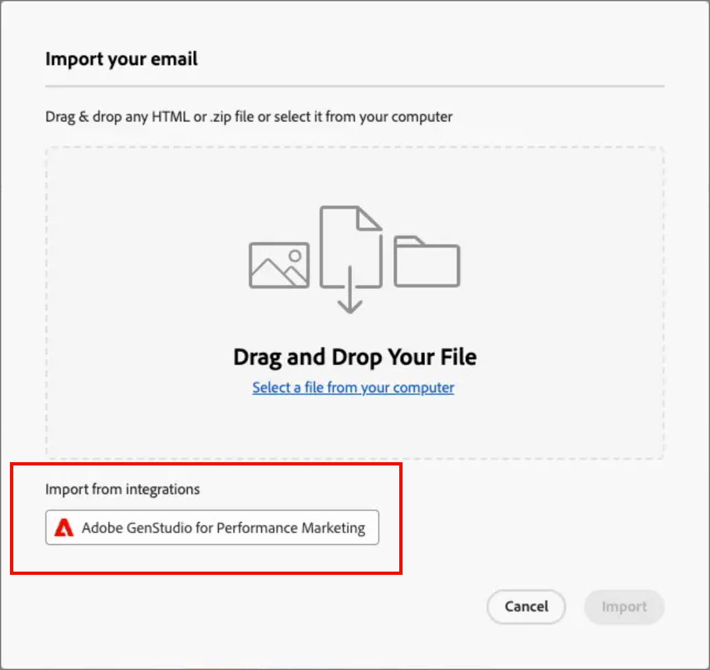

# Email content creation with GenStudio for Performance Marketing {#genstudio-workflow}

>[!CONTEXTUALHELP]
>id="ajo-b2b_genstudio_button"
>title="Use a template built with GenStudio"
>abstract="Use the integration with Adobe GenStudio for Performance Marketing to import a GenStudio template enhanced with the Adobe AI technology."

>[!AVAILABILITY]
>
>The GenStudio integration in [!DNL Adobe Journey Optimizer B2B Edition] is currently unavailable for use with the **Healthcare Shield** or **Privacy and Security Shield** add-on offerings.
>
>This integration is available for the email channel only.

To enhance workflow efficiency and maintain brand consistency, you can combine GenStudio for Performance Marketing experiences with Adobe Journey Optimizer B2B Edition email orchestration. This expanded workflow enables you to leverage the AI-power content creation tools in GenStudio to expand and maximize email communications through account journeys.

For example, a technical marketer who uses Journey Optimizer B2B Edition to develop and automate email communications to key accounts can collaborate with a performance marketer who creates content using GenStudio. With this workflow, both can work together to combine on-brand content from GenStudio into Journey Optimizer B2B Edition account-based marketing automation, delivering engaging emails that target specific buying groups and drive sales.

>[!BEGINSHADEBOX]

## GenStudio content generation capabilities

[Adobe GenStudio for Performance Marketing](https://business.adobe.com/products/genstudio-for-performance-marketing.html){target="_blank"} is a generative AI-first application that empowers marketing teams to create impactful, personalized ads and emails that adhere to brand standards and comply with their enterprise policies. By leveraging Adobe AI technology, it provides a comprehensive suite of tools that simplify the complexities of content creation and management so that creatives can focus on innovation.

{width="30"} [Create on-brand marketing emails](https://experienceleague.adobe.com/en/docs/genstudio-for-performance-marketing-learn/tutorials/creating-experiences/creating-on-brand-emails){target="_blank"}

Learn more about the GenStudio for Performance Marketing capabilities in the [documentation](https://experienceleague.adobe.com/en/docs/genstudio-for-performance-marketing/user-guide/home){target="_blank"}

>[!ENDSHADEBOX]

## Export HTML from Journey Optimizer B2B Edition

First, in Journey Optimizer B2B Edition, export HTML from an email that includes your brand's guidelines.

1. In Journey Optimizer B2B Edition, access the content of your email in the visual design space.

1. From the _[!UICONTROL More ...]_ menu at the top of the email design space, choose **[!UICONTROL Export HTML]**.

   {width="600"}

   This action generates a downloaded .zip file that contains the HTML and image files.

## Use the exported HTML in GenStudio for Performance Marketing

GenStudio for Performance Marketing recognizes certain elements within the imported email HTML when they are identified with a recognized field name. Add field names in the exported HTML using the Handlebars syntax where you need GenStudio for Performance Marketing to generate a certain type of content.

| Field             | Content type              |
| ----------------- | ------------------------- |
| `{{pre_header}}`  | Preheader                 |
| `{{headline}}`    | Headline                  |
| `{{sub_headline}}`| Sub-Headline              |
| `{{body}}`        | Body text                 |
| `{{cta}}`         | Call to action (button)   |
| `{{image}}`       | Image                     |
| `{{link}}`        | Call to action on image   |

### Create the template

Use the HTML file to create a template in GenStudio for Performance Marketing.

For detailed information about uploading an HTML template into GenStudio in the Adobe GenStudio for Performance Marketing, refer to [Add a template](https://experienceleague.adobe.com/en/docs/genstudio-for-performance-marketing/user-guide/content/templates/use-templates#add-a-template) in the GenStudio for Performance Marketing documentation.

When you upload the exported HTML as a template, GenStudio for Performance Marketing scans the HTML file for recognized fields. Use the preview to review your template elements and confirm that you identified them properly with the recognized field names.

### Generate email experiences

In GenStudio for Performance Marketing, use the template to create several email experience variations and save them.

For detailed information about generating branded email experiences, refer to [Create an email experience](https://experienceleague.adobe.com/en/docs/genstudio-for-performance-marketing/user-guide/create/create-email-experience) in the GenStudio for Performance Marketing documentation.

## Add generated email experiences to Journey Optimizer B2B Edition

>[!NOTE]
>
>The GenStudio for Performance Marketing integration is available only for email creation and is not available for creating an email template.

To use the GenStudio email variations created from the exported Journey Optimizer B2B Edition email HTML file, follow these steps:

1. In Journey Optimizer B2B Edition, [add an email](./add-email.md) to an account journey using a _[!UICONTROL Take an action]_ node.

   * For the _[!UICONTROL Action on]_ target, choose **[!UICONTROL People]**.

   * For the _[!UICONTROL Action on people]_, choose **[!UICONTROL Send email]**.

     {width="700" zoomable="yes"}

   * For the _[!UICONTROL Email source]_, choose **[!UICONTROL Create new email]** to create the email natively in Journey Optimizer B2B Edition. 

1. On the _Create your Email_ page, select **[!UICONTROL Import HTML]**.

1. In the _[!UICONTROL Import your email]_ dialog, click **[!UICONTROL Adobe GenStudio for Performance Marketing]**.

   {width="500" zoomable="yes"}

1. Browse the published experiences.

   You can filter the experiences on several criteria, such as _Template_ and _Created by_.

   {width="600" zoomable="yes"}

1. Select an experience and click **[!UICONTROL Use]** to start building your email content.

   >[!NOTE]
   >
   >GenStudio experiences created from a Journey Optimizer B2B Edition or Marketo Engage template are imported directly into the email design space. Experiences that are created without a Journey Optimizer B2B Edition template are imported into compatibility mode.

1. Use the [email content and personalization tools](./email-authoring.md) to edit your email as needed and save it.

   {width="800" zoomable="yes"}
