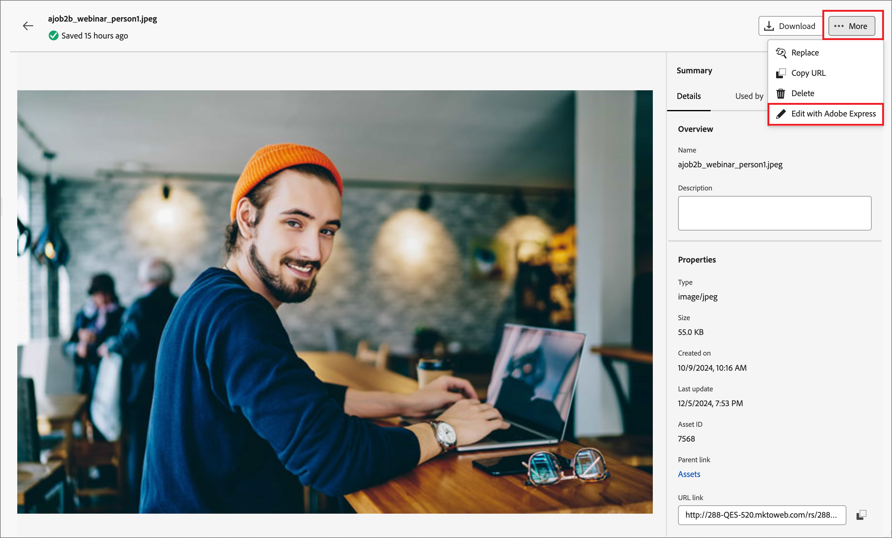
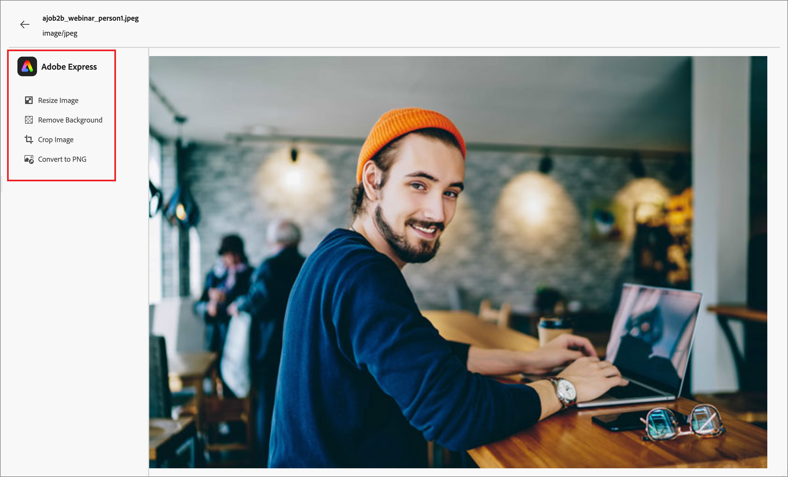
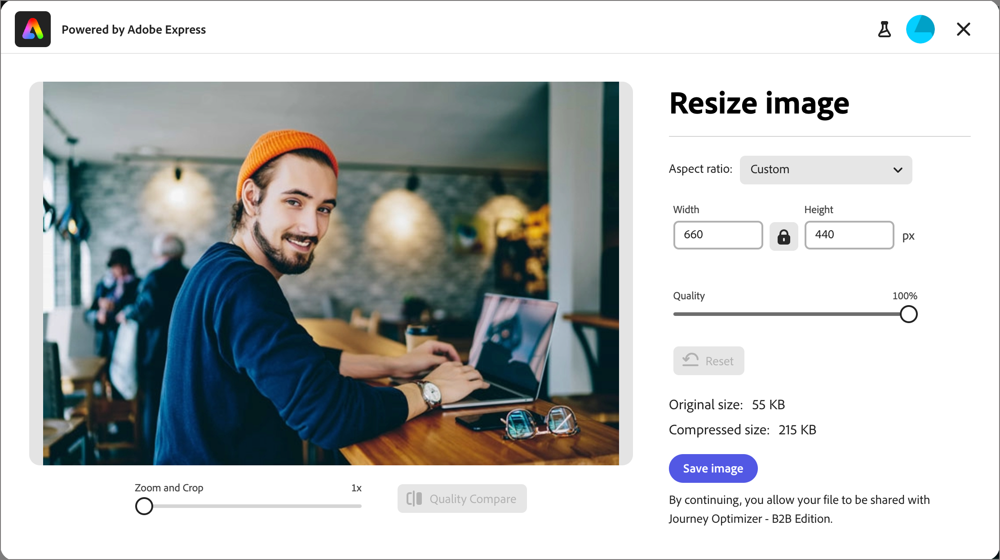
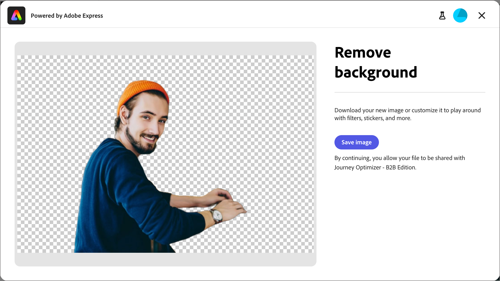
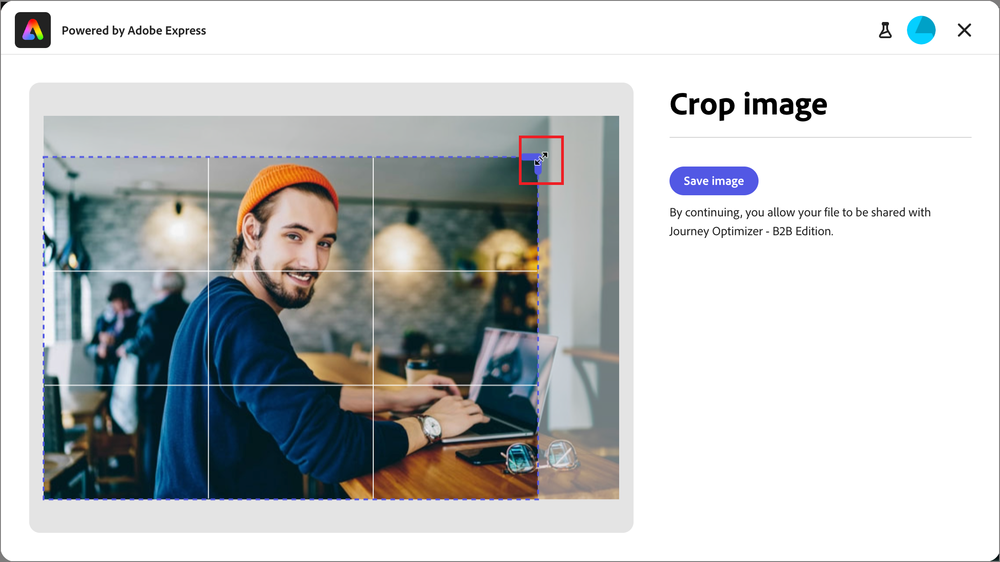
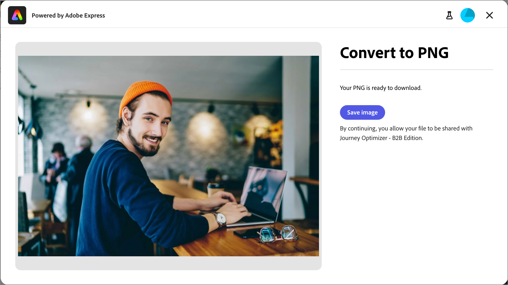
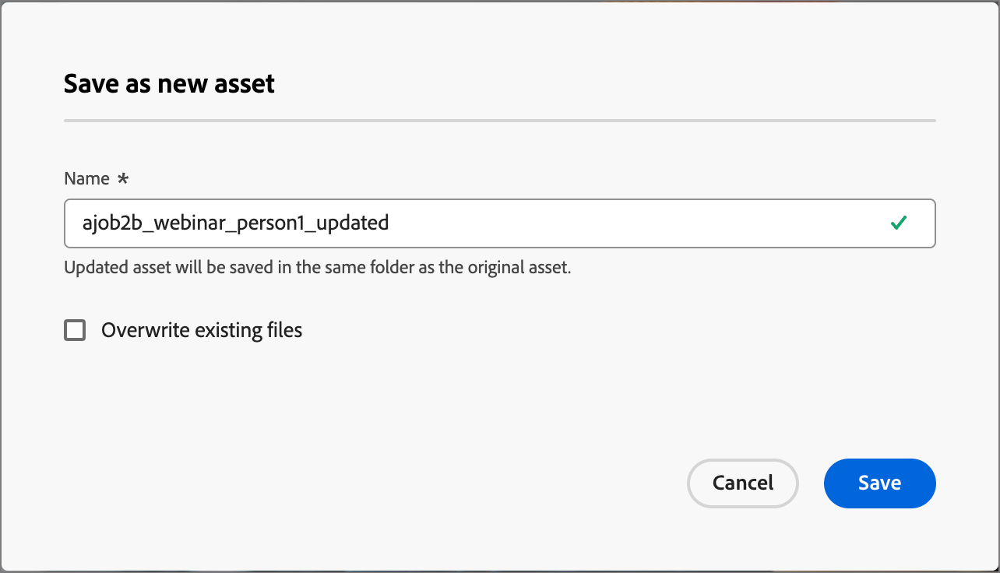

# Edit images with Adobe Express {#edit-images-adobe-express}

>[!CONTEXTUALHELP]
>id="ajo-b2b_assets_edit_adobe_express"
>title="Edit Images in Adobe Express"
>abstract="Easy and intuitive image-editing tools, powered by Adobe Express, are available directly within Adobe Journey Optimizer B2B Edition to increase content velocity."

Adobe Journey Optimizer B2B Edition integrates natively with Adobe Express, and enables you to access a set of Adobe Express image editing tools. You can use these tools to modify the images stored in the Journey Optimizer B2B Edition workspace for the connected Marketo Engage asset repository. The integration provides the following key benefits:

* Increased content reuse by editing and saving new image assets in Journey Optimizer B2B Edition.

* Reduced time and effort to update image assets or create new versions of existing image assets.

>[!NOTE]
>
>Entitlements for Adobe Express editing features are included with all Journey Optimizer B2B Edition subscriptions. Using the image editing capabilities requires enablement for your organization by an administrator.

The Adobe Express functions support PNG and JPEG image file formats.

_To modify an image:_

1. Go to the left navigation and click **[!UICONTROL Content Management]** > **[!UICONTROL Assets]**.

  This action opens a listing page with all the assets listed. The _[!UICONTROL Journey Optimizer B2B Edition]_ workspace is selected by default.

1. Locate the image that you want to modify or use as an original to create a new asset.

   * To view the assets by workspace and folder, open the structure by clicking the _Show Folders_ icon at the top left.

   * To sort the table by any of the columns, click the column title. The arrow in the title row indicates the current sort column and order.

   * To search for an image asset within the selected workspace or folder, enter a text string in the search bar.

   {width="800" zoomable="yes"}

1. Click the name of the image asset to open it and view its details.

   >[!TIP]
   >
   >It is a best practice to select [the _[!UICONTROL Used By]_ tab](./marketo-engage-design-studio.md#view-asset-used-by-references) in the image details to review the content where the image is currently used before you proceed to make edits to the image file.

1. Click the **[!UICONTROL More]** menu at the top right and choose **[!UICONTROL Edit with Adobe Express]**.

    {width="600" zoomable="yes"}

    This action opens the Adobe Express editor, with a list of available capabilities displayed on the left.

1. Select any of the image modification functions to alter the image.

    {width="600" zoomable="yes"}    

    * [**[!UICONTROL Resize image]**](#resize-image)
    * [**[!UICONTROL Remove background]**](#remove-background)
    * [**[!UICONTROL Crop image]**](#crop-image)
    * [**[!UICONTROL Convert to PNG]**](#convert-file-format) (when a JPEG image is loaded)
    * [**[!UICONTROL Convert to JPEG]**](#convert-file-format) (when a PNG image is loaded)

1. When you return to the main Adobe Express editor, make sure to click **[!UICONTROL Save]** again to save the modified image file in the Journey Optimizer B2B Edition asset workspace using the same file name.

   If you want to save the modified version as a new image, click **[!UICONTROL Save as New Asset]**.

## Resize image

1. Use the resize settings to reduce or expand the image:

   * Select an **[!UICONTROL Aspect ratio]** option. Use a standard size for digital content or choose **[!UICONTROL Custom]** if you want to enter values for **[!UICONTROL Width]** and **[!UICONTROL Height]** to meet your needs.

   * Drag the **[!UICONTROL Quality]** scale slider as needed. The resulting image size is displayed according to the quality level. You can click **[!UICONTROL Quality Compare]** below the image to toggle the display between the original and quality adjusted. The **[!UICONTROL Zoom and Crop]** tool allows you to inspect parts of the displayed image more closely.

   * If you want to return the image to its original state, click Reset.

   {width="600" zoomable="yes"}

1. When you are satisfied with the result, click **[!UICONTROL Save image]**.

## Remove background

{width="600" zoomable="yes"}

Adobe Express performs an automatic background removal to isolate the primary object in the image. If you are satisfied with the result, click **[!UICONTROL Save image]**.

## Crop image

1. Drag the handles on the corners of the image to remove the outer areas that you do not want to include in the image asset.

   {width="600" zoomable="yes"}

1. When you are satisfied with the result, click **[!UICONTROL Save image]**.

## Convert file format

* **[!UICONTROL Convert to JPEG]** - For a PNG image, you can convert the image to a JPEG image file and save it as a new asset in the workspace. 
* **[!UICONTROL Convert to PNG]** - For a JPEG image, you can convert the image to a PNG image file and save it as a new asset in the workspace. 

{width="600" zoomable="yes"}   

1. Click **[!UICONTROL Save image]**.

1. When you return to the main Adobe Express editor, click **[!UICONTROL Save as New Asset]**.

1. In the _[!UICONTROL Save as new asset]_ dialog, change the populated name as needed and click **[!UICONTROL Save]**.

   {width="400"}   

   The **[!UICONTROL Name]** field is populated using the original file name appended with `_updated`.
   
   If you enter a file name that is not unique to the folder, select **[!UICONTROL Overwrite existing files]**.
