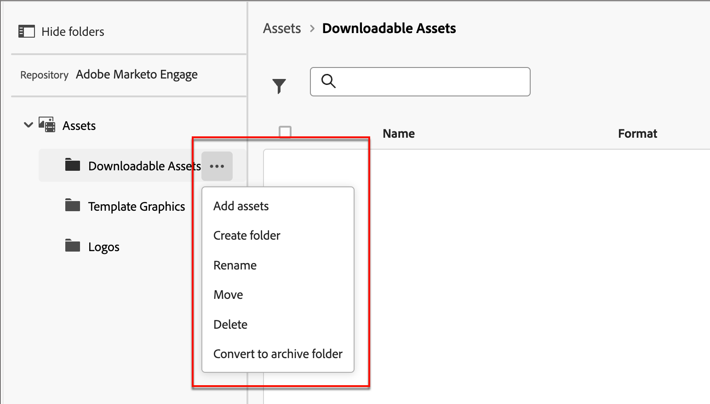

# Work with internal image assets

The internal image asset repository is the default asset source for designing content, and you can easily manage and use the available assets to design content that supports your account journeys.

You have the full range of asset management functions in Journey Optimizer B2B Edition. These functions include:

* [Replace](#replace-assets)
* [Delete](#delete-assets)
* [Move](#create-a-folder)
* [Edit with Adobe Express](./image-edit-adobe-express.md)

## Browse and access assets

To access internal assets in Journey Optimizer B2B Edition, go to the left navigation and click **[!UICONTROL Content Management]** > **[!UICONTROL Assets]**. This action opens a listing page with all the assets listed.

{width="800" zoomable="yes"}

* To view the assets by folder, open the structure by clicking the _Show Folders_ icon on the top left.

* To sort the table by any of the columns, click the column title. The arrow in the title row indicates the current sort column and order.

* To search for an image asset within the selected folder, enter a text string in the search bar.

* To customize the columns that are displayed in the table, click the _Customize table_ icon (  ) on the top right.

   Select the columns that you want to display in the listing and click **[!UICONTROL Apply]**.

## View asset details

Click the name of any asset to open the asset details page.

{width="700" zoomable="yes"}

## View asset used-by references

Within the asset details page, click the **[!UICONTROL Used By]** tab to view details of where the asset is currently used within Journey Optimizer B2B Edition, across emails, email templates, and fragments.

>[!IMPORTANT]
>
>Any asset that is currently _IN USE_ in any of the emails, email templates, or fragments **cannot** be deleted.

The panel displays the references by category: _Email_, _Email template_, or _Fragment_. Emails in Journey Optimizer B2B Edition are embedded and authored within journeys, so the parent journey of the email that uses the asset is displayed in references.

Clicking the link directs you to the corresponding email, email template, or fragment where the asset is used.

{width="700" zoomable="yes"}

## Add assets

From the _Assets_ list page, you can add image assets to the Journey Optimizer B2B Edition asset repository. 

1. Click **[!UICONTROL Add Assets]** at the top right. 

1. In the _[!UICONTROL Add assets]_ dialog, drag and drop one or more files from your system to the file box.

   {width="500"}

   You can also click the _[!UICONTROL Select a file from your computer]_ link to use your local file system to find and select files. 

   You can upload assets from your local system of up to 10 files at a time. The maximum file size is 100 MB.

   The file names of the selected images are displayed in the dialog. Asset file names must be unique (across folders), and if a file with the name already exists, a message is displayed. Names can have a maximum of 100 characters, and cannot contain special characters (such as `;`, `:`, `\`, and `|`). 

1. Select the destination folder to store the assets.

1. To overwrite (replace) files when you upload one or more files with an existing file name, select the **[!UICONTROL Overwrite existing files]** checkbox.

1. Click **[!UICONTROL Add]**.

## Delete assets

Any asset that is currently in use in any of the emails, email templates, or fragments cannot be deleted. Check the used-by references before initiating an asset removal. Also, a delete action cannot be undone, so check before initiating a removal action.

Use either of the following methods to delete an asset:

* Go to the asset details, click **[!UICONTROL ... More]** at the top right, and choose **[!UICONTROL Delete]** from the options.

   {width="600" zoomable="yes"}

* On the _[!UICONTROL Assets]_ listing page, click the _More_ icon (**[!UICONTROL ...]**) next to the asset item and choose **[!UICONTROL Delete]** from the options.

   {width="600" zoomable="yes"}

This action opens a confirmation dialog. You can abort the process by clicking **[!UICONTROL Cancel]**, or click **[!UICONTROL Delete]** to confirm deletion.

If the asset is currently in use, the action opens an informational dialog that alerts you that it cannot be deleted. Click **[!UICONTROL OK]**, which aborts the removal.

## Replace assets

Use either of the following methods to replace an asset residing in the _[!UICONTROL Journey Optimizer B2B Edition]_ asset repository:

* Go to the asset details, click **[!UICONTROL ... More]** at the top right, and choose **[!UICONTROL Replace]** from the options.

* On the _[!UICONTROL Assets]_ listing page, click the _More_ icon (**[!UICONTROL ...]**) next to the asset item and choose **[!UICONTROL Replace]** from the options.

In the _[!UICONTROL Replace asset]_ dialog, drag and drop the replacement file from your system to the file box. You can also click the _[!UICONTROL Select a file from your computer]_ link to use your local file system to select a file. (If you select multiple files in your local system, the first file selected is used for the replacement.)

{width="500"}

To proceed, click **[!UICONTROL Replace]**. You can abort the process by clicking **[!UICONTROL Cancel]**. 

If the file to be replaced is in use, a dialog alerts you that the new image file replaces the image where it is used (emails, email templates and fragments).

## Download assets

You can download an asset using either of the following methods:

* Go to the asset details and click **[!UICONTROL Download]** at the top right.

* On the _[!UICONTROL Assets]_ listing page, click the _Ellipsis_ (**[!UICONTROL ...]**) next to the asset item and choose **[!UICONTROL Download]** from the options.

In the confirmation dialog, click **[!UICONTROL Download]** to initiate downloading the asset to your local system. You can abort the process by clicking **[!UICONTROL Cancel]**.

## Apply bulk actions on selected assets

From the listing page (_[!UICONTROL Content Management]_ > _[!UICONTROL Assets]_), select multiple assets at a time by selecting each checkbox to the left. A message banner appears at the bottom when you select multiple assets.

{width="700" zoomable="yes"}

You can take the following bulk actions for selected assets residing in the _[!UICONTROL Journey Optimizer B2B Edition]_ asset repository:

+++Move assets

1. On the selection banner, click **[!UICONTROL Move]**.

   This action opens the _[!UICONTROL Move Assets]_ dialog, which lists the names of the selected assets and allows you to select the _target_ folder where you want to move these assets. 

1. Select a folder.

   The path next to _[!UICONTROL Selected assets will move to:]_ reflects the change. 
   
1. Click **[!UICONTROL Move]**.

+++

+++Delete assets

>[!NOTE]
>
>You can apply a bulk delete for a maximum of 20 selected assets.

1. On the selection banner, click **[!UICONTROL Delete]**.

1. In the confirmation dialog, click **[!UICONTROL Delete]**.

   If any of the selected assets are currently in use, the removal of that asset is aborted and an alert message is displayed.

+++

## Create a folder

1. On the _[!UICONTROL Assets]_ listing page, click **[!UICONTROL Create Folder]** at the top right.

1. In the dialog, enter the folder name and select the destination (parent) folder for the new folder.

   Folder names must be unique, with a maximum of 100 characters, and cannot contain special characters, such as `;`, `:`, `\`, `|`.

    {width="500"}

1. Click **[!UICONTROL Add]**.

## Apply folder-level actions

You can apply actions to a folder or assets within the folder. Click the _More_ icon (**...**) next to the folder to reveal the actions that you can apply to it.

{width="700" zoomable="yes"}

You can take the following actions at the folder level:

+++Add assets

1. Choose **[!UICONTROL Add assets]** to upload image files to the folder.

1. In the _[!UICONTROL Add assets]_ dialog, drag and drop the files from your system. You can also click the link to use your file system to select the files.

   You can add assets from your local system of up to 10 files at a time. You have the option to overwrite files when you upload one or more files with an existing file name.

   The file names of the selected images are displayed in the dialog. Asset file names must be unique (across folders), and if a file with the name already exists an error message is displayed. Names can have a maximum of 100 characters, and cannot contain special characters (such as `;`, `:`, `\`, and `|`).

1. Click **[!UICONTROL Add]**.

+++

+++Create a sub-folder

1. Choose **[!UICONTROL Create folder]**.

1. In the dialog, enter the folder name.

   Folder names must be unique, with a maximum of 100 characters, and cannot contain special characters, such as `;`, `:`, `\`, `|`.

1. Click **[!UICONTROL Add]**.

+++

+++Rename the folder

1. Choose **[!UICONTROL Rename]**.

1. In the dialog, enter the new folder name.

   Folder names must be unique, with a maximum of 100 characters, and cannot contain special characters, such as `;`, `:`, `\`, `|`.
   
1. Click **[!UICONTROL Save]**.

+++

+++Move the folder

1. To move the folder to another parent folder, choose **[!UICONTROL Move]**.

1. In the dialog, select the target folder as the new parent for the sub-folder.

1. Click **[!UICONTROL Move]**.

   If you try to move a folder into one of its own sub-folders (within the structure of the selected folder), an error message is displayed and the move is canceled.

+++

+++Delete the folder

1. Choose **[!UICONTROL Delete]**.

1. In the confirmation dialog, click **[!UICONTROL Delete]**.

If any of the assets in the folder is currently in use, the action opens an alert dialog to inform you that it cannot be deleted. Click **[!UICONTROL OK]**, which aborts the removal.

+++

+++Convert to an archive folder

Archiving a folder makes the files within it unsearchable. Use the archive function for asset files that you do not want your team member to use going forward, such as an outdated event promotional badge or seasonal content. Later, you can unarchive a folder if you want the content to be available again.

* Choose **[!UICONTROL Convert to archive folder]**. A confirmation banner is displayed to confirm that the folder status is changed to archived. 

* Choose **[!UICONTROL Unarchive folder]**. A confirmation banner is displayed to confirm that the folder status is changed to unarchived.

+++

## Use assets in your content

Assets can be used in your team's email, email template, or visual fragment authoring from the visual content editor.

From the visual design space, select the _Assets_ icon (  ) on the left sidebar.

This action changes the tools panel that displays a list of the available assets. There are multiple methods for adding an image asset to the visual canvas:

* Drag and drop an image thumbnail from the left navigation.

* Add an image component to the canvas and click **[!UICONTROL Select Asset]** in the component to open the _[!UICONTROL Select Asset]_ dialog.

   {width="700" zoomable="yes"}

   From the dialog, you can choose an image from the selected repository. Click **[!UICONTROL Select]** to add the asset.
   
   There are tools available to help you locate the asset that you need: 

   * Click the _Filter_ icon on the top left to filter the displayed items according to your criteria.

   * Enter text in the _Search_ field to filter the displayed items for a match of the asset name.

   {width="700" zoomable="yes"}
