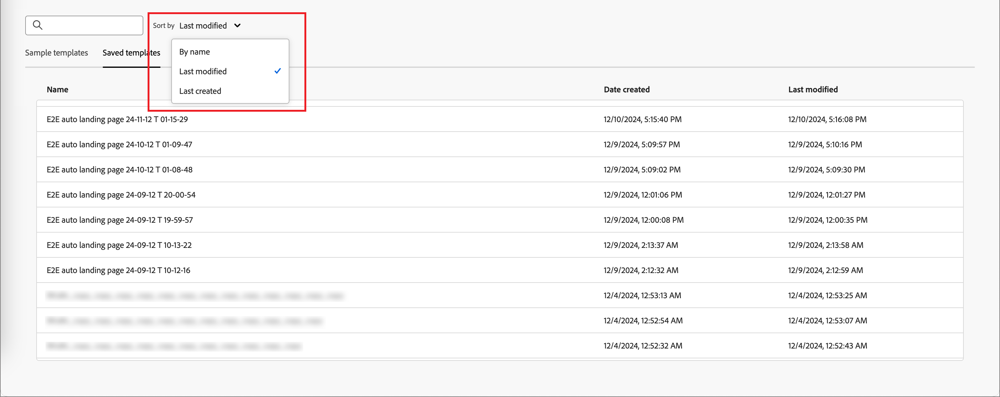
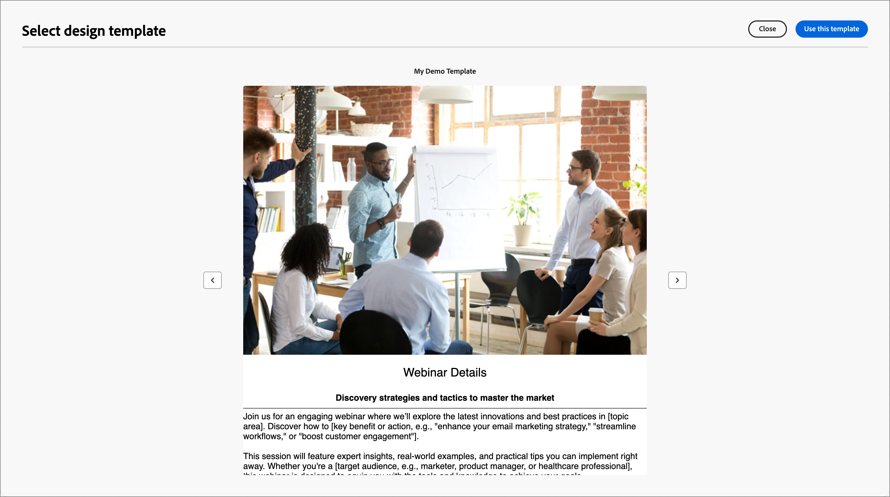
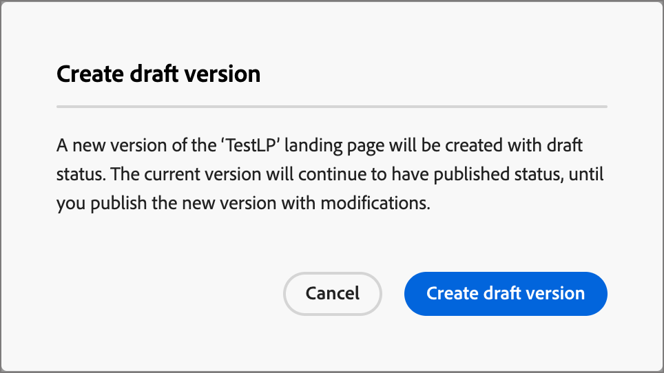

# Landing pages

A landing page is a standalone web page where you can direct contacts and customers after they click a linked item in an email, SMS message, or any digital location. You can incorporate these pages into your account journeys to get your prospects and customers to view your messages on the web and progress along in your account journeys. You can create, personalize, and preview landing pages in the landing page visual design space.

To direct your customers to a defined web page when they click a specific link, create a landing page in Journey Optimizer B2B Edition. 

* Create the page
* Design the landing page and author content
* Test the page
* Publish the page
* Link to the page from your journey content

For example, you can create and design landing pages to direct your users to online information. The page could include a form where they can opt in or opt out from receiving your communications. Or it could be an opportunity to subscribe to a recurring communications, such as a newsletter. 

You can create, personalize, and preview landing pages in the visual design space.
<!-- 
For the Beta phase, you can only design landing pages from scratch and publish your landing pages. The landing pages will be served on adobe hosted domain for the Beta phase. The capability to define your branded domains for hosting will be delivered in a future release. -->

## Access and manage landing pages

To access landing pages in Adobe Journey Optimizer B2B Edition, go to the left navigation and click **[!UICONTROL Content Management]** > **[!UICONTROL Landing pages]**. This action opens a listing page with all the landing pages created in the instance listed in a table.

{width="800" zoomable="yes"}

The table is sorted by the _[!UICONTROL Modified]_ column, with the most recently updated items at the top by default. Click the column title to change between ascending and descending.

### Filter the landing pages list

To search for a landing page by name, enter a text string into the search bar for a match. Click the _Filter_ icon (  ) to show the available filter options and change the settings to filter the displayed items according to your specified criteria.

{width="700" zoomable="yes"}

### Customize the column display

Customize the columns that you want to display in the table by clicking the _Customize table_ icon (  ) at the top right. 

In the dialog, select the columns to display and click **[!UICONTROL Apply]**.

{width="300"}

### Landing page status and lifecycle

The landing page status determines its availability for linking in your email and SMS content, and the changes that you can make to it. 

| Status               | Description |
| -------------------- | ----------- |
| Draft                | When you create a landing page, it is in draft status. It remains in this status as you define or edit the visual content and until you publish it as a hosted page. Available actions: <ul><li>Edit name or description<li>Edit link URL<li>Edit in visual design space<li>Publish<li>Duplicate<li>Delete|
| Published            | When you publish a landing page, it is hosted on the Journey Optimizer B2B Edition instance and it becomes available for linking in an email or SMS message content. Available actions: <ul><li>Edit name or description<li>Edit link URL<li>Add link in email or SMS message content<li>Create draft version<li>Duplicate<li>Delete |
| Published with draft | When you create a draft from a published landing page, the published version remains, and the draft content can be modified in the visual design space. If you publish the draft version, it replaces the current published version and the content is updated in the hosted page. Available actions: <ul><li>Edit name or description<li>Edit link URL<li>Add link in email or SMS message content<li>Edit draft version in visual design space<li>Publish draft version<li>Duplicate<li>Delete (deletes both versions)<li>Discard draft (returns to published status)|

{zoomable="yes"}

## Create a landing page

You can add a new landing page in Journey Optimizer B2B Edition by clicking **[!UICONTROL Create landing page]** at the top right.

1. In the _[!UICONTROL Create landing page]_ dialog, enter a useful **[!UICONTROL Name]** and **[!UICONTROL Description]** (optional).

   Landing page requirements:

   * Name - Maximum of 100 characters, must be unique, case-insensitive

   * Description - Maximum of 300 characters

   * Alpha, numeric, and special characters are allowed

   * Reserved characters are **_not allowed_**: `\ / : * ? " < > |`

   {width="400"}

1. If needed and if there are multiple subdomains configured, change the **[!UICONTROL Subdomain]** to use for the landing page.

1. Click **[!UICONTROL Create]**.

   The _[!UICONTROL Create your primary landing page]_ home page opens and provides multiple options for creating the page: _[!UICONTROL Design from scratch]_, _[!UICONTROL Import HTML]_, or use a saved template.
   
   {width="800" zoomable="yes"}
   
   After you select the method that you want to use to start landing page design, use the visual design space to [design the page](./landing-page-design.md).

### Design from scratch

Use the visual content editor to define the structure of the landing page content. By adding and moving structural components with simple drag-and-drop actions, you can design the shape of the page content within seconds.

1. From the _[!UICONTROL Create your primary landing page]_ home page, select the **[!UICONTROL Design from scratch]** option.

1. [Add structure and content](./landing-page-design.md#add-structure-and-content) to the page.

### Import HTML

Adobe Journey Optimizer B2B Edition allows you to import existing HTML content to design your landing pages.

{{$include /help/_includes/content-design-import.md}}

   {width="500"}  

>[!NOTE]
>
>Using a `<table>` tag as the first layer in an HTML file can cause style loss, including background and width settings in the top layer tag.

You can personalize the imported content as needed with the visual design space.

### Select a saved template

You can choose from:

* **Sample templates**. The Journey Optimizer interface offers a collection of out-of-the-box landing page templates that you can choose from.

* **Saved templates**. Use a saved custom template created by a member of your organization using the _[!UICONTROL Templates]_ menu <!-- or the _[!UICONTROL Save as content template]_ option when designing a landing page. -->

Use the _[!UICONTROL Select design template]_ section to start building your content from a template. You can use a sample template or a saved custom landing page template from your Journey Optimizer B2B Edition instance.

>[!BEGINTABS]

>[!TAB Saved templates]

On the _Create your primary landing page_ home page, the _Sample templates_ tab is selected by default. To use a custom template, select the **[!UICONTROL Saved templates]** tab.

The list of all saved landing page templates is displayed. You can sort them by _[!UICONTROL Name]_, _[!UICONTROL Last modified]_, and _[!UICONTROL Last created]_.

{width="700" zoomable="yes"}

Select the template that you want from the list.

   After selection, this displays a preview of the template. In preview mode, you can navigate between all the templates of one category (sample or saved, depending on your selection) using the right and left arrows.

   {width="800" zoomable="yes"}

When the display matches what you want to use, click **[!UICONTROL Use this template]** at the top right of the preview window.

This action copies the content into the visual design space, where you can edit the content as needed.

>[!TAB Sample templates]

Adobe Journey Optimizer B2B Edition offers a selection of _out-of-the-box_ landing page templates, which can be used for creating your own landing pages and landing page templates.

<!-- {width="800" zoomable="yes"} -->

>[!ENDTABS]

<!-- 
>[!NOTE]
>
> Saved templates may have governance (content locking) settings applied to one or more components. The visual designer provides guidelines about locked components when you [author an email from a governed template](./email-authoring-governance.md). -->

## Edit a landing page

Edits to a landing page depend on its current status:

* When a landing page is in **_Draft_** status, you can edit any of its details, the URL, and the visual content.
* When a landing page is in **_Published_** status, you can edit the description, but not the name. To change the visual content, you must create a draft version of the page.
* When a landing page is in **_Published with draft_** status, editing the details is limited to the description. You can also edit the visual content for the draft version.

>[!BEGINTABS]

>[!TAB Draft]

1. From the _[!UICONTROL Landing pages]_ listing page, click the landing page name to open it.

   A preview of the visual content is displayed, with the landing page details on the right.

1. Modify any of the details, such as name and description.

   {width="700" zoomable="yes"}

1. To make changes to the content in the visual design space, click **[!UICONTROL Edit landing page]**.

   Use the visual design tools as needed:

   * [Add structure and content](./landing-page-design.md#add-structure-and-content)
   * [Add Assets](./landing-page-design.md#add-assets)
   * [Navigate the layers, settings, and styles](./landing-page-design.md#navigate-the-layers-settings-and-styles)
   * [Personalize content](./landing-page-design.md#personalize-content)
   * [Edit linked URL tracking](./landing-page-design.md#edit-linked-url-tracking)

1. Click **[!UICONTROL Save]**, or **[!UICONTROL Save & close]** to return to the landing page details.

1. When the page meets your criteria and you want to make it available for display, click **[!UICONTROL Publish]**.

>[!TAB Published]

1. From the _[!UICONTROL Landing page]_ listing page, click the page name to open it.

   A preview of the visual content is displayed, with the landing page details on the right.

1. Modify the description, if needed.

   For a published landing page, all other details cannot be changed.

1. If you want to update the content, click **[!UICONTROL Edit landing page]** on the right.

   Click **[!UICONTROL Create draft version]** in the dialog to open the draft version in the visual design space.

   {width="300"}

   Use the visual design tools as needed:

   * [Add structure and content](./landing-page-design.md#add-structure-and-content)
   * [Add Assets](./landing-page-design.md#add-assets)
   * [Navigate the layers, settings, and styles](./landing-page-design.md#navigate-the-layers-settings-and-styles)
   * [Personalize content](./landing-page-design.md#personalize-content)
   * [Edit linked URL tracking](./landing-page-design.md#edit-linked-url-tracking)

1. Click **[!UICONTROL Save]**, or **[!UICONTROL Save & close]** to return to the landing page details.

1. When the draft landing page meets your criteria and you want to make the changes available on the published page, click **[!UICONTROL Publish]**.

   When you publish the draft version, it replaces the current published version and the content is updated for the page URL.

>[!TAB Published with draft]

When you open the landing page, the draft version is displayed by default. The tabs at the top of the preview space allow you to toggle the display between the published and draft versions. The draft actions and details are displayed on the right. 

{width="700" zoomable="yes"}

To update the content:

1. Click **[!UICONTROL Edit landing page]** at the top right. Use the visual design tools as needed:

   * [Add structure and content](./landing-page-design.md#add-structure-and-content)
   * [Add Assets](./landing-page-design.md#add-assets)
   * [Navigate the layers, settings, and styles](./landing-page-design.md#navigate-the-layers-settings-and-styles)
   * [Personalize content](./landing-page-design.md#personalize-content)
   * [Edit linked URL tracking](./landing-page-design.md#edit-linked-url-tracking)

1. Click **[!UICONTROL Save]**, or **[!UICONTROL Save & close]** to return to the landing page details.

1. When the draft page meets your criteria and you want to make the changes available, click **[!UICONTROL Publish]**.

   When you publish the draft version, it replaces the current published version and the content is updated in the hosted page.

>[!ENDTABS]

### Check alerts

As you design your landing page content, alerts are displayed in the interface (top-right) when key settings are missing.

{width="250"}

If you do not see this button, there are no detected issues.

Two types of alerts can be detected:

* **_Warnings_** that refer to recommendations and best practices, such as:

   * `Placeholder links are present in the landing page body`: Do not forget to replace the placeholders with valid links.

   * `Text version of HTML is empty`: Do not forget to define a text version of your page body, which is used when HTML content cannot be displayed.

   * `Empty link is present in page body`: Check that all the links in your page are correct. 

* **_Errors_** that prevent you from testing or activating the journey/campaign as long as they are not resolved, such as:

   * `The landing page content is empty`: Page content is mandatory.

## Duplicate a landing page

You can duplicate a landing page using either of the following methods:

* From the _[!UICONTROL Landing page]_ listing page, click the _More_ icon (**...**) next to the landing page name and choose **[!UICONTROL Duplicate]**.
* At the top right of the landing page details page, click **[!UICONTROL ... More]** and choose **[!UICONTROL Duplicate]**.

{width="600" zoomable="yes"}

In the dialog, enter a useful name (unique) and description (optional). Click **[!UICONTROL Duplicate]** to complete the action.

{width="350"}

The duplicated (new) page then appears in the _Landing pages_ listing.

## Delete a landing page

You can delete a landing page using either of the following methods:

* From the _[!UICONTROL Landing page]_ listing page, click the _More_ icon (**...**) next to the landing page name and choose **[!UICONTROL Delete]**.
* At the top right of the landing page details page, click **[!UICONTROL ... More]** and choose **[!UICONTROL Delete]**.

This action opens a confirmation dialog. You can abort the process by clicking **[!UICONTROL Cancel]**, or click **[!UICONTROL Delete]** to confirm deletion.

{width="400"}

## Link to a landing page

As a Marketer or Designer that creates email, fragment, and page content, you can embed links to the published (live) landing pages that are created in your Journey Optimizer B2B Edition instance.

1. As you work in the visual design space for a fragment, email, landing page, or template, select an excerpt of text, a button component, or an image component for the link.

   The **[!UICONTROL Link]** options are displayed in the right panel.

1. For the **[!UICONTROL Type]** option, choose **[!UICONTROL Landing page]**.

   {width="700" zoomable="yes"}

1. For the **[!UICONTROL Landing page]** option, click the _Select page_ icon (  ).

1. In the Select landing page dialog, set the **[!UICONTROL Landing page source]** as **[!UICONTROL Journey Optimizer B2B Edition]**, select the checkbox for the landing page from the list of published pages, and click **[!UICONTROL Select]**.

   {width="600" zoomable="yes"}

1. For the **[!UICONTROL Target]** option, choose the link target behavior:

   * **[!UICONTROL None]** - opens the link using the browser default behavior.
   * **[!UICONTROL Blank]** - opens the link in a new window or tab.
   * **[!UICONTROL Self]** - opens the link in the same frame.
   * **[!UICONTROL Parent]** - opens the link in the parent frame.
   * **[!UICONTROL Top]** - opens the link in the full body of the window.

1. (Text link only) If you want to underline the linked text, select the **[!UICONTROL Underline link]** checkbox.

   You can set additional styling for the link text, including the link color, by selecting the **[!UICONTROL Styles]** tab in the right panel.
