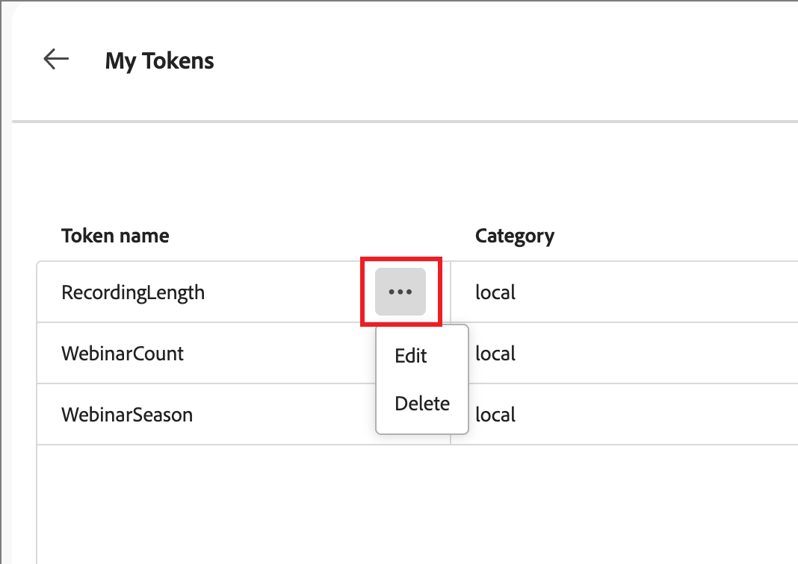

# Custom tokens for email personalization

Content personalization uses tokens as placeholders or variables that are populated when the content artifact is generated. Standard personalization tokens are available for emails, landing pages, fragments, and templates. You can also define a set of custom tokens with values that are specific to the account journey. This set of custom tokens is called _My Tokens_ and any of these custom tokens are for personalization when [authoring journey emails](./email-authoring.md#content-authoring---personalization).

In addition to _My Tokens_, which are specific to the account journey, you can use any of the standard (built-in) tokens for email personalization.

## Manage My Tokens {#my-tokens}

The _My Tokens_ are custom variables that you create or modify for an account journey in Draft status. This custom token set currently support text and number token definitions. 

When you add a custom token to an email, it is displayed as `{{my.TokenName}}`. For example, you might have `{{my.EventDate}}` or `{{my.WebinarSpeaker}}` tokens created to manage email content related to upcoming webinars.

_To access the custom tokens for an account journey:_

1. Open the draft account journey.

1. Click the **[!UICONTROL More...]** menu at the top right and choose **[!UICONTROL My Tokens]**.

   {width="450"}

   The _My Tokens_ page lists all custom tokens that are defined for the journey.

   {width="700" zoomable="yes"}

### Create a token

1. In the _[!UICONTROL My Tokens]_ page, click **[!UICONTROL Create]** and choose the token type that you want to define:

   * **[!UICONTROL Text]** - Use this type to define a token with a basic text string value.

   * **[!UICONTROL Number]** - Use this type to define a token with a numeric value.

1. In the dialog, enter the **[!UICONTROL Name]** and **[!UICONTROL Value]** for the token.

   {width="400"}

   You cannot use spaces or special characters in the token name. You can use _camel case_, such as `EventType`, to use a multi-word name that is easily identified.

   If you are defining a _Number_ token, the value can contain only numeric characters. You can use a decimal value.

   {width="400"} 

1. Click **[!UICONTROL Add]**.

### Edit a token

While the account journey remains in draft status, you can edit any of the defined My Tokens. 

1. In the _[!UICONTROL My Tokens]_ page, click the _More actions_ icon (**...**) next to the token name and choose **[!UICONTROL Edit]**.

    {width="430"} 

1. In the dialog, change the **[!UICONTROL Name]** and **[!UICONTROL Value]** as needed for the journey.

   {width="400"} 

1. Click **[!UICONTROL Edit]**.

### Delete a token

You can delete a custom token from the _My Tokens_ list, but you should make sure that it is not currently used in your journey email content.

1. In the _[!UICONTROL My Tokens]_ page, click the _More actions_ icon (**...**) next to the token name and choose **[!UICONTROL Delete]**.

1. In the confirmation dialog, click **[!UICONTROL Delete]**.

## Use custom tokens in your content

When you are authoring email content for your account journey, you can use any of the tokens from the _My Tokens_ list when you use the personalization tools in the visual design space.

1. Select the text component and click the _Add personalization_ (  ) icon in the toolbar.

   {width="600"}

   This action opens the _Edit Personalization_ dialog. The dialog includes a _[!UICONTROL My tokens]_ folder in the _[!UICONTROL Personalization Tokens]_ library if there are custom tokens defined for the account journey.

1. Expand the **[!UICONTROL My tokens]** folder, then click **+** or **...** to add one of your custom tokens to the blank space.

   You can add any additional static text as needed.

   {width="700" zoomable="yes"}

1. Click **[!UICONTROL Save]**.
