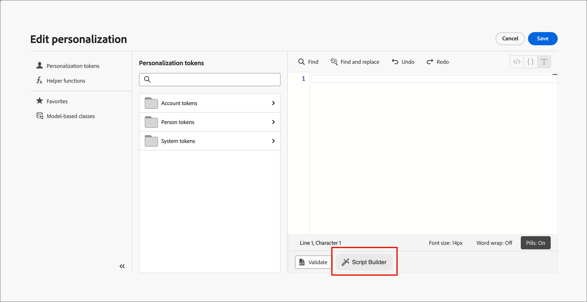

# Script Builder

_Script Builder_ is an AI-powered assistant available in the [!DNL Adobe Journey Optimizer B2B Edition] email design space. It helps marketers and email developers create personalization scripts faster, and it helps with migrating from [!DNL Marketo Engage] by converting existing personalization logic into [!DNL Journey Optimizer B2B Edition] without rewriting code manually.

>[!AVAILABILITY]
>
>Script Builder is currently available to select customers as a limited beta release for emails in **_account journeys only_**. Support for person journeys is planned for a future release. To get access, contact your Adobe representative.

Building conditional email personalization, such as switching language blocks by locale, swapping content by region or persona, or inserting dynamic profile or custom object values, requires authoring _Handlebars_ expressions. If you migrate from [!DNL Marketo Engage], you have the added challenge of rewriting _Velocity_ scripts line by line. Script Builder addresses both obstacles from a single conversational interface:

* Generate a new Handlebars personalization script from a plain-language description.
* Paste a [!DNL Marketo Engage] Velocity script and convert it into an equivalent Handlebars script with automatic token mapping.
* Preview, edit, validate, and save the output directly into the email, without copying and pasting between tools.

## Guidelines and limitations

>[!IMPORTANT]
>
>User access to Script Builder is controlled through the same permissions used for other generative AI capabilities in [!DNL Journey Optimizer B2B Edition]. For information about granting feature permissions, see [Enable AI Assistant access](../ai-assistant/enable-ai-assistant-access.md).

Before you use Script Builder, review the [guidelines and limitations](../ai-assistant/generative-ai-content.md#general-guidelines-and-limitations) that apply to generative AI features in [!DNL Journey Optimizer B2B Edition]. [User agreement](https://www.adobe.com/legal/licenses-terms/adobe-gen-ai-user-guidelines.html){target="_blank"} acceptance is also required before you can use AI capabilities.

Familiarize yourself with the [Handlebars templating language](https://handlebarsjs.com/guide/){target="_blank"}, the [personalization syntax](./personalization-syntax.md), and the [helper functions](./personalization-helper-functions.md) supported in [!DNL Journey Optimizer B2B Edition]. Script Builder generates valid Handlebars for you, but understanding the syntax helps you review and edit the output with confidence.

## Open Script Builder {#open-script-builder}

Script Builder is available from the [personalization editor](./personalization.md) while you [author email content](./email-authoring.md) for an account journey.

1. In the email design space, select the component where you want to add or replace a personalization script.

1. To open the personalization editor, click the _Add personalization_ (  ) icon.

1. In the editor, select **[!UICONTROL Script Builder]**.

   {width="700" zoomable="yes"}

   >[!BEGINSHADEBOX]

   The first time you access Script Builder, review the [_[!UICONTROL Generative AI Terms of Use]_](https://www.adobe.com/legal/licenses-terms/adobe-gen-ai-user-guidelines.html){target="_blank"} and confirm your agreement.

   {width="400"}

   >[!ENDSHADEBOX]

   The Script Builder panel opens with a conversational chat interface.

   {width="700" zoomable="yes"}

1. Start the chat according to what you want to do:

   * [Generate a new script](#generate-personalization-script)
   * [Convert an existing Velocity script](#convert-marketo-velocity-script)

## Generate a personalization script {#generate-personalization-script}

Use Script Builder to create a new Handlebars personalization script from a plain-language description, without writing the expression yourself.

Script Builder includes a mapping library that resolves [!DNL Marketo Engage] lead and account fields to their equivalent [!DNL Journey Optimizer B2B Edition] XDM profile attributes, based on the [XDM field mapping](../admin/xdm-field-management.md) defined for your organization.

1. In the Script Builder chat interface, describe the personalization logic that you want.

   For example, describe the attribute, custom object, or condition that determines which content variant to display.

1. Review the generated Handlebars script in the preview pane.

1. Edit the script directly in the preview pane if you want to refine the logic or wording.

1. Click **[!UICONTROL Validate]** to check the script against the [!DNL Journey Optimizer B2B Edition] schema.

   Validation catches syntax errors and unresolved token references before you save the script, so that broken personalization is never published to a live email.

1. Click **[!UICONTROL Save]** to insert the script directly into the selected location in the email.

## Convert a Marketo Engage Velocity script {#convert-marketo-velocity-script}

Use Script Builder to migrate an existing [!DNL Marketo Engage] Velocity script into an equivalent Handlebars script for [!DNL Journey Optimizer B2B Edition].

1. In the Script Builder chat, enter `Convert this` and paste the Velocity script that you want to convert.

   Script Builder parses the Velocity constructs, matches the token references to XDM profile attributes, and generates the equivalent Handlebars script.

1. Review the [conversion report](#review-conversion-report) and [resolve any tokens that need manual mapping](#resolve-tokens-without-mapping).

1. [Preview and validate](#preview-validate-script) the generated script, then save it directly into the email.

### Supported Velocity constructs {#supported-velocity-constructs}

Script Builder converts the following [!DNL Marketo Engage] Velocity control-flow constructs into their equivalent Handlebars or Conditional Content expressions:

| Velocity construct | Handlebars or Conditional Content equivalent |
| ------------------- | --------------------------------------------- |
| `#if` / `#elseif` / `#else` | Handlebars `{{#if}}`, `{{else if}}`, and `{{else}}` block helpers, or an [!DNL Journey Optimizer B2B Edition] [conditional content](./conditional-content.md) rule |
| `#set` | A Handlebars variable assignment within the generated script |

It translates segment-based conditional logic into [conditional content](./conditional-content.md) rules that replicate the branching behavior, including emails with many language-variant blocks.

If a Velocity construct has no direct Handlebars or Conditional Content equivalent, Script Builder flags it in the [conversion report](#review-conversion-report) instead of generating an incomplete or incorrect expression.

### Review the conversion report {#review-conversion-report}

After each conversion, Script Builder surfaces a structured report that lists:

* Tokens that were successfully mapped.
* Tokens that require manual resolution.
* Velocity constructs with no direct Handlebars equivalent.

Use the report to confirm that the conversion is complete before you resolve any remaining tokens and save the script.

### Resolve tokens without a mapping {#resolve-tokens-without-mapping}

For tokens that are not in the mapping library, such as custom lead attributes or custom [!DNL Marketo Engage] objects, Script Builder attempts to resolve a mapping in the following order:

1. It suggests a likely mapping based on the available XDM fields and, for custom objects, the [model-based classes](./personalization.md#custom-datasets) configured for your organization, when a confident match exists.

1. If it cannot suggest a confident match, it asks you for the correct mapping in the chat.

When you confirm a mapping for a token that was not in the library, Script Builder asks whether you want to remember the decision. If you agree, the mapping is remembered for the source [!DNL Marketo Engage] instance, identified by its Munchkin ID, so that the same token resolves automatically the next time you convert a script from that instance.

### Preview and validate the script {#preview-validate-script}

Before you commit a conversion, Script Builder displays a side-by-side preview of the original Velocity script and the generated Handlebars output, with inline editing support. Use the preview to compare the two versions and make any adjustments directly in the generated script.

Click **[!UICONTROL Validate]** to check the generated Handlebars against the [!DNL Journey Optimizer B2B Edition] schema. Validation runs again when you save, so that broken personalization is never published to a live email.

When you are satisfied with the result, click **[!UICONTROL Save]** to insert the script directly into the chosen location in the email.

<!--
### Save reusable conversion profiles {#save-reusable-conversion-profiles}

Save your field mappings and segment mappings as a reusable conversion profile so that your token schema does not need to be re-entered for each script or migration batch. Select a saved profile at the start of a conversion to apply its mappings automatically.

### Audit logs {#conversion-audit-logs}

Script Builder records an audit log for every conversion event, including which scripts were processed, which tokens were remapped, which tokens required manual intervention, and who approved the final output. Use the audit log to review migration activity across your organization.

-->
