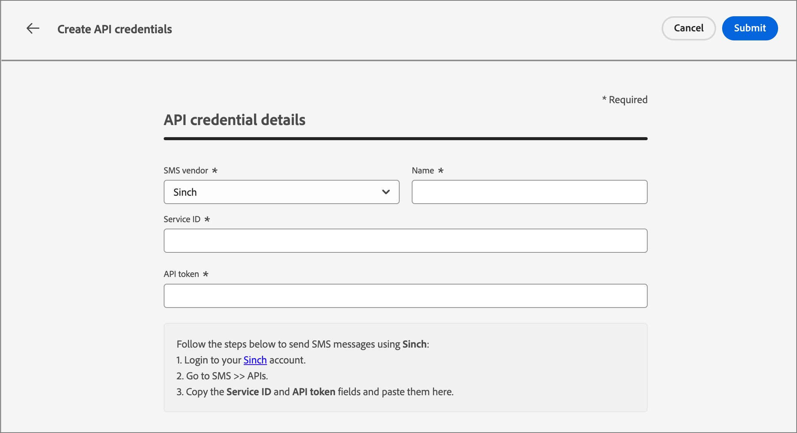

# SMS authoring

Use Adobe Journey Optimizer B2B edition to send text messages (SMS) to your customers on their mobile devices. You can create, personalize, and preview messages in text format from the SMS editor. 

## SMS configurations

Adobe Journey Optimizer B2B Edition sends text messages through SMS service providers (or SMS gateway providers). Before creating your SMS message, configure your service provider from the Administrator settings.

### SMS gateway service providers

Adobe Journey Optimizer B2B Edition currently integrates with third-party providers who offer text messaging services independently. Supported providers for text messaging are Sinch, Twilio, and Infobip. 

Prior to SMS channel configuration in Adobe Journey Optimizer B2B edition, you must create an account with one of these providers to get your API Token and Service ID, which you need to configure the connection between Adobe Journey Optimizer B2B Edition and the applicable provider.

>[!IMPORTANT]
>
>Your use of text messaging services is subject to additional terms and conditions from the applicable provider. As third-party solutions, Sinch, Twilio, and Infobip are available to Adobe Journey Optimizer B2B Edition users through an integration. Adobe does not control, and is not responsible for third-party products. For any issues or requests for assistance related to the text messaging services (SMS), contact your provider.

### Verify an existing SMS API configuration

>[!NOTE]
>
>The described settings are accessible only to the users with SMS Admin privileges.

On the left navigation, expand the **[!UICONTROL Administrator]** section and click **[!UICONTROL Configuration]**.

{width="800" zoomable="yes"}

The page lists the available API Configurations for your instance. You can filter the displayed API credentials by the SMS service provider or creator.

{width="500"}

### Create a new API credention for an SMS service provider

In each of the following cases, clicking Submit the credentials are immediately validated & saved, redirecting you to the API Credentials listing page. If the submitted credentials are invalid, the system displays an error message on the listing page. In this case, you can choose to cancel the configuration, or to update it and submit again.

>[!BEGINTABS]

>[!TAB Sinch]

_To configure Sinch as your SMS provider with Adobe Journey Optimizer B2B Edition:_

1. On the left navigation, expand the **[!UICONTROL Administrator]** section and click **[!UICONTROL Configuration]**.

1. Click the **[!UICONTROL Create new API credentials]** at the top-right of the _[!UICONTROL API Credentials]_ list.

1. Configure your SMS API credentials:

   {width="500"}

   * **[!UICONTROL SMS vendor]** - Choose `Sinch` as the SMS provider.

   * **[!UICONTROL Name]** - Enter a name for your API Credential.

   * **[!UICONTROL Service ID]** and **[!UICONTROL API Token]** - Access the APIs page from your Sinch account (you can find your credentials under the SMS tab).

   For more information about finding this information for your Sinch account, see the [Sinch developer documentation](https://developers.sinch.com/docs/sms/getting-started/#2-get-credentials)

1. Click **[!UICONTROL Submit]** when the configuration details of your API credentials are complete.

>[!TAB Twilio]

_To configure Twilio as your SMS provider with Adobe Journey Optimizer B2B Edition:_

1. On the left navigation, expand the **[!UICONTROL Administrator]** section and click **[!UICONTROL Configuration]**.

1. Click the **[!UICONTROL Create new API credentials]** at the top-right of the _[!UICONTROL API Credentials]_ list.

1. Configure your SMS API credentials:

   {width="500"}

   * **[!UICONTROL SMS vendor]** - Choose `Twilio` as the SMS provider.

   * **[!UICONTROL Name]** - Enter a name for your API credential definition.

   * **[!UICONTROL Account SID]** and **[!UICONTROL Auth Token]** - Access the _Account Info_ pane of your Twilio Console Dashboard page to find your credentials.

   For more information about finding this information for your Twilio account, see the [Twilio Help Center](https://help.twilio.com/articles/14726256820123-What-is-a-Twilio-Account-SID-and-where-can-I-find-it-).

1. Click **[!UICONTROL Submit]** at the top-right of the page when the configuration details of your API credentials are complete.

>[!TAB Infobip]

_To configure Infobip as your SMS provider with Adobe Journey Optimizer B2B Edition:_

1. On the left navigation, expand the **[!UICONTROL Administrator]** section and click **[!UICONTROL Configuration]**.

1. Click the **[!UICONTROL Create new API credentials]** at the top-right of the _[!UICONTROL API Credentials]_ list.

1. Configure your SMS API credentials:

   {width="500"}

   * **[!UICONTROL SMS vendor]** - Choose `Infobip` as the SMS provider.

   * **[!UICONTROL Name]** - Enter a name for your API credential definition.

   * **[!UICONTROL API base URL]** and **[!UICONTROL API key]** - Access your web interface homepage or the API key management page for your Infobip account to find your credentials.

   For more information about finding this information for your Infobip account, see the [Infobip documentation](https://www.infobip.com/docs/api/_blank).

1. Click **[!UICONTROL Submit]** at the top-right of the page when the configuration details of your API credentials are complete.

>[!ENDTABS]

## Add an SMS action in an account journey

You can set up text message deliveries in an Account Journey when you add a new _[!UICONTROL Take an action]_ node and do the following:

1. For the _[!UICONTROL Action on]_ target, choose **[!UICONTROL People]**.

1. For the _[!UICONTROL Action on people]_, choose **[!UICONTROL Send SMS]**.

   {width="800" zoomable="yes"}

1. At the bottom of the _[!UICONTROL Take an action]_ panel, click **[!UICONTROL Create SMS]**.

1. In the _[!UICONTROL Create new email]_ dialog, enter a unique **[!UICONTROL Name]** for the email and a **[!UICONTROL Subject line]**.

   {width="500"}

## Create the SMS message

>[!IMPORTANT]
>
>**SMS consent management** 
> 
>In accordance with the industry standards and regulations, all SMS marketing messages must contain a way for the recipients to easily unsubscribe. To do this, SMS recipients can reply with opt-in and opt-out keywords. All standard opt-in and opt-out keywords are supported and honored. In addition, any custom keywords configured for your SMS service provider account are supported and honored.

1. Enter the text that you want to send in the **[!UICONTROL Message]** field.

   You can create an message of up to 1600 characters, with every 160 characters considered as a single SMS message.

1. **Personalize the text message**.

   At anytime while authoring the text message, click the _Personalize_ icon to the right of the text message box.

   {width="800" zoomable="yes"}
   
   The displayed page provides access to your Adobe Marketo Engage Lead and System tokens. Both standard and custom tokens are included. You can use the Search bar to locate the token you need, or navigate through the folder tree to find and select any of the lead/system tokens.

   Place your cursor at the location in the message where you want to add the token. Add a token by clicking the plus ( **+** ) symbol next to it. If you want to add the token with a fallback (default that will appear in case that field is not available for a lead), click the ellipsis ( **...** ) and choose **[!UICONTROL Insert with fallbacl text]**.

   {width="700" zoomable="yes"}

   In the _[!UICONTROL Enter fallback value]_ dialog, enter the text that appears as a fallback and then click **[!UICONTROL Add]**.

   {width="400"}

   When your personalization tokens are placed, click **[!UICONTROL Save]** to save changes and return to the main SMS authoring workspace. You can continue to edit the message with the tokens as needed. 

<!-- 1. **Add URLs to text message**.

   After defining your content, you can add URLs to your message by clicking the _Link_ icon.
   
   You can add two types of URLs: 

   External URLs - This is ANY external URL that can be directly typed into/ pasted into the input text box
   Adobe Marketo Engage Design Studio Landing Pages - Selecting this option, you will see a 'Landing Page picker' from which you can select any of the listed approved Landing Pages from Marketo Engage

   You can choose to 'shorten' either of these URLs by selecting the checkbox
   Note that the URL shortening function, uses the Marketo subdomain for shortening
   The shortened URL appears as a read-only field within the modal
   You can optionally track clicks on the URL
   You can also choose to include 'mkt_tok' for tracking activity against a user
   Click on Add to save changes & add the chosen URL to the SMS message
-->

## Set the SMS properties

1. In the _[!UICONTROL SMS properties]_ section, enter a **[!UICONTROL Name]** (required, 100 cha\racter maximum) and **[!UICONTROL Description]** (optional, 300 character maximum) for your message. 

   Alpha, numeric, special characters are allowed for these fields. The following reserved characters are **not allowed**: `\`, `/`, `:`, `*`, `?`, `"`, `<`, `>` and `|`.

1. Choose the **[!UICONTROL SMS Type]**:

   * Use `Marketing` for promotional text messages, which require user consent.
   * Use `Transactional` for non-commercial messages, such as order confirmation, password reset notifications, or delivery information.

1. For **[!UICONTROL SMS configuration]**, choose one of the pre-defined API configurations.

   This determine which SMS gateway service provider and account is used to deliver the message.

1. Enter the **[!UICONTROL Sender number]** ​you want to use for your communications.

   {width="700" zoomable="yes"}

   The recipient number is always mapped to the `Lead.MainPhone` field in Marketo Engage.

<!-- ## Preview the text message content

When your message content is defined, you can use test profiles to preview its content. If you inserted personalized content, you can check how this content is displayed in the message, using test profile data.

1. Click **[!UICONTROL Simulate Content]** at the top of the SMS authoring workspace.

1. From the _[!UICONTROL Simulate Content]_ page, click **[!UICONTROL Add People]**.

1. Use the # page to manage the leads used for your test profile.

   In the displayed list, you can search for and add any of the leads (up to 10 leads at a time) from the Marketo Engage lead database.

   To search, enter the whole email address and click enter. The corresponding lead profile shows up for selection.

   The preview updated to the personalization fields for the selected profile.

   All the added leads appear on the left rail of the 'Simulate Content' page

   You can manage this list by adding more people and deleting individual leads from the profile listing (it does not remove them from the database).

1. Simulate content for a lead.

   Select any of the leads listed on the left rail of the Simulate Content page and the SMS preview on the page updates for the corresponding lead.

   You can also select a lead from the 'drop-down' box above the preview space and the SMS preview on the page updates for the corresponding lead

1. To exit the _[!UICONTROL Simulate Content]_ page and return back to the SMS authoring workspace, click Close. -->
