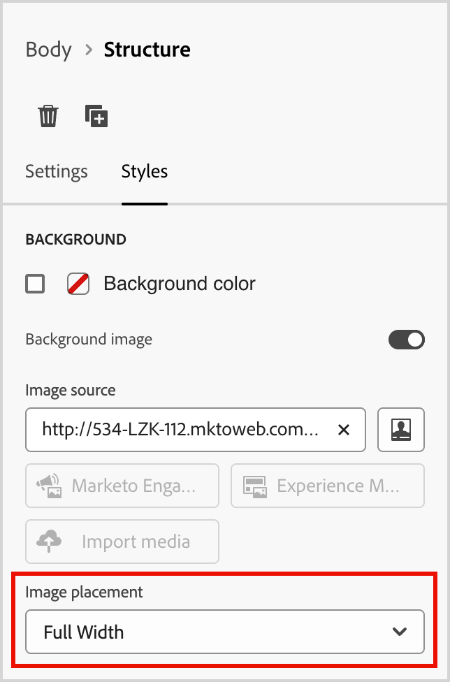

# Structure components {#structure-components}

>[!CONTEXTUALHELP]
>id="ajo-b2b_structure_components_email"
>title="About Structure components"
>abstract="Structure components are layout elements that you can use to design the structure of an email."

>[!CONTEXTUALHELP]
>id="ajo-b2b_structure_components_landing_page"
>title="About Structure components"
>abstract="Structure components are layout elements that you can use to design the structure of a page."

>[!CONTEXTUALHELP]
>id="ajo-b2b_structure_components_fragment"
>title="About Structure components"
>abstract="CStructure components are layout elements that you can use to design the structure of a fragment."

>[!CONTEXTUALHELP]
>id="ajo-b2b_structure_components_template"
>title="About Structure components"
>abstract="Structure components are layout elements that you can use to design the structure of a template."

Use the _Structure components_ in the design space to define the structure of your contents. By adding and moving structural elements with simple drag-and-drop actions, you can quickly define the shape of your content layout. Each structure component spans the horizontal space. Stack them to build the layout vertically, and you can divide each component into columns and control the width to form each content block that you need.

## Structure library

The **[!UICONTROL Structure]** section at the top of the Components library displays the available structure components:

| Icon  | Component.  | Description | 
| ----- | ----------- | ----------- |
|  | 1:1 column |  A single column container that fills the width of the space. |
|  | 1:2 column Left | A two-column container that uses a 1:2 ratio to fill the width of the space. The first (left) column occupies a third of the width and the second (right) occupies the remaining two-thirds. |
|  | 1:3 column Left | A two-column container that uses a 1:3 ratio to fill the width of the space. The first (left) column occupies a fourth of the width and the second (right) occupies the remaining three-fourths. |
|  | 2:1 column Right | A two-column container that uses a 2:1 ratio to fill the width of the space. The first (left) column occupies a two-thirds of the width and the second (right) occupies the remaining one-third. |
|  | 2:2 column | A two-column container that uses a 2:2 ratio to fill the width of the space. The left and right columns are equal in width. |
|  | 3:1 column Right | A two-column container that uses a 3:1 ratio to fill the width of the space. The first (left) column occupies a three-fourths (75%) of the width and the second (right) occupies the remaining one-fourth (25%). |
|  | 3:3 column | A three-column container that uses a 3:3 ratio to fill the width of the space. All three columns are equal in width. |
|  | 4:4 column | A four-column container that uses a 4:4 ratio to fill the width of the space. All four columns are equal in width. |
|  | n:n column | A customizable column structure that fills the space according to the columns that you define. You set the number of columns (between two and ten) and set the width of each column individually. |

## Add structure components

When you design the content for your email, landing page, or fragment, add each structure component to construct the design layout. Drag an item from the **[!UICONTROL Structures]** section on the left of the design space and drop it onto the canvas. You can use the toolbar to change the select a column. Use the _Settings_ and _Styles_ tabs on the right panel to define the parameters for the selected component or column.

{width="800" zoomable="yes"}

### Toolbar

The toolbar is displayed in the canvas when you select it in the canvas. The available tools provide an easy way to select a column and apply component functions.

{width="150"}

| Tool | Name | Usage | 
| ---- | ---- | ----- |
| {width="40"} | Enable conditional content | Enable conditional variants for the component. [Learn more](./conditional-content.md) |
| {width="100"} | Select a column |  Select a column by number. When the column is selected, you can apply column settings and styles. |
| {width="40"} | Duplicate | Create a copy of the component and add it directly below. |
| {width="40"} | Delete | Remove the component. |

### Settings

After you add a component, it is selected in the visual design space and its properties are displayed in the right panel. The _[!UICONTROL Settings]_ tab is displayed by default. You can also select a structure component at any time to change the settings.

#### Display options

If you want to exclude the component from desktop or mobile device display, change the **[!UICONTROL Display Options]** setting. The default, _[!UICONTROL Show on all devices]_, enables display across all devices. 

{width="400" zoomable="yes"}

Choose another setting to make the component exclusive by device type:

* _[!UICONTROL Show only on desktop devices]_ - Choose this setting when you want to display the component on desktop devices and exclude it for mobile devices.
* _[!UICONTROL Show only on mobile devices]_ - Choose this setting when you want to display the component on mobile devices, such as phones and tablets, and exclude it for desktop devices.

#### Header and footer 

You can designate a structure component as the HTML header or footer in the email message or landing page. With the structure component selected in the canvas, click the **[!UICONTROL Header]** or **[!UICONTROL Footer]** option. There can be only one header or footer, and the option is not available if another component is assigned.

{width="600" zoomable="yes"}

You can remove the header or footer designation by selecting the component and clicking the option to remove it.

### Stacked columns

For smaller screens or display windows, the columns in the structure component display as stacked unless you change the default setting. With the multi-column structure component selected, change the **[!UICONTROL Do not stack columns on mobile]** setting by moving the toggle slider to the right.

{width="250"}

## Styles

After you add a component, it is selected in the visual design space and its properties are displayed in the right panel. You can also select a component at any time to change the settings and styles.

### Background

With the _[!UICONTROL Styles]_ tab selected in the right panel, use the **[!UICONTROL Background]** section to define the color and optional image to use as a background for the structure component.

#### [!UICONTROL Background color]

Select the checkbox and click the color square to choose a color from the picker. You can choose a color by entering a known RGB, HSL, HSB, or hexadecimal value. Or, you can use the color slider and the color field to select the color.

{width="300"}

#### [!UICONTROL Background image]

Move the toggle selector to enable the background image settings.

{width="250"}

Choose the [asset source type](./assets-overview.md) and select an image file:

+++[!UICONTROL Marketo Engage Assets]

Choose this type to browse and select an image asset from the Journey Optimizer B2B Edition library or from the connected Market Engage instance. 

{width="700" zoomable="yes"}

From the dialog, you can choose an image from the selected repository and workspace. Click **[!UICONTROL Select]** to add the asset.

There are tools available to help you locate the asset that you need: 

* Click the _Filter_ icon on the top left to filter the displayed items according to your criteria.

* Enter text in the _Search_ field to filter the displayed items for a match of the asset name.

   {width="700" zoomable="yes"}

+++

+++[!UICONTROL Experience Manager Assets]

Choose this type to browse and select an image asset from a [configured Experience Manage Assets repository](../admin/configure-aem-repositories.md). 

From the _[!UICONTROL Select Assets]_ dialog, choose an image using the available tools to locate the asset that you need and click **[!UICONTROL Select]**.:

* Change the **[!UICONTROL Repository]** at the top right.

* Click **[!UICONTROL Manage assets]** at the top right to open the Assets repository in another browser tab and use AEM Assets management tools.

* Click the _View type_ selector at the top right to change the display to **[!UICONTROL List View]**, **[!UICONTROL Grid View]**, **[!UICONTROL Gallery View]**, or **[!UICONTROL Waterfall View]**.

* Click the _Sort order_ icon to change the sort order between ascending and descending.

   {width="700" zoomable="yes"}

* Click the **[!UICONTROL Sort by]** menu arrow to change the sort criteria to **[!UICONTROL Name]**, **[!UICONTROL Size]**, or **[!UICONTROL Modified]**.

* Click the _Filter_ icon on the top left to filter the displayed items according to your criteria.

* Enter text in the _Search_ field to filter the displayed items for a match of the asset name.
   
   {width="700" zoomable="yes"}

+++
   
+++[!UICONTROL Import media]

Choose this type to select a file from your system and import it into the Journey Optimizer B2B Edition asset library.

In the _[!UICONTROL Upload image]_ dialog, drag and drop a file from your system to the file box. The maximum file size is 100 MB.
   
{width="450"}

The file names of the selected images are displayed in the dialog. Asset file names must be unique (across folders), and if a file with the name already exists, a message is displayed. Names can have a maximum of 100 characters, and cannot contain special characters (such as `;`, `:`, `\`, and `|`). 

Click **[!UICONTROL Import]**.

+++

Use the **[!UICONTROL Image placement]** option to choose how the image fills the structure component. The placement settings follow the standard [HTML background image fill and alignment attributes](https://www.w3schools.com/html/html_images_background.asp).

{width="250"}

### Other styles

You can apply other structure component styles that differ from the styles applied to the content components that it contains. 

+++Border

{{styles-border}}

+++

+++Margin

{{styles-margin}}

+++

+++Advanced

{{styles-advanced}}

+++

## Columns

Use the _Select a column_ tool in the component toolbar to select a column. You can then use the column toolbar to change the column selection, remove the column, or apply conditional content variations for the column. The parameters for the column are displayed in the _[!UICONTROL Settings]_ and _[!UICONTROL Styles]_ tabs on the right.

{width="500"}

| Tool | Name | Usage | 
| ---- | ---- | ----- |
| {width="40"} | Clear column | Clear the content in the column. |
| {width="40"} | Enable conditional content | Enable conditional variants for the column. [Learn more](./conditional-content.md) |
| {width="100"} | Select a column |  Select a column by number. When the column is selected, you can apply settings and styles. |

### Change n:n columns

The columns widths are static for most of the structure components. When you add the _[!UICONTROL n:n column]_ component, you can change the number of columns and the column sizing. The n:n column component starts with five columns of equal width (20%).

>[!NOTE]
>
>Each column size cannot be less than 10% of the total width of the structure component. Only empty columns can be removed.

With the component selected in the canvas, use the **[!UICONTROL Columns number]** option in the right panel to change the number of columns. Click the up and down arrow icons to increase or decrease the number of columns, or enter the number in the field. 

{width="650" zoomable="yes"}

In the canvas, move the column sizing icon to adjust the width of the selected column. As you increase or decrease the width, the adjacent column also adjusts so that all columns occupy 100% of the component width.

{width="500" zoomable="yes"}

### Column styles

With the column selected in the canvas, you can set styles to apply to that column. 

+++Border

{{styles-border}}

+++

+++Alignment

{{styles-alignment-v}}

+++

+++Margin

{{styles-margin}}

+++

+++Advanced

{{styles-advanced}}

+++

## Navigation tree

In the visual design space, you can access the structural components, including columns and content, using the navigation tree. Click the _[!UICONTROL Navigation tree]_ icon (  ) on the left to display the tree.

{width="800" zoomable="yes"}

The _[!UICONTROL Body]_ element is the root of the tree structure. Click any of the components or column child elements in the tree to select it on the canvas. The _[!UICONTROL Settings]_ and _[!UICONTROL Styles]_ tabs on the right display the parameters for that component or column.

{width="800" zoomable="yes"}
