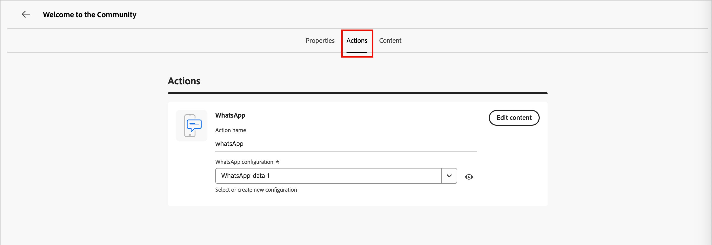

# WhatsApp authoring

Use Adobe Journey Optimizer B2B Edition to send WhatsApp messages to account members on their mobile devices. You can create, personalize, and preview messages using approved Meta message templates from the WhatsApp editor. <!-- Test your WhatsApp messages before publishing the account journey to ensure your intended rendering, accurate personalization, and proper configuration of all settings. -->

Before creating WhatsApp messages for account journeys, make sure that you have the needed [WhatsApp channel configured](../admin/configure-channels-whatsapp.md) in the _[!UICONTROL Administrator]_ settings.

>[!NOTE]
>
>Only _outbound_ WhatsApp message elements are supported in Journey Optimizer B2B Edition.

+++ Supported message elements and calls to action options

The following message types are supported in WhatsApp:

| Message element | Description |
| - | - |
| Headers | Optional text that appears above the body of your message. |
| Text | Supports dynamic content through parameters. |
| Images (JPEG, PNG) | Must be in 8-bit RGB or RGBA format and under 5 MB in size. |
| Videos | Must be 3GPP or MP4, under 16 MB, and hosted by URL. |
| Audio | Only available for response messages. Must be AAC, AMR, MP3, MP4 audio, or OGG format, hosted on a URL, and under 16 MB. |
| Documents | Must be under 100 MB, hosted on a URL, and in one of the following formats: `.txt`, `.xls`/`.xlsx`, `.doc`/`.docx`, `.ppt`/`.pptx`, or `.pdf`. |
| Body Text | Supports dynamic content through parameters. |
| Footer Text | Supports dynamic content through parameters. |

The following call-to-action options are available for your WhatsApp messages:

| Call to action | Description |
| - | - |
| Visit website | Only one button is permitted, with variable parameters included. |
| Call on WhatsApp | Provides a button that opens a WhatsApp chat with the specified phone number directly from the message. |
| Call phone number | Provides a button that initiates a phone call to the specified number when tapped by the user. |

+++

## Add a WhatsApp action in an account journey

You can set up WhatsApp message deliveries in an account journey when you [add a _[!UICONTROL Take an action]_ node](../journeys/action-nodes.md) and do the following:

1. For the _[!UICONTROL Action on]_ target, choose **[!UICONTROL People]**.

1. For the _[!UICONTROL Action on people]_, choose **[!UICONTROL Send WhatsApp]**.

   {width="500" zoomable="yes"}

## Create the WhatsApp message

1. At the bottom of the _[!UICONTROL Take an action]_ panel, click **[!UICONTROL Create WhatsApp]**.

1. In the dialog, enter a unique **[!UICONTROL Name]** (required) and **[!UICONTROL Description]** (optional) for the WhatsApp message.

   {width="400"}

1. Click **[!UICONTROL Create]**.

   The _WhatsApp design space_ opens where you can define the WhatsApp actions and create the content for sending the message.

### Select the actions configuration

1. In the _WhatsApp design space_, select the **[!UICONTROL Actions]** tab.

1. For **[!UICONTROL WhatsApp configuration]**, select the [configuration](../admin/configure-channels-whatsapp.md#create-channel-configuration) that supports the marketing actions and message delivery settings for your needs.

   {width="700" zoomable="yes"}

1. Click **[!UICONTROL Edit content]** to move on to the message parameters and text.

### Select a message template

>[!IMPORTANT]
>
>**WhatsApp consent management**: In accordance with Meta's policies and applicable regulations, all WhatsApp marketing messages must be sent only to recipients who have opted in to receive communications. WhatsApp recipients can opt out at any time by replying with an opt-out keyword. Opt-out responses are automatically honored, and the corresponding profiles are removed from future marketing message audiences.

WhatsApp messages are sent using pre-approved message templates from your Meta WhatsApp Business Account. **Templates must be reviewed and approved by Meta** before you can use them in Journey Optimizer B2B Edition. Work with your [!DNL Meta Business Manager] account administrator to manage and submit templates for approval.

1. For **[!UICONTROL Select template category]**, choose one of the following:

   * Marketing
   * Utility
   * Authentication

1. For **[!UICONTROL Select WhatsApp template]**, choose an approved template for the configuration business account.

   The template content loads in the message editor, displaying the template structure and any variable fields available for personalization.

   {width="700" zoomable="yes"}

   Templates are organized by category (_Marketing_, _Utility_, and _Authentication_) and status. Only **_Approved_** templates are available for selection. For more information about creating WhatsApp templates, see [_Create message templates for your WhatsApp Business account_](https://www.facebook.com/business/help/2055875911147364?id=2129163877102343) in the Meta documentation.

### Image URLs

If your template includes any images, use the **[!UICONTROL Image URL]** field to add media URLs to replace any placeholders in your template. Meta's template media are only placeholders. To display images, audio, or video correctly, you must use external URLs from Adobe Experience Manager or other sources.

### Personalize the message content

Approved WhatsApp templates can include variable placeholders that you define using profile data or dynamic values.

For each variable field displayed in the template, click the _Personalize_ icon (  ) next to the field.

{width="700" zoomable="yes"}

The dialog provides access to the account tokens, person tokens, and system tokens. Both standard and custom tokens are included. You can use the _Search_ bar to locate the token you need, or navigate through the folder tree to find and select any of the tokens.

For detailed information about using tokens for personalization, see [Content personalization](./personalization.md).

When your personalization tokens are defined, click **[!UICONTROL Save]** to save changes and return to the main WhatsApp message workspace.
