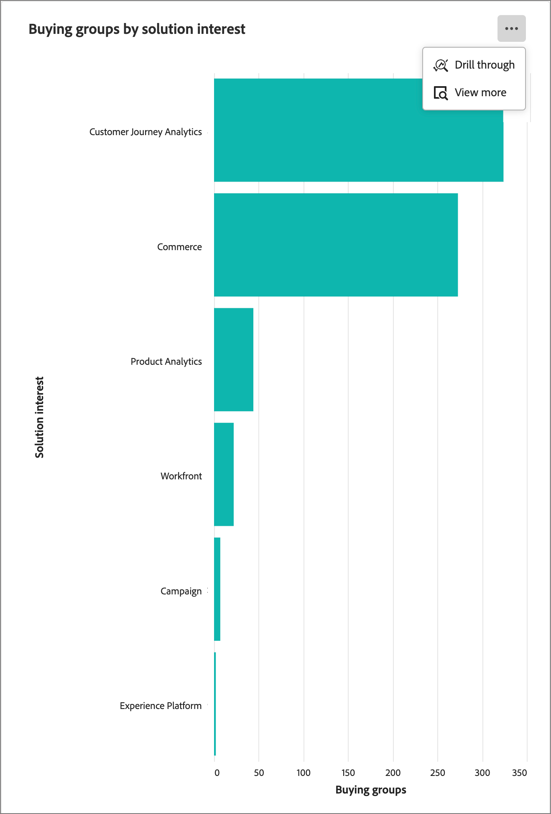

# Buying Groups Overview dashboard

The Overview dashboard for buying groups is designed for the B2B Sales handoff process. It enables the Marketing team to share _ready_ buying groups and their members along with essential data to the Sales team for execution. This process ensures a streamlined transition from marketing to sales.

The Sales handoff comprises:

* **Data handoff**: Marketing identifies _ready_ target data and makes it accessible to Sales in the CSV format. 
* **Sales acceptance**: Sales manually reviews and incorporates _ready_ targets into their pipeline.

To access this dashboard, expand **[!UICONTROL Accounts]** in the left navigation and then select **[!UICONTROL Buying groups]**. Select the **[!UICONTROL Overview]** tab if it is not displayed by default.

{width="800" zoomable="yes"}
<!--
## Buying Group Status

Gain insights into your buying groups' progression with the Buying Group Status view. This visualization showcases the distribution of your buying groups categorized by their most recent status update within a specified time frame.

{width="800" zoomable="yes"}

**[!UICONTROL Status]** (y-axis): Track the journey of buying groups through various stages.
**[!UICONTROL Number of Buying Groups]** (x-axis): Quantify the number of buying groups at each status, providing a clear metric of your funnel's health and activity.

To generate a shareable PDF of your current view, click **[!UICONTROL Export]** at the top-right corner of the page. -->

## Buying group completion score distribution

This visualization illustrates the distribution of buying groups based on the completion scores, and is categorized into four distinct score bands. The central figure represents the total number of buying groups, and provides a quick snapshot of overall progress. The segmented colors indicate the proportion of buying groups within each score range, which allows you to assess completion trends at a glance.

To view more detailed information, click the **...** menu icon at the top right.

{width="500"}

## Buying group engagement score distribution

This visualization illustrates the distribution of buying groups based on their engagement scores, and is categorized into four distinct score bands. The central figure represents the total number of buying groups, and provides a quick snapshot of overall progress. The segmented colors indicate the proportion of buying groups within each score range, which allows you to assess completion trends at a glance.

To view more detailed information, click the **...** menu icon at the top right.

{width="500"}

## Buying groups by solution interest

This visualization illustrates the distribution of buying groups by solution interest, and helps you to identify which solutions generate the most interest. Each bar represents a specific solution, with its length indicating the number of buying groups associated with that interest. This bar chart provides a clear and immediate understanding of solution demand trends.

To view more detailed information, click the **...** menu icon at the top right. Choose **Drill through** or **View More**.

{width="500"}

## Filter the data

Click the _Filter_ (  ) icon at the top left to filter the displayed data using any of these attributes:

* Current stage
* Industry
* Region
* Solution interest

{width="500"}

Select as many values for each attribute that you want to use to filter the data and click **[!UICONTROL Apply]**.

## Engage with the data

To engage with the data, use the _More_ (**...**) menu at the top-right of each chart. 

### [!UICONTROL Drill through]

Choose **[!UICONTROL Drill through]** for an in-depth analysis of individual group scores or distributions. 

{width="700" zoomable="yes"}

The global filters applied to the dashboard are carried over. Click the _Filter_ (  ) icon at the top left to [change the attribute filters](#filter-the-data) for the drill-through view.

You can click the _More_ (**...**) menu at the top-right and choose **[!UICONTROL View more]** to [view extended data](#view-more).

### [!UICONTROL View more]

Choose **[!UICONTROL View more]** to view extended data and insights.

{width="700" zoomable="yes"}

The displayed pop-up includes a chart and a table that show the breakdown of the buying group distribution.

To download the data, click **[!UICONTROL Download CSV]** at the top right of the data table. To return to the Overview dashboard, click **[!UICONTROL Close]**.
