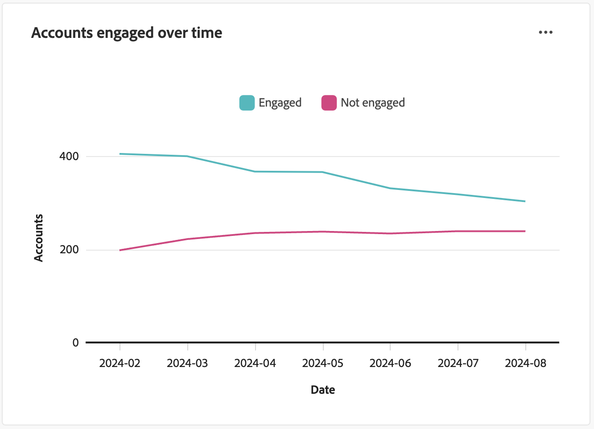

# Engagement Overview dashboard

This dashboard provides a comprehensive view of engagement and showcases real-time metrics of account and individual interactions through snapshot donut charts and trend-revealing line charts over time. It helps you monitor and strategize your engagement efforts effectively.

To access the _Engagement dashboard_, select the **[!UICONTROL Dashboard]** item in the left navigation. Then select the **[!UICONTROL Engagement]** tab at the top of the page.

<!-- To generate a shareable PDF of your current view, click **[!UICONTROL Export]** at the top-right corner of the page. To engage with the data, use the action menu in the top-right corner. -->

{width="800" zoomable="yes"}

## Engagement by accounts / buying group / people 

The circle charts divide accounts, buying groups, or people into engaged and non-engaged categories. The central figure displays the total count within each category, providing an at-a-glance understanding of overall engagement.

{width="500"}

## Accounts / buying groups / people engaged over time 

These line charts display the engagement levels of accounts or people over time. With distinct lines for 'Engaged' and 'Not Engaged,' visualized alongside a time-stamped horizontal axis, you can pinpoint trends and patterns. You can hover over a line to reveal precise metrics for any given date.

{width="500"}

## Filter the data

You can filter the displayed data by date range and attributes.

### Date range filter

Use the _[!UICONTROL Date range filter]_ at the top right to filter the data according to the date range.

{width="380"}

For the **[!UICONTROL Custom]** range, you can use the calendar tool to specify a start and end date. The end date defaults to the current day.

{width="380"}

### Attribute filter

Click the _Filter_ (  ) icon at the top left to filter the displayed data using any of these attributes:

* Solution interest
* Engagement type
* Region
* Industry
* Buying group member role

{width="500"}

Select as many values for each attribute that you want to use to filter the data and click **[!UICONTROL Apply]**.

## Engage with the data

To engage with the data, use the **...** menu at the top-right of each chart.

{width="300"}

### Drill through

For a circle chart, choose **[!UICONTROL Drill through]** for an in-depth analysis of individual group engagement data.

The global filters (data range and attributes) are applied to the dashboard are carried over. Click the _Filter_ (  ) icon at the top left to [change the attribute filters](#filter-the-data) for the drill-through view. Use the date range selector at the top right to [change the date range](#date-range-filter) for the drill-through view.

{width="700" zoomable="yes"}

| Engagement by accounts | Engagement by buying groups | Engagement by people |
| ---------------------- | --------------------------- | -------------------- |
| <li>Account name <li>Status <li>People engaged (number)<li>Engagement activities (number) <li>Last Engagement (date) | <li>Buying group <li>Account <li>Solution interest <li>Status <li>Engagement activities (number) | <li>Name <li>Status <li>Email (address) <li>Engagement activities (number) <li>Last engagement (date) |

You can click the **...** menu icon at the top-righ and choose **[!UICONTROL View more]** to [view extended data and insights](#view-more).

### View more

Choose **[!UICONTROL View more]** for extended data and insights.

{width="700" zoomable="yes"}

Depending on the chart, there is extended data for the following:

| Engagement by accounts / buying groups / people | Accounts /buying groups / people engaged over time |
| ----------------------------------------------- | -------------------------------------------------- | 
| <li>Engaged <li>Not Engaged | <li>Date <li>Accounts / Buying groups / People (number) <li>Engaged / Not engaged |

To copy the extended data, click **[!UICONTROL Download CSV]** at the top right.
