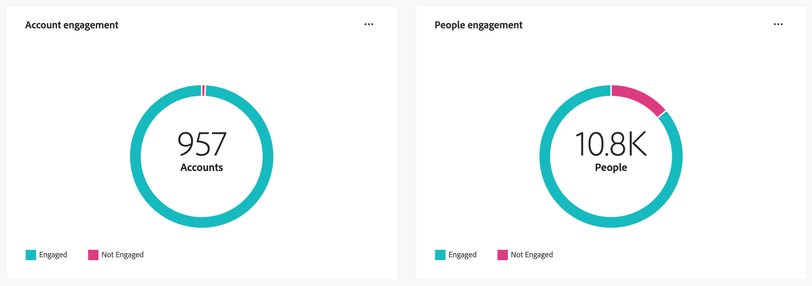

# Engagement Overview dashboard

This dashboard provides a comprehensive view of engagement and showcases real-time metrics of account and individual interactions through snapshot donut charts and trend-revealing line charts over time. It helps you monitor and strategize your engagement efforts effectively.

<!-- To generate a shareable PDF of your current view, click **[!UICONTROL Export]** at the top-right corner of the page. To engage with the data, use the action menu in the top-right corner. -->

## Engagement by Accounts / People

The donut charts clearly divide accounts or people into engaged and non-engaged categories. The central figure denotes the total count within each category, providing an at-a-glance understanding of overall engagement.

{width="700" zoomable="yes"}

## Engagement by Accounts / People Over Time

These line charts display the engagement levels of accounts or people over time. With distinct lines for 'Engaged' and 'Not Engaged,' visualized alongside a time-stamped horizontal axis, you can pinpoint trends and patterns. You can hover over a line to reveal precise metrics for any given date.

{width="700" zoomable="yes"}

## Enhanced interactions

Engage further with the data by using the action icon ( **...** ) in the top-right corner.

{width="400"}

### View more

**[!UICONTROL View More]**: For all dashboard views, a pop-up appears with the chart and a table showing the breakdown of engagement by account / people.

Download CSV button on the top-right corner of the table.

<!-- ### Drill through

Choose **[!UICONTROL Drill through]** for an in-depth analysis of individual group statuses.

The global filters applied to the dashboard are carried over to this page.

The applied filters are displayed, but are not editable on this page. 
The only available filters that are enabled are _Account Name_ or _Person Name_.

To display or hide available columns, click **[!UICONTROL View more]** at the top-right corner:

Click **[!UICONTROL View more]** to open the download dialog.

Button on the top right corner to open a pop-up with the available column list:

* [!UICONTROL Account]
* [!UICONTROL Account name]
* [!UICONTROL Account ID]
* [!UICONTROL Status]
* [!UICONTROL People engaged]
* [!UICONTROL Engagement activities]
* [!UICONTROL Last engagement date]
* [!UICONTROL Region]
* [!UICONTROL Industry]
* [!UICONTROL People]
* [!UICONTROL Name]
* [!UICONTROL Person ID]
* [!UICONTROL Status]
* [!UICONTROL Email]
--->
### Filter

Global filter: **[!UICONTROL Date ]** filter, which reflects the Buying Group last status change date. The start date is adjustable. The end date defaults to the current day.

You can also filter the display using any of these attributes: 

* Solution Interest
* List of Solution Interests
* Engagement Type
* List of Engagement Types
* Account Region
* Account's Region
* Account Industry
* Account's Industry
