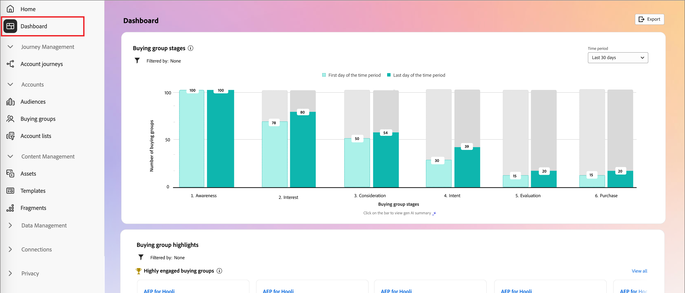
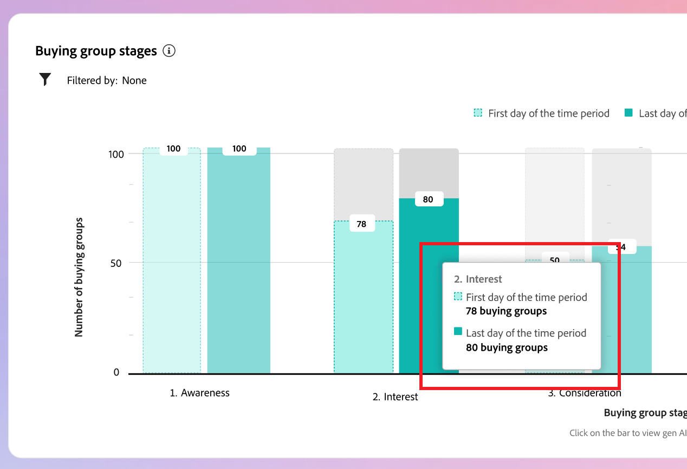
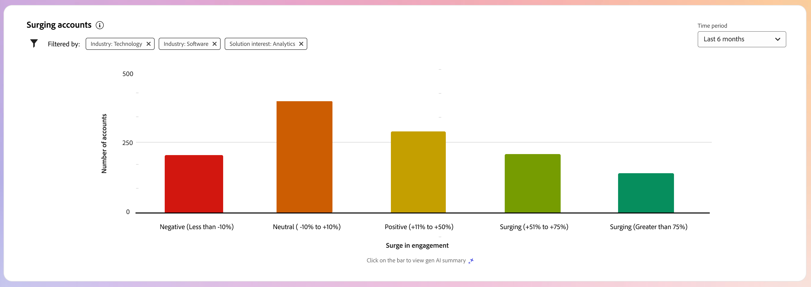
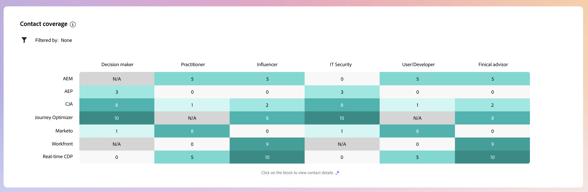

# Intelligent Dashboard

The Intelligent Dashboard provides a comprehensive view of buying group and account metrics, helping you to monitor and strategize your Marketing efforts more effectively.

To access the _Intelligent Dashboard_, select the **[!UICONTROL Dashboard]** item in the left navigation.

{width="800" zoomable="yes"}

The Intelligent Dashboard also provides access to account and buying group detail pages that includes two types of generative AI features:

* Summaries for accounts and buying groups
* Intent detection for person, buying group, and account

{{intent-data-note}}

## Buying group stages {#buying-group-stages}

>[!CONTEXTUALHELP]
>id="ajo-b2b_intelligent_dashboard_buying_group_stages"
>title="Buying group stages"
>abstract="This chart provides an overview of buying group progression across different stages based on the configured transition rules. The first bar indicates the number of buying groups in a specific stage on the first date of the selected time frame in comparison to the last date of the selected time frame."

The _[!UICONTROL Buying Group Stages]_ chart provides an overview of buying group progression across different stages ([based on transition rules set up by an administrator](../buying-groups/buying-group-stages.md)).

>[!NOTE]
>
>Availability of buying group stages requires configuration of the buying group stages. See [Buying group stages](../buying-groups/buying-group-stages.md) for detailed information about stages and how to define and enable stages for buying groups.

{width="800" zoomable="yes"}

The chart uses the buying group stages from the most recently published version of the buying group stages model. There are two bars for each stage. The first bar indicates the number of buying groups on the first date of the selected time frame. And the second (in comparison) is the number of buying groups on the last date of the time frame. You can hover over each bar to see the number of buying groups in each stage.

{width="400"}

### Generative AI summary

Click a bar to surface a generative AI summary of buying groups in that stage for the selected time period.

{width="500"}

The generated summary provides an overview of buying group progression across different stages based on the configured transition rules.

### Time period {#time-period-stages}

Use the date filter at the top right to change the date range for the data visualizations. Click the down arrow to set a relative date range, or to set custom start and end dates. 

<!-- {width="300"} -->

### Attribute filter {#attribute-filter-stages}

Click the _Filter_ (  ) icon at the top left to filter the data display using any of these attributes:

* Solution Interest
* Account
* Stage name

<!-- Add screen when the UI is available {width="500"} -->

## Buying group highlights {#buying-group-highlights}

>[!CONTEXTUALHELP]
>id="ajo-b2b_intelligent_dashboard_buying_group_highlights_engagement"
>title="Top 5 buying groups by engagement"
>abstract="Top engaged buying groups based on their normalized engagement score."

>[!CONTEXTUALHELP]
>id="ajo-b2b_intelligent_dashboard_buying_group_highlights_velocity"
>title="Top 5 High velocity buying groups"
>abstract="Buying groups based on the velocity with which they are progressing through stages."

>[!CONTEXTUALHELP]
>id="ajo-b2b_intelligent_dashboard_buying_group_highlights_stagnant"
>title="Top 5 Stagnant buying groups"
>abstract="Stagnant buying groups that are not progressing through stages despite high completeness score."

The _[!UICONTROL Buying group highlights]_ section is organized into three rows to surface information about the buying groups of interest to your organization.

{width="800" zoomable="yes"}

* **Top 5 buying groups by engagement** - This row displays the top engaged buying groups based on their normalized engagement score.
* **Top 5 High velocity buying groups** - This row displays the top buying groups based on the velocity with which they are progressing through the buying group stages.
* **Top 5 Stagnant buying groups** - This row displays the most stagnant buying groups that are not progressing through stages despite a high completeness score.

Each card includes the following data:

* **_Buying group name_**. Click the name to open the buying group detail page.
* **_Account name_**. Click the name to open the account detail page (hyperlinked to account detail page).
* **_Current stage_** for the buying group.
* **_Engagement score_** (normalized across all buying groups). If all buying groups have the same top score, it displays the last updated score.
* **_Completeness score_** (ranging from 1-100). If all buying groups have the same top score, it displays the last updated score.
* **_Category intent_**. Click _[!UICONTROL View details]_ to view the intent data:

   {width="500" zoomable="yes"}

   * The details popup displays the category name with intent level at the top.
   * The data for each row is organized in columns: the product name, product intent strength, and top keywords by intent strength.
   * The sort order is high to low for category, product, and keywords. If one or more of each type has the same intent strength, the sort uses alphabetical order.

   {{intent-data-note}}
   
At the top right of the _Buying group highlights_ panel, click **[!UICONTROL View All]** to navigate to the Buying groups list page.

### Attribute filter {#attribute-filter-bg-highlights}

Click the _Filter_ (  ) icon at the top left to filter the data display using any of these attributes:

* Solution interest
* Buying group
* Account

<!-- Add screen when the UI is available {width="500"} -->

### Time period {#time-period-bg-highlights}

Use the date filter at the top right to change the date range for the data visualizations. Click the down arrow to set a relative date range, or to set custom start and end dates. 

<!-- {width="300"} -->

## Surging accounts {#account-surge}

>[!CONTEXTUALHELP]
>id="ajo-b2b_intelligent_dashboard_account_surge"
>title="Account surge"
>abstract="Accounts with significant change in engagement momentum within the selected time frame."

The _[!UICONTROL Surging accounts]_ section displays a visualization of the accounts with a significant change in engagement momentum within the selected time frame.

>[!NOTE]
>
>Account surge data is limited to accounts that were ingested by Journey Optimizer B2B Edition in an account audience through account journeys or buying groups.

{width="800" zoomable="yes"}

Hover over each bar to view the number of accounts in each category.

{width="400"}

Click a bar to surface a generative AI summary of the accounts in the category for the selected time frame.

{width="500"}

### Attribute filter {#attribute-filter-acct-surge} 

Click the _Filter_ (  ) icon at the top left to filter the data display using any of these attributes:

* Solution interest
* Industry
* Region

<!-- Add screen when the UI is available {width="500"} -->

### Time period {#time-period-acct-surge}

Use the date filter at the top right to change the date range for the data visualizations. Click the down arrow to set a relative date range, or to set custom start and end dates. 

<!-- {width="300"} -->

## Account highlights {#account-highlights}

>[!CONTEXTUALHELP]
>id="ajo-b2b_intelligent_dashboard_account_highlights_surging"
>title="Surging accounts"
>abstract="Accounts with significant increase in engagement momentum in the selected time frame "

>[!CONTEXTUALHELP]
>id="ajo-b2b_intelligent_dashboard_account_highlights_at_risk"
>title="At-risk accounts"
>abstract="Accounts with significant decrease in engagement momentum in the selected time frame."

The _[!UICONTROL Buying group highlights]_ section is organized into two rows to surface information about the accounts of interest to your organization.

>[!NOTE]
>
>Account highlight data is limited to accounts that were ingested by Journey Optimizer B2B Edition in an account audience through account journeys or buying groups.

{width="800" zoomable="yes"}

* **Surging accounts** - This row displays the accounts with a significant increase in engagement momentum over the selected time frame.
* **At-risk accounts** - This row displays the accounts with a significant decrease in engagement momentum over the selected time frame.

Each card includes the following data:

* **_Account name_**. Click the name to open the account detail page.
* **_Generative AI summary_** of the account.
* **_Keyword intent_**. Click _[!UICONTROL View details]_ to view the intent data:

   {width="500" zoomable="yes"}

   * The details popup displays the category name with intent level at the top.
   * The data for each row is organized in columns: the product name, product intent strength, and top keywords by intent strength.
   * The sort order is high to low for category, product, and keywords. If one or more of each type has the same intent strength, the sort uses alphabetical order.  

   {{intent-data-note}}
<!-- 
At the top right of the _Buying group highlights_ panel, click **[!UICONTROL View All]** to navigate to the Buying groups list page. -->

### Attribute filter {#attribute-filter-acct-highlights}

Click the _Filter_ (  ) icon at the top left to filter the data display using any of these attributes:

* Solution interest
* Buying group

<!-- Add screen when the UI is available {width="500"} -->

### Time period {#time-period-acct-highlights}

Use the date filter at the top right to change the date range for the data visualizations. Click the down arrow to set a relative date range, or to set custom start and end dates. 

<!-- {width="300"} -->

## Contact coverage {#contact-coverage}

>[!CONTEXTUALHELP]
>id="ajo-b2b_intelligent_dashboard_contact_coverage"
>title="Contact coverage"
>abstract="Displays the number of contacts with a specific role associated with a solution interest. Assignment of role and solution interest is based on the buying group template."

The _[!UICONTROL Contact coverage]_ section displays a visualization of the number of contacts with a specific role associated with a solution interest. Assignment of role and solution interest is based on the buying group template.

>[!NOTE]
>
>Contact coverage data is based on the buying groups that are created in the Journey Optimizer B2B Edition instance.

{width="800" zoomable="yes"}

Hover over each cell to view the number of contacts in the role/solution interest.

{width="400"}

Click a cell to view detailed information for the contacts in the role/solution interest.

{width="700" zoomable="yes"}

### Attribute filter {#attribute-filter-contact-coverage}

Click the _Filter_ (  ) icon at the top left to filter the data display using any of these attributes:

* Solution interest
* Accounts 

<!-- Add screen when the UI is available {width="500"} -->

## Contact overlap {#contact-overlap}

>[!CONTEXTUALHELP]
>id="ajo-b2b_intelligent_dashboard_contact_overlap"
>title="Contact overlap"
>abstract="List of contacts who are part of more than one buying group as a result of being associated with multiple solution interests."

The _[!UICONTROL Contact overlap]_ section displays a list of contacts who are part of more than one buying group as a result of being associated with multiple solution interests.

>[!NOTE]
>
>Contact overlap data is based on the buying groups that are created in the Journey Optimizer B2B Edition instance.

{width="800" zoomable="yes"}

Click the _Information_ (  ) to display a table with the following details:

* Buying group name (click the name to open the buying group details page)
* Role
* Solution interest
* Product intent
* Product

{width="600" zoomable="yes"}

### Attribute filter {#attribute-filter-contact-overage}

Click the _Filter_ (  ) icon at the top left to filter the data display using any of these attributes:

* Solution interest
* Roles
* Accounts

<!-- Add screen when the UI is available {width="500"} -->
