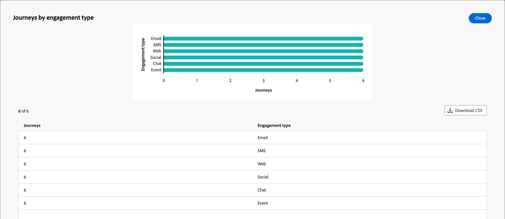

# Account Journeys Overview dashboard

This dashboard provides a comprehensive overview of your active account journeys, detailing account progress using circle and bar charts that categorize and quantify completions, and engagement activities. It helps Marketers evaluate the effectiveness of Email and SMS channels through key delivery and engagement metrics.

This overview is available for published account journeys, and it takes approximately four hours for data to start populating the charts and tables.

{width="700" zoomable="yes"}

## Journey completion rate distribution

This chart illustrates the distribution of journeys based on their completion rate, and is categorized into four distinct score bands. The central figure represents the total number of journeys, and provides a quick snapshot of overall progress. The segmented colors indicate the proportion of journeys within each score range, which allows you to assess completion trends at a glance.

To view more detailed information, click the **...** menu icon at the top right.

{width="500"}

## Journeys by engagement type

This bar chart displays the distribution of journeys based on the engagement type, and helps you identify which engagements were most used across journeys. Each bar represents a specific engagement type, with its length indicating the number of journeys with activities of that type. This visualization provides a clear and immediate understanding of engagement trends within your account journeys.

To view more detailed information, click the **...** menu icon at the top right.

{width="500"}

## Engage with the data

To engage with the data, use the **...** menu at the top-right of each chart.

### [!UICONTROL Drill through]

For the circle chart, choose **[!UICONTROL Drill through]** for an in-depth analysis of the data. 

{width="700" zoomable="yes"}

You can click the _More_ (**...**) menu at the top-righ and choose **[!UICONTROL View more]** to [view extended data](#view-more).

### [!UICONTROL View more]

Choose **[!UICONTROL View more]** to view extended data and insights.

{width="700" zoomable="yes"}

The displayed pop-up includes a chart and a table that show the breakdown of the journey data.

To download the data, click **[!UICONTROL Download CSV]** at the top right of the data table. To return to the _Overview_ dashboard, click **[!UICONTROL Close]**.
