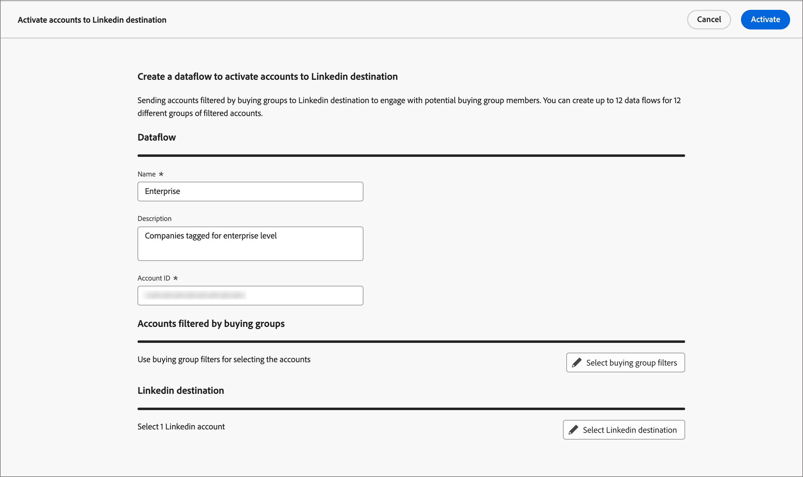
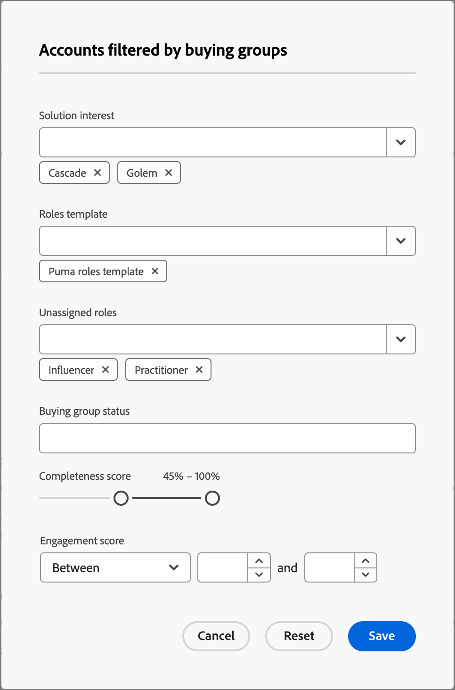

# LinkedIn Account Matched Audiences

Journey Optimizer B2B Edition offers the ability to generate LinkedIn Ad audiences through Account Matched Audiences, and is designed to help you fill empty roles in your buying groups. By defining a set of buying group filters, you can maintain a LinkedIn Matched Audience to target prospects who match your buying group parameters. This feature leverages Experience Platform Destinations to manage some aspects of the integration. There is a limit of ten dataflows.

Before you initiate a dataflow from Journey Optimizer B2B Edition, you must have at least one instance of the [(Companies) LinkedIn Matched Audience destination connector](https://experienceleague.adobe.com/en/docs/experience-platform/destinations/catalog/social/linkedin#connect) with a LinkedIn Campaign Manager account configured in your Experience Platform application.

## Configure a new LinkedIn account connection {#linkedin-destination-setup}

>[!CONTEXTUALHELP]
>id="ajo-b2b_linkedin_destination_setup"
>title="LinkedIn destination setup is required"
>abstract="Send accounts filtered by buying groups to a Linkedin destination to engage with potential buying group members. You can create up to 10 data flows for 10 different groups of filtered accounts. To get started with this feature, add a Linkedin destination first."

1. In Experience Platform, go to **[!UICONTROL Connections]** > **[!UICONTROL Destinations]** in the left navigation and select the **[!UICONTROL Catalog]** tab.

1. In the catalog, locate the **[!UICONTROL (Companies) LinkedIn Matched Audience]** connector and click **[!UICONTROL Set Up]**.

   {width="800" zoomable="yes"}

1. Select **[!UICONTROL New Account]** > **[!UICONTROL Connect to LinkedIn]**.

1. Provide your LinkedIn credentials and sign in.

   The LinkedIn account is connected as a destination.

## Update the account details
   
The name and description for the LinkedIn account are visible for buying groups in Journey Optimizer B2B Edition. It is a best practice to update this information so that it is easily identifiable for your Marketers working with buying groups. You can change the account details in the Experience Platform or Journey Optimizer B2B Edition UI.

1. Go to **[!UICONTROL Connections]** > **[!UICONTROL Destinations]** in the left navigation and select the **[!UICONTROL Accounts]** tab.

1. For the new account that you created, click the _More_ (**...**) menu and choose **[!UICONTROL Edit details]**.

    {width="800" zoomable="yes"}
   
1. In the dialog, update the name and description.

    {width="500"}

1. Click **[!UICONTROL Save]**.

## Activate the account for buying groups

>[!NOTE]
>
>If you already have ten dataflows, you cannot create another. If you are at the maximum, delete one in Experience Platform before you create a new one in Journey Optimizer B2B Edition. 

1. In Journey Optimizer B2B Edition, go to **[!UICONTROL Accounts]** > **[!UICONTROL Buying groups]** in the left navigation.

1. Select the **[!UICONTROL Browse]** tab.

1. Click **[!UICONTROL Activate to LinkedIn Destination]** at the top right.

   {width="800" zoomable="yes"}

1. Give the dataflow a descriptive name and description (optional). 

   After you save it, the name that you specify for the dataflow is prepended with _AJOB2B_ to aid in identifying the dataflow in Experience Platform.

1. Enter the [Account ID of your LinkedIn Campaign Manager Account](https://www.linkedin.com/help/lms/answer/a424270).

   You can find your Account ID by your Account Name in the Campaign Manager UI.

    {width="700" zoomable="yes"}

1. Click **[!UICONTROL Select buying group filters]** and define the parameters of your account audience.

   >[!IMPORTANT]
   >
   >At this time, filters cannot be edited after the dataflow is activated. Double-check your work before you activate the dataflow.

   {width="400"}

   For the **[!UICONTROL Engagement score]**, the operator `Between` is inclusive, as are percentage ranges. For example, 5.1 and 5 are both _between_ 5 and 6.

   Empty conditions are treated like `Is Any`.

   Click **[!UICONTROL Save]** to add the specified filters.

1. Click **[!UICONTROL Select LinkedIn destination]** and choose the configured LinkedIn destination that you want to use. 

   Upon activation, this setting creates the dataflow using the destination configuration and a corresponding virtual segment.

1. Double-check your settings and click **[!UICONTROL Activate]** at the top right.

   Click **[!UICONTROL Activate]** again in the confirmation dialog.

   A banner is displayed with a link to your dataflows menu in Experience Platform so that you can check the dataflow record.
