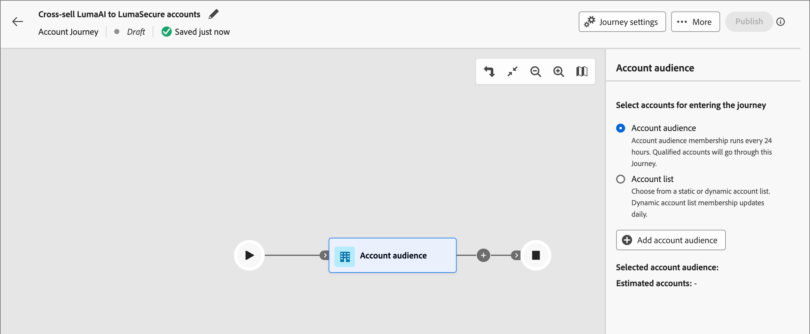
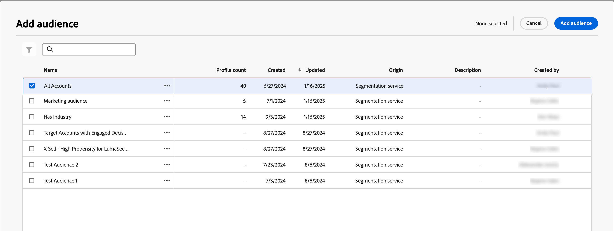

# Account audience journey nodes

The account audience node specifies which accounts enter the journey. When you [create an account journey](./create-publish-journey.md#create-a-journey), the journey always starts with an account audience node that defines its input.

Use one of the following input options for this journey node:

* **[Account audience](../audiences/account-audience-overview.md)** — The account audience represents the basic audience that syncs from Experience Platform Segmentation Service.
* **[Account list](../accounts/account-lists.md)** — The account list is a collection of named accounts that you use for targeted journey orchestration. An account list targets named accounts using defined criteria, such as industry, location, or company size.

## Set the audience for the account audience node

1. Click the **[!UICONTROL Account audience]** node. This action displays the node properties on the right.

   {width="700" zoomable="yes"}

1. Choose the input type for accounts entering the journey:

   * **[!UICONTROL Account audience]**

     Choose the account audience option. Then, click **[!UICONTROL Add account audience]**.

     In the _[!UICONTROL Add audience]_ dialog, select a previously created audience segment. Then, click **[!UICONTROL Add audience]**.

     {width="700" zoomable="yes"}

   * **[!UICONTROL Account list]**

     Choose the account list option. Click **[!UICONTROL Add account list]**.

     In the _[!UICONTROL Select live account list]_ dialog, select a published account list. Then, click **[!UICONTROL Save]**.

     {width="700" zoomable="yes"}

     For more information about creating and publishing account lists, see [Account lists](../accounts/account-lists.md).

## Create an audience segment

1. In the left navigation, select **[!UICONTROL Accounts]** > **[!UICONTROL Audiences]**.

1. Click **[!UICONTROL Create audience]** in the upper-right corner.

   {width="800" zoomable="yes"}

1. Follow the steps in the [Segmentation Service guide](https://experienceleague.adobe.com/en/docs/experience-platform/segmentation/types/account-audiences){target="_blank"}.
