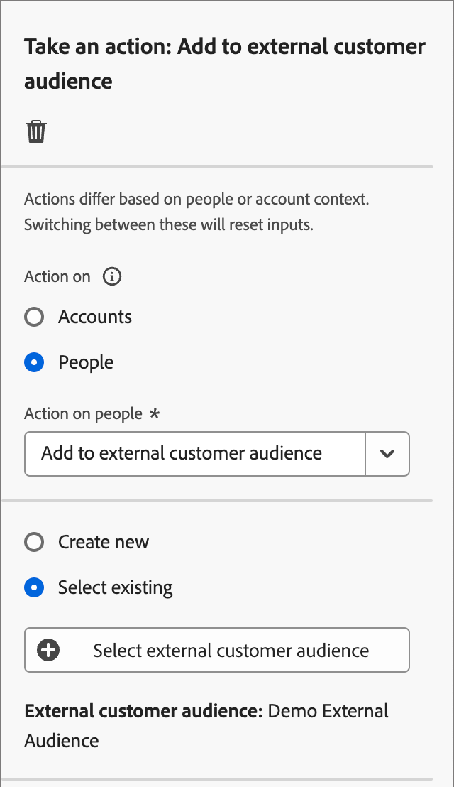
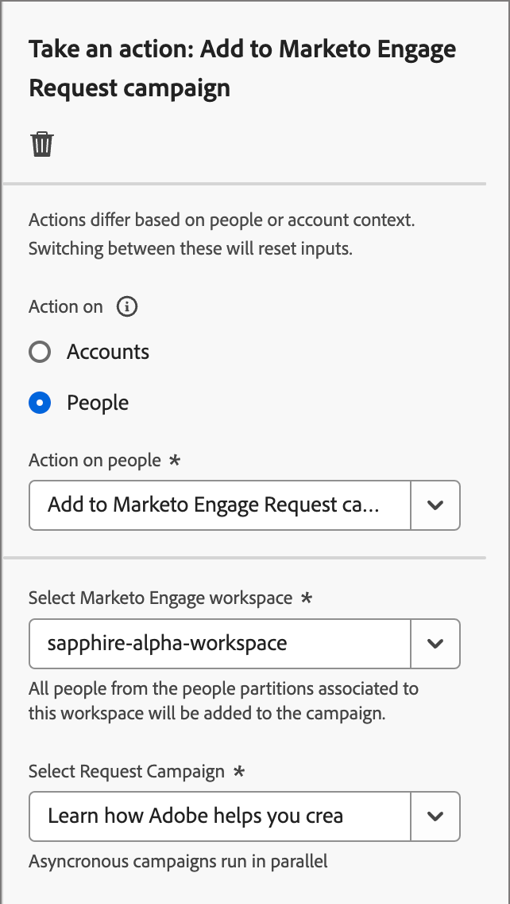

# Take an action

In your account journey, you can add a _[!UICONTROL Take an action]_ node to execute an action, such as send an email, change a score, assign to a buying group, and so on. Actions are typically what you want to happen as a result of some kind of trigger, such as an event or a previous action.

{width="30"} [Watch the overview video](#overview-video)

## Account actions

Use an action on accounts when you want to apply a change to all people that are part of accounts on the node path.

### Actions and constraints {#account-action-constraints}

| Action | Constraints |
| ------ | ----------- |
| [!UICONTROL Account Change Data Value] | Select attribute New value |
| [!UICONTROL Account Interesting Moment] | Type (email, milestone, or web) Description (optional)|
| [!UICONTROL Activate to destination] | Select a destination |
| [!UICONTROL Add Account to (other) Journey] | Select live account journey |
| [!UICONTROL Add to account list] | Select live static account list |
| [!UICONTROL Remove Account from Journey] | Select live account journey |
| [!UICONTROL Remove from account list] | Select a live static account list |
| [!UICONTROL Send Sales Alert] | Select solution interest Send email to|
| [!UICONTROL Update Buying Group Stage] | Select solution interest Select buying group stage |
| [!UICONTROL Update Buying Group Status] | Select solution interest Status (required, 50 characters max) |

### Add an account-based action

1. Navigate to the journey map.

1. Click the plus ( **+** ) icon on a path and choose **[!UICONTROL Take an action]**.

   {width="400"}

1. In the node properties on the right, choose **[!UICONTROL Accounts]** for the action.

1. Select an action from the list and set any values for the action.

   {width="700" zoomable="yes"}

>[!BEGINSHADEBOX]

### Activate to a LinkedIn destination

Use the _Activate to destination_ action for accounts to activate accounts to Experience Platform destinations directly from your journey. This action enables you to push qualified accounts (based on buying group filters, engagement scores, and other criteria) into matched audiences on supported destinations. It 

Starting with the 2025.10 release, **_LinkedIn_** is the first supported destination type. Use the action for a LinkedIn destination to streamline campaign execution by eliminating multi-system handoffs and reducing latency. For example, as a marketer, you can automatically activate high-intent accounts to LinkedIn for retargeting when key buying roles are missing, or re-engage dormant accounts based on inactivity filters.

For more information about using account matched audiences for a LinkedIn destination, see [LinkedIn Account Matched Audiences](../data/linkedin-account-matched-audiences.md).

+++ Set activation of accounts to a LinkedIn destination

1. With the _Take an action_ node selected in the journey canvas, set the **[!UICONTROL Action on accounts]** to **[!UICONTROL Activate to destination]**.

1. Click **[!UICONTROL Select destination]**.

   {width="600" zoomable="yes"}

1. In the dialog, select the configured LinkedIn destination and click **[!UICONTROL Save]**.

  {width="700" zoomable="yes"}

1. Enter the **[!UICONTROL Audience name]** that is used to identify the activated audience in the destination.

   {width="550" zoomable="yes"}   

+++

>[!ENDSHADEBOX]

## People actions

Use an action on people when you want to apply a change to all people on the node path. This node type can be used within the split path by people or split path by accounts.

### Actions and constraints {#people-action-constraints}

| Context | Action | Constraints |
| ------- | ------ | ----------- |
| [Journey Optimizer B2B](#journey-optimizer-b2b-actions) | [!UICONTROL Add to external customer audience] | Select external customer audience |
| | [!UICONTROL Assign to Buying Group] | Select solution interest Select role |
| | [!UICONTROL Change Data Value] | Select person attribute Set new value |
| | [!UICONTROL Change Score] | Score name Change in score|
| | [!UICONTROL Person Interesting Moment] | Type Description |
| | [!UICONTROL Remove from Buying Group] | Select solution interest |
| | [!UICONTROL Send email] | Create new email Select email from Marketo Engage |
| | [!UICONTROL Send SMS] | Create SMS |
| [Marketo Engage](#marketo-engage-actions) | [!UICONTROL Add to Marketo Engage Request campaign] | Select Marketo Engage workspace Select Request campaign |
| | [!UICONTROL Add to Marketo list]| Select name of external Marketo connection  List name |
| | [!UICONTROL Remove from Marketo list] | Select name of external Marketo connection  List name |

>[!NOTE]
>
>The _[!UICONTROL Change People Partition in Marketo Engage]_ action is deprecated for the 2025.10 release and is not available on the simplified architecture for Journey Optimizer B2B Edition.

### Add a people-based action

1. Navigate to the journey map.

1. Click the plus ( **+** ) icon on a path and choose **[!UICONTROL Take an action]**.

1. In the node properties on the right, choose **[!UICONTROL People]** for the action.

1. Select an action from the list and set any values for the action.

{width="700" zoomable="yes"}

### Journey Optimizer B2B actions

The Journey Optimizer B2B people-based actions are designed to manage communications through the configured channels and manage people categorization within your buying groups and accounts. The journey applies the action when a qualifying account with person profiles reaches the node.

+++[!UICONTROL Add to external customer audience]

Use this action to push people to an external audience that can be activated across a paid media channel to further target members of buying groups. This action is executed through Real-Time CDP B2B Edition.

>[!NOTE]
>
>When a qualifying account with person profiles reaches the _Add to external customer audience_ node in a published journey, it can take up to 48 hours for those profiles to populate in the external audience.

{width="300"}

When you select this people-based action, you can create a new external audience or select from the list of existing external audiences. 

* For existing audiences, you can choose from external customer audiences that were created in [!DNL Journey Optimizer B2B Edition] only.
* When you create an audience and use it for this journey action, make sure that you connect the destination. For more information, see [Create a new destination connection](https://experienceleague.adobe.com/en/docs/experience-platform/destinations/ui/connect-destination){target="_blank"} and [Activation overview](https://experienceleague.adobe.com/en/docs/experience-platform/destinations/ui/activate/activation-overview#activate-audiences-from-the-destinations-catalog){target="_blank"} in the Experience Platform documentation.

{width="30"} [Watch a video overview for paid media orchestration](../data/linkedin-account-matched-audiences.md#orchestrate-paid-media-engagement)

_To create an external audience:_

1. Choose **[!UICONTROL Create new]**.

1. Click **[!UICONTROL Create external customer audience]**.

1. Enter a **[!UICONTROL Name]** (required) and **[!UICONTROL Description]** (optional) for the new external audience. 

   {width="300"}

1. Click **[!UICONTROL Create]**.

   The system creates the new audience and displays a confirmation message. You can then proceed to use it as an existing audience for the node action.

   >[!NOTE]
   >
   >When a new external customer audience is created from Journey Optimizer B2B Edition, it is seeded with a dummy record (`test@email.com`). This record is overwritten as soon as the first real profile is added to the external audience from the journey.

_To use an existing audience:_

1. Click **[!UICONTROL Select external customer audience]**.

1. In the dialog, select the audience that you want to use.

   {width="700" zoomable="yes"}

1. Click **[!UICONTROL Add audience]**.

+++

+++[!UICONTROL Assign to Buying Group]

Use this action to add people profiles to a [buying group](../buying-groups/buying-groups-overview.md) based on a selected solution interest and role. 

{width="300"}

+++

+++[!UICONTROL Change Data Value]

Use this action to change the value of a [people profile attribute](../admin/field-mapping.md#xdm-business-person-attributes). Select the attribute and then set the new value.

{width="300"}

+++

+++[!UICONTROL Change Score]

Use this action to change the person score in Marketo Engage. [Learn more](https://experienceleague.adobe.com/en/docs/marketo-learn/tutorials/lead-and-data-management/lead-scoring-learn){target="_blank"}

{width="300"}

+++

+++[!UICONTROL Person Interesting Moment]

Use this action to log an interesting moment for people. Choose a type (Email, Milestone, or Web) and add a description (optional).

{width="300"}

+++

+++[!UICONTROL Remove from Buying Group]

Use this action to remove people profiles from a [buying group](../buying-groups/buying-groups-overview.md) based on a selected solution interest. 

{width="300"}

+++

+++[!UICONTROL Send email]

Use this action to send an email. After you [create the email](../content/add-email.md#add-an-email-to-your-journey) for the node, you can design, personalize, and preview email messages in the email design space (see [Email authoring](../content/email-authoring.md)). You can also send an [email from Marketo Engage](https://experienceleague.adobe.com/en/docs/marketo/using/product-docs/email-marketing/general/creating-an-email/create-an-email){target="_blank"}. Select the Marketo Engage workspace and then select the email to send.

{width="300"}

+++

+++[!UICONTROL Send SMS]

Use this action to send an SMS message. You can create, personalize, and preview SMS messages in the visual design space (see [SMS authoring](../content/sms-authoring.md)).

{width="300"}

+++

### Marketo Engage actions

The Marketo Engage people-based actions are designed to coordinate your account-based marketing orchestration in Journey Optimizer B2B Edition with your lead-based marketing efforts in Marketo Engage. Use these actions to orchestrate list membership and request campaigns.

>[!NOTE]
>
>The Marketo Engage actions require configured integration with one or more external Marketo Engage instances. <!-- For detailed information about configuring these connections, see #. -->

For example, you might want to suppress campaigns in Marketo Engage for people that are part of buying groups in Journey Optimizer B2B Edition. In this case, you can create a static list in Marketo Engage specifically for the solution interest. Then, on a split path by buying group, use the _Add to Marketo list_ action from a journey node. This action adds buying group members to a particular static list in a connected Marketo Engage instance. Then, use the solution interest focused static list for a smart list filter in Marketo Engage.

+++[!UICONTROL Add to Marketo Engage Request campaign]

Use this action to add people profiles to a [request campaign](https://experienceleague.adobe.com/en/docs/marketo/using/product-docs/core-marketo-concepts/smart-campaigns/flow-actions/request-campaign){target="_blank"} in Marketo Engage.

First, select a connected Marketo Engage instance. Next, select the request campaign name.

{width="300"}

+++

+++[!UICONTROL Add to Marketo list]

Use this action to add people to a [Static List](https://experienceleague.adobe.com/en/docs/marketo/using/product-docs/core-marketo-concepts/smart-lists-and-static-lists/static-lists/understanding-static-lists){target="_blank"} in Marketo Engage. 

First, select a connected Marketo Engage instance. Next, select the list name.

{width="300"}

+++

+++[!UICONTROL Remove from Marketo list]

Use this action to remove people from a [Static List](https://experienceleague.adobe.com/en/docs/marketo/using/product-docs/core-marketo-concepts/smart-lists-and-static-lists/static-lists/understanding-static-lists){target="_blank"} in Marketo Engage. 

First, select a connected Marketo Engage instance. Next, select the list name.

{width="300"}

+++

## Overview video

>[!VIDEO](https://video.tv.adobe.com/v/3443207/?learn=on)
