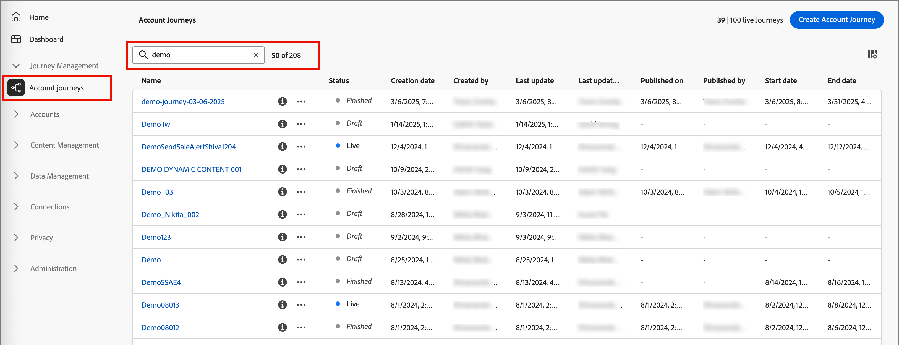

# Journey management

In Journey Optimizer B2B Edition, journeys are automated, multistep account and lead-based marketing plans that orchestrate personalized  experiences across channels in response to engagement, business events, or scheduled campaigns. Define sales-driven engagement that includes email, SMS, and more in to coordinate inbound marketing with outbound sales activities for each buying group member.

Journey Optimizer B2B Edition supports two journey types:

* **Account journeys** - Streamline demand generation and buying group qualification and drive more qualified demand for your acquisition, upsell/cross-sell, and retention programs. Tailor your journeys for each buying group and buying group member using automated engagement across email, SMS, events, and more.

   {width="30"} [Watch the account journey overview video](#overview-video)

* **Person journeys** - (Beta) Orchestrate lead-based marketing using Experience Platform audiences and data. With person journeys, your Marketing Operations are not reliant on Marketo Engage or workarounds for Adobe Campaign/B2C tool chains so that they can work with B2B use cases.

   When used in concert with account journeys and buying groups, a person journey can provide marketers with the power to apply full orchestration to the buying journey.

   +++Current limitations for person journeys
   
   There are limitations that could block certain use cases or cause difficulty creating person journeys. Many issues are a result of the initial beta program implementation, to be addressed in the future.
   
   * Events cannot be combined with profile attributes to narrow down audience definitions.
   * The context of the event that qualifies a profile for a journey cannot be used for personalization or orchestration.
   * Journeys cannot currently have both an event and profile segment entry criteria.
   * Event listeners cannot listen for multiple events.
   * Wait nodes currently do not have a full suite of options for day of the week or time of day exit criteria.
   * The email editor incorrectly references capabilities and attributes that are only available for Account Journeys
   * Support for custom journey tokens (_My Tokens_) is not yet available.
   * Add and Remove from person journey nodes is not currently available from either journey type. 
   * Event history cannot be used for orchestration or personalization.
   * Related objects (such as account, buying group, opportunity, and custom objects) cannot be used for orchestration or personalization.
   * Web, SMS, and ad platform channels are not currently supported.

   +++

## Get started with a journey

To get started with your first journey:

1. [Create a journey](./create-publish-journey.md#create-a-journey).
1. [Add the nodes](./create-publish-journey.md#add-a-node) and [define the journey flow](./create-publish-journey.md#add-and-delete-a-path) in the journey map.
1. [Publish the journey](./create-publish-journey.md#publish-a-journey).

## Access and browse your journeys

>[!BEGINTABS]

>[!TAB Account journeys]

On the left navigation, expand **[!UICONTROL Journey Management]** and click **[!UICONTROL Account journeys]**.

Enter text in the  _Search_ tool at the top of the list to filter the displayed list by name. 

{width="800" zoomable="yes"}

The _[!UICONTROL Account Journeys]_ list page includes the following columns:

* [!UICONTROL Name] (click the name to open the journey for editing)
* [!UICONTROL Status]
* [!UICONTROL Description] 
* [!UICONTROL Created by]
* [!UICONTROL Last updated at]
* [!UICONTROL Last updated by]
* [!UICONTROL Published on]
* [!UICONTROL Published by]

You can sort the list by _[!UICONTROL Status]_ by clicking the column header.

>[!TAB Person journeys (Beta)]

[!BADGE Beta]{type=Informative tooltip="Available as a beta feature on the simplified architecture"}

On the left navigation, expand **[!UICONTROL Journey Management]** and click **[!UICONTROL Person journeys]**.

Enter text in the _Search_ tool at the top of the list to filter the displayed list by name. 

{width="800" zoomable="yes"}

The _[!UICONTROL Person Journeys]_ list page includes the following columns:

* [!UICONTROL Name] (click the name to open the journey for editing)
* [!UICONTROL Status]
* [!UICONTROL Description] 
* [!UICONTROL Created by]
* [!UICONTROL Last updated at]
* [!UICONTROL Last updated by]
* [!UICONTROL Published on]
* [!UICONTROL Published by]

You can sort the list by _[!UICONTROL Status]_ by clicking the column header.

>[!ENDTABS]

### Customize column display

You can customize the columns that are displayed in the table by clicking the _Customize table_ (  ) icon in the top-right corner. Select or clear the checkboxes in the dialog and click **[!UICONTROL Apply]**. 

{width="800" zoomable="yes"}

### Journey status

The status of a journey can change based on the actions that you apply. Based on the status of a journey, certain actions are/are not available from the right side of the header.

| Status | Description | Available actions |
| ------ | ----------- | ----------------- |
| _**Draft**_ | An unpublished journey that is editable. |<li>[Publish](./create-publish-journey.md#publish-a-journey)<li>[Duplicate](#duplicate-journey) <li>[Delete](#delete-journey) |
| _**Live**_ | Journey status changes from _Draft_ to _Live_ when a journey is published. In this state, it is no longer editable. | <li>[Duplicate](#duplicate-journey)<li>[Close to new entries](#close-to-new-entries) <li>[Abort](#abort-journey) |
| _**Closed to new entries**_ | The journey status changes from _Live_ to _Closed to new entries_ when you click [!UICONTROL Close to new entries] in the top navigation. | <li>[Duplicate](#duplicate-journey) <li>[Abort](#abort-journey) |
| _**Aborted**_ | Journey status changes from _Live_ or _Closed to new entries_ when you abort a journey. An aborted journey cannot be restarted. | <li>[Duplicate](#duplicate-journey) <li>[Delete](#delete-journey)  |
| _**Finished**_ | When all accounts in a journey complete the journey, the status changes from _Live_ or _Closed to new entries_ to _Finished_.| <li>[Duplicate](#duplicate-journey) <li>[Delete](#delete-journey) |

## Journey maps

Click the name (displayed as a link) in the journeys list to review the details, make changes, and take actions.

{width="800" zoomable="yes"}

The header of each journey map includes: 

* Journey name
* Edit tool for the journey name (  _Edit_ icon)
* [Status](#journey-status) of the journey

From the journey map, you can [Add the nodes](./create-publish-journey.md#add-a-node) and [define the journey flow](./create-publish-journey.md#add-and-delete-a-path).

## Journey actions

The journeys list page includes all account or person journeys in your Journey Optimizer B2B Edition instance. From the list page, you can apply a number of actions to a journey.

### Abort journey

If you abort (stop) a live or scheduled journey, accounts or people in the journey immediately stop their progress, and no further journey entrance can happen. An aborted journey cannot be restarted. 

>[!IMPORTANT]
>
>When the journey is used in another journey from a _Take an action_ node with the _[!UICONTROL Add Account to (other) Journey]_ action, aborting the journey blocks that action in that journey.

1. Click the journey name to open it.

1. Click the **[!UICONTROL More...]** menu at the top right and choose **[!UICONTROL Abort]**.

   {width="450"}

1. In the confirmation dialog, click **[!UICONTROL Abort]**.

### Close to new entries

If you close a live journey, accounts that are currently in the journey continue their path in that journey and no further journey entrance can happen. A closed journey cannot be restarted. You can duplicate a closed journey.

>[!IMPORTANT]
>
>When the journey is used in another journey from a _Take an action_ node with the _[!UICONTROL Add Account to (other) Journey]_ action, closing it to new entries blocks that action from that journey.

1. Click the journey name to open it.

1. Click the **[!UICONTROL More...]** menu at the top right and choose **[!UICONTROL Close to new entries]**.

1. In the confirmation dialog, click **[!UICONTROL Close to new entries]**.

### Duplicate a journey

A duplicate action is similar to a clone function, but a duplicated journey does not include any created journey content assets. You can duplicate the details for the journey, or just a simple _skeleton_ of the flow and path structure.

>[!NOTE]
>
>This action is not currently available for person journeys.

1. Click the _More_ icon (**...**) next to the journey name and choose **[!UICONTROL Duplicate]**.

   {width="450"}

   Depending on the status of the journey, you can also access the duplicate action from the journey details or journey map:

   * For a draft journey, click the **[!UICONTROL More...]** menu at the top right and choose **[!UICONTROL Duplicate]**.

   * For all other journey statuses, click **[!UICONTROL Duplicate]** at the top right.

     {width="450"}

1. In the _Duplicate Journey_ dialog, set the **[!UICONTROL Name]** and **[!UICONTROL Description]** for the new journey.

   By default, the dialog uses the name of the duplicated journey appended with __copy_. Enter another unique name for the journey as needed.

   {width="400"}

1. Choose the duplication **[!UICONTROL Type]**:

   * **[!UICONTROL Partial content duplication]** - Use this type to copy everything in the journey, excluding any created emails or SMS messages. Nodes that reference a Marketo Engage email or SMS message are fully intact.

   * **[!UICONTROL Duplicate without details]** - Use this type copy only the node structure and paths. All node settings and path conditions are undefined (default), so that you can reuse the basic flow with different audience, actions, and path segmentation settings. All _Wait_ nodes use the default of five days.

1. Click **[!UICONTROL Duplicate]**.

   The duplicated journey opens in the journey map, where you can set the details and create journey content as needed.

### Delete a journey

Use a delete action to delete a journey permanently. You cannot delete a live or scheduled journey.

1. Click the _More_ icon (**...**) next to the journey name and choose **[!UICONTROL Delete]**.

    Depending on the status of the journey, you can also access the delete action from the journey details or journey map:

   * For a draft journey, click the **[!UICONTROL More...]** menu at the top right and choose **[!UICONTROL Delete]**.

   * For other journey statuses, such as _Finished_ or _Aborted_, click **[!UICONTROL Delete]** at the top right.

1. In the confirmation dialog, click **[!UICONTROL Delete]**.

## Review account progression

For a published account journey that is in a _Live_, _Closed to new entries_, _Aborted_, or _Finished_ status, you can open the journey map to review the account progression for the journey nodes. Each node on the map displays the number of accounts to reach that node and, for live journeys, the number of accounts currently at that node.

{width="400"}

When you select the node, click the number to view a list of accounts that entered the node or are currently at that step of the journey. 

{width="700" zoomable="yes"}

## Account journey overview video {#overview-video}

>[!VIDEO](https://video.tv.adobe.com/v/3443202/?learn=on)
