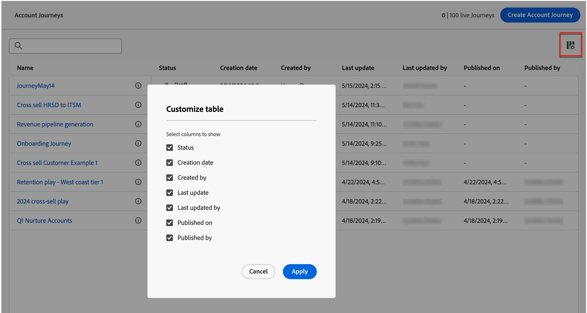

# Account journeys

Build and execute journeys that are tailored for each buying group and buying group member using automated engagement across email, SMS, events,  and more. WIth account journeys you can streamline demand generation and buying group qualification and drive more qualified demand for your acquisition, upsell/cross-sell, and retention programs.

Define sales-driven engagement that includes email, SMS, and more inside account journeys to coordinate inbound marketing with outbound sales activities for each buying group member.

{width="30"} [Watch the overview video](#overview-video)

## Access and browse account journeys

1. In your Adobe Experience Platform home page, click Adobe Journey Optimizer B2B Edition.

1. On the left navigation, click **[!UICONTROL Account journeys]**.

   {width="800" zoomable="yes"}

   The displayed journeys page includes the following columns:

   * [!UICONTROL Name] (click the name to open the account journey for editing)
   * [!UICONTROL Status]
   * [!UICONTROL Description] 
   * [!UICONTROL Created by]
   * [!UICONTROL Last updated at]
   * [!UICONTROL Last updated by]
   * [!UICONTROL Published on]
   * [!UICONTROL Published by]

  This table includes the ability to search by Name and Created by. Sort is currently unavailable.

You can customize the displayed table by clicking the _Columns_ icon in the top-right corner and selecting or clearing the checkboxes. 

{width="800" zoomable="yes"}

## Anatomy of an account journey

Click the name (displayed as a link) in the _[!UICONTROL Account journeys]_ list to review the details, make changes, and take actions.

{width="800" zoomable="yes"}

The editor header of each account journey includes: 

* Journey name
* Ability to edit the name (_Edit_ icon)
* Status of the journey

The following actions are available in the header:

* **Publish** - You can publish a journey if there are no blocker errors. When published, the journey status changes to _Live_. If the journey has errors, the button is dimmed with content information: `Resolve errors before publishing`.
* **Duplicate** - This action is similar to a clone function, but the duplicated journey does not include any assets.
* **Close to new entries** - If you close a journey, accounts currently in the journey continue their path in the journey and no further journey entrance can happen. A closed journey cannot be restarted. You can duplicate a closed journey.
* **Abort** - If you stop a journey, accounts in the journey immediately stop their progress and no further journey entrance can happen. A stopped journey cannot be restarted. If you block new entrances without stopping people's progress, consider closing the journey instead.
* **Delete** - This action permanently deletes the journey.

The status of a Journey changes based on the actions that you apply. Based on the status of a journey, certain actions are/are not available in the header.

| Status | Description | Available actions |
| ------ | ----------- | ----------------- |
| _**Draft**_ | An unpublished journey that is editable. |<ul><li>Publish</li><li>Duplicate </li><li>Delete </li></ul> |
| _**Live**_ | Journey status changes from Draft to Live when a journey is published. In this state, it is no longer editable. | <ul><li>Duplicate </li><li>Close to new entries </li><li>Abort </li></ul> |
| _**Closed to new entries**_ | The journey status changes from _Live_ to _Closed to new entries_ when you click [!UICONTROL Close to new entries] in the top navigation. | <ul><li>Duplicate </li><li>Abort </li></ul> |
| _**Aborted**_ | Journey status changes from _Live_ or _Closed to new entries_ when you abort a journey. An aborted journey cannot be restarted. | <ul><li>Duplicate </li><li>Delete </li></ul> |
| _**Finished**_ | When all accounts in a journey complete the journey, the status changes from Live or Closed to new entries to Finished.| <ul><li>Duplicate </li><li>Delete </li></ul> |

## Get started with a journey

To get started with account journeys:

1. [Create a journey](./create-publish-journey.md#create-an-account-journey).
1. [Add the nodes](./create-publish-journey.md#add-a-node) and [define the journey flow](./create-publish-journey.md#add-and-delete-a-path) in the journey map.
1. [Publish the journey](./create-publish-journey.md#publish-an-account-journey).

## Overview video

>[!VIDEO](https://video.tv.adobe.com/v/3443202/?learn=on)
