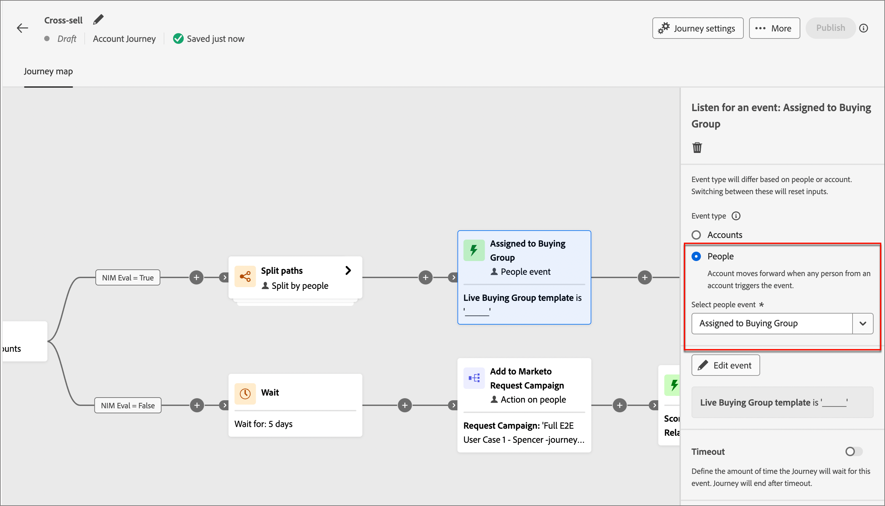
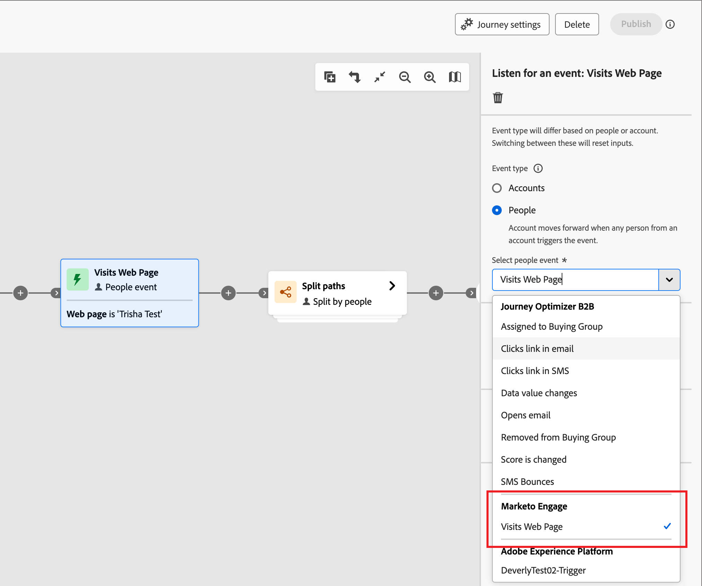
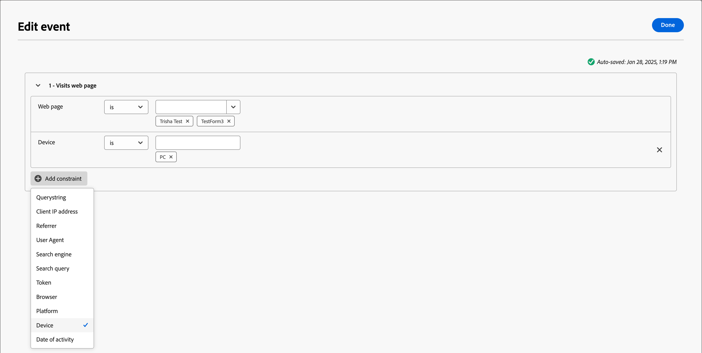
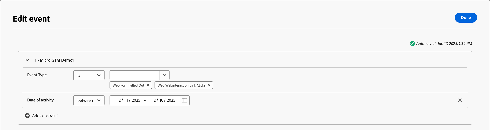

# Listen for an event

Add the _Listen for an event_ node to move your audience forward to the next step in the account journey when an event occurs.

{width="30", vertical-align="middle"} [Watch the overview video](#overview-video)

>[!NOTE]
>
>You cannot add this node type on split path by people.

## Account events

Listen for an event based on the account when you want to move the account forward in the journey according to events triggered by account activity.

### Events and constraints

| Event | Constraints |
| ----- | ----------- |
| [!UICONTROL Account had interesting moment] | Type (Email, Milestone, or Web) Additional constraints (optional): <li>Description</li><li>Source</li><li>Date of activity</li>  Timeout (optional) |
| [!UICONTROL Change in Account Data Value] | Attribute Additional constraints (optional): <li>New value</li><li>Previous value</li><li>Date of activity</li>  Timeout (optional) |
| [!UICONTROL Change in Buying Group Stage] | Solution interest Additional constraints (optional): <li>New stage</li><li>Previous stage</li><li>Date of activity</li>  Timeout (optional) |
| [!UICONTROL Change in Buying Group Status] | Solution interest Additional constraints (optional): <li>New status</li><li>Previous status</li><li>Date of activity</li>  Timeout (optional) |
| [!UICONTROL Change in Completeness Score] | Solution interest Additional constraints (optional): <li>New score</li><li>Previous score</li><li>Date of activity</li>  Timeout (optional) |
| [!UICONTROL Change in Engagement Score] | Solution interest Additional constraints (optional): <li>New score</li><li>Previous score</li><li>Date of activity</li>  Timeout (optional) |

### Add an account event

1. Navigate to the journey map.

1. Click the plus ( **+** ) icon on a path and choose **[!UICONTROL Listen for an event]**.

1. In the node properties on the right, choose **[!UICONTROL Accounts]** for the event type.

   {width="700" zoomable="yes"}

1. Select an event from the list.

1. Click **[!UICONTROL Edit event]** and define details for the event.

## People events

Listen for an event based on people when you want to move the account forward in the journey according to events triggered by people activity. You can also filter events according to people attributes, 

### Events and constraints

| Input type | Event | Constraints |
| ---------- | ----- | ----------- |
| Journey Optimizer B2B | [!UICONTROL Assigned to Buying Group] | Solution interest  Additional constraints (optional): <li>Role</li><li>Date of activity</li> Timeout (optional) |
| | [!UICONTROL Clicks link in email] | Email  Additional constraints (optional): <li>Link</li><li>Link ID</li><li>Is mobile device</li><li>Device</li><li>Platform</li><li>Browser</li><li>Is predictive content</li><li>Is bot activity</li><li>Bot activity pattern</li><li>Browser</li><li>Date of activity</li><li>Min. number of times</li> Timeout (optional) |
| | [!UICONTROL Clicks link in SMS] | Email  Additional constraints (optional): <li>Link</li><li>Device</li><li>Platform</li><li>Date of activity</li><li>Min. number of times</li> Timeout (optional) |
| | [!UICONTROL Data value changes] | Person attribute  Additional constraints (optional): <li>New value</li><li>Previous value</li><li>Reason</li><li>Source</li><li>Date of activity</li><li>Min. number of times</li> Timeout (optional) |
| | [!UICONTROL Opens email] | Email  Additional constraints (optional): <li>Link</li><li>Link ID</li><li>Is mobile device</li><li>Device</li><li>Platform</li><li>Browser</li><li>Is predictive content</li><li>Is bot activity</li><li>Bot activity pattern</li><li>Browser</li><li>Date of activity</li><li>Min. number of times</li> Timeout (optional) |
| | [!UICONTROL Removed from Buying Group] | Solution interest Date of activity (optional) Timeout (optional) |
| | [!UICONTROL Score is changed] | Score name  Additional constraints (optional):<li>Change</li><li>New score</li><li>Urgency</li><li>Priority</li><li>Relative score</li><li>Relative urgency</li><li>Date of activity</li><li>Min. number of times</li> Timeout (optional) |
| | [!UICONTROL SMS Bounces]| SMS message  Additional constraints (optional): <li>Date of activity</li><li>Min number of times</li> Timeout (optional) |
| Marketo Engage | [!UICONTROL Visits Web Page] | Web page   Select one or more Marketo Engage pages to match.   Additional constraints (optional): <li>Querystring</li><li>Client IP address</li><li>Referrer</li><li>User Agent</li><li>Search engine</li><li>Search query</li><li>Token</li><li>Browser</li><li>Platform</li><li>Device</li><li>Date of activity</li> |
| | [!UICONTROL Fills out form] | Form   Select one or more Marketo Engage forms to match.   Additional constraints (optional): <li>Date of activity</li><li>Querystring</li><li>Client IP address</li><li>Referrer</li><li>User agent</li><li>Platform</li><li>Device</li> Timeout (optional) |
| Adobe Experience Platform | [!UICONTROL Event definition] | Event type   Additional constraints (optional): <li>Fields</li>  Additional constraints (not supported): <li>Date of activity</li><li>Min. number of times</li>  Timeout (optional) |

### People event filters

| Filters | Description |
| ------------ | ----------- |
| [!UICONTROL Activity history] > [!UICONTROL Email] | Email activities based on conditions that are evaluated using one or more selected email messages from earlier in the journey: <li>[!UICONTROL Clicked link in email] <li>Opened email <li>Was delivered by email <li>Was sent email <!--  **[!UICONTROL Switch to inactivity filter]** - Use this option to filter based on lack of activity (a person did not have the email activity).-->|
| [!UICONTROL Activity history] > [!UICONTROL SMS Message] | SMS activities based on conditions that are evaluated using one or more selected SMS messages from earlier in the journey: <li>[!UICONTROL Clicked link in SMS] <li>[!UICONTROL SMS Bounced] <!--   **[!UICONTROL Switch to inactivity filter]** - Use this option to filter based on lack of activity (a person did not have the SMS activity). --> |
| [!UICONTROL Activity history] > [!UICONTROL Data Value Changed] | For a selected person attribute, a value change occurred. These change types include: <li>New value<li>Previous value<li>Reason<li>Source<li>Date of activity<li>Min. number of times <!--   **[!UICONTROL Switch to inactivity filter]** - Use this option to filter based on lack of activity (a person did not have a data value change). --> |
| [!UICONTROL Activity history] > [!UICONTROL Had Interesting Moment] | Interesting moment activity that is defined in the associated Marketo Engage instance. Constraints include: <li>Milestone<li>Email<li>Web <!--  **[!UICONTROL Switch to inactivity filter]** - Use this option to filter based on lack of activity (a person did not have an interesting moment).--> |
| [!UICONTROL Activity history] > [!UICONTROL Visited web page] | Web page activity that for one or more web pages managed by the associated Marketo Engage instance. Constraints include: <li>Web page (required)<li>Date of activity<li>Client IP address <li>Querystring <li>Referrer <li>User agent <li>Search engine <li>Search query <li>Personalized URL <li>Token <li>Browser <li>Platform <li>Device <li>Min. number of times <!--  **[!UICONTROL Switch to inactivity filter]** - Use this option to filter based on lack of activity (a person did not visit the web page). --> |
| [!UICONTROL Person Attributes] | Attributes from the person profile, including: <li>City <li>Country <li>Date of birth <li>Email address <li>Email invalid <li>Email suspended <li>First name <li>Inferred state region<li>Job title <li>Last name <li>Mobile phone number <li>Person engagement score <li>Phone number <li>Postal code <li>State <li>Unsubscribed <li>Unsubscribed reason |
| [!UICONTROL Special filters] > [!UICONTROL Member of Buying Group] | The person is or is not a buying group member evaluated against one or more of the following criteria: <li>Solution Interest</li><li>Buying Group status</li><li>Completeness Score</li><li>Engagement Score</li><li>Role</li>|
| [!UICONTROL Special filters] > [!UICONTROL Member of List] | The person is or is not a member of one or more Marketo Engage lists. |
| [!UICONTROL Special filters] > [!UICONTROL Member of Program] | The person is or is not a member of one or more Marketo Engage programs. |

### Add a people event

1. Navigate to the journey map.

1. Click the plus ( **+** ) icon on a path and choose **[!UICONTROL Listen for an event]**.

1. In the node properties on the right, choose **[!UICONTROL People]** for the event type.

   {width="700" zoomable="yes"}

1. Select an event from the list.

1. Click **[!UICONTROL Edit event]** and define details for the event.

### Listen for a Marketo Engage event

If you have web pages in your connected Marketo Engage instance, you can trigger an event based on a visit/no visit to these web pages, as well as Marketo Engage forms that were/were not filled. 

1. Select a **[!UICONTROL Listen for an event]** node in the journey map.

1. In the node properties on the right, choose **[!UICONTROL People]** for the event type.

1. Click the arrow for the **[!UICONTROL Select people event]** selector and scroll the menu to the **[!UICONTROL Marketo Engage]** section.

1. Select a Market Engage activity type:

   * **[!UICONTROL Visits Web Page]**.
   * **[!UICONTROL Fills Out Form]**

   {width="700" zoomable="yes"}

1. Click **[!UICONTROL Edit event]** and define one or more web pages to match and any additional constraints for the event.

   * (Required) In the _[!UICONTROL Edit event]_ dialog, define the **[!UICONTROL Web page]** or **[!UICONTROL Fills out form]** constraint. Use **[!UICONTROL is]** (default) to match on one or more selected pages or forms. Use **[!UICONTROL is not]** to match on all page visits/forms with the exclusion of one or more selected pages/forms. Or, use **[!UICONTROL is any]** to match on any Marketo Engage web page visit or filled form.

   * (Optional) Click **[!UICONTROL Add constraint]** and choose the field that you want to use for the constraint. Set the operator and the value for the field.

     {width="700" zoomable="yes"}

     You can repeat this action to include additional field constraints as needed.

   * If needed, select the **[!UICONTROL Filters]** tab to [add filters for the event](#add-a-filter-to-the-people-event).

   * When the constraints and filters are defined, click **[!UICONTROL Done]**.

1. If needed, set the **[!UICONTROL Timeout]** option to limit the time period to listen for the event (see [Add a timeout to an event node](#add-a-timeout-to-an-event-node)). 

1. In the journey map, add the next node to execute when the event occurs.

### Listen for an Experience Event

Administrators can configure Adobe Experience Platform (AEP)-based event definitions, which enable Marketers to create account journeys that react to [AEP Experience Events](https://experienceleague.adobe.com/en/docs/experience-platform/xdm/classes/experienceevent){target="_blank"}. Using AEP experience events in account journeys is a two-step process:

1. [Create and publish an AEP event definition](../admin/configure-aep-events.md).

2. In an account journey, add a _Listen for an event_ node, and select an Experience Platform event definition for a people-based event.

{width="30", vertical-align="middle"} [Watch the video overview](../admin/configure-aep-events.md#overview-video)

_To include an Experience Event in your journey:_

1. Select a **[!UICONTROL Listen for an event]** node in the journey map.

1. In the node properties on the right, choose **[!UICONTROL People]** for the event type.

1. Click the arrow for the **[!UICONTROL Select people event]** selector and scroll the menu to the **[!UICONTROL Adobe Experience Platform]** section.

   {width="700" zoomable="yes"}

1. Select the event.

   The event type is displayed as empty in the node details.

   {width="400" zoomable="yes"}   

1. Click **[!UICONTROL Edit event]** and define the event types and any additional constraints for the event.

   * (Required) In the _[!UICONTROL Edit event]_ dialog, define the event type. You can use the default **[!UICONTROL is]** operator to match on one or more selected event types. Or you can use the **[!UICONTROL is not]** operator to match on all event types with the exclusion of one or more selected event types.

   * (Optional) Click **[!UICONTROL Add constraint]** and choose the field that you want to use for the constraint. Set the operator and the value for the field.
  
     {width="700" zoomable="yes"}

     >[!NOTE]
     >
     >The constraints for _date of activity_ and _minimum number of times_ are not supported.

     You can repeat this action to include additional field constraints as needed.

   * If needed, select the **[!UICONTROL Filters]** tab to [add filters for the event](#add-a-filter-to-the-people-event).

   * When the constraints and filters are defined, click **[!UICONTROL Done]**.

1. If needed, set the **[!UICONTROL Timeout]** option to limit the time period to listen for the event (see [Add a timeout to an event node](#add-a-timeout-to-an-event-node)). 

1. In the journey map, add the next node to execute when the event occurs.

1. Complete the remaining nodes for your journey and [publish it](./journey-overview.md).

   When the journey is live (published) and reaches the _Listen for an event_ node, it begins listening for AEP Experience Events.

### Add filters to the people event

1. After you define the event, select the **[!UICONTROL Filters]** tab in the _[!UICONTROL Edit Event]_ dialog.

   {width="700" zoomable="yes"}

1. Add one or more filters to target the people for the event.

   * Drag and drop any of the [people filters](#people-event-filters) from the left navigation and complete the match definition.

      >[!NOTE]
      >
      >If you have custom person fields defined in the account audience schema in Experience Platform, these fields are also available under **[!UICONTROL Attributes]** to use as person attributes in filters. 

   * Fine tune your filtering by applying the **[!UICONTROL Filter logic]** at the top. You choose to match all filters or any filter.

      {width="700" zoomable="yes"}

   * Click **[!UICONTROL Done]**.

## Add a timeout to an event node

If needed, define the amount of time the journey waits for the event. The journey ends after a timeout unless you define a timeout path, where you can add other nodes.

1. Enable the **[!UICONTROL Timeout]** option.

1. Select the duration for which the journey waits for an event to occur before it times out.

   You can choose to end the path here or take a different course of action by setting another path.

1. To create a new path in the journey where you can add actions and events applicable to accounts when the event does not occur, select the **[!UICONTROL Set timeout path]** check box.

   {width="700" zoomable="yes"}

## Overview video

>[!VIDEO](https://video.tv.adobe.com/v/3443219/?learn=on)
