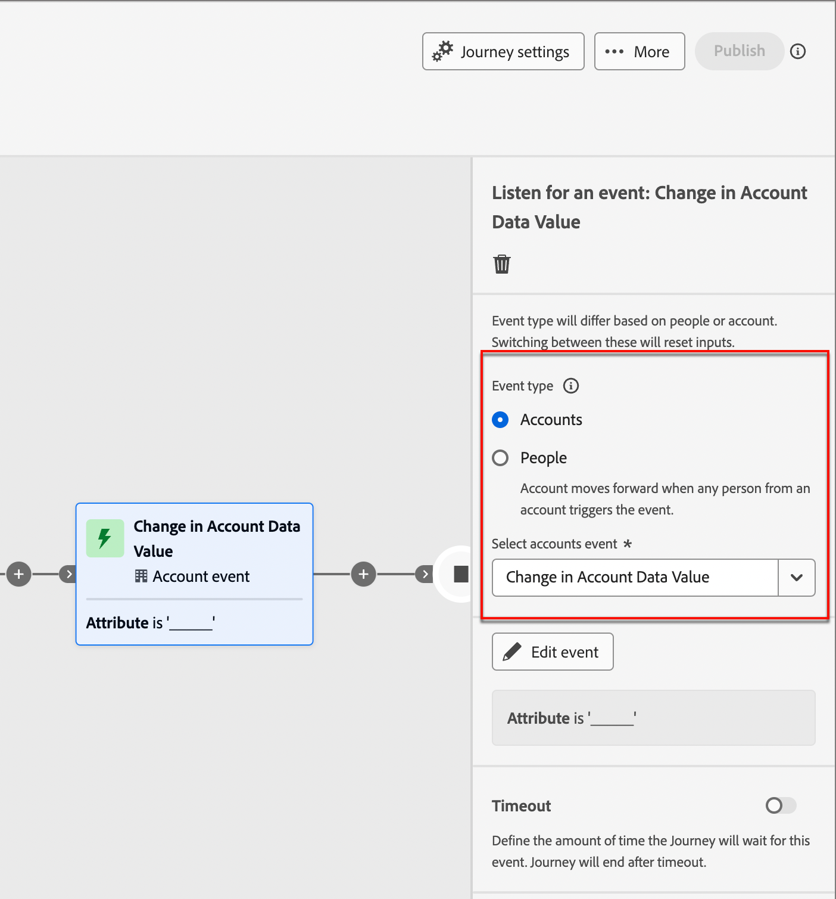
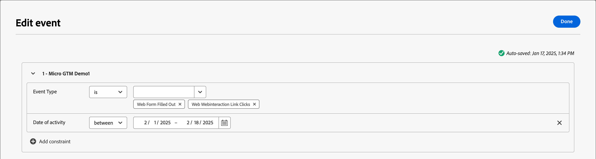
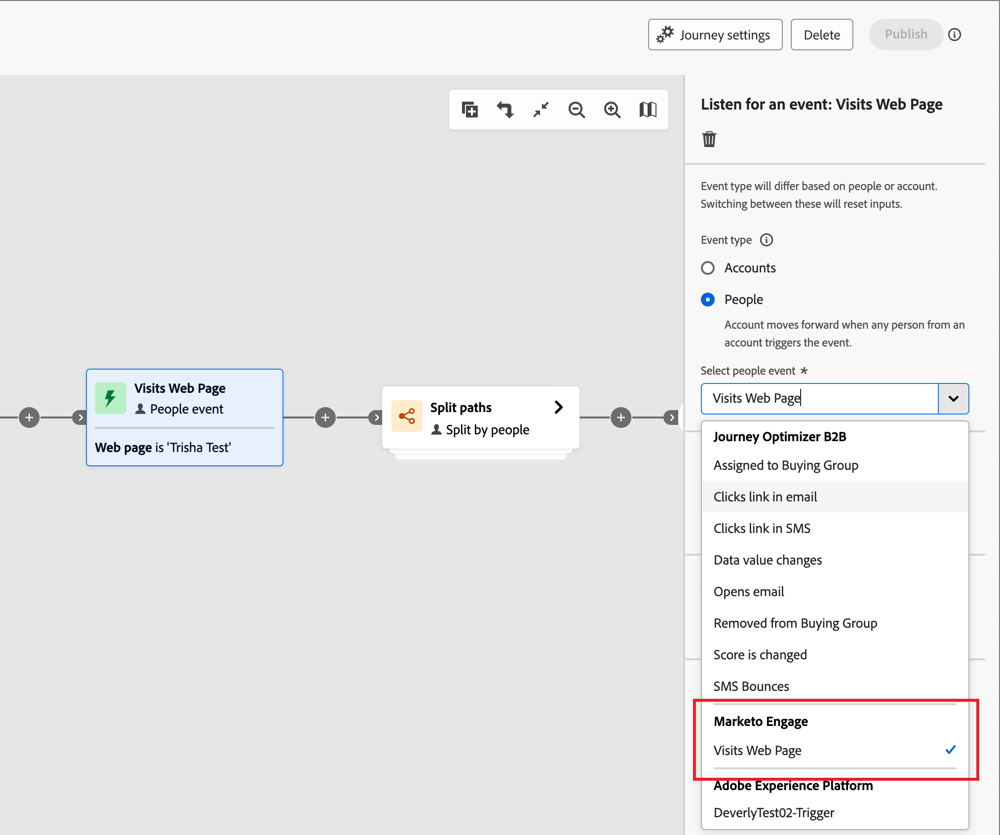

# Listen for an event

To move the audience forward to the next step in your [journey](./journeys-overview.md) when an event occurs, add the _Listen for an event_ node. Depending on the journey type, you can use this node to trigger the next node in the journey according to people or account events. 

<!--
{width="30", vertical-align="middle"} [Watch the overview video](#overview-video)
-->

## Account journeys {#account-journeys}

>[!NOTE]
>
>For an account journey, you cannot add the _[!UICONTROL Listen for an event]_ node type on a split path by people.

1. Open the account journey canvas.

1. Click the plus ( **+** ) icon on a path and choose **[!UICONTROL Listen for an event]**.

   {width="400"}

1. In the node properties on the right, use the _Event type_ selector to choose between **[!UICONTROL Accounts]** and **[!UICONTROL People]**.

1. Select an event from the list.

   * For the _People_ event type, choose the [people event](#people-events) that you want to use for the trigger.

       {width="500" zoomable="yes"}

   * For the _Accounts_ event type, choose the [account event](#account-events) that you want to use for the trigger.

      {width="500" zoomable="yes"}

1. Click **[!UICONTROL Edit event]** and define details for the event.

   Depending on the selected event type and event, define the event matching criteria.

   * [People events](#people-events)
   * [Account events](#account-events)

   You can also include [filters](#filters-people-event) for the event.

1. Click **[!UICONTROL Done]**.

   The event and filter definitions are displayed in the node and in the node properties.

   {width="500"}

### People events for account journeys {#people-events}

In an account journey, you can listen for an event based on people when you want to move the account forward in the journey according to events triggered by people activity. You can also filter events according to event history and people attributes.

>[!TIP]
>
>Experience events can occur _before_ people enter the journey (such as a prior email click or web interaction). To route people based on these events, use the [!UICONTROL Event history] filter in a [Split paths by people](./split-merge-paths-nodes.md#experience-event-history-filtering) node.

#### Journey Optimizer B2B events {#events-account-people}

| Event | Constraints |
| ----- | ----------- |
| [!UICONTROL Assigned to Buying Group] | Solution interest (required)  Additional constraints (optional): <li>Role</li><li>Date of activity</li> Timeout (optional) |
| [!UICONTROL Person profile changes] | Attribute (required) Date of activity (optional) New value (optional) Previous value (optional) Reason (optional) Source (optional) |
| [!UICONTROL Removed from Buying Group] | Solution interest (required) Date of activity (optional) Timeout (optional) |

1. Set the required value to match for the event.

   If needed, set the operator for the evaluation.

1. For each optional constraint that you want to include for event match, click **[!UICONTROL Add constraint]** and select a constraint in the list.

   {width="700" zoomable="yes"}

1. (Optional) Select the **[!UICONTROL Filters]** tab to [add filters for the event](#filters-people-event).

1. Click **[!UICONTROL Done]**.

#### Experience Events {#experience-events-account-people}

>[!PREREQUISITES]
>
>Administrators configure [Adobe Experience Platform (AEP) Experience Events](https://experienceleague.adobe.com/en/docs/experience-platform/xdm/classes/experienceevent){target="_blank"}, which enable marketers to create account and person journeys that react to the events in near real-time.
>
>To make Experience Events available for journeys, a product administrator must first [add the event types and fields of interest](../admin/configure-aep-events.md#add-an-event) in [!DNL Journey Optimizer B2B Edition].

1. Click **[!UICONTROL Add constraint]** and choose the field that you want to use for the constraint.

   The available constraints are defined as managed fields for the event configuration.
   
1. Complete the condition for the constraint. 

   You can use the default **[!UICONTROL is]** operator to match one or more field values. Or you can use the **[!UICONTROL is not]** operator to match on all values with the exclusion of one or more specified values.
  
   {width="700" zoomable="yes"}

1. (Optional) Select the **[!UICONTROL Filters]** tab to [add filters for the event](#filters-people-event).

1. Click **[!UICONTROL Done]**.

### Account events {#account-events}

In an account journey, you can listen for an event based on the account when you want to move the account forward in the journey according to events triggered by account activity.

| Event | Constraints |
| ----- | ----------- |
| [!UICONTROL Account had interesting moment] | Type (Email, Milestone, or Web) Additional constraints (optional): <li>Description</li><li>Source</li><li>Date of activity</li>  Timeout (optional) |
| [!UICONTROL Change in Account Data Value] | Attribute Additional constraints (optional): <li>New value</li><li>Previous value</li><li>Date of activity</li>  Timeout (optional) |
| [!UICONTROL Change in Buying Group Stage] | Solution interest Additional constraints (optional): <li>New stage</li><li>Previous stage</li><li>Date of activity</li>  Timeout (optional) |
| [!UICONTROL Change in Buying Group Status] | Solution interest Additional constraints (optional): <li>New status</li><li>Previous status</li><li>Date of activity</li>  Timeout (optional) |
| [!UICONTROL Change in Completeness Score] | Solution interest Additional constraints (optional): <li>New score</li><li>Previous score</li><li>Date of activity</li>  Timeout (optional) |
| [!UICONTROL Change in Engagement Score] | Solution interest Additional constraints (optional): <li>New score</li><li>Previous score</li><li>Date of activity</li>  Timeout (optional) |

1. Set the required constraint to match for the event.

1. For each optional constraint that you want to include for event match, click **[!UICONTROL Add constraint]** and select the field.

   {width="700" zoomable="yes"}
   
   Set the operator and value for the evaluation.

1. Click **[!UICONTROL Done]**.

<!--

Removed from AJO B2B people events 

| [!UICONTROL Clicks link in email] | Email  Additional constraints (optional): <li>Link</li><li>Link ID</li><li>Is mobile device</li><li>Device</li><li>Platform</li><li>Browser</li><li>Is predictive content</li><li>Is bot activity</li><li>Bot activity pattern</li><li>Browser</li><li>Date of activity</li><li>Min. number of times</li> Timeout (optional) |
| [!UICONTROL Clicks link in SMS] | Email  Additional constraints (optional): <li>Link</li><li>Device</li><li>Platform</li><li>Date of activity</li><li>Min. number of times</li> Timeout (optional) |
| [!UICONTROL Data value changes] | Person attribute  Additional constraints (optional): <li>New value</li><li>Previous value</li><li>Reason</li><li>Source</li><li>Date of activity</li><li>Min. number of times</li> Timeout (optional) |
| [!UICONTROL Opens email] | Email  Additional constraints (optional): <li>Link</li><li>Link ID</li><li>Is mobile device</li><li>Device</li><li>Platform</li><li>Browser</li><li>Is predictive content</li><li>Is bot activity</li><li>Bot activity pattern</li><li>Browser</li><li>Date of activity</li><li>Min. number of times</li> Timeout (optional) |
| [!UICONTROL Score is changed] | Score name  Additional constraints (optional):<li>Change</li><li>New score</li><li>Urgency</li><li>Priority</li><li>Relative score</li><li>Relative urgency</li><li>Date of activity</li><li>Min. number of times</li> Timeout (optional) |
| [!UICONTROL SMS Bounces]| SMS message  Additional constraints (optional): <li>Date of activity</li><li>Min number of times</li> Timeout (optional) |

### Listen for a Marketo Engage event {#listen-for-marketo-engage-event}

| Marketo Engage | [!UICONTROL Visits Web Page] | Web page   Select one or more Marketo Engage pages to match.   Additional constraints (optional): <li>Querystring</li><li>Client IP address</li><li>Referrer</li><li>User Agent</li><li>Search engine</li><li>Search query</li><li>Token</li><li>Browser</li><li>Platform</li><li>Device</li><li>Date of activity</li> |
| | [!UICONTROL Fills out form] | Form   Select one or more Marketo Engage forms to match.   Additional constraints (optional): <li>Date of activity</li><li>Querystring</li><li>Client IP address</li><li>Referrer</li><li>User agent</li><li>Platform</li><li>Device</li> Timeout (optional) |
| Adobe Experience Platform | [!UICONTROL Event definition] | Event type   Additional constraints (optional): <li>Fields</li>  Additional constraints (not supported): <li>Date of activity</li><li>Min. number of times</li>  Timeout (optional) |

If you have web pages in your connected Marketo Engage instance, you can trigger an event based on a visit/no visit to these web pages, as well as Marketo Engage forms that were/were not filled. 

1. Use the **[!UICONTROL Select people event]** selector and scroll the menu to the **[!UICONTROL Marketo Engage]** section.

1. Select a Marketo Engage activity type:

   * **[!UICONTROL Visits Web Page]**.
   * **[!UICONTROL Fills Out Form]**

   {width="700" zoomable="yes"}

1. Click **[!UICONTROL Edit event]** and define one or more web pages to match and any additional constraints for the event.

   * (Required) In the _[!UICONTROL Edit event]_ dialog, define the **[!UICONTROL Web page]** or **[!UICONTROL Fills out form]** constraint. Use **[!UICONTROL is]** (default) to match on one or more selected pages or forms. Use **[!UICONTROL is not]** to match on all page visits/forms with the exclusion of one or more selected pages/forms. Or, use the **[!UICONTROL is any]** operator to match on any Marketo Engage web page visit or filled form.

   * (Optional) Click **[!UICONTROL Add constraint]** and choose the field that you want to use for the constraint. Set the operator and the value for the field.

     {width="700" zoomable="yes"}

     To include additional field constraints as needed, repeat this action.

   * If needed, select the **[!UICONTROL Filters]** tab to [add filters for the event](#add-a-filter-to-the-people-event).

   * When the constraints and filters are defined, click **[!UICONTROL Done]**.

1. If needed, set the **[!UICONTROL Timeout]** option to limit the time period to listen for the event (see [Add a timeout to an event node](#add-a-timeout-to-an-event-node)). 

1. In the journey canvas, add the next node to execute when the event occurs.

-->

## Person journeys {#person-journeys}

1. Open the person journey canvas.

1. Click the plus ( **+** ) icon on a path and choose **[!UICONTROL Listen for an event]**.

   {width="350"}

1. In the node properties on the right, click **[!UICONTROL Add event criteria]**. 

   {width="450"}

1. Add an event and set the constraints that you want to match for the trigger.

   You can use [Experience Events](#experience-events-person) and [Person profile changes](#person-profile-changes) to define the event trigger.

   Drag and drop the event trigger into the builder space and set the definition. Click **[!UICONTROL Add constraint]** for each constraint that you want to use to refine the event match.

   You can add multiple events to match. The first qualifying event advances the person profile forward in the journey.
   
1. (Optional) Select the **[!UICONTROL Filters]** tab to [add filters for the event](#filters-people-event).

1. Click **[!UICONTROL Done]**.

   The event and filter definitions are displayed in the node and in the node properties.

   {width="450"}

### Experience Events for person journeys {#experience-events-person}

>[!PREREQUISITES]
>
>Administrators configure [Adobe Experience Platform (AEP) Experience Events](https://experienceleague.adobe.com/en/docs/experience-platform/xdm/classes/experienceevent){target="_blank"}, which enable marketers to create account and person journeys that react to the events in near real-time.
>
>To make Experience Events available for journeys, a product administrator must first [add the event types and fields of interest](../admin/configure-aep-events.md#add-an-event) in [!DNL Journey Optimizer B2B Edition].

You can use Experience Events to trigger the node in person journeys in the _[!UICONTROL Edit event]_ dialog.

1. Expand **[!UICONTROL Sapphire AEP events]** in the _[!UICONTROL Triggers]_ list on the left.

1. Drag and drop the Experience Event into the event matching builder space.

   You can use the _Search_ field to filter for a keyword in the event name, such as `email`.

1. Click **[!UICONTROL Add constraint]** and choose the field that you want to use to refine the event match.

   The available constraints are defined as managed fields for the event configuration.
  
   {width="700" zoomable="yes"}

1. Set the operator and values to match for the event field.

1. (Optional) Add another Experience event or a [person profile change](#person-profile-changes).

   When you add multiple events to match. The first qualifying event advances the person profile forward in the journey.

1. (Optional) Select the **[!UICONTROL Filters]** tab to [add filters for the event](#filters-people-event).

1. Click **[!UICONTROL Done]**.

### Person profile changes {#person-profile-changes}

You can use a change in B2B person profile attributes to trigger the node in person journeys in the _[!UICONTROL Edit event]_ dialog.

1. Drag and drop **[!UICONTROL Person profile change]**s from the _[!UICONTROL Triggers]_ list into the event matching builder space.

1. Click **[!UICONTROL Add constraint]** and select the attribute change that you want to use for the event trigger. 

   Set the field value according to the change that you want to match.

   {width="700" zoomable="yes"}

1. (Optional) Add another _Person profile change_ attribute that you want to use as an event trigger, or an [Experience Event](#experience-events-person).

   When you add multiple events to match. The first qualifying event advances the person profile forward in the journey.

1. (Optional) Select the **[!UICONTROL Filters]** tab to [add filters for the event](#filters-people-event).

1. Click **[!UICONTROL Done]**.

## Filters for events {#filters-people-event}

When you define a [people event in an account journey](#people-events) or an [event in a person journey](#person-journeys), you can include filtering to limit matching event triggers based on various criteria:

| Filters | Description |
| ------------ | ----------- |
| [!UICONTROL Event history] | Experience events configured by an administrator. See _[!UICONTROL Select Experience Events and fields](../admin/configure-aep-events.md)_. |
| [!UICONTROL Person Attributes] | Attributes from the B2B person profile, including: <li>City <li>Country <li>Date of birth <li>Email address <li>Email invalid <li>Email suspended <li>First name <li>Inferred state region<li>Job title <li>Last name <li>Mobile phone number <li>Person engagement score <li>Phone number <li>Postal code <li>State <li>Unsubscribed <li>Unsubscribed reason |
| [!UICONTROL Person attributes] | (Person journeys only) Attribute value |
| [!UICONTROL Special filters] > [!UICONTROL Member of Buying Group] | The person is or is not a buying group member evaluated against one or more of the following criteria: <li>Solution Interest</li><li>Buying Group status</li><li>Completeness Score</li><li>Engagement Score</li><li>Is Removed</li><li>Role</li>|

<!--
| [!UICONTROL Special filters] > [!UICONTROL Member of List] | The person is or is not a member of one or more Marketo Engage lists. |
| [!UICONTROL Special filters] > [!UICONTROL Member of Program] | The person is or is not a member of one or more Marketo Engage programs. |
-->

1. After you define the event trigger, select the **[!UICONTROL Filters]** tab in the _[!UICONTROL Edit event]_ dialog.

   {width="700" zoomable="yes"}

1. To filter matches for the event, add one or more filter criteria.

   * Drag and drop any of the filters from the left navigation and complete the match definition.

      >[!NOTE]
      >
      >If you have custom person fields defined in the account audience schema in Experience Platform, these fields are also available under **[!UICONTROL Attributes]** to use as person attributes in filters. 

   * Refine your filtering by applying the **[!UICONTROL Filter logic]** at the top. You can choose to match all filters or any filter.

      {width="600" zoomable="yes"}

1. When the event and filter definitions are complete, click **[!UICONTROL Done]**.

## Add a timeout to an event node {#timeouts}

If needed, define the amount of time the journey waits for the event. The journey ends after a timeout unless you define a timeout path, where you can add other nodes.

Enable the **[!UICONTROL Timeout]** option in the node properties to specify a timeout for the _Listen for event_ node.

1. With the options enabled, choose the _Type_ and specify the parameters for the timeout:

   * **[!UICONTROL Duration]** - Use this type to specify a time period for the event trigger. If the event does not trigger within that period, the person or account does not proceed in the journey.

      Select the duration for which the journey waits for an event to occur before it times out. Specify the number of minutes, hours, days, weeks, or months.

      {width="500" zoomable="yes"}

      If you want the time period to end on a specific day of the week, enable the **[!UICONTROL Must end on]** option. **[!UICONTROL Any day]** is selected by default, with all of the days selected. Clear the checkbox and then select one or more days for an ending date. Then select the **Time** and **[!UICONTROL Time zone]**.

      {width="300"}
   
   * **[!UICONTROL Date]** - Use this type to set an expiration date for the node. If the event does not trigger by the specified date/time, the person or account does not proceed in the journey.

      Click the _Calendar_ icon to set the date and time for the timeout.

      {width="500" zoomable="yes"}

1. Define the timeout path.

    The **[!UICONTROL Set timeout path]** option is selected by default. You can use this path to define what happens if the Listen for event node times out. You can add alternative actions and events that apply to person profiles when the event does not occur.

   {width="600" zoomable="yes"}

   If you do not want to define the path, you can clear the _[!UICONTROL Set timeout path]_ check box.

<!--
 ## Overview video

>[!VIDEO](https://video.tv.adobe.com/v/3443219/?learn=on) 
-->
