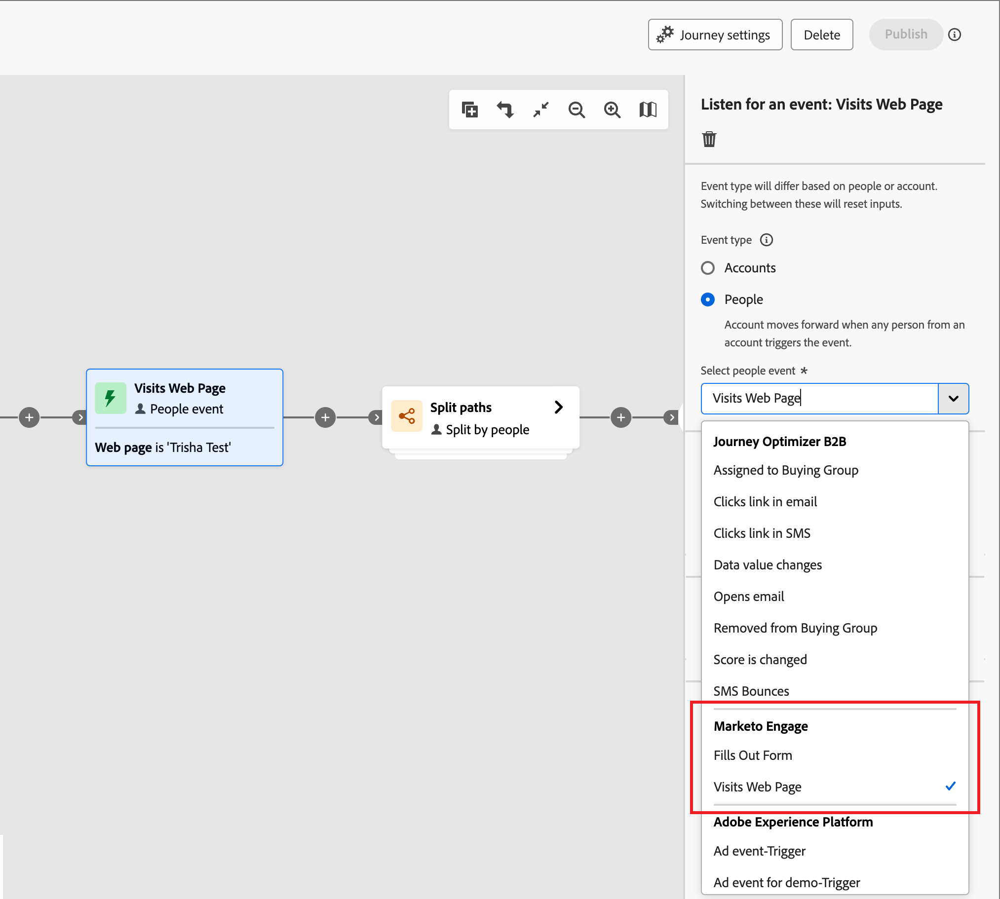

# Listen for an event

Add the _Listen for an event_ node to move your audience forward to the next step in the account journey when an event occurs.

{width="30"} [Watch the overview video](#overview-video)

>[!NOTE]
>
>You cannot add this node type on split path by people.

## Account events

Listen for an event based on the account when you want to move the account forward in the journey according to events triggered by account activity.

### Events and constraints

| Event | Constraints |
| ----- | ----------- |
| Account had interesting moment | Type (Email, Milestone, or Web) Additional constraints (optional): <li>Description</li><li>Source</li><li>Date of activity</li>  Timeout (optional) |
| Change in Account Data Value | Attribute Additional constraints (optional): <li>New value</li><li>Previous value</li><li>Date of activity</li>  Timeout (optional) |
| Change in Buying Group Stage | Solution interest Additional constraints (optional): <li>New stage</li><li>Previous stage</li><li>Date of activity</li>  Timeout (optional) |
| Change in Buying Group Status | Solution interest Additional constraints (optional): <li>New status</li><li>Previous status</li><li>Date of activity</li>  Timeout (optional) |
| Change in Completeness Score | Solution interest Additional constraints (optional): <li>New score</li><li>Previous score</li><li>Date of activity</li>  Timeout (optional) |
| Change in Engagement Score | Solution interest Additional constraints (optional): <li>New score</li><li>Previous score</li><li>Date of activity</li>  Timeout (optional) |

### Add an account event

1. Navigate to the journey map.

1. Click the plus ( **+** ) icon on a path and choose **[!UICONTROL Listen for an event]**.

1. In the node properties on the right, choose **[!UICONTROL Accounts]** for the event type.

   {width="700" zoomable="yes"}

1. Select an event from the list.

1. Click **[!UICONTROL Edit event]** and define details for the event.

## People events

Listen for an event based on people when you want to move the account forward in the journey according to events triggered by people activity.

### Events and constraints

| Input type | Event | Constraints |
| ---------- | ----- | ----------- |
| Journey Optimizer B2B | Assigned to Buying Group | Solution interest  Additional constraints (optional): <li>Role</li><li>Date of activity</li> Timeout (optional) |
| | Clicks link in email | Email  Additional constraints (optional): <li>Link</li><li>Link ID</li><li>Is mobile device</li><li>Device</li><li>Platform</li><li>Browser</li><li>Is predictive content</li><li>Is bot activity</li><li>Bot activity pattern</li><li>Browser</li><li>Date of activity</li><li>Min. number of times</li> Timeout (optional) |
| | Clicks link in SMS | Email  Additional constraints (optional): <li>Link</li><li>Device</li><li>Platform</li><li>Date of activity</li><li>Min. number of times</li> Timeout (optional) |
| | Data value changes | Person attribute  Additional constraints (optional): <li>New value</li><li>Previous value</li><li>Reason</li><li>Source</li><li>Date of activity</li><li>Min. number of times</li> Timeout (optional) |
| | Opens email | Email  Additional constraints (optional): <li>Link</li><li>Link ID</li><li>Is mobile device</li><li>Device</li><li>Platform</li><li>Browser</li><li>Is predictive content</li><li>Is bot activity</li><li>Bot activity pattern</li><li>Browser</li><li>Date of activity</li><li>Min. number of times</li> Timeout (optional) |
| | Removed from Buying Group | Solution interest Date of activity (optional) Timeout (optional) |
| | Score is changed | Score name  Additional constraints (optional):<li>Change</li><li>New score</li><li>Urgency</li><li>Priority</li><li>Relative score</li><li>Relative urgency</li><li>Date of activity</li><li>Min. number of times</li> Timeout (optional) |
| | SMS Bounces| SMS message  Additional constraints (optional): <li>Date of activity</li><li>Min number of times</li> Timeout (optional) |
| Marketo Engage | Visits Web Page | Web page   Select one or more Marketo Engage pages to match.   Additional constraints (optional): <li>Querystring</li><li>Client IP address</li><li>Referrer</li><li>User Agent</li><li>Search engine</li><li>Search query</li><li>Token</li><li>Browser</li><li>Platform</li><li>Device</li><li>Date of activity</li> |
| | Fills out form | Form   Select one or more Marketo Engage forms to match.    Additional constraints (optional): <li>Date of activity</li><li>Querystring</li><li>Client IP address</li><li>Referrer</li><li>User agent</li><li>Platform</li><li>Device</li> Timeout (optional) |
| Adobe Experience Platform | Event definition | Event type   Additional constraints (optional): <li>Fields</li>  Additional constraints (not supported): <li>Date of activity</li><li>Min. number of times</li>  Timeout (optional) |

### Add a people event

1. Navigate to the journey map.

1. Click the plus ( **+** ) icon on a path and choose **[!UICONTROL Listen for an event]**.

1. In the node properties on the right, choose **[!UICONTROL People]** for the event type.

   {width="700" zoomable="yes"}

1. Select an event from the list.

1. Click **[!UICONTROL Edit event]** and define details for the event.

### Listen for Marketo Engage event

If you have web pages in your connected Marketo Engage instance, you can trigger an event based on a visit/no visit to these web pages, as well as Marketo Engage forms that were/were not filled. 

1. Select a **[!UICONTROL Listen for an event]** node in the journey map.

1. In the node properties on the right, choose **[!UICONTROL People]** for the event type.

1. Click the arrow for the **[!UICONTROL Select people event]** selector and scroll the menu to the **[!UICONTROL Marketo Engage]** section.

1. Select a Market Engage activity type:

   * **[!UICONTROL Visits Web Page]**.
   * **[!UICONTROL Fills Out Form]**

   {width="700" zoomable="yes"}

1. Click **[!UICONTROL Edit event]** and define one or more web pages to match and any additional constraints for the event.

   * (Required) In the _[!UICONTROL Edit event]_ dialog, define the **[!UICONTROL Web page]** or Fills out form constraint. Use **[!UICONTROL is]** (default) to match on one or more selected pages or forms. Use **[!UICONTROL is not]** to match on all page visits/forms with the exclusion of one or more selected pages/forms. Or, use **[!UICONTROL is any]** to match on any Marketo Engage web page visit or filled form.

   * (Optional) Click **[!UICONTROL Add constraint]** and choose the field that you want to use for the constraint. Set the operator and the value for the field.

     {width="700" zoomable="yes"}

     You can repeat this action to include additional field constraints as needed.

   * When the constraints are defined, click **[!UICONTROL Done]**.

1. If needed, set the **[!UICONTROL Timeout]** option to limit the time period to listen for the event (see [Add a timeout to an event node](#add-a-timeout-to-an-event-node)). 

1. In the journey map, add the next node to execute when the event occurs.

### Listen for an Experience Event

Administrators can configure Adobe Experience Platform (AEP)-based event definitions, which enable Marketers to create account journeys that react to [AEP Experience Events](https://experienceleague.adobe.com/en/docs/experience-platform/xdm/classes/experienceevent){target="_blank"}. Using AEP experience events in account journeys is a two-step process:

1. [Create and publish an AEP event definition](../admin/configure-aep-events.md).

2. In an account journey, add a _Listen for an event_ node, and select an Experience Platform event definition for a people-based event.

{width="30"} [Watch the video overview](../admin/configure-aep-events.md#overview-video)

_To include an Experience Event in your journey:_

1. Select a **[!UICONTROL Listen for an event]** node in the journey map.

1. In the node properties on the right, choose **[!UICONTROL People]** for the event type.

1. Click the arrow for the **[!UICONTROL Select people event]** selector and scroll the menu to the **[!UICONTROL Adobe Experience Platform]** section.

   {width="700" zoomable="yes"}

1. Select the event.

   The event type is displayed as empty in the node details.

   {width="400" zoomable="yes"}   

1. Click **[!UICONTROL Edit event]** and define the event types and any additional constraints for the event.

   * (Required) In the _[!UICONTROL Edit event]_ dialog, define the event type. You can use the default **[!UICONTROL is]** operator to match on one or more selected event types. Or you can use the **[!UICONTROL is not]** operator to match on all event types with the exclusion of one or more selected event types.

   * (Optional) Click **[!UICONTROL Add constraint]** and choose the field that you want to use for the constraint. Set the operator and the value for the field.
  
     {width="700" zoomable="yes"}

     >[!NOTE]
     >
     >The constraints for _date of activity_ and _minimum number of times_ are not supported.

     You can repeat this action to include additional field constraints as needed.

   * When the constraints are defined, click **[!UICONTROL Done]**.

1. If needed, set the **[!UICONTROL Timeout]** option to limit the time period to listen for the event (see [Add a timeout to an event node](#add-a-timeout-to-an-event-node)). 

1. In the journey map, add the next node to execute when the event occurs.

1. Complete the remaining nodes for your journey and [publish it](./journey-overview.md).

   When the journey is live (published) and reaches the _Listen for an event_ node, it begins listening for AEP Experience Events.

## Add a timeout to an event node

If needed, define the amount of time the journey waits for the event. The journey ends after a timeout unless you define a timeout path, where you can add other nodes.

1. Enable the **[!UICONTROL Timeout]** option.

1. Select the duration for which the journey waits for an event to occur before it times out.

   You can choose to end the path here or take a different course of action by setting another path.

1. To create a new path in the journey where you can add actions and events applicable to accounts when the event does not occur, select the **[!UICONTROL Set timeout path]** check box.

   {width="700" zoomable="yes"}

## Overview video

>[!VIDEO](https://video.tv.adobe.com/v/3443219/?learn=on)
