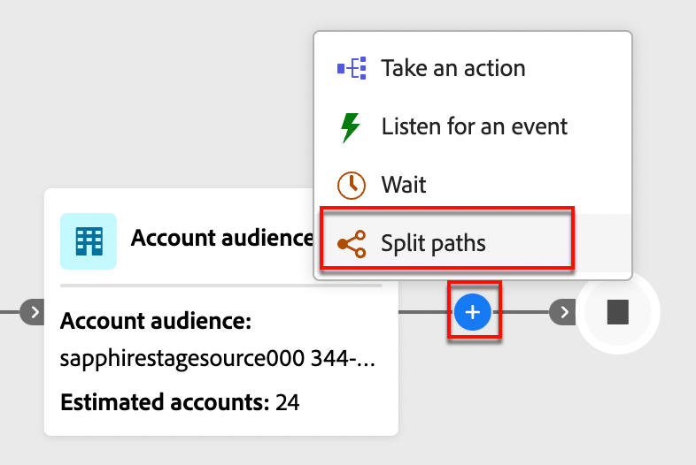

# Split and merge paths

Use split and merge path nodes in your account journey to orchestrate your account journeys. You can segment the audience according to conditions that you define and combine the segments to proceed. 

## Split paths

Add a _Split paths_ node to define one or more segmented paths based on account or people attributes.

>[!NOTE]
>
>A maximum of 25 paths are supported.

**Split paths by accounts**: Paths split by accounts can include both account and people actions and events. These paths can be split further.

_How does a split path by accounts node work?_ 

* When you add a split path node and choose _Account_, each path that is added includes an end node with the ability to add nodes to each edge.
* It is possible to split the path by Accounts repeatedly, such as in a nested manner. A split path includes an option for not adding the default path.
* If an accounts/person does not qualify for one of the split paths, it does not move forward in the journey.
* These paths can be combined using a merge node.

{width="700" zoomable="yes"}

**Split paths by people**: Paths split by people and can include only people actions. These paths cannot be split again and automatically join back.

_How does a split path by people node work?_ 

* _Split path by people_ nodes are grouped nodes. The paths automatically merge so that all the people in the audience can move forward to the next step without losing their account context.
* _Split path by people_ nodes cannot be nested--you cannot add split path for people on a path that is in this grouped node.
* Split path nodes include an option for omitting a default path so that accounts/people without a matching path do not move forward in the journey.
* _Split path by people_ nodes support the use of _account-person relationships_, which allows you to filter people based on their role (such as contractor or full-time employee) as defined in the roles templates.

{width="700" zoomable="yes"}

### Path conditions {#path-conditions}

| Node context | Path conditions | Description |
| ------------ | --------------- | ----------- |
| [Accounts](#add-a-split-path-by-account-node) | Account Attributes | Attributes from the account profile, including: <li>Annual revenue</li><li>City</li><li>Country</li><li>Employee size</li><li>Industry</li><li>Name</li><li>SIC code</li><li>State</li> |
| | [!UICONTROL Special filters] > [!UICONTROL Has Buying Group] | The account does or does not have members of buying groups evaluated against one or more of the following criteria: <li>Solution Interest</li><li>Buying Group status</li><li>Completeness Score</li><li>Engagement Score</li> |
| [People](#add-a-split-path-by-people-node) > [!UICONTROL People attributes only] | [!UICONTROL Person Attributes] | Attributes from the person profile, including: <li>City</li><li>Country</li><li>Date of birth</li><li>Email address</li><li>Email invalid</li><li>Email suspended</li><li>First name</li><li>Inferred state region</li><li>Job title</li><li>Last name</li><li>Mobile phone number</li><li>Phone number</li><li>Postal code</li><li>State</li><li>Unsubscribed</li><li>Unsubscribed reason</li>|
| | [!UICONTROL Activity history] > [!UICONTROL Email] | Email activities associated with the journey: <li>[!UICONTROL Clicked link in email]</li><li>Opened Email</li><li>Was delivered email</li><li>Was sent email</li> These conditions are evaluated using a selected email message from earlier in the journey.  |
| | [!UICONTROL Activity history] > [!UICONTROL Data Value Changed] | For a selected person attribute, a value change occurred. These change types include: <li>New value</li><li>Previous value</li><li>Reason</li><li>Source</li><li>Date of activity</li><li>Min. number of times</li> |
| | [!UICONTROL Activity history] > [!UICONTROL Had Interesting Moment] | Interesting moment activity that is defined in the associated Marketo Engage instance. Constraints include: <li>Milestone</li><li>Email</li><li>Web</li>|
| | [!UICONTROL Special filters] > [!UICONTROL Member of Buying Group] | The person is or is not a buying group member evaluated against one or more of the following criteria: <li>Solution Interest</li><li>Buying Group status</li><li>Completeness Score</li><li>Engagement Score</li><li>Role</li>|
| | [!UICONTROL Special filters] > [!UICONTROL Member of List] | The person is or is not a member of one or more Marketo Engage lists. |
|  [People](#add-a-split-path-by-people-node) > [!UICONTROL Account-person attributes only] | Role in account attributes | The person is or is not assigned a role in the account. Optional constraints: <li>Enter a role name</li> | 

### Add a split path by account node

1. Navigate to the journey editor.

1. Click the plus ( **+** ) icon on a path and choose **[!UICONTROL Split paths]**.

   {width="300"}

1. In the node properties on the right, choose **[!UICONTROL Accounts]** for the split.

1. To define a condition applicable to _[!UICONTROL Path 1]_, click **[!UICONTROL Apply condition]**.

   {width="500"}

1. In the conditions editor, add one or more filters to define the split path.

   * Drag and drop filter attributes from the left navigation and complete the match definition.

   * Fine tune your conditions by applying the **[!UICONTROL Filter logic]** at the top. You choose to match all attribute conditions or any condition.

      {width="700" zoomable="yes"}

   * Click **[!UICONTROL Done]**.

1. To add more paths, click **[!UICONTROL Add path]** and repeat the previous steps to add conditions applicable to this path.

   You can also label each path based on these conditions or use the default labels.

1. If needed, reorder the paths according to the priority that you want for the split.

   Path filtering is evaluated in top-down order. Each account proceeds along the first path that matches.

   Click the up and down arrows at the top right of each path card to move it higher or lower in the list of paths.

   {width="500" zoomable="yes"}

1. Enable the **[!UICONTROL Other accounts]** option to add a default path for accounts that are not a match for the defined paths. If not, the journey ends for these people.

### Add a split path by people node

>[!NOTE]
>
>When you split paths by people, a _Close split paths_ node is automatically inserted to end the split. A split-by-people path allows only _Take an action_ on people nodes.

1. Navigate to the journey editor.

1. Click the plus ( **+** ) icon on a path and choose **[!UICONTROL Split paths]**.

   {width="300"}

1. In the node properties on the right, choose **[!UICONTROL People]** for the split.

1. Set the **[!UICONTROL Attributes used for conditions]**.

   * Choose **[!UICONTROL People attributes only]** to use conditions related to the person profile and events. 
   * Choose **[!UICONTROL Account-person attributes only]** to use conditions related to the person's role membership within an account.

1. To define a condition applicable to _[!UICONTROL Path 1]_, click **[!UICONTROL Apply condition]**.

1. In the conditions editor, add one or more filters to define the split path.

   * Drag and drop any of the people attributes from the left navigation and complete the match definition.

      >[!NOTE]
      >
      >If you have custom person fields defined in the account audience schema in Experience Platform, these fields are also available to use as person attributes in conditions. 

   * Fine tune your conditions by applying the **[!UICONTROL Filter logic]** at the top. You choose to match all attribute conditions or any condition.

      {width="700" zoomable="yes"}

   * Click **[!UICONTROL Done]**.

1. To add more paths, click **[!UICONTROL Add path]** and repeat the previous steps to add conditions applicable to this path.

   You can also label each path based on these conditions or use the default labels.

1. If needed, reorder the paths according to the priority that you want for the split.

   Path filtering is evaluated in top-down order. Each person proceeds along the first path that matches.

   Click the up and down arrows at the top right of each path card to move it higher or lower in the list of paths.

   {width="500" zoomable="yes"}

1. Enable the **[!UICONTROL Other people]** option to add a default path for people that are not a match for the defined paths. If not, the journey ends for these people.

>[!BEGINSHADEBOX "Marketo Engage list membership"]
   
In Marketo Engage, _Smart Campaigns_ check membership of programs to ensure that leads don't receive duplicate emails and aren't members of multiple streams of emails at the same time. In Journey Optimizer B2B, you can check for Marketo Engage list membership as a condition for your split path by people to help eliminate duplication in journey activities.
      
To do this, expand **[!UICONTROL Special Filters]** and drag the **[!UICONTROL Member of List]** condition into the filter space and complete the filter definition to evalute membership in one or more Marketo Engage lists.
   
{width="700" zoomable="yes"}
   
>[!ENDSHADEBOX] 

When you have conditions defined for each path for splitting your audience on the people level, you can add actions that you want to take on people.

>[!NOTE]
>
>When you split the audience by people, you can add only people actions until the paths are closed or merged.

## Merge paths

Add a _Merge paths_ node to combine different split paths by account in your journey. 

1. Navigate to the journey editor.

1. Click the plus ( **+** ) icon on a path and choose **[!UICONTROL Split paths]**.

1. Click the split node to open its properties on the right.

1. Click [!UICONTROL Add path] to create three paths.

1. Add a combination of actions and events to each path.

1. Click the plus ( **+** ) icon for any one of these paths and choose **[!UICONTROL Merge]** from the displayed options.

   {width="400"}

1. In the merge paths node properties, select the paths you want to merge.

   {width="600" zoomable="yes"}

   At this point, the paths are merged so that accounts from the selected paths combine to a single path that can continue to progress through the journey.

1. If needed, you can unmerge paths by navigating back to the merge paths node properties and clearing the checkbox for any paths that you want to remove.
