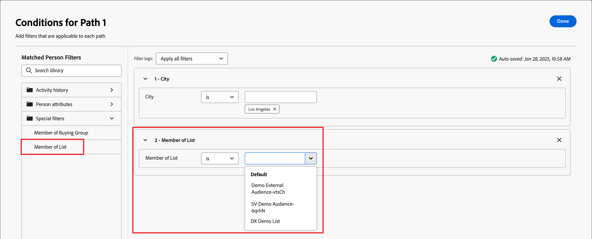

# Split and merge paths

Use split and merge path nodes to segment people or accounts according to the conditions that you define. Create paths for the audience or accounts list according to conditions, define each path with action and event nodes for the segment, and then combine the paths and continue the journey.

{width="30"} [Watch the overview video](#overview-video)

A _Split paths_ node defines one or more segmented paths based on **_either_** account or people filters. A split based on a people filter is automatically closed with a merge paths node so that all people can move forward to the next step without losing their account context.

>[!NOTE]
>
>A maximum of 25 paths are supported.

## Split paths by accounts

Split by accounts paths can include both account and people actions and events. These paths can be split further.

_**How a split path by accounts node works**_ 

* Each path that you add includes an end node with the ability to add nodes to each edge.
* Split by account nodes can be nested (you can split the path by accounts repeatedly). 
* Evaluation of each path is from top to bottom. If an account matches for the first and second paths, it proceeds along the first path only.
* Two or more paths can be combined using a merge node.
* The node supports the definition of an _[!UICONTROL Other accounts]_ path, where you can add actions or events for accounts that do not match one of the defined segments/paths.

{width="700" zoomable="yes"}

### Account path conditions

| Path conditions | Description |
| --------------- | ----------- |
| Account Attributes | Attributes from the account profile, including: <li>Annual revenue <li>City <li>Country <li>Employee size <li>Industry <li>Name <li>SIC code <li>State |
| [!UICONTROL Special filters] > [!UICONTROL Account has matched buying group] | The account is matched with one or more buying groups. It can be evaluated against one or more of the following constraints for a matched buying group: <li>Solution Interest <li>Buying Group stage <li>Buying Group status <li>Engagement Score <li>Completeness Score <li> Number of people in buying group role |
[!UICONTROL Special filters] > [!UICONTROL Has Buying Group] | The account does or does not have members of buying groups. It can also be evaluated against one or more of the following criteria: <li>Solution Interest <li>Buying Group stage <li>Buying Group status <li>Engagement Score <li>Completeness Score |

>[!NOTE]
>
>The _[!UICONTROL Has Buying Group]_ filter is marked for future deprecation. For new journeys, use the _[!UICONTROL Account has matched buying group]_ filter, which includes all the same constraints.

### Add a split path by account node

1. Navigate to the journey map.

1. Click the plus ( **+** ) icon on a path and choose **[!UICONTROL Split paths]**.

   {width="300"}

1. In the node properties on the right, choose **[!UICONTROL Accounts]** for the split.

1. To define a condition applicable to _[!UICONTROL Path 1]_, click **[!UICONTROL Apply condition]**.

   {width="500"}

1. In the conditions editor, add one or more filters to define the split path.

   * Drag and drop filter attributes from the left navigation and complete the match definition.

   * Fine tune your conditions by applying the **[!UICONTROL Filter logic]** at the top. You choose to match all filters or any filter.

      {width="700" zoomable="yes"}

   * Click **[!UICONTROL Done]**.

1. To add more paths, click **[!UICONTROL Add path]** and repeat the previous steps to add conditions applicable to this path.

   You can also label each path based on these conditions or use the default labels.

1. If needed, reorder the paths according to the priority that you want for the split.

   Path filtering is evaluated in top-down order. Each account proceeds along the first path that matches.

   Click the up and down arrows at the top right of each path card to move it higher or lower in the list of paths.

   {width="500" zoomable="yes"}

1. Enable the **[!UICONTROL Other accounts]** option to define the default path for accounts that are not a match for the defined segments/paths.

   When this option is not enabled, the journey ends for accounts that do not match a defined segment/path within the split.

### Buying group filtering for accounts

You can define a path for accounts associated with buying groups and filter the path using buying group criteria. Use the **[!UICONTROL Account has matched buying group]** filter to define the path segment using a matched buying group. This filter also includes that option to identify accounts based on the number of assigned roles within a matched buying group.

For example, you might want to evaluate buying group readiness based on the depth (number of people) it has in different roles, such as three decision makers and two influencers. In this case, set the condition to target accounts with a minimum of three (3) Decision Makers and two (2) Influencers in a matched buying group:

1. Click **[!UICONTROL Add filter]** and choose the **[!UICONTROL Number of people in buying group role]** filter.

   {width="700" zoomable="yes"}

1. Define the first role parameter.

   * Set the number of people evaluation to `at least` with a value of `3`.
   * Set the role evaluation to `is` and choose `Decision Maker` from the list of roles.

1. Repeat step 1 to add another buying group role parameter.

1. Define the second role parameter.

   * Set the number of people evaluation to `at least` with a value of `2`.
   * Set the role evaluation to `is` and choose `Influencer` from the list of roles.

   {width="700" zoomable="yes"}

1. Click **[!UICONTROL Done]** when you have all conditions defined for the path.

For the identified accounts, you might then want to add an action node in the path to update the status of the buying group or stage, or to send a sales alert email.

## Split paths by people

Split by people paths can include only people actions. These paths cannot be split again and automatically join back.

_**How a split path by people node works**_ 

* Split by people nodes function within a _grouped node_ split-merge combination. The split paths automatically merge so that all people can move forward to the next step without losing their account context.
* Split by people nodes cannot be nested (you cannot add a split path for people on a path that is in this grouped node).
* Evaluation of each path is from top to bottom. If a person matches for the first and second paths, they proceed along the first path only.
* The node supports the use of _account-person relationships_, which allows you to filter people based on their role (such as contractor or full-time employee) as defined in the relationship.
* The node supports the definition of an _[!UICONTROL Other people]_ path, where you can add actions or events for people that do not match one of the defined segments/paths.

{width="700" zoomable="yes"}

### People path conditions

| Path conditions | Description |
| --------------- | ----------- |
| [!UICONTROL Activity history] > [!UICONTROL Email] | Email activities based on conditions that are evaluated using one or more selected email messages from earlier in the journey: <li>[!UICONTROL Clicked link in email] <li>Opened Email <li>Was delivered email <li>Was sent email  **[!UICONTROL Switch to inactivity filter]** - Use this option to filter based on lack of activity (a person did not have the email activity).|
| [!UICONTROL Activity history] > [!UICONTROL SMS Message] | SMS activities based on conditions that are evaluated using one or more selected SMS messages from earlier in the journey: <li>[!UICONTROL Clicked link in SMS] <li>[!UICONTROL SMS Bounced]  **[!UICONTROL Switch to inactivity filter]** - Use this option to filter based on lack of activity (a person did not have the SMS activity). |
| [!UICONTROL Activity history] > [!UICONTROL Data Value Changed] | For a selected person attribute, a value change occurred. These change types include: <li>New value<li>Previous value<li>Reason<li>Source<li>Date of activity<li>Min. number of times  **[!UICONTROL Switch to inactivity filter]** - Use this option to filter based on lack of activity (a person did not have a data value change).|
| [!UICONTROL Activity history] > [!UICONTROL Had Interesting Moment] | Interesting moment activity that is defined in the associated Marketo Engage instance. Constraints include: <li>Milestone<li>Email<li>Web  **[!UICONTROL Switch to inactivity filter]** - Use this option to filter based on lack of activity (a person did not have an interesting moment).|
| [!UICONTROL Activity history] > [!UICONTROL Visited web page] | Web page activity that for one or more web pages managed by the associated Marketo Engage instance. Constraints include: <li>Web page (required)<li>Date of activity<li>Client IP address <li>Querystring <li>Referrer <li>User agent <li>Search engine <li>Search query <li>Personalized URL <li>Token <li>Browser <li>Platform <li>Device <li>Min. number of times  **[!UICONTROL Switch to inactivity filter]** - Use this option to filter based on lack of activity (a person did not visit the web page).   |
| [!UICONTROL Person Attributes] | Attributes from the person profile, including: <li>City <li>Country <li>Date of birth <li>Email address <li>Email invalid <li>Email suspended <li>First name <li>Inferred state region<li>Job title <li>Last name <li>Mobile phone number <li>Person engagement score <li>Phone number <li>Postal code <li>State <li>Unsubscribed <li>Unsubscribed reason |
| [!UICONTROL Special filters] > [!UICONTROL Member of Buying Group] | The person is or is not a buying group member evaluated against one or more of the following criteria: <li>Solution Interest</li><li>Buying Group status</li><li>Completeness Score</li><li>Engagement Score</li><li>Role</li>|
| [!UICONTROL Special filters] > [!UICONTROL Member of List] | The person is or is not a member of one or more Marketo Engage lists. |
| [!UICONTROL Special filters] > [!UICONTROL Member of Program] | The person is or is not a member of one or more Marketo Engage programs. |

### Account-person path conditions

| Path conditions | Description |
| --------------- | ----------- |
| [!UICONTROL Role in account] | The person is or is not assigned a role in the account. Optional constraints: <li>Role name |

### Add a split path by people node

>[!NOTE]
>
>When you split paths by people, a _Close split paths_ node is automatically inserted to end the split. A split-by-people path allows only _Take an action_ on people nodes.

1. Navigate to the journey map.

1. Click the plus ( **+** ) icon on a path and choose **[!UICONTROL Split paths]**.

   {width="300"}

1. In the node properties on the right, choose **[!UICONTROL People]** for the split.

1. Set the **[!UICONTROL Attributes used for conditions]**.

   * Choose **[!UICONTROL People attributes only]** to use conditions related to the person profile. 
   * Choose **[!UICONTROL Account-person attributes only]** to use conditions related to the person's role membership within an account.

1. To define a condition applicable to _[!UICONTROL Path 1]_, click **[!UICONTROL Apply condition]**.

1. In the conditions editor, add one or more filters to define the split path.

   * Drag and drop any of the people attributes from the left navigation and complete the match definition.

      >[!NOTE]
      >
      >If you have custom person fields defined in the account audience schema in Experience Platform, these fields are also available to use as person attributes in conditions. 

   * Fine tune your conditions by applying the **[!UICONTROL Filter logic]** at the top. You choose to match all attribute conditions or any condition.

      {width="700" zoomable="yes"}

   * Click **[!UICONTROL Done]**.

1. To add more paths, click **[!UICONTROL Add path]** and repeat the previous steps to add conditions applicable to this path.

   You can also label each path based on these conditions or use the default labels.

1. If needed, reorder the paths according to the priority that you want for the split.

   Path filtering is evaluated in top-down order. Each person proceeds along the first path that matches.

   Click the up and down arrows at the top right of each path card to move it higher or lower in the list of paths.

   {width="500" zoomable="yes"}

1. Enable the **[!UICONTROL Other people]** option to add a default path for people that are not a match for the defined paths. 

   When this option is not enabled, people that do not match a defined segmant/path move past the split and proceed to the next step in the journey.

   When you have conditions defined for each path for splitting your audience on the people level, you can add actions that you want to take on people.

### Activity filtering

For a split path by people, you can define a path according to the person's activity related to:

* Email messages from earlier in the journey
* SMS messages from earlier in the journey
* Change in data value in the person profile
* An interesting moment (tracked in Marketo Engage) associated with an email, web page, or milestone
* Visit to a web page tracked in Marketo Engage

>[!BEGINSHADEBOX "Inactivity filtering"]

For each of the _[!UICONTROL Activity history]_ filters, you can enable the **[!UICONTROL Switch to inactivity filter]** option. This option changes the filter to an evaluation for an absence of that activity type. For example, if you want to create a path for people who _**did not**_ open an email from earlier in the journey, add the _[!UICONTROL Email]_ > _[!UICONTROL Opened email]_ filter. Enable the inactivity option and specify the email. It is a best practice to use the _[!UICONTROL Date of activity]_ constraint to define a time period for the inactivity.

{width="700" zoomable="yes"}

>[!ENDSHADEBOX]

### Membership filtering

Within the _[!UICONTROL Special Filters]_ section, there are multiple filters that you can use to evaluate a person's membership in a buying group or Marketo Engage list. For example, if you want to create a path for people who are members of a buying group and are assigned a particular role, add the _[!UICONTROL Special filters]_ > _[!UICONTROL Member of Buying group]_ filter. For the filter, set the membership as _true_, select a _[!UICONTROL Solution interest]_ that is associated with one or more buying groups, and set the _[!UICONTROL Role]_ that you want to match.

{width="700" zoomable="yes"}

>[!BEGINSHADEBOX "Marketo Engage list membership"]
   
In Marketo Engage, _Smart Campaigns_ check membership of programs to ensure that leads don't receive duplicate emails and aren't members of multiple streams of emails at the same time. In Journey Optimizer B2B, you can check for Marketo Engage list membership as a condition for your split path by people to help eliminate duplication in journey activities.
      
To use list membership in a split condition, expand **[!UICONTROL Special Filters]** and drag the **[!UICONTROL Member of List]** condition into the filter space. Complete the filter definition to evaluate membership in one or more Marketo Engage lists.
   
{width="700" zoomable="yes"}
   
>[!ENDSHADEBOX]

## Merge paths

Add a _Merge paths_ node to combine different split paths by account in your journey. 

1. Navigate to the journey map.

1. Click the plus ( **+** ) icon on a path and choose **[!UICONTROL Split paths]**.

1. Click the split node to open its properties on the right.

1. Click [!UICONTROL Add path] to create three paths.

1. Add a combination of actions and events to each path.

1. Click the plus ( **+** ) icon for any one of these paths and choose **[!UICONTROL Merge]** from the displayed options.

   {width="400"}

1. In the merge paths node properties, select the paths you want to merge.

   {width="600" zoomable="yes"}

   At this point, the paths are merged so that accounts from the selected paths combine to a single path that can continue to progress through the journey.

1. If needed, you can unmerge paths by navigating back to the merge paths node properties and clearing the checkbox for any paths that you want to remove.

## Overview video

>[!VIDEO](https://video.tv.adobe.com/v/3443231/?learn=on)
