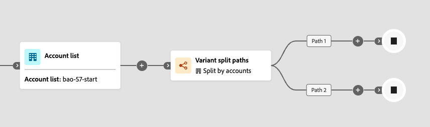

# Variant split paths

Use a _Variant split paths_ node to randomly distribute accounts across two or more journey paths based on percentage allocations that you define. This node is useful when you want to test different messaging, timing, or engagement tactics across segments of your account audience without applying conditional rules.

>[!AVAILABILITY]
>
>Variant split paths is currently available to select customers as a limited beta release, for **Account journeys only**. Support for Person journeys is planned for a future release. Contact your Adobe representative to get access.

## How variant split paths work

When an account reaches a variant split paths node, the node assigns it to exactly one path based on configured percentages. The assignment uses a quota-based algorithm that tracks how many accounts have been assigned to each path and adjusts over time to maintain the configured ratios.

* Each account is assigned to exactly one path.
* Assignment is random and quota-based — the algorithm adjusts allocations dynamically to approach the configured percentages across the overall population.
* The node supports 2 to 20 paths. Each path has a configurable name and an integer percentage from 1 to 99. The sum of all path percentages must equal exactly 100%.

>[!IMPORTANT]
>
>**Quota-based algorithm: not deterministic**
>
>The distribution algorithm uses quota-based random assignment. This algorithm is **not deterministic**: the same account may be assigned to a different path each time it enters or re-enters the journey. Path assignment depends on the current quota state at the time of evaluation, not on a fixed property of the account. See [Limitations](#limitations) for details on what use cases this affects.

## Differences from split paths

Both _Split paths_ and _Variant split paths_ divide accounts into multiple journey branches, but they use different mechanisms:

| Aspect | Split paths | Variant split paths |
| -------- | ----------- | ------------------- |
| **Assignment logic** | Conditional rule-based — each account is evaluated against defined conditions and proceeds along the first path it matches. | Percentage-based random assignment — accounts are distributed across paths according to configured percentages with no filtering conditions. |
| **Determinism** | Deterministic — same account always follows the same path as long as it matches the same conditions. | Not deterministic — the same account may follow different paths on re-entry. |
| **Use case** | Segment by known account or buying group attributes; priority-ordered evaluation. | Randomly distribute accounts for testing messaging, timing, or tactics across your account audience. |
| **Other accounts path** | Supported — accounts that do not match any defined path can be routed to a default path. | Not applicable — every account is assigned to one of the defined paths. |

## Configure a variant split paths node

1. Navigate to the journey map.

1. Click the plus ( **+** ) icon on a path and choose **[!UICONTROL Variant split paths]**.

   {width="300" zoomable="no"}

   The node is added to the journey canvas with two default paths.

   {width="700" zoomable="yes"}

1. In the node properties panel on the right, review or update the **[!UICONTROL Label]** for each path.

   Path labels appear as edge labels on the journey canvas and help distinguish paths in journey analytics.

   {width="500" zoomable="yes"}

1. Set the **[!UICONTROL Percentage]** for each path. Values must be integers from 1 to 99.

   The running total indicator shows the sum of all path percentages. The total must equal exactly 100% before you can publish the journey. An error state is shown when the total does not equal 100%.

   {width="500" zoomable="yes"}

   {width="500" zoomable="yes"}

1. To distribute percentages evenly across all paths, click **[!UICONTROL Distribute evenly]**. The system calculates equal shares and adjusts any rounding to ensure the total equals 100%.

1. To add another path, click **[!UICONTROL Add path]**. Up to 20 paths are supported.

1. To remove a path, click the delete icon on the path card. Paths can only be removed if at least two paths remain.

1. Continue adding nodes to each path as needed.

### Validation rules

The following rules apply to variant split path configuration. Violations block journey publish.

| Rule | Requirement |
| ---- | ----------- |
| Minimum paths | 2 |
| Maximum paths | 20 |
| Percentage per path | Integer from 1 to 99 |
| Total percentage | Must equal exactly 100% |

## Distribution algorithm

The variant split paths node uses a **quota-based random assignment** algorithm. When an account reaches the node, the runtime evaluates how many accounts have already been assigned to each path during the current journey instance and routes the account to the path that is furthest below its configured quota.

**Key properties of the quota-based algorithm:**

* Distribution closely tracks the configured percentages at all account volumes. Because the algorithm actively maintains quota counts, actual distribution only drifts by at most one account per path due to rounding when totals do not divide evenly.
* The algorithm uses a pessimistic lock during quota evaluation to serialize assignments, which ensures accurate count tracking under concurrent execution.

## Limitations {#limitations}

Review these limitations before using variant split paths in your journeys.

>[!CAUTION]
>
>**Path assignment is not deterministic.**
>
>The quota-based algorithm does not guarantee that the same account always follows the same path. If an account exits and re-enters the journey, it may be assigned to a different path depending on the quota state at the time of re-entry. Do not use variant split paths for use cases that require consistent per-account path assignment across journey instances.

| Limitation | Description |
| ---------- | ----------- |
| **Not suitable for controlled experiments** | Because path assignment is not deterministic, variant split paths is **not suitable** for A/B experiments or attribution scenarios that require a given account to consistently receive the same treatment. Use cases that depend on per-account consistency — such as measuring response rates or attributing outcomes to a specific experience — may produce unreliable results. |
| **Minor rounding drift** | When the total account count is not evenly divisible by the configured percentages, distribution may be off by at most one account per path. This is expected rounding behavior and is not an error. |
| **Path assignment is not idempotent** | Re-entering the journey may produce a different path assignment for the same account. If your journey design assumes that an account always follows the same path after the split node, this assumption does not hold. |
| **Account journeys only** | Variant split paths is supported in Account journeys only. Person journeys are not supported. |
| **No conditional filtering** | Unlike _Split paths_, variant split paths does not apply conditions. Every account that reaches the node is assigned to a path. |

## Split people within an account journey

_(Account journeys only)_

In an account journey, you can also use a variant split paths node to randomly distribute the **people within accounts** across percentage-based paths. This is useful when you want to test different content or experiences at the person level while accounts continue moving through the journey.

_**How a variant split by people node works**_

* The node functions as a _grouped node_ — a split-merge combination. The split paths automatically close at a corresponding merge node so that all people can move forward without losing their account context.
* Each person in the account is assigned to exactly one path based on the configured percentages.
* The same quota-based algorithm applies — path assignment is not deterministic and the same person may follow a different path on re-entry.
* Only _[!UICONTROL Take an action]_ nodes for people are supported within the paths. The paths cannot be split further.

_**Distribution behavior across people**_

People within an account are processed as a batch. The number assigned to each path is calculated as `floor(percentage / 100 × people_in_account)`, and the **last configured path receives all remaining people**. This means:

* When an account has an odd number of people, the last path receives one more person than earlier paths.
* For accounts with a single person, that person is always assigned to the first path regardless of configured percentages.
* For accounts with very few people (fewer than 10), the per-account distribution may differ noticeably from the configured percentages. Distribution converges toward the configured ratios when measured across many accounts.

>[!NOTE]
>
>This rounding behavior applies per account batch, not across all accounts in the journey. The last path will systematically receive slightly more people than configured when account sizes are odd. This is expected behavior.

### Add a variant split by people node

1. Navigate to the journey map.

1. Click the plus ( **+** ) icon on a path and choose **[!UICONTROL Variant split paths]**.

1. In the node properties panel on the right, select **[!UICONTROL People]** for **[!UICONTROL Split paths by]**.

   {width="500" zoomable="yes"}

   A _Close variant split paths_ node is automatically inserted to close the grouped split.

   {width="700" zoomable="yes"}

1. Configure the path **[!UICONTROL Label]** and **[!UICONTROL Percentage]** for each path using the same steps as [account-level configuration](#configure-a-variant-split-paths-node).

1. Add _[!UICONTROL Take an action]_ nodes for people within each path as needed.
