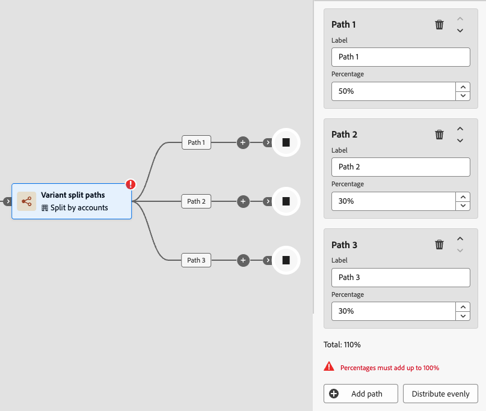

# Variant split paths

Use a _Variant split paths_ node to distribute accounts or people across two or more journey paths based on percentage allocations that you define. This node is useful when you want to test different messaging, timing, or engagement tactics across segments of your audience without applying conditional rules.

>[!AVAILABILITY]
>
>The _Variant split paths_ node for account and person journeys is available to select customers as a limited availability feature. To get access, contact your Adobe representative.

## Comparison by journey type {#journey-type-comparison}

The variant split paths node uses different assignment algorithms depending on the journey type. Understanding this difference is important for choosing the right use case for each journey type.

| | Account journeys | Person journeys |
| - | ---------------- | --------------- |
| **Algorithm** | Quota-based random assignment | Deterministic hash assignment |
| **Determinism** | Not deterministic — the same account may be assigned to a different path on re-entry, depending on the current quota state. | Deterministic — the same person is always assigned to the same path for a given published journey, regardless of how many times they enter or re-enter. |
| **A/B testing** | Not suitable — path assignment is not stable across re-entries. | Suitable — consistent per-person path assignment supports controlled experiments and attribution. |
| **Re-entry behavior** | Account may follow a different path each time it enters the journey. | Person always follows the same path they were assigned on first entry. |
| **Distribution accuracy** | Within one account per path due to quota enforcement. | Converges to within ±2% of configured percentages at 1,000 or more journey entries. |

## Comparison to split paths {#compare-split-paths}

Both _[Split paths](./split-merge-paths-nodes.md)_ and _Variant split paths_ divide a journey into multiple branches (paths), but they use different mechanisms:

| Aspect | Split paths | Variant split paths |
| -------- | ----------- | ------------------- |
| **Assignment logic** | _Conditional rule-based_ — Each entity is evaluated against defined conditions and proceeds along the first path it matches. | _Percentage-based assignment_ — Entities are distributed across paths according to configured percentages with no filtering conditions. |
| **Determinism** | _Deterministic_ — The same entity always follows the same path as long as it matches the same conditions. | _Depends on journey type_ -  Person journeys are deterministic (same person always follows the same path for a published journey). Account journeys are not deterministic (quota-based). |
| **Other accounts/people path** | _Supported_ — Entities that do not match any defined path can be routed to a default path. | _Not applicable_ — Every entity that reaches the node is assigned to a path. |
| **Use case** | Segment by known account or person attributes; priority-ordered evaluation. | Distribute entities for testing messaging, timing, or tactics. Person journeys: suitable for A/B experiments. Account journeys: suitable for random distribution without per-account consistency. |

## Account journeys {#account-journeys}

For account journeys, the distribution algorithm uses [quota-based random assignment](#account-journeys--quota-based-random-assignment). This algorithm is **_not deterministic_**: the same account could be assigned to a different path each time it enters or re-enters the journey. Path assignment depends on the current quota state at evaluation time, not on a fixed account property.

### Split by account {#split-by-account}

When an account reaches a variant split paths node, the runtime evaluates how many accounts have already been assigned to each path during the current journey instance and routes the account to the path that is furthest below its configured quota.

* Each account is assigned to exactly one path.
* Assignment is quota-based. The algorithm adjusts allocations dynamically to approach the configured percentages across the overall population.
* Because the algorithm tracks quota counts, actual distribution only drifts by at most one account per path due to rounding when totals do not divide evenly.

### Split by people {#split-by-people}

In an account journey, you can also use a variant split paths node to distribute the _people within accounts_ randomly across percentage-based paths. This split type is useful when you want to test different content or experiences at the person level. Accounts continue to move through the journey. The variant split paths by people node operates with the following guardrails:

* The node functions as a _grouped node_, which is a split-merge combination. The split paths automatically close at a corresponding merge node so that all people can move forward without losing their account context.
* Each person in the account is assigned to exactly one path based on the configured percentages.
* The same quota-based algorithm used for accounts applies to people. The path assignment is not deterministic and the same person may follow a different path on re-entry.
* Only _[!UICONTROL Take an action]_ nodes for people are supported within the paths. The paths cannot be split further.

>[!BEGINSHADEBOX "Distribution behavior across people"]

People within an account are processed as a batch. The number assigned to each path is calculated as `floor(percentage / 100 × people_in_account)`, and the **last configured path receives all remaining people**. This means:

* When an account has an odd number of people, the last path receives one more person than earlier paths.
* For accounts with a single person, that person is always assigned to the first path regardless of configured percentages.
* For accounts with very few people (fewer than 10), the per-account distribution may differ noticeably from the configured percentages. Distribution converges toward the configured ratios when measured across many accounts.

>[!NOTE]
>
>This rounding behavior applies per account batch, not across all accounts in the journey. The last path systematically receives slightly more people than configured when account sizes are odd. This is expected behavior.

>[!ENDSHADEBOX]

## Person journeys {#person-journeys}

When a person reaches a variant split paths node, the runtime maps them to a path based on a hash of their ID and the journey ID.

* Each person is assigned to exactly one path.
* Assignment is deterministic — the same person always receives the same path assignment for a given published journey, regardless of how many times they enter or re-enter.
* The hash is computed from the person ID and journey ID only. It does not depend on the node position, time of entry, or any quota state. This means that re-entering the journey produces the same path assignment every time.

>[!NOTE]
>
>**Person journey variant split is suitable for A/B testing and experiments.**
>
>Because assignment is deterministic and consistent across re-entries, variant split paths in person journeys supports controlled experiments where the same person must consistently receive the same experience. Use the [journey details](./journey-details.md) view to monitor distribution across paths after the journey is live.

## Distribution algorithm

The applied distribution algorithm depends on the journey type.

### Account journeys — quota-based random assignment

The variant split paths node in account journeys uses a **quota-based random assignment** algorithm. When an account reaches the node, the runtime evaluates how many accounts have already been assigned to each path during the current journey instance and routes the account to the path that is furthest below its configured quota.

**Key property of the quota-based algorithm:**

* Distribution closely tracks the configured percentages at all account volumes. Because the algorithm actively maintains quota counts, actual distribution only drifts by at most one account per path due to rounding when totals do not divide evenly.

### Person journeys — deterministic hash assignment

The variant split paths node in person journeys uses a **deterministic hash assignment** algorithm. When a person reaches the node, the runtime computes a hash value from the person ID and journey ID, then maps the result to a path based on the configured percentage ranges. The algorithm is applied using the following workflow:

1. The runtime computes a MurmurHash3 32-bit hash from a composite key that combines the person ID and journey ID.
1. The hash value is mapped to a position in a range of 10,000 equally-sized buckets.
1. The buckets are partitioned according to the configured path percentages. For example, with paths at 30%, 30%, and 40%, the first 3,000 buckets correspond to Path 1, the next 3,000 to Path 2, and the remaining 4,000 to Path 3.
1. The person is assigned to the path whose bucket range contains their hash position.

There are two key properties of the deterministic hash algorithm:

* **_Consistency_** — The same person is always assigned to the same bucket for a given journey ID. Re-entering the journey produces the same path assignment every time.
* **_Statistical distribution_** — Distribution converges to within ±2% of the configured percentages when at least 1,000 unique persons have entered the journey. With smaller audiences, per-path counts may differ more noticeably from the configured ratios.

## Limitations {#limitations}

Review these limitations before using variant split paths in your journeys.

### Account journey limitations {#account-journey-limitations}

>[!IMPORTANT]
>
>**Path assignment is not deterministic.**
>
>The quota-based algorithm does not guarantee that the same account always follows the same path. If an account exits and re-enters the journey, it may be assigned to a different path depending on the quota state at the time of re-entry. Do not use account journey variant split paths for use cases that require consistent per-account path assignment across journey instances.

| Limitation | Description |
| ---------- | ----------- |
| **Not suitable for controlled experiments** | Because path assignment is not deterministic, variant split paths in account journeys is **not suitable** for A/B experiments or attribution scenarios that require a given account to consistently receive the same treatment. |
| **Minor rounding drift** | When the total account count is not evenly divisible by the configured percentages, distribution may be off by at most one account per path. This is expected rounding behavior and is not an error. |
| **Path assignment is not idempotent** | Re-entering the journey may produce a different path assignment for the same account. |
| **No conditional filtering** | Unlike _Split paths_, variant split paths does not apply conditions. Every account that reaches the node is assigned to a path. |

### Person journey limitations {#person-journey-limitations}

| Limitation | Description |
| ---------- | ----------- |
| **Statistical variance at small scale** | Distribution converges to the configured percentages within approximately ±2% when at least 1,000 unique persons have entered the journey. With fewer entries, per-path counts may differ more noticeably from configured ratios. This is expected behavior of the hash distribution and is not an error. |
| **No conditional filtering** | Unlike _Split paths_, variant split paths does not apply conditions. Every person that reaches the node is assigned to a path. |

## Add a variant split paths node {#add-variant-split-paths-node}

The steps to add and configure a variant split path node are the same for both account and person journeys.

1. Navigate to the journey map.

1. Click the _Add_ ( **+** ) icon on a path and choose **[!UICONTROL Variant split paths]**.

   {width="300" zoomable="no"}

   On the journey map, the node has two default paths.

1. (_Account journeys only_) In the node properties on the right, choose either **[!UICONTROL Accounts]** or **[!UICONTROL People]** for the split.

   If you are using the _[!UICONTROL People]_ type, a _Close variant split paths_ node is automatically inserted to close the grouped split.

   {width="700" zoomable="yes"}

1. Review or update the **[!UICONTROL Label]** for each path.

   Path labels appear as edge labels on the journey canvas and help distinguish paths in journey analytics.

   {width="600" zoomable="yes"}
   
1. Set the **[!UICONTROL Percentage]** for each path.

   Values must be integers from 1 to 99.

   {width="500" zoomable="yes"}

   The running total indicator shows the sum of all path percentages. The total must equal exactly 100% before you can publish the journey. An error state is displayed when the total does not equal 100%.

   {width="500" zoomable="yes"}

   To distribute percentages evenly across all paths, click **[!UICONTROL Distribute evenly]**. The system calculates equal shares and adjusts any rounding to ensure the total equals 100%.

1. To define additional paths, click **[!UICONTROL Add path]** for each one.

   The node supports up to 20 paths. As you add more paths, adjust the _[!UICONTROL Percentage]_ so that the total equals 100%. 
   
   You can remove a path by clicking the _Delete_ (  ) icon in the path card. A path can be removed only when at least two paths remain.

   The following rules apply to variant split path configuration. Violations block journey publish.

   | Rule | Requirement |
   | ---- | ----------- |
   | Minimum paths | 2 |
   | Maximum paths | 20 |
   | Percentage per path | Integer from 1 to 99 |
   | Total percentage | Must equal exactly 100% |
