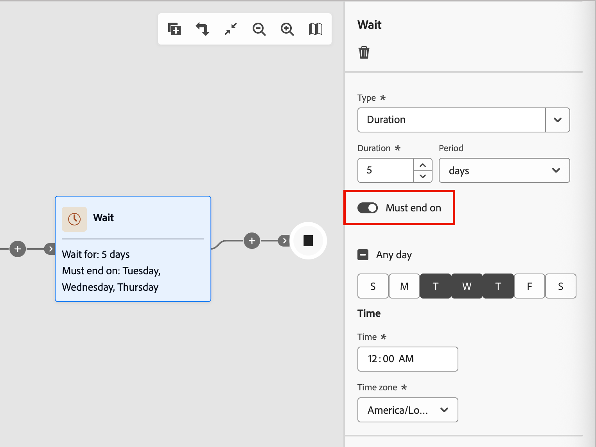

# Wait nodes

Use a _Wait_ node when you want to pause the journey progression for a certain duration before moving to the next step.

There are two ways that you can define the wait time:

* A specific date when you want to move forward to the next node in the journey
* A relative duration (number of minutes, hours, days, weeks, or months)

## Add the wait node

1. Navigate to the journey map.

1. Click the plus ( **+** ) icon on a path and choose **[!UICONTROL Wait]**.

   {width="440"}

1. To set the time to wait before the journey proceeds to the next node in the path, use the node properties on the right to set the **[!UICONTROL Type]**.

   * **[!UICONTROL Duration]** - Define a specific number of days, hours, or minutes to elapse between entry and exit of the wait node. 
   * **[!UICONTROL Date]** - Specify a date and time for the exit.

   {width="500"}

## Advanced wait settings

Enable the **[!UICONTROL Must end on]** option to configure an _advanced wait step_ and ensure that your messages reach people and account members at the optimal moment. This configuration gives you precise control over when a person or account exits a wait step and proceeds to the next node in the journey. Rather than a fixed number of hours or days from entry to exit, you can schedule actions to occur at specific times and on specific days of the week. 

With an _advanced wait step_, you define **_when_** the person or account exits, not simply how long they wait.

{width="500"}

### Wait types

| Wait type | Description | Configuration |
| --------- | ----------- | ------------- |
| **Specific time of day** | Hold until a specific time (such as 9:00 AM) | Set the time (hour and minute). Exits at the next occurrence of that time (for the selected time zone). |
| **Specific day of week** | Hold until a particular day (such as Tuesday) | Select a day of the week. If no time is specified, exits at midnight (for the selected time zone) on the next matching day. |
| **Day range or combination** | Hold until any day within a range (such as Monday–Friday), or on any one of the specified days | Select your target days. If no time is specified, exits at midnight (for the selected time zone) on the next matching day. |
| **Time + Day combination** | Combine both for precise scheduling (such as Tuesday at 10:00 AM) | Select your target days and set the target time. Exits at the next day/time occurrence (for the selected time zone). |

### Common scenarios

The following scenarios illustrate how you can apply typical examples to your wait node configuration:

+++Email arrival during business hours

**Scenario:** You market to B2B customers who read emails during their workday. You want all emails to arrive during business hours.

**Solution:** Configure your wait step to release leads at 9:00 AM on weekdays (Monday–Friday). No matter when a lead enters the wait node, they receive your email during business hours.

+++

+++Consistent send times for dynamic audiences

**Scenario:** Your audience changes daily as new accounts or leads qualify. You want all leads to receive the first email at the same time, regardless of when they qualified.

**Solution:** Set your wait step to end at a specific time (such as 10:00 AM). All leads, whether they qualified at midnight or noon, exit the wait step together at 10:00 AM.

+++

+++SLA-compliant follow-up tasks

**Scenario:** Your Sales team has a two-business-day SLA to follow up on marketing-qualified account leads. Weekends are excluded.

**Solution:** Configure the wait step to release leads only on business days. A lead qualified on Friday is routed for follow-up on Monday or Tuesday, not over the weekend.

+++

### Entry and exit examples

| Wait configuration | Account/lead enters | Account/lead exits |
| ------------------ | ------------------- | ------------------ |
| 9:00 AM, Any day | Monday 11:00 AM | Tuesday 9:00 AM |
| 9:00 AM, Any day | Monday 7:00 AM | Monday 9:00 AM |
| Tuesday, no time set | Friday 3:00 PM | Tuesday 12:00 AM |
| 10:00 AM, Monday–Friday | Saturday 2:00 PM | Monday 10:00 AM |
| 10:00 AM, Monday–Friday | Wednesday 8:00 AM | Wednesday 10:00 AM |
