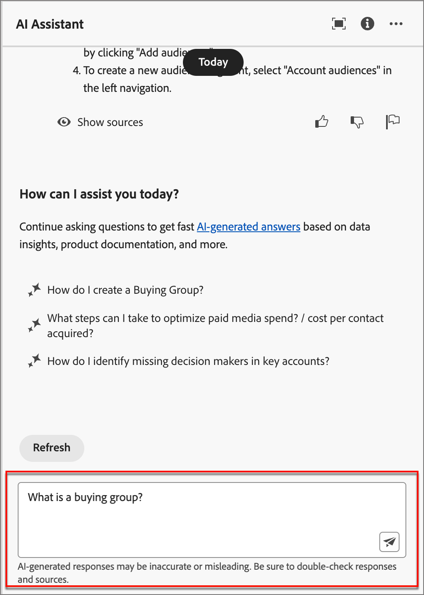
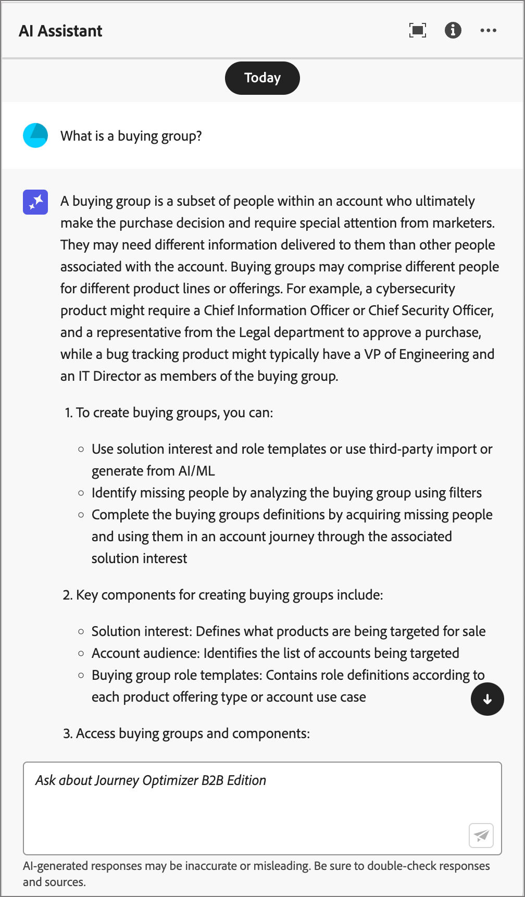

# Use AI Assistant

In Journey Optimizer B2B Edition, AI Assistant is a user interface feature that you can use to understand account-based marketing concepts and quickly navigate and learn about the Journey Optimizer B2B Edition features<!-- get operational insights for your specific environment -->. It is also available in several products across Adobe Experience Cloud.

To access AI Assistant, click the icon in the header. AI Assistant opens in a panel on the right.

{width="600" zoomable="yes"}

>[!IMPORTANT]
>
>An agreement for the Adobe Experience Cloud Generative AI User Guidelines is required before you can use the AI Assistant. For more information about this agreement and usage guidelines, see the [Adobe Experience Cloud Generative AI User Guidelines](https://www.adobe.com/legal/licenses-terms/adobe-dx-gen-ai-user-guidelines.html).

In Adobe Journey Optimizer B2B Edition, AI Assistant supports the following use cases:

* **Product knowledge** (Beta)

    Product knowledge questions are about Journey Optimizer B2B Edition concepts related to aspects of Adobe Journey Optimizer. Some examples of product knowledge questions include:

    * How do I set up SMS provider accounts?
    * How do I send an email in an account journey?
    * How can I personalize my email content?

<!-- 
* **Operational insights** in journeys (Beta)

    Operational insight questions are about the journey objects in your organization's sandbox. Some examples of operational insight questions or prompts include:

    * How many live journeys do I have in Adobe Journey Optimizer?
    * Give me a list of all the scheduled journeys
    * How many Journeys have been created in the last 7 days?

    >[!NOTE]
    >
    >The only Adobe Journey Optimizer B2B Edition object you have access to ask the AI Assistant operational insights questions about is **Journeys**. It will only have data for the sandbox you are currently in.
-->
To ask a question, enter it in the field at the bottom of the panel and press enter.

{width="150" zoomable="yes"}

Check the answer and use the **Show sources** button to get direct links to the product documentation and learn more.

{width="150" zoomable="yes"}

Use the thumb up or thumb down to rate the quality of the answer.

To learn how to use AI Assistant, see example objectives that you can accomplish with the AI Assistant, and learn how the AI Assistant works, refer to the [Adobe Experience Platform documentation](https://experienceleague.adobe.com/en/docs/experience-platform/ai-assistant/home){target="_blank"}.
