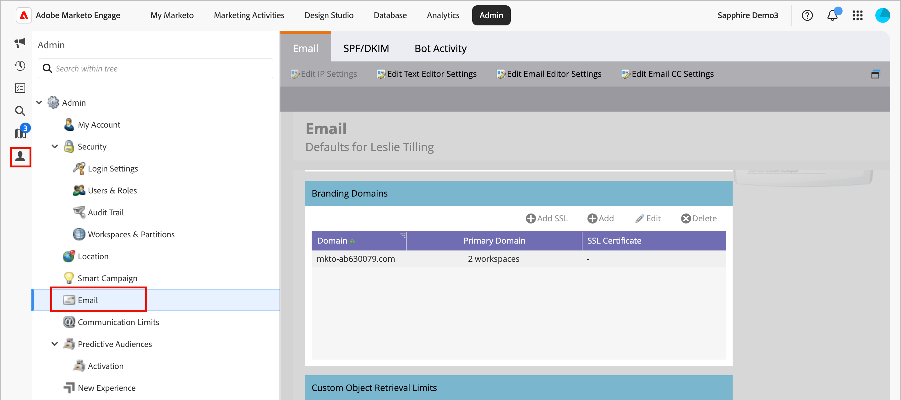

# Configure branding domains

A branding domain in Marketo Engage is a custom subdomain (such as `links.yourcompany.com`) used to rewrite links and track email clicks and ensure that they reflect your brand rather than a generic domain. Each branding domain acts as a click-tracking domain to enhance deliverability and trust by matching your email and landing page links to your domain.

* It replaces generic links with your own branding in email hyperlinks.
* When an account lead clicks a link, it redirects through this custom domain to allow performance tracking while appearing legitimate to email filters.
* If you have multiple brands, you can configure additional branding domains to support different business units or brands.

>[!BEGINSHADEBOX]

**Unique CNAMEs for tracking links**

Email tracking links must be new and unique for the attached Marketo Engage instance. If you have existing CNAMEs for tracking links point to a pre-existing (production) Marketo Engage instance, they cannot be reused _as-is_.

You can share return-path domain branding between your production Marketo Engage instance and the attached instance, but this is a backend change. Open a support ticket and provide your Marketo Engage prefix (Munchkin ID) and your new Journey Optimizer B2B Edition prefix (Munchkin ID) to request shared return-path domain branding.

>[!ENDSHADEBOX]

>[!PREREQUISITES]
>
>Before you edit or add a domain in the UI, you must have a [mapped CNAME to an Adobe-provided Marketo Engage domain](https://experienceleague.adobe.com/en/docs/marketo/using/getting-started/initial-setup/setup-steps#customize-your-landing-page-urls-with-a-cname){target="_blank"}.
>
>When adding a domain, the system checks for pre-existing SSLs, which may have been manually created prior. If you encounter this validation, create your domain without selecting SSL creation and then connect them as a separate procedure.

## Access branding domains in Marketo Engage

1. Go to the **[!UICONTROL Admin]** area in your Marketo Engage instance and select **[!UICONTROL Email]**.

1. Scroll down to the **[!UICONTROL Branding Domains]** panel.

   {width="700" zoomable="yes"}   

   The list displays the default domain for the Marketo Engage instance.

## Edit your default branding domain 

The first step in working with branding domains is to edit the default branding domain defined in your Marketo Engage instance.

>[!NOTE]
>
>You cannot define an additional branding domain until you have edited the generic default domain.

1. In the _[!UICONTROL Branding Domains]_ panel, select the generic domain and click **[!UICONTROL Edit]** at the top.

   {width="500"}

1. In the _[!UICONTROL Edit Branding Domain]_ dialog, enter the name of your default domain in the **[!UICONTROL Domain]** field.

   {width="400"} 

1. If you have multiple workspaces defined for your Marketo Engage instance, click **[!UICONTROL Next]**.

   Select each of the workspaces where you want to apply the updated primary domain.

   {width="400"} 

1. Click **[!UICONTROL Save]**.

## Define an additional domain

After you edit the default domain, you can add another branding domain when you want to run multiple brands out of your Journey Optimizer B2B Edition environment where each has its own branded tracking links. When you add a domain, you have the following options:

>* _Make Primary Domain_: Make this the primary domain for the workspace. When you select this option, all existing unsent emails are set to the default primary domain and all newly created emails automatically default to this primary domain. Marketers can choose an alternative branding domain where needed.
>
>* _Generate SSL Certificate_: Create a Secure Sockets Layer (SSL) with the creation of the domain. The first tracking domain initiates a one-time set up of infrastructure that may take a few hours. The system sends a notification upon completion.

_To add the domain:_

1. In the _[!UICONTROL Branding Domains]_ panel, click **[!UICONTROL Add]** at the top.

   {width="500"}

1. In the _[!UICONTROL New Branding Domain]_ dialog, enter the name of the branding domain in the **[!UICONTROL Domain]** field.

1. (Optional) Select the **[!UICONTROL Generate SSL Certificate]** check box to automatically generate an SSL for the domain.

   {width="400"}

   If needed and available, you can also select _Make Primary Domain_ check box.

   >[!NOTE]
   >
   >**_Custom SSLs_**: If you need a custom SSL, you can submit a [support ticket](https://nation.marketo.com/t5/support/ct-p/Support){target="_blank"}. Do not use the checkbox for SSL creation.

1. If you have multiple workspaces defined for your Marketo Engage instance, click **[!UICONTROL Next]**.

   If needed, select each of the workspaces where you want to apply the new domain as the primary domain.

    {width="400"}

1. Click **[!UICONTROL Save]**.

## Edit SSLs for existing branding domains

Follow these steps to enable SSL for your existing domains.

1. From the _[!UICONTROL Admin]_ area, select **[!UICONTROL Email]**.

1. In the _[!UICONTROL Branding Domains]_ panel, select the domain row and click **[!UICONTROL Add SSL]**.

   {width="500"}

1. In the dialog, click **[!UICONTROL Confirm]**.

   {width="400"}

## Error messages

| Error | Details |
| ----- | ------- |
| `Domain already exists.` | A domain with same name already exists. |
| `Domain is not mapped to the default domain.` | The custom domain is not correctly mapped to the default domain. Verify the domain mapping settings and ensure that the DNS configuration points to the correct default domain. |
| `SSL certificates could not be issued due to unsupported CAA records. Request your IT to update your CAA records.` | The CAA records are not up to date. For those using Adobe-managed SSL certificates, CAA records must be updated to certificates recommended by the vendor. |
| `SSL certificate has already been issued.` | An SSL certificate already exists for this custom domain. No further action is needed unless the certificate is expired or needs to be reissued. |
| `The default domain was not found. Please contact Support for assistance.` | There was an issue when trying to locate the default domain. Contact Adobe support to trigger investigation. |
| `Unexpected error encountered while creating a domain. Please contact Support for assistance.` | An unexpected error occurred. Gather logs and error details, then escalate the issue to Adobe support. |

## Delete a branding domain

>[!NOTE]
>
>If you want to delete the primary branding domain (in one or more workspaces), you must first select a different branding domain to be the primary for each workspace.
>
>Deleting a domain **_does not_** delete the SSL certificate. This guardrail prevents user errors that result in a website being without SSL certificates. If you do want to remove the SSL certificates, contact Adobe support.

In the _[!UICONTROL Branding Domains]_ panel, select the domain and click **[!UICONTROL Delete]** at the top.
